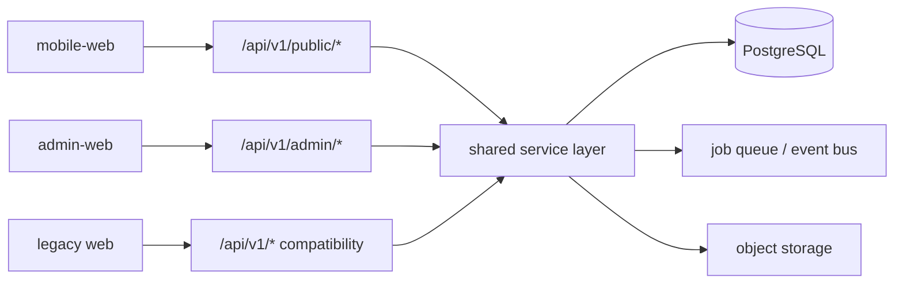

# Admin Web 规划、设计与开发方案

状态：独立 Admin、认证/RBAC/审计、玩家内容、对局诊断、运行监控与受控恢复、语音资产与持久任务、账号治理、运营总览/任务中心/只读设置/全局搜索、生产部署与分阶段发布自动化均已完成；剩余工作是实际 OIDC 租户与集群验收、浏览器级 E2E/可访问性加固，以及 Mobile 其余 Public API 切流和旧 Web 退役。

## 1. 决策摘要

- 新建 `apps/admin-web`，与 `apps/web`、`apps/mobile-web` 独立构建和发布。
- `mobile-web` 最终成为唯一 C 端；`apps/web` 在切流稳定后退役。
- Admin 不复制旧 Web 的哥特主题、全局 CSS、C 端大厅和直播剧场。
- Admin 首版不调用当前匿名 `/api/v1/*` 写接口，生产构建默认 fail closed。
- 后端采用 `/api/v1/public/*` 与 `/api/v1/admin/*` 双边界，迁移期保留旧接口兼容层。
- Admin API client 首先放在 `admin-web/src/api`；出现第二个后台消费者后再升为 `packages/admin-client`。
- MVP 使用固定角色和权限点，权限由 API 强制执行，前端只负责交互提示。

## 2. 产品定位与边界

`admin-web` 是内部运营、内容管理和诊断后台，不承接普通用户大厅。

### MVP 包含

- 登录、会话、403/404 与权限路由；
- 运营总览；
- 实时运行只读监控和受控恢复；
- 对局分页检索、完整复盘与模型诊断；
- 虚拟玩家草稿、编辑、发布、归档；
- 法官语音资产状态、试听和生成缺失项；
- 后台用户固定角色分配；
- 审计日志。

### MVP 不包含

- C 端创建大厅、普通观战和普通回放；
- 规则集可视化编辑；
- 模型供应商 API Key 管理；
- 自定义 IAM 权限设计器；
- 计费分析、复杂报表和批量导出；
- 未完成持久任务队列前的多实例取消、重派；
- 物理删除。

若需要后台模拟开局，应作为高权限 QA 工具放入后续阶段，而不是后台首页。

## 3. 信息架构

```text
/login

/overview

/operations
  /runs
  /runs/:runId
  /games
  /games/:sessionId

/content
  /players
  /players/new
  /players/:profileId
  /voice-assets

/access
  /users
  /roles

/system
  /audit-logs
  /jobs                 # 任务队列完成后
  /settings             # MVP 先只读

/403
/*
```

导航分组为：总览、对局运营、内容资产、权限治理、系统。

顶部栏最终提供环境标识、全局 ID 搜索、异常任务提醒和当前账号菜单。列表筛选、分页和排序必须写入 URL，保证刷新与分享链接后状态可恢复。

## 4. 视觉与交互方向

- 桌面优先，主适配 1280–1600px，1024px 仍可完成核心操作；
- 暗色侧栏、浅色高密度内容区，不继承哥特背景和装饰框；
- 业务图片只在玩家头像、内容预览和回放证据中出现；
- 统一状态语义：运行蓝、成功绿、警告橙、失败红，并提供文本或图标冗余；
- 复杂编辑使用独立页面，简单状态变更使用抽屉或对话框；
- ID 支持一键复制和跨 run/session/profile 搜索；
- 所有列表具备 loading、empty、error、forbidden 和 partial failure 状态；
- 所有破坏性或高成本操作显示影响范围，并要求原因与二次确认；
- 保留可见焦点环、键盘导航和 WCAG AA 对比度。

基础组件路线采用 shadcn/ui 的 Radix 方案，组件源码归项目所有。首批只引入实际使用的 Button、Input、Select、Dialog、AlertDialog、Table、Pagination、Tabs、Badge、Card、Skeleton、Tooltip 和 Toast，不批量复制组件。

## 5. 前端技术架构

### 基线

- React 19、Vite 8、TypeScript 6；
- React Router 7 嵌套路由与路由级懒加载；
- TanStack Query 5 管理服务端状态；
- Tailwind CSS 4 和 CSS variables 管理设计令牌；
- React Hook Form + Zod 管理表单；
- TanStack Table 管理服务端分页、排序和筛选；
- `openapi-typescript` + `openapi-fetch` 生成并调用 Admin contract；
- Vitest + Testing Library，后续加入 MSW、Playwright 和 axe。

不引入 Redux/Zustand、Axios、Ant Design。URL 与 React 管页面状态，TanStack Query 管服务端状态。

### 目标目录

```text
apps/admin-web/
  src/
    app/
      providers/
      layouts/
      auth/
    api/
      generated/
      client.ts
      problem-details.ts
    components/
      ui/                  # shadcn 原子组件
      admin/               # DataTable、PageHeader、EmptyState 等
    features/
      dashboard/
      live-runs/
      game-sessions/
      player-profiles/
      voice-assets/
      access/
      audit/
    lib/
      env.ts
      query-keys.ts
      permissions.ts
    routes/
    styles/
    tests/
```

规则：

- 页面、query、mutation、表单和 schema 按 feature 共置；
- 不从 `apps/web/src` 跨应用导入；
- 真正跨端的纯逻辑先从 `packages/game-client` 直接复用，出现职责冲突时再抽 `packages/game-domain`；
- Admin HTTP DTO 不放进当前 Public `game-client`；
- 所有功能路由懒加载；
- Vite 环境变量不保存秘密。

## 6. API 与安全边界



Public/Admin router 共享 service 层，不能复制业务实现。

### Public API 建议

```text
GET         /api/v1/public/rule-sets
GET         /api/v1/public/player-profiles
GET         /api/v1/public/player-profiles/:id
POST        /api/v1/public/session
GET         /api/v1/public/me
GET         /api/v1/public/me/favorite-player-profiles
PUT/DELETE  /api/v1/public/me/favorite-player-profiles/:id

POST        /api/v1/public/game-runs
GET         /api/v1/public/game-runs/:id
GET         /api/v1/public/game-runs/:id/events
WS          /api/v1/public/game-runs/:id/voice-stream

GET         /api/v1/public/game-sessions
GET         /api/v1/public/game-sessions/:id/playback
POST        /api/v1/public/game-sessions/:id/resume
```

Public DTO 使用字段白名单，不包含：

- prompt、raw response、checkpoint；
- known roles、private summaries、内部错误栈；
- 内部模型供应商配置、后台用户和 owner 内部 ID。

### Admin API 建议

```text
GET  /api/v1/admin/me
POST /api/v1/admin/logout
GET  /api/v1/admin/overview
GET  /api/v1/admin/search
GET  /api/v1/admin/settings

GET/POST  /api/v1/admin/player-profiles
GET/PATCH /api/v1/admin/player-profiles/:id
POST      /api/v1/admin/player-profiles/:id/publish
POST      /api/v1/admin/player-profiles/:id/archive
POST      /api/v1/admin/player-profiles/:id/restore
GET       /api/v1/admin/player-profile-options
POST      /api/v1/admin/player-profile-ai-drafts
POST      /api/v1/admin/player-avatar-assets

GET  /api/v1/admin/games
GET  /api/v1/admin/games/:id
GET  /api/v1/admin/games/:id/debug

GET /api/v1/admin/live-runs
GET /api/v1/admin/live-runs/:id
GET /api/v1/admin/live-runs/:id/debug
POST /api/v1/admin/live-runs/:id/stop
POST /api/v1/admin/live-runs/:id/resume

GET  /api/v1/admin/judge-voice-lines
POST /api/v1/admin/judge-voice-generation-jobs
GET  /api/v1/admin/jobs/:id
GET  /api/v1/admin/jobs

GET /api/v1/admin/users
GET /api/v1/admin/roles
GET /api/v1/admin/audit-events
```

对局普通详情与 debug 分成两个 endpoint，后者要求更高权限。

列表统一响应：

```json
{
  "items": [],
  "pagination": {
    "page": 1,
    "page_size": 20,
    "total": 0,
    "pages": 0
  }
}
```

错误统一为 Problem Details，并包含稳定业务码和 `request_id`。更新资源使用整数 `version` 或 ETag，过期编辑返回 `409`。

### 认证与会话

- 优先服务端 session，使用 HttpOnly、Secure、SameSite cookie；
- Admin 与 API 使用同域反向代理；
- cookie 写操作启用 CSRF 防护；
- access token 不放 localStorage；
- 第一个超级管理员通过部署配置或迁移脚本初始化；
- 禁止公开注册后台账号；
- 认证故障时后台保持不可用，不能降级为匿名管理。

当前落地状态：

- 已实现 `/api/v1/admin/me`、`/dev-login` 和 `/logout`；
- session 与 CSRF 均使用高熵随机值，数据库只保存 SHA-256；
- 生产配置强制 Secure Cookie，认证响应使用 `no-store`；
- 开发登录仅允许 development/test + 显式开关，请求体不能指定身份或角色；
- production 前端默认 fail closed；只有部署显式注入
  `VITE_ADMIN_AUTH_ENABLED=true` 才进入真实认证边界，且实际 OIDC 租户与部署安全验收完成前不提供生产登录入口；
- 开发登录是联调工具，不是生产身份方案。
- 已实现 `/api/v1/admin/player-profiles*` 的固定权限矩阵、CSRF、乐观锁、状态流转和操作审计；
- 已实现 `/api/v1/public/player-profiles*` 白名单只读投影，只暴露已发布且未归档档案；
- 已实现 `/api/v1/admin/games*` 的真实服务端分页筛选、只读详情白名单和 `no-store`；普通详情不返回完整 replay/event payload 或模型原文；
- `games.debug.read` 使用独立 `/debug` endpoint，返回脱敏、限长限量的错误分类，读取行为进入审计；Admin 前端不会自动请求该接口；
- 已实现 `/api/v1/admin/live-runs*` 的真实 PostgreSQL 服务端分页筛选、只读详情白名单、持久化活动新鲜度和活跃运行轮询；`last_activity_at/is_stale` 不作为进程心跳或健康检查；
- 运行普通 DTO 不返回 payload、player configs、lineup warnings、原始错误、语音文本/音频或内部凭据；非安全终局运行隐藏胜方、模型和 actor/action；
- `runs.debug.read` 使用独立 `/debug` endpoint，只有用户显式点击才读取脱敏、限量错误分类并记录审计；`runs.control` 另行保护带 CSRF、幂等键、原因和二次确认的停止/检查点恢复；
- 旧匿名内容写默认关闭且 production 禁止开启，迁移期只保留 favorite-only PATCH。

## 7. RBAC

MVP 固定角色：

- `viewer`：非敏感只读；
- `content_editor`：玩家内容与缺失语音；
- `operator`：运行与对局诊断；
- `super_admin`：用户、角色和系统级高风险操作。

核心权限点：

```text
overview.read
runs.read
runs.debug.read
runs.control
games.read
games.debug.read
players.read
players.write
players.publish
players.archive
players.ai_generate
voice.read
voice.generate_missing
voice.regenerate_all
users.manage
roles.manage
audit.read
settings.read
settings.manage
```

权限必须由 API 强制执行。前端不写 `role === ...`，只消费 `/admin/me` 返回的权限集合。

以下动作必须记录审计：发布、归档、恢复、重试、取消、AI 生成、语音生成、角色变更和系统配置变更。审计至少记录 actor、action、resource、before/after、result、reason、request ID、IP 和时间。

## 8. 数据模型调整

### 玩家内容生命周期

```text
draft -> published -> archived
```

增加 `status`、`published_at`、`published_by`、`updated_by`、`deleted_at` 和 `version`。普通删除改为归档并支持恢复。

当前全局 `favorite` 语义拆分：

- 后台推荐改为 `featured` + `display_order`；
- C 端收藏已迁为 Guest User 与 Profile 的关联表，不回填或双写历史全局 `favorite`；
- Mobile 只调用专用收藏 endpoint，不再调用通用 Profile PATCH；
- 当前 Guest 身份以浏览器 Cookie 为边界，跨设备同步必须接入正式 C 端身份源后再提供。

历史 `owner_user_id = NULL` 统一解释为系统/全局内容，不自动归给首个管理员。

法官语音采用“复制、checksum 校验、双读、切换、保留旧文件”的方式迁出 `apps/web/public`，目标为持久卷或对象存储。Replay JSON 暂不重写，只补查询投影与必要索引。

迁移 `20260711_05` 为只读运行监控增加四个索引：`live_runs(updated_at DESC, run_id DESC)`、`live_runs(created_at DESC, run_id DESC)`、`live_runs(status, updated_at DESC, run_id DESC)` 与 `voice_utterances(run_id, status)`。

数据库迁移采用 expand/contract：新表、新列至少保留两个发布周期，首次发布不 drop 旧结构。回填脚本必须幂等并输出迁移前后统计。

## 9. 旧 Web 迁移策略

| 旧能力 | Admin 去向 | 策略 |
|---|---|---|
| 玩家工作台 | `/content/players` | 迁校验和工作流，UI 重写 |
| 法官语音资产 | `/content/voice-assets` | 迁分组与试听，生成改异步任务 |
| 对局历史 | `/operations/games` | 改服务端分页筛选 |
| 完整复盘/Debug | `/operations/games/:id` | 迁诊断能力，敏感数据单独权限 |
| 实时观战 | `/operations/runs/:id` | 只迁事件与诊断，不迁直播剧场 |
| 创建对局 | 后续 QA 工具 | 高权限、非首页 |
| 普通回放 | `mobile-web` | 不迁 |
| 组件展示页 | 删除 | 不进入生产路由 |

不迁移 `AppTheme`、Arena 导航、旧 UI primitives、全局 `styles/index.css` 和哥特素材。旧 Web 中只做 `game-client` 重新导出的 façade 文件也不复制。

## 10. 开发阶段与粗估

| 阶段 | 工作 | 关键 DoD | 粗估 |
|---|---|---|---:|
| 0 | 决策、方案、独立 Admin 骨架 | 文档、路由壳、fail-closed、CI、lint/test/build | 2–4 人日 |
| 1 | 认证、RBAC、审计、Admin/Public DTO | 通用 OIDC、认证基础与玩家 DTO/审计已完成；仍需实际租户验收和其他业务 DTO | 7–12 人日 |
| 2 | 玩家管理纵向闭环 | 分页、编辑、发布/归档/恢复、409 和受控 AI 草稿已完成；浏览器 E2E 待加固 | 5–8 人日 |
| 3 | 对局与运行诊断 | 分页、白名单详情、独立 debug、停止、检查点恢复、fencing 和 orphan 自动恢复已完成 | 6–10 人日 |
| 4 | 语音资产 | 独立持久存储、任务化生成、权限与审计 | 4–6 人日 |
| 5 | 加固与切流 | 安全、性能、可访问性、部署和回滚演练 | 4–7 人日 |

按一名前端和一名后端并行，生产级 MVP 约 5–7 个自然周。实际身份租户配置、外部密钥和基础设施未就绪会延长周期。

建议按可独立回滚的 PR 切片：

1. 规划文档和 Admin 骨架；
2. session、RBAC、审计基础和 `/admin/me`；（已完成）
3. 抽 service，增加玩家 Public/Admin router；（已完成）
4. 玩家管理纵向闭环；（除 AI 草稿外已完成）
5. 对局运营和独立 debug 权限；（只读对局记录已完成）
6. 语音存储迁移和生成任务；
7. Live run 只读监控；（已完成）
8. Mobile 切 Public API 与旧 URL 重定向；
9. 稳定观察后停止旧 Web 流量。

## 11. 测试与 CI

### 前端

- 权限路由、401/403、会话过期；
- loading/error/empty/partial failure；
- URL 分页、排序和筛选；
- 表单校验、409 冲突和危险操作确认；
- 对话框焦点、键盘导航和 axe；
- Admin 深链 SPA fallback。

### API 与数据

- 每个 Admin endpoint 的 401/403/2xx 权限矩阵；
- Public 响应递归断言不存在敏感字段；
- 审计落库、软删除/恢复、乐观锁 409；
- 空库升级、生产快照升级、重复回填；
- 万级对局/Profile 列表性能；
- SSE 重连与运行恢复幂等。

### CI 必过项

- `admin-web`：lint、Vitest、build；
- `mobile-web`：lint、Vitest、build；
- `game-client`：typecheck、Vitest；
- API：ruff、pytest、Alembic upgrade；
- OpenAPI 生成后无未提交 diff；
- 权限矩阵和 Public 泄漏测试；
- 关键 Playwright E2E 使用 mock provider，不调用真实模型或 TTS。

## 12. 部署、切流与回滚

- Admin 使用独立域名或独立静态站点；
- 同域反代 `/api`，并支持 SSE 与 WebSocket；
- `index.html` 禁止缓存，hash assets 长缓存；
- 配置 SPA fallback、CSP、HSTS、`frame-ancestors 'none'` 和 `X-Robots-Tag: noindex`；
- 数据库迁移先发布，API 次之，Admin 静态产物最后；
- `ADMIN_WRITE_ENABLED` 可快速切换只读模式；
- 前端、Admin API 和数据库 expand 迁移可独立回滚；
- 数据已经写入后优先回滚应用，不执行破坏性 Alembic downgrade；
- 旧结构和旧语音文件至少保留两个版本周期；
- Mobile 切流后观察一个稳定周期，再删除 `apps/web`。

## 13. 正式上线 Definition of Done

- `admin-web` 可独立构建、发布和回滚；
- 未登录访问所有 Admin HTTP/SSE/WS 都被拒绝；
- 无权限用户直接请求 API 返回 403；
- 所有后台写操作都有可检索审计；
- Public DTO 自动化测试确认不含敏感字段；
- 玩家、对局、运行列表均为服务端分页；
- 编辑冲突以 409 明确提示；
- Mobile 已使用专用收藏接口；
- 语音文件不再写入 `apps/web/public`；
- Live 停止与检查点恢复只向 `runs.control` 开放，使用 CSRF、幂等、原因、确认、审计和 fencing token；
- 键盘可完成核心操作，焦点始终可见；
- Admin 不加载旧 Web 哥特资产；
- CI、迁移演练、发布冒烟和回滚 runbook 全部通过。

## 14. 当前完成状态

### 阶段 0：独立应用骨架

- 新建 `apps/admin-web`，端口为 `5175`；
- 独立 Vite/React/Router/Query/Tailwind 工程；
- 独立后台 Shell、响应式侧栏、顶部栏和中性设计令牌；
- 阶段 0 曾建立总览、运营、内容、权限、系统占位路由；真实接线后，未实现模块已从当前导航和路由移除；
- 路由级懒加载和 Admin 专用 404；
- 开发预览仅可显式启用，默认本地模式连接真实 Admin API；生产构建默认 fail closed；
- 不调用旧匿名 API，不依赖 `game-client` HTTP API；
- 根目录提供 admin dev/build/lint/test 命令；
- CI 新增 admin-web 以及 mobile-web/game-client 检查；
- 基础路由测试、lint 和生产构建通过。

### 阶段 1A：认证、固定 RBAC 与审计基础

- `users` 增加固定后台角色与启用状态；
- 新增 `admin_sessions` 与 `audit_events` 迁移；
- 服务端 session、CSRF、动态 Cookie 名与路径、过期/撤销/禁用校验；
- 固定角色权限映射和可复用的服务端 permission dependency；
- `/api/v1/admin/me`、仅开发环境可用的无输入登录、安全登出；
- 统一 Admin Problem Details、稳定业务码、request ID 与 `no-store`；
- 审计载荷递归限深限长，并对 token、Cookie、Authorization、Bearer 等敏感值脱敏；
- Admin typed auth client、session Query、登录、403、会话过期、权限路由与导航过滤；
- 前端不使用 localStorage/sessionStorage 保存凭据，所有请求携带 cookie credentials；
- API 全量测试、Admin lint/test/build 和 Alembic 空库升级/回退/再升级/schema check 通过。

### 阶段 1B/2：玩家资料管理闭环

- HTTP-free 共享 service 同时服务 legacy、Public 和 Admin router；
- 玩家生命周期、后台 `featured`、发布/更新操作者、软归档和整数 `version` 已迁入 PostgreSQL；
- 历史玩家回填为 published，保留创建时间作为发布时间，并同步 `favorite -> featured`；
- Public DTO 使用严格字段白名单，列表、详情、显式选人和自动补位均只读取 published；
- Admin 提供服务端分页、搜索、筛选、排序、详情、草稿创建/编辑、发布、归档、恢复与选项接口；
- `players.read/write/publish/archive` 权限、CSRF、状态转换原因、409 current version 与审计在 API 强制执行；
- Admin 列表和独立编辑页支持 URL 状态、读写权限差异、未保存离开拦截、字段错误、冲突保留和本地预览 fixture；
- 旧匿名内容和 favorite 写入默认关闭，production 禁止重新开启；
- API 全量测试和 PostgreSQL 空库升级、旧数据回填、回退/再升级、schema check 已通过。

### 阶段 2B：Mobile 玩家 Public API 与设备级收藏

- Mobile 大厅、玩家图鉴和详情已切到独立 Public Profile 类型、分页聚合与 query key；
- Public Catalog 与个性化收藏查询分离，收藏服务故障时目录和选人保持可用且收藏控件只读；
- 新增独立 Public Guest Session、CSRF、Origin allowlist、会话限流和过期 Guest 清理；
- 收藏 PUT/DELETE 幂等并按 Guest User 隔离，不接受客户端提供的 user ID；
- Public Catalog 与新游戏配置仅输出受管同源头像，阻断 legacy 外链追踪；
- game-client 保留 legacy API/type，旧 Web 在共存期仍可构建；Mobile 不会回退全局 favorite PATCH；
- 当前进程内限流只适用于既有单 worker 部署，反向代理环境必须配置可信客户端地址或边缘限流；规模扩大前将过期清理迁为批处理任务。

### 阶段 3A：Admin 对局记录只读切片

- `/operations/games` 连接真实 Admin API，提供服务端分页、Session/Run/模型搜索、对局状态、最新运行状态、胜方、规则、日期与排序 URL 状态；
- `/operations/games/:sessionId` 展示玩家和完成局角色结果、公开轮次摘要、运行记录、诊断计数以及最多 50 条无 payload 事件元数据；partial/resumable 对局不公开角色、玩家/运行模型、死亡原因/来源、事件元数据或未完成轮次；
- 普通详情严格排除 state、logs、checkpoint、event payload、prompt、raw response、私有摘要和内部凭据；
- 受限错误摘要通过独立 `/debug` 请求，仅 `games.debug.read` 可访问，且必须由用户显式触发；读取成功写入审计，失败不影响基础详情；
- Admin 前端覆盖真实 API 渲染、URL 筛选、loading/empty/error/404、权限导航和按需 debug 流程。

### 阶段 3B：Admin 运行监控只读切片

- `/operations/runs` 连接真实 Admin PostgreSQL API，支持服务端分页、Run/Session 前缀搜索、状态、规则、日期和排序 URL 状态以及手动刷新；第 1 页存在 queued/running 记录时每 5 秒轮询，否则每 30 秒发现新记录，其他页不自动轮询；
- `/operations/runs/:runId` 展示安全模型配置、计数、关联对局和最多 50 条无 payload 事件元数据；只有 completed 且关联对局 complete、不可恢复时才公开胜方、模型和 actor/action；
- `last_activity_at` 与 `is_stale` 表示数据库持久化活动新鲜度，不代表 worker、模型任务或 API 进程在线/健康；
- 普通 DTO 和前端 parser 拒绝 payload、player configs、lineup warnings、原始错误、prompt、token、语音文本与音频；非终局事件只保留安全归类；
- `runs.debug.read` 通过独立 `/debug` 显式读取脱敏、限长、最多 20 条错误分类并写入审计，debug 失败不影响基础详情；
- 迁移 `20260711_05` 增加运行更新时间、运行创建时间、状态加更新时间及语音 run/status 四个查询索引；后续阶段已补充受控停止、检查点恢复和 orphan 自动恢复。

阶段 3B 已完成。`mobile-web` 仍是唯一继续演进的 C 端，普通回放和观战剧场不迁入 Admin。Admin OIDC 已在阶段 5B 接入，实际身份租户验收仍是生产开放后台的前置条件；正式 C 端身份源则是 Guest 收藏跨设备同步与账号合并的前置条件。

### 阶段 4A：Admin 法官语音资产只读切片

- `/content/voice-assets` 连接真实 `/api/v1/admin/judge-voice-lines`，提供覆盖率、文件体积、分类、缺失状态、搜索、排序、分页和手动刷新；
- `voice.read` 同时保护列表与 `/judge-voice-lines/:id/audio`，试听音频不会回退旧匿名 public URL；
- 普通 DTO 只返回台词 ID、展示文本、分类、文件存在状态、大小、模板/席位、安全试听 URL 和字幕计数，不返回服务器路径、filename、manifest、字幕内容或音频块；
- 页面显示当前数据库或旧目录双读状态，且不提供生成、覆盖、删除按钮；
- 旧 Web 匿名语音生成 POST 默认关闭，production 配置校验禁止重新开启。

阶段 4A 已完成。阶段 4B 需要先确定对象存储/持久卷与任务队列契约，再接入 `voice.generate_missing`、`voice.regenerate_all`、CSRF、幂等键、任务进度和操作审计。

### 阶段 4B1：法官语音独立持久存储

- 迁移 `20260711_06` 新增 `judge_voice_assets`，保存台词定义、格式、采样率、音频字节、SHA-256、大小和规范化字幕时间点；
- `import-judge-voice-assets` 从旧静态目录幂等导入，重复执行复用 checksum/元数据一致的记录，文件变化时更新同一资产；
- Admin 列表查询只投影元数据，不读取 LargeBinary；试听按 ID 单条读取数据库音频；
- 实时静态法官语音和普通回放均数据库优先，记录缺失时回退旧目录，满足 expand/contract 回滚边界；
- 旧文件至少保留两个发布周期，本阶段不删除 `apps/web/public/judge-voice`。

阶段 4B1 已完成。4B2 的生成任务必须使用持久任务表或外部队列，不能以无恢复能力的进程内线程冒充可靠异步任务。

### 阶段 4B2：持久语音生成任务

- 迁移 `20260711_07` 新增持久任务表，保存模式、请求范围、状态、进度、分类错误、操作者和时间；
- POST 排队强制 CSRF、模式对应权限及 `Idempotency-Key`，同请求复用、不同请求冲突，成功排队写入审计；
- `run-judge-voice-worker` 作为独立持续进程领取 queued job，支持 SIGTERM/SIGINT 优雅停止、可配置轮询间隔、行锁防重，并可回收超过 15 分钟的 running job；`--once` 仅用于单次运维检查；
- Admin 依据权限显示“生成缺失”或“重新生成全部”，轮询独立 job endpoint，终态后刷新资产覆盖率；
- 任务错误只返回稳定分类，不向前端或审计写入 TTS 原始错误与凭据。

阶段 4B2 已完成。生产部署需由进程管理器守护持续 worker；`--once` 仅用于发布冒烟或人工排障。

### 阶段 5A：部署与运行保障

- `/api/v1/health/live` 只检查 API 进程存活，`/api/v1/health/ready` 同时检查 PostgreSQL 连接与 Alembic head，迁移落后时返回 503；
- 生产配置拒绝开发登录、不安全 Cookie、通配符/HTTP CORS、同名 Admin/Public Session Cookie 和旧匿名写入；
- `make release-check` 覆盖 API 与三个前端/共享包的 lint、测试、构建及 Alembic 模型漂移检查，CI 同步执行 `alembic check`；
- 发布、持续 worker、健康探针、资产导入和前向兼容回滚步骤见 `docs/admin-deployment-runbook.md`；
- 生成任务进度通过 `role=status` 和 `aria-live=polite` 播报，不依赖视觉变化。

阶段 5A 的工程保障已完成。通用 OIDC 在阶段 5B 接入；注入实际 issuer/client 并完成真实账号验收前，production 必须保持 Admin 外网入口关闭。

### 阶段 5B：正式 Admin OIDC 身份接入

- 通用 OIDC Authorization Code + PKCE S256，通过 discovery 获取 authorize/token/JWKS endpoint，只接受 RS/ES 非对称签名 ID Token；
- 登录事务持久化保存 state hash、浏览器绑定 hash、nonce hash、PKCE verifier、return path、过期和消费状态，API/进程重启不丢失事务；
- callback 校验 state、浏览器绑定、单次消费、issuer、audience、签名、时效、nonce 和 `email_verified=true`，未知 `kid` 会刷新 JWKS；
- 后台账号必须先由 `provision-admin-user` 配置本地固定角色，首次登录按验证邮箱绑定 issuer/sub，拒绝未配置、停用或已绑定其他身份的账号；
- OIDC claims 不参与角色授权，成功后复用现有 Admin Session、CSRF、RBAC 和审计，失败只记录稳定分类；
- Admin 登录页从 `/admin/login-options` 动态发现企业登录入口，安全保留内部 return path，并展示不含提供商原始信息的失败提示；
- migration `20260711_08` 新增可回退的短期登录事务表，production 配置强制 OIDC 和 HTTPS issuer/callback/web base URL。

阶段 5B 代码与本地签名/回调验收完成。正式开放前仍需拿实际 identity tenant 的 issuer、client、callback 和测试账号完成一次端到端验收；该步骤是外部配置门禁，不应以开发登录替代。

### 阶段 5C：后台账号与审计管理闭环

- migration `20260711_09` 为后台账号增加独立乐观锁版本，并新增按操作者 + Idempotency-Key 唯一的开通请求记录；
- `/admin/users` 只列出后台账号，支持服务端分页、姓名/邮箱、角色、启用状态、OIDC 绑定状态和排序，不返回 provider、subject、session token、IP 或 User-Agent；
- 创建账号强制 `users.manage`、`roles.manage`、CSRF 和 Idempotency-Key；同请求复用、不同请求冲突，并写入成功/失败审计；
- 修改账号强制 expected version，禁止操作者停用或降级自己，禁止移除最后一个启用的超级管理员；停用会立即撤销目标账号全部活动会话；
- 独立会话撤销接口幂等返回撤销数量，所有账号变更记录原因、前后安全摘要和请求编号；
- `/admin/audit-events` 由 `audit.read` 保护，支持操作者/资源/请求搜索、动作、结果、资源类型、日期和排序，只返回最小审计 DTO；
- Admin 新增 `/system/users`、`/system/audit`，导航和深链使用服务端同名权限，账号弹窗支持开通、角色/状态修改和会话撤销；
- CLI 仅保留首位超级管理员引导和恢复用途，日常账号管理迁入受审计 Admin 页面。

阶段 5C 已完成。后续阶段已完成运行停止、恢复、自动 reaper 与生产部署。

### 阶段 6：运行控制、自动恢复与生产部署

- `runs.control` 保护停止和检查点恢复，写操作强制 CSRF、原因、二次确认与 Idempotency-Key，成功和失败均审计；
- 运行租约、心跳和单调递增 fencing token 保证多 API/Worker 协调，旧 Worker 的事件、checkpoint、回放与终态写入会被数据库拒绝；
- 独立 live-run reaper 对过期租约执行停止收敛、checkpoint 恢复或稳定失败，带最大次数、指数退避、持久心跳和 Prometheus 告警；
- API/Admin 正式容器、Compose、Kubernetes staging/production overlays、不可变 SHA 镜像、迁移 Job、探针、监控、分阶段发布、自动回滚和 runbook 已落地。

阶段 6 已完成。真实集群、域名、证书、Secret 与 OIDC tenant 仍需在目标环境验收。

### 阶段 7A：运营工作台与内容辅助

- `/overview` 聚合真实玩家、对局、运行、语音任务与 reaper 健康数据，并生成可跳转的异常提醒；
- `/system/jobs` 展示持久语音任务状态、进度与稳定错误码，支持状态 URL 筛选、分页、刷新与轮询；
- `/system/settings` 只读展示安全开关和协调参数，不返回密钥、数据库地址、OIDC issuer/client 或内部凭据；
- 顶栏提供按实际读权限裁剪的 Run、Session、玩家和任务全局搜索，只接受服务端返回的后台内部路径；
- 玩家新建页提供 `players.ai_generate` 保护的 AI 草稿生成，服务端从数据库读取名称冲突集合，强制 CSRF 并审计；生成结果只填表，不保存、不发布且不覆盖模型与形象选择；
- 旧匿名 AI 写入口继续保持兼容写开关关闭，Admin 不回退到旧接口。

阶段 7A 已完成。下一阶段进入浏览器级 E2E、axe/键盘验收、大数据量性能基线和真实环境发布验收。

### 阶段 7B：浏览器级质量门禁

- 新增 Playwright Chromium 浏览器测试，以 Vite `test` 模式构建隔离预览；正式 production 构建继续 fail closed，不使用 fixture 绕过生产认证边界；
- 桌面端验证运营总览、跳过链接到 `main` 的键盘焦点、全量 Admin Shell axe 扫描、5 秒内首屏可用和 AI 草稿只填表不保存的人工审核边界；
- 移动端验证侧栏打开、导航和导航后自动收起；
- 修复身份容器的非法 ARIA 标注，并提高总览更新时间文字对比度至 WCAG AA 基线；
- CI 新增 `admin-web-browser` 门禁：安装 Chromium、运行浏览器测试，并保留 HTML/性能附件报告；本地入口为 `make admin-e2e`；
- 本机基线中桌面运营总览首次可用为 514ms，阈值固定为 5 秒；该阈值用于防止明显回归，不等同于生产 SLO。

阶段 7B 已完成。剩余的真实 OIDC、目标数据库/Worker、集群 Ingress、证书和回滚验收需要在获授权的 staging/production 环境执行。

### 阶段 8A：生产拓扑发布预演

- 部署预演发现 Kubernetes 清单原先遗漏持久法官语音 Worker；这会使 `voice.generate_missing` 和 `voice.regenerate_all` 创建的任务永久停留在 queued；
- 已补充单副本 `werewolf-judge-voice-worker` Deployment，复用受限 API 运行身份、ConfigMap/Secret、资源限制和 90 秒优雅终止窗口；
- 语音 Worker 现持久写入独立数据库心跳，Compose 与 Kubernetes 使用 `check-judge-voice-worker` 探针；这修复了复用 API 镜像默认 HTTP healthcheck、Worker 未监听 API 端口而持续误报 unhealthy 的问题；
- 发布脚本现在会断言渲染清单包含该 Worker，并在迁移/API/Reaper 后等待它滚动就绪；CI 对 staging/production 渲染清单同样断言；
- 本机生产 Admin runtime 冒烟、真实 OIDC、目标数据库、TLS、Ingress、外部 Secret、GHCR 拉取授权和回滚演练仍需在获授权目标环境完成。
