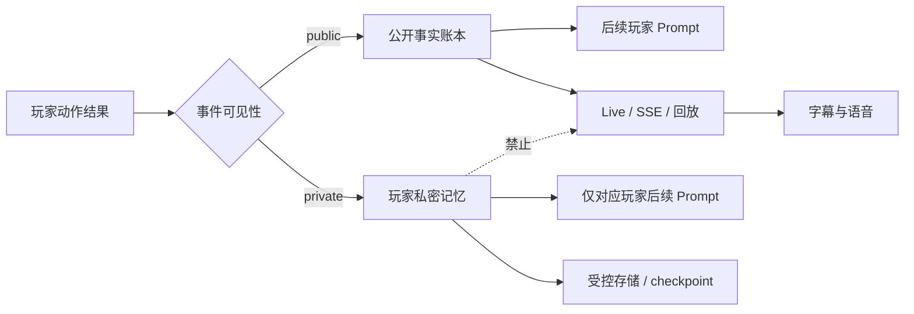
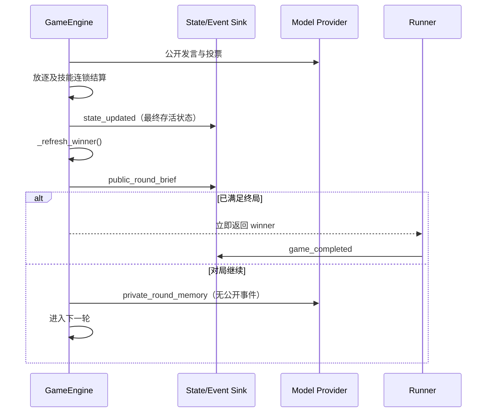

# 狼人杀 P0 对局完整性修复开发设计

**Date:** 2026-07-14

**Status:** Ready for implementation

**Source Run:** `run_05aa0b0f2b92` / `game_0c46d70d`

**Scope:** `apps/api` 游戏引擎、Prompt 上下文、Live/Replay 事件、语音边界与恢复兼容

**Related Analysis:** `docs/run-05aa0b0f2b92-quality-remediation-plan.md`

## 1. 文档目标

本文把复盘中确认的四项 P0 问题转化为可直接拆任务、开发、联调和验收的技术方案：

1. P0-01：关键公开事实没有可靠进入后续角色上下文。
2. P0-02：自爆中断后，没有记录谁已经发言、谁尚未获得发言机会。
3. P0-03：玩家私密回合记忆进入公开 Live 流、语音和回放。
4. P0-04：决胜动作结算完成后仍继续请求玩家总结，终局发布延迟。

本设计的完成标准不是“补几句 Prompt”，而是同时保证以下四层一致：

- 引擎状态正确；
- 模型看到的事实正确；
- 观众收到的公开事件正确；
- 保存和回放的数据不突破隐私边界。

## 2. 本局已确认的触发链

| P0 | 本局事实 | 当前实现中的直接缺口 | 最终表现 |
| --- | --- | --- | --- |
| P0-01 | 第 1 轮 5 号在警长 PK 发言中明确跳预言家并报 6 号好人 | 普通 `sheriff_speech` 写入 `public_facts`，`sheriff_pk_speech` 没有写入 | 第 4 轮多名玩家认为 5 号“突然跳预言家” |
| P0-02 | 第 3 轮 9 号在轮到 5 号发言前自爆 | 自爆判断只接收中文 `stage` 字符串，没有已完成和待发言名单 | 5 号“未轮到”被解释为“发过言但没跳身份” |
| P0-03 | 11 号总结中包含狼人身份、下一刀目标和欺骗计划 | `summarize` 同时属于公开流字段和公开语音动作；回放还重建总结动作并携带 `private_summaries` | 私密策略进入字幕、语音、Live 事件和保存回放 |
| P0-04 | 第 4 轮放逐 5 号后神职已经全灭 | `_run_day_phase()` 在终局检查前执行 `_run_summaries()` | 决胜后又等待约 64 秒并生成不存在的“下一步策略” |

以上四项均可由现有数据和代码路径直接确认。本文不把尚未实现的语义抽取、发言评分或法官文案优化作为 P0 前提。

## 3. 目标与非目标

### 3.1 目标

1. 任何警长 PK 发言在后续轮次仍可进入角色 Prompt。
2. 角色能明确区分“主动没有表达”和“流程中断导致未获得表达机会”。
3. `private_round_memory` 的模型输入、输出和生命周期事件不进入任何公开消费者。
4. 决胜结算完成后不再发起任何玩家动作，尤其不再发起总结动作。
5. 终局前完成猎人开枪、警徽处理等规则规定的连锁结算，不能过早截断技能。
6. 新字段可被旧回放、旧 checkpoint 和旧客户端安全忽略。
7. 已经保存的历史对局在公开读取时同样执行隐私边界。
8. 将本局关键路径固化为自动化回归场景。

### 3.2 非目标

- 不在本次 P0 中重写完整事实抽取系统。
- 不使用另一个大模型判断“这句话是否在跳身份”。
- 不调整狼人自爆策略概率、发言风格和角色人设。
- 不补齐全部 P1 法官台词、警徽 Live 表现和终局语音持久化问题。
- 不修改具体胜负规则定义；`_get_winner()` 的屠边逻辑在本局中结果正确。
- 不建立新的数据库表，也不要求 JSON 数据全量离线迁移后才能上线。
- 不把赛后感言混入游戏内总结。若未来增加赛后感言，必须是终局后的独立产品阶段。

## 4. 发布优先级与阻断关系

P0 内部仍需分两层处理：

| 顺序 | 工作包 | 原因 | 发布要求 |
| --- | --- | --- | --- |
| 1 | P0-03 私密总结隔离 | 直接泄露阵营秘密 | 安全热修复，禁止通过开关回退到公开 |
| 2 | P0-04 终局前置 | 继续执行无效动作，并扩大泄密窗口 | 与隐私热修复同批或紧随其后 |
| 3 | P0-01 公开事实持久化 | 决策基础错误 | P0 主版本必须包含 |
| 4 | P0-02 中断结构化 | 把未轮到误判成主动沉默 | 与事实账本同批交付 |
| 5 | 历史数据读取脱敏和清理 | 只修新写入不能消除旧回放泄密 | P0 发布门禁，不可延期为普通优化 |

如果需要拆 PR，允许分 PR 合并，不允许只上线第 1、2 项后把第 3、4、5 项降级为 P1。

## 5. 总体架构

目标数据流分为两条明确通道：



四项 P0 共享三个设计原则：

1. **状态先于文案。** 中断、终局和可见性都用结构化字段表达，中文文本只负责展示。
2. **默认拒绝泄露。** 私密动作不依赖 `is_public=false` 让下游自觉过滤，而是在事件产生源头不发布。
3. **规则链完成后判胜。** 猎人追刀、白痴翻牌和警徽处理属于同一结算链，链完成后才进入终局检查。

## 6. P0-01：关键公开事实持久化

### 6.1 当前缺口

当前 `PublicFact` 只有：

```text
round_number + category + text
```

`compressed_public_facts()` 会合并“固定类别”和最近事实，但最终仍按 `max_lines` 截取。引擎对普通警上发言调用 `_add_public_fact()`，对 PK 发言仅写入 `round_state.sheriff_pk_speeches` 和 `round_log.sheriff_pk_speech`。轮次变化后，`_sheriff_election_context()` 只读取当前轮状态，首轮 PK 内容因此不再进入后续 Prompt。

### 6.2 数据结构

对现有 `public_facts` 元素做增量升级，不新增第二套事实存储：

```python
@dataclass(frozen=True)
class PublicFact:
    round_number: int
    category: str
    text: str
    schema_version: int = 2
    fact_id: str = ""
    stage: str | None = None
    actor: str | None = None
    retention: str = "recent"  # critical | important | recent
    details: dict[str, Any] = field(default_factory=dict)
```

字段语义：

| 字段 | 说明 | P0 用途 |
| --- | --- | --- |
| `schema_version` | 单条事实的结构版本 | 允许旧事实按 v1 读取 |
| `fact_id` | 引擎内稳定逻辑标识 | 测试、去重和问题定位 |
| `stage` | 事实发生的动作阶段 | 区分普通警上、PK、辩论和中断 |
| `actor` | 公开行为主体 | 构建玩家自己的公开发言历史 |
| `retention` | Prompt 投影保留级别 | 保证关键事实不被普通近期事件挤出 |
| `details` | 仅保存可公开的结构化补充 | 保存中断名单等确定性信息 |

兼容要求：

- `round_number`、`category`、`text` 继续保留，现有读取方无需立即升级。
- `public_fact_from_dict()` 对缺失新字段使用默认值。
- v1 中 `category in PINNED_CATEGORIES` 的事实读取为 `important`，不能被降为普通近期事实。
- `details` 禁止写入角色身份真相、模型 reasoning、Prompt 或私密观察。
- `fact_id` 不使用 Live 数据库事件 ID。引擎不能依赖事件存储返回值才能维护游戏状态。

建议的 `fact_id` 形式：

```text
r{round_number}:{stage}:{actor-or-system}:{ordinal}
```

`ordinal` 取当前状态内事实序号。checkpoint 从轮首恢复时会回到同一事实基线，重新执行可得到相同顺序。

### 6.3 P0 事实分级

P0 不做自然语言身份声明抽取，先依靠确定性的动作类型保护事实：

| 来源 | `category` | `stage` | `retention` |
| --- | --- | --- | --- |
| 普通警上发言 | `claim` | `sheriff_speech` | `important` |
| 警长 PK 发言 | `claim` | `sheriff_pk_speech` | `critical` |
| 自爆和公开翻牌 | `reveal` | 对应阶段 | `critical` |
| 死亡、放逐、猎人带人 | `death` | `night_resolution` / `day_resolution` | `critical` |
| 警长当选、移交、撕毁 | `sheriff` | 对应阶段 | `critical` |
| 阶段中断 | `interruption` | 被中断阶段 | `critical` |
| 票型 | `vote` | `vote` / `sheriff_vote` | `important` |
| 普通辩论 | `speech` | `debate` | `recent` |

本次必须补齐的写入点：

```python
round_state.sheriff_pk_speeches.append(...)
self._add_public_fact(
    round_number=round_state.number,
    category="claim",
    stage="sheriff_pk_speech",
    actor=name,
    retention="critical",
    text=f"第{round_state.number}轮警长PK发言：{name}：{message}",
)
```

写事实必须发生在发言校验通过之后、自爆检查之前。这样“玩家完成 PK 发言后另一名狼人自爆”时，已完成的发言不会丢失。

### 6.4 Prompt 投影策略

持久化账本保存完整事实，Prompt 使用受预算约束的投影：

1. `critical` 事实优先进入 Prompt。
2. `important` 事实按时间进入剩余预算。
3. `recent` 事实只补足最近上下文。
4. 同一事实按 `fact_id` 去重，不再只用整段中文文本去重。
5. 每条长发言在 Prompt 投影时可做字符上限裁剪，但持久化原文不裁剪。
6. 对当前玩家额外加入其 `actor == player.name` 的公开发言历史，确保玩家能回忆自己曾经说过什么。

建议把现有单一 `max_lines=18` 改成可测试的预算对象：

```python
PublicFactBudget(
    max_total_chars=6000,
    critical_chars=3600,
    important_chars=1600,
    recent_chars=800,
    max_fact_chars=360,
)
```

其中 `critical_chars` 是软上限：先缩短单条事实的 Prompt 展示文本，再压缩同类结构，但不能为了满足预算删除 critical 事实，也不能让 important/recent 事实挤掉 critical 事实。极端情况下允许本次 Prompt 超出软上限并记录 `critical_budget_overflow` 指标。预算值先作为模块常量，不进入规则配置。P0 验收关注“首轮 PK 发言到第四轮仍在”，不要求一次性建立面向所有玩法的动态 Token 预算器。

### 6.5 玩家公开自我历史

`_world_state()` 构建时新增：

```json
{
  "public_self_history": [
    "第1轮警长PK发言：5号玩家：我5号，预言家，昨晚验6号好人。"
  ]
}
```

该字段由公开事实账本按 `actor` 派生，不需要在 `Player` 上再保存一份重复数据。Prompt 增加独立段落：

```text
你的公开发言历史：
- 第1轮警长PK发言：……
```

这个段落只表示“你公开说过什么”，不表示内容一定真实。狼人悍跳内容同样会被保留。

### 6.6 不采用的方案

- 不从 `round_log` 临时拼接所有历史发言：状态恢复和 Prompt 组装会继续形成多套真相来源。
- 不在 P0 中调用模型抽取 `claim_role`、`claim_target`、`claim_result`：抽取错误会产生新的确定性假事实。
- 不把所有完整辩论永久塞进 Prompt：会快速耗尽上下文，并放大重复内容。

## 7. P0-02：自爆中断结构化

### 7.1 数据结构

在 `RoundState` 增加一个可空结构：

```python
@dataclass(frozen=True)
class StageInterruption:
    stage: str
    interrupted_by: str
    actor: str
    timing: str
    last_completed_speaker: str | None
    completed_actors: list[str]
    pending_actors: list[str]
```

`RoundState` 增加：

```python
interruption: StageInterruption | None = None
```

字段语义：

| 字段 | 示例 | 说明 |
| --- | --- | --- |
| `stage` | `sheriff_speech` | 被中断的真实动作阶段，不使用展示中文 |
| `interrupted_by` | `werewolf_self_explosion` | 中断原因枚举 |
| `actor` | `9号玩家` | 发起中断的玩家 |
| `timing` | `before_actor` | `before_stage`、`before_actor`、`after_actor` |
| `last_completed_speaker` | `10号玩家` | 仅公开发言阶段有值 |
| `completed_actors` | `[4,3,12,11,10]` | 已完整完成当前阶段动作的人 |
| `pending_actors` | `[9,5]` | 因中断未完成当前阶段动作的人 |

只有一个自爆会立即结束当前白天，因此每轮一个 `interruption` 足够。将来如果规则支持可恢复的多次中断，再升级为列表。

### 7.2 执行游标

当前 `_maybe_run_werewolf_self_explosion(..., stage: str)` 只拿到中文描述，例如 `5号玩家 发言前`。改为接收结构化游标：

```python
@dataclass(frozen=True)
class PublicStageCursor:
    stage: str
    ordered_actors: list[str]
    completed_actors: list[str]
    current_actor: str | None
    timing: str
```

调用规则：

- 进入整个阶段前：`timing=before_stage`，完成名单为空。
- 某玩家行动前：`timing=before_actor`，该玩家仍属于 `pending_actors`。
- 某玩家行动成功后：先把玩家加入 `completed_actors`，再以 `timing=after_actor` 检查自爆。
- 批量投票或退水前的自爆：所有尚未提交动作的人都属于 `pending_actors`。

禁止从中文 `stage` 文案反向解析阶段、玩家或时点。

### 7.3 中断落库与公开事实

自爆确认后，按以下顺序执行：

1. 根据 `PublicStageCursor` 生成 `StageInterruption`。
2. 保存到 `round_state.interruption`。
3. 解析自爆死亡、公开身份和警徽后续。
4. 写入一条 `critical` 中断事实。
5. 发布包含 `interruption` 的最终自爆 `state_updated`。

中断事实展示模板示例：

```text
第3轮警上发言因9号玩家自爆而中断；已完成发言：4号、3号、12号、11号、10号；
9号、5号尚未获得发言机会，不能将其视为主动沉默。
```

如果 `pending_actors` 为空，不添加“尚未获得机会”句子。

### 7.4 Prompt 表达

`_world_state()` 增加公开的 `stage_interruptions` 投影；`prompts_zh.py` 独立渲染：

```text
公开流程中断记录：
- 第3轮警上发言被9号自爆中断。
- 5号当时尚未获得发言机会；不要仅以该轮未发言判断其身份。
```

这里的“不要仅以……判断”是确定性流程说明，不是替玩家下身份结论。

### 7.5 Live 和回放契约

自爆状态事件新增可选字段：

```json
{
  "werewolf_self_exploded": "9号玩家",
  "day_ended_by_self_explosion": true,
  "interruption": {
    "stage": "sheriff_speech",
    "interrupted_by": "werewolf_self_explosion",
    "actor": "9号玩家",
    "timing": "before_actor",
    "last_completed_speaker": "10号玩家",
    "completed_actors": ["4号玩家", "3号玩家", "12号玩家", "11号玩家", "10号玩家"],
    "pending_actors": ["9号玩家", "5号玩家"]
  }
}
```

客户端可以先忽略该字段；引擎和 Prompt 不能等待客户端适配后才上线。

## 8. P0-03：私密回合记忆隔离

### 8.1 命名和职责拆分

现有 `_run_summaries()` 同时做两件语义完全不同的事：

- 调模型生成每个角色的私密策略记忆；
- 用服务端状态生成公开轮次摘要。

拆分为：

```python
_publish_public_round_brief(...)
_run_private_round_memories(...)
```

对外动作命名：

| 概念 | 内部 action | 是否调用模型 | 是否公开 |
| --- | --- | --- | --- |
| 玩家私密回合记忆 | `private_round_memory`，Prompt 可暂时兼容旧 `summarize` schema | 是 | 否 |
| 服务端公开轮次摘要 | `public_round_brief` | 否 | 是 |

第一版可继续使用 `summarize` 作为内部模型 schema key，避免同时改规则快照中的 action 列表；但所有代码变量和事件权限都必须按 `private_round_memory` 语义处理。外部事件不得再出现该模型动作。

### 8.2 显式事件可见性

不能再用 `action_visible_stream_field()` 兼任权限判断。为 `PlayerActionRequest` 增加：

```python
event_visibility: Literal["public", "private"]
```

P0 映射：

```python
def action_event_visibility(*, phase: str, action: str) -> str:
    if action == "summarize":
        return "private"
    if is_secret_werewolf_action(phase, action):
        return "private"
    return "public"
```

本次只把现有秘密狼人动作和 `summarize` 归入 `private`，不顺带修改其他夜间 God View 行为。

当 `event_visibility == "private"` 时：

- `_publish_player_action_requested()` 不发布；
- `generate_action_with_events()` 使用 `NullEventSink`；
- 不发布 `model_request_started`；
- 不发布 `model_thinking_tick`；
- 不发布 `model_response_delta`；
- 不发布 `model_response_received`；
- 不发布 `action_parsed`；
- 不发布公开 fallback warning；
- 仍写 checkpoint、`RoundLog.summaries`、`private_summaries` 和对应玩家 observation。

这比“发布事件但标记 `is_public=false`”更安全，因为公开 SSE 当前会传输完整事件对象，下游漏过滤仍可能泄密。

公开动作序列化入口还需增加硬保护：只有 `event_visibility == "public"` 才能构造 `choice`、`result` 和 `visible_result`。`summarize`/`private_round_memory` 必须直接返回“不允许公开”，不能只依赖 `action_visible_stream_field()` 返回 `None`；否则现有 `action_parsed.choice` 路径仍可能把完整 summary 字符串写入事件。

### 8.3 流式和语音的防御性修改

即使源头已经不发事件，仍需做两层防御：

1. 从 `streaming.PUBLIC_STREAM_FIELD_BY_ACTION` 移除 `summarize`。
2. 从 `voice.PUBLIC_SPEECH_ACTIONS` 移除 `summarize`。

因此即使未来误发：

- 流式解析器也不会提取 `summary` 字段；
- 恶意或历史 `model_response_delta(action=summarize, is_public=true)` 也不会生成玩家语音。

`waiting_message_for_action("summarize")` 可保留给内部日志，但它不应到达公开事件。

### 8.4 公开摘要

`public_round_brief` 继续由 `_public_round_brief(round_state)` 使用结构化状态生成，不接触任一角色的身份知识或模型文本。

公开事件示例：

```json
{
  "type": "state_updated",
  "phase": "summary",
  "action": "public_round_brief",
  "payload": {
    "public_summary": "第4轮；5号玩家被放逐。"
  }
}
```

公开 payload 禁止包含：

- `private_summaries`；
- `summaries`；
- summary action log；
- 模型 `reasoning`；
- 原始 Prompt 或原始响应。

### 8.5 Live、回放和普通对局 API

只修改实时写入还不够，当前保存回放还有两条重建泄密路径：

1. `replay_playback.DAY_ACTION_KEYS` 包含 `summaries`，会从动作日志重建公开模型事件。
2. `_day_state_payload()` 会携带 `private_summaries`。

P0 必须同时修改：

- 从 `DAY_ACTION_KEYS` 移除 `summaries`；
- 从 `_day_state_payload()` 移除 `summaries` 和 `private_summaries`；
- 普通 `GET /games/{session_id}` 使用公开 DTO，不直接返回存储层原始对象；
- 公开 DTO 移除 `state.rounds[*].private_summaries`；
- 公开 DTO 移除 `logs[*].summaries`；
- Admin 如需调试私密记忆，必须走已有权限保护的 Admin 数据面，不能复用普通游戏接口。

数据库中的 `GameReplayPayload` 可以保留受控原始数据，用于恢复、质量评估和受权排障。安全边界建立在明确的出站 DTO，而不是依靠调用方记住哪些字段不能展示。

### 8.6 历史事件和语音清理

旧事件已经写入数据库，因此发布时需要两种措施：

#### 立即生效的读取侧保护

- Live 回放读取历史事件时过滤所有 `action == summarize` 的模型生命周期事件。
- 返回保存语音前，过滤来源事件为 `summarize` 的玩家语音。
- 即使一次性清理未完成，公开接口也不能返回旧敏感内容。

#### 一次性数据清理

提供可 dry-run 的管理脚本：

1. 统计 `action=summarize` 且 payload 含 `visible_text`、`delta`、`result` 或 `choice` 的事件数。
2. 将这些事件 payload 替换为固定脱敏对象，保留事件 ID 以避免破坏回放时序。
3. 删除或失效所有以这些事件为来源的玩家语音记录和音频对象。
4. 输出处理 run 数、事件数、语音数和失败数。
5. 在单事务或可重入批次中执行，重复运行结果一致。

建议脱敏 payload：

```json
{
  "redacted": true,
  "reason": "private_round_memory"
}
```

不要求清除受控 `GameReplayPayload` 中用于恢复的私密记忆；公开 DTO 负责隔离。

## 9. P0-04：决胜结算后立即终局

### 9.1 判胜边界

不能简单地在每次 `_remove_player()` 后立即结束，因为死亡可能触发完整的规则连锁：

- 猎人死亡后仍可能开枪；
- 警长死亡后仍需移交或撕毁警徽；
- 白痴被放逐可能翻牌免死；
- 同夜可能有狼刀、毒杀和猎人技能的组合。

正确边界是“当前结算链已经全部完成，存活列表稳定”之后。

新增统一帮助函数：

```python
def _refresh_winner(self, active_players: list[str]) -> bool:
    winner = self._get_winner(active_players)
    if not winner:
        return False
    self.state.winner = winner
    return True
```

### 9.2 必须检查的结算点

| 结算点 | 检查时机 | 原因 |
| --- | --- | --- |
| 普通夜间死亡 | 夜间死亡、猎人后续和警徽处理完成后 | 不截断夜间连锁 |
| 首夜延迟公布死亡 | `_finish_deferred_night_deaths_if_needed()` 全部完成后 | 警长流程后再结算首夜死亡 |
| 狼人自爆 | 自爆死亡和警徽后续完成后 | 自爆也可能直接形成终局 |
| 白天放逐 | `_resolve_day_exile()` 完成白痴、猎人和警徽后续后 | 本局的直接触发点 |
| 无人放逐 | 可检查但通常不改变存活阵营 | 保持控制流统一 |

### 9.3 日间流程新顺序



`_run_day_phase()` 的目标伪代码：

```python
resolve_vote_and_day_aftermath()
publish_final_day_state()
is_terminal = _refresh_winner(active_players)
publish_public_round_brief()
if is_terminal:
    return
run_private_round_memories()
```

公开轮次摘要不依赖玩家模型，因此可以在终局前快速发布。终局由现有 runner 在引擎返回并完成必要持久化后调用 `registry.mark_completed()`；不能让引擎和 runner 各发布一次 `game_completed`。

### 9.4 自爆和夜间路径

- 自爆结算完成后调用 `_refresh_winner()`，再发布最终自爆状态并返回日间流程。
- 延迟夜间死亡路径继续在完成全部死亡后检查 winner。
- 普通夜间路径统一改用 `_refresh_winner()`，避免多个位置手写 `self.state.winner = self._get_winner(...)`。
- 主循环保留一次兜底检查，但它不能再成为白天决胜后的第一个检查点。

### 9.5 终局后的失败保护

在玩家动作入口增加防御性断言：

```python
if self.state.winner:
    raise RuntimeError("Cannot request player action after game is terminal")
```

该断言放在真正提交模型请求之前。正常流程永远不触发；未来若有新动作错误插入终局之后，测试和日志会立即暴露，而不是静默生成无效内容。

### 9.6 事件顺序契约

决胜放逐的公开事件顺序必须满足：

```text
vote state_updated
-> exile/skill-chain state_updated
-> public_round_brief state_updated（允许省略动画，不允许调用玩家模型）
-> game_completed
```

在最终状态事件之后，不得再出现以下事件：

- `action_requested`；
- `model_request_started`；
- `model_thinking_tick`；
- `model_response_delta`；
- `model_response_received`；
- `action_parsed`。

终局延迟 SLO：最后一个决定胜负的 `state_updated` 到 `game_completed` 的服务端时间小于 1 秒；数据库异常另按失败流程处理，不能为了 SLO 在持久化失败时伪造成功终局。

## 10. 状态、事件与恢复兼容

### 10.1 `GameState` 和 `RoundState`

- `public_facts` 仍为 JSON 数组，只升级单个元素结构。
- `RoundState.interruption` 为新增可选 JSON 字段。
- `to_dict()` 输出新字段。
- `round_state_from_dict()` 对缺失 `interruption` 返回 `None`。
- 旧回放不做反向推断；没有结构化中断字段时保持“未知”，不能猜测 pending 名单。

### 10.2 Checkpoint

现有 checkpoint 在轮首保存完整 `state_at_round_start`，新字段均为加法兼容：

- 不需要为这两个字段单独升级 checkpoint schema。
- v1/v2 checkpoint 读取时使用缺省值。
- 轮次重放会重新生成当前轮事实和中断结构。
- 私密总结继续记录模型成功响应，保证失败恢复不会重复计费或改变内容。
- 从旧 checkpoint 恢复后，新代码生成 v2 事实是允许的。

如果实现过程中改变 checkpoint 顶层字段或运行参数契约，才需要升级 `CHECKPOINT_SCHEMA_VERSION`；本设计本身不要求。

### 10.3 Live 客户端

- 新增 `interruption` 和 `public_round_brief` 对客户端是增量字段/动作。
- 旧客户端会忽略未知字段，不阻塞后端发布。
- 新客户端可在后续 P1 中将中断结构转成明确法官台词。
- `summarize` 公开事件消失是安全修复，不提供兼容回退。

### 10.4 数据库

- 无表结构迁移。
- `GameReplayPayload.state`、`logs` 和 checkpoint 继续使用 JSON。
- 历史清理是数据修复任务，不是 schema migration。

## 11. 文件级改造清单

| 文件/模块 | 必须修改内容 |
| --- | --- |
| `apps/api/app/werewolf/public_facts.py` | 扩展 `PublicFact`；兼容 v1 读取；实现 retention 预算和按 `fact_id` 去重 |
| `apps/api/app/werewolf/models.py` | 增加 `StageInterruption` 与 `RoundState.interruption` 序列化 |
| `apps/api/app/werewolf/checkpoint.py` | 反序列化新增字段，验证旧 checkpoint 缺省行为 |
| `apps/api/app/werewolf/engine.py` | PK 发言写事实；结构化 stage cursor；中断落状态；私密事件可见性；拆分摘要；前置终局检查 |
| `apps/api/app/werewolf/prompts_zh.py` | 渲染关键事实、公开自我历史和中断说明 |
| `apps/api/app/werewolf/streaming.py` | 移除 `summarize` 公开流字段；公开字段不再承担权限判断 |
| `apps/api/app/werewolf/voice.py` | 移除 `summarize` 公开语音动作 |
| `apps/api/app/werewolf/replay_playback.py` | 不重建总结动作；公开状态不带私密总结；携带可公开中断字段 |
| `apps/api/app/api/routes/games.py` | 普通对局接口应用公开 DTO；历史播放事件和语音读取侧过滤 |
| Live/voice store 相关模块 | 支持历史敏感事件和来源语音过滤/清理 |
| `apps/api/tests/test_werewolf_public_facts.py` | v1 兼容、关键事实预算、自我历史投影 |
| `apps/api/tests/test_werewolf_runner.py` | 四项 P0 引擎全链路回归 |
| `apps/api/tests/test_werewolf_lm.py` | `summarize` 无公开流式增量 |
| `apps/api/tests/test_voice.py` | 即使 `is_public=true`，summarize 也不生成语音 |
| `apps/api/tests/test_voice_stream_api.py` | 历史总结语音不返回、不重放 |
| `apps/api/tests/test_games_api.py` | 普通对局和 playback DTO 不包含私密字段 |

实现时必须基于最新工作区逐块修改，不能覆盖当前已经存在的 sheriff state update、Mobile Live 或 voice 测试改动。

## 12. 推荐 PR 拆分

### PR-A：隐私和终局热修复

范围：

- 显式事件可见性；
- `summarize` 源头静默；
- streaming/voice 防御；
- replay 和普通 API 出站脱敏；
- `_run_summaries()` 拆分；
- 决胜后跳过私密记忆；
- 终局事件顺序测试。

发布门禁：所有负向泄密测试通过，决胜后模型调用数为 0。

### PR-B：公开事实和中断语义

范围：

- PublicFact v2；
- PK 发言写入；
- retention 投影；
- 玩家公开自我历史；
- `StageInterruption`；
- 结构化 self-explosion cursor；
- Prompt 与回放字段。

发布门禁：本局首轮 PK 到第四轮 Prompt 的 fixture 通过；不同中断时点 pending 名单准确。

### PR-C：历史数据清理和监控

范围：

- dry-run 清理脚本；
- 事件 payload 脱敏；
- 来源语音清理；
- 指标和上线核查命令。

读取侧保护必须在 PR-A 中先落地，PR-C 的离线清理不能成为公开接口安全的唯一保障。

## 13. 测试设计

### 13.1 P0-01 事实测试

| 测试 | 断言 |
| --- | --- |
| `test_sheriff_pk_speech_is_persisted_as_critical_public_fact` | PK 发言写入 actor、stage、retention 和原文 |
| `test_sheriff_pk_claim_survives_into_later_round_prompt` | 第 1 轮发言在第 4 轮 Prompt 中仍存在 |
| `test_player_public_self_history_contains_own_pk_speech` | 5 号自己的 Prompt 含自己的历史发言 |
| `test_public_fact_v1_payload_loads_with_compatible_defaults` | 旧三字段事实可读取 |
| `test_critical_facts_are_not_displaced_by_recent_speech` | 大量 recent 事实不能挤出目标 PK 事实 |
| `test_public_fact_details_reject_private_keys` | reasoning、role truth、private observation 不得进入公开 details |

### 13.2 P0-02 中断测试

| 测试 | 断言 |
| --- | --- |
| `test_self_explosion_before_speech_records_all_pending_actors` | 阶段开始前自爆时完成名单为空 |
| `test_self_explosion_before_actor_records_pending_speakers` | 当前和后置位均在 pending |
| `test_self_explosion_after_actor_marks_actor_completed` | 发言后自爆时该玩家属于 completed |
| `test_interruption_fact_reaches_next_round_prompt` | 下一轮明确显示未获得发言机会 |
| `test_interruption_roundtrip_through_checkpoint` | 序列化/反序列化内容一致 |
| `test_legacy_round_without_interruption_loads_as_none` | 旧回放正常读取 |

本局 fixture 的关键断言：

```text
completed = [4号, 3号, 12号, 11号, 10号]
pending = [9号, 5号]
last_completed_speaker = 10号
```

### 13.3 P0-03 隐私测试

使用固定敏感哨兵：

```text
SENTINEL_WOLF_PRIVATE_PLAN_刀10号_嫁祸12号
```

| 测试 | 断言 |
| --- | --- |
| `test_private_round_memory_emits_no_live_lifecycle_events` | 六类模型生命周期事件均不存在 |
| `test_private_summary_never_emits_public_delta` | 不存在 `model_response_delta` |
| `test_summarize_is_not_a_public_stream_action` | `action_visible_stream_field()` 返回 `None` |
| `test_summarize_never_creates_voice_even_if_marked_public` | 人工构造旧错误事件仍返回 `None` |
| `test_playback_does_not_rebuild_summary_actions` | playback 事件不含 `action=summarize` |
| `test_playback_day_state_excludes_private_summaries` | payload 不含两个总结字段 |
| `test_public_game_response_redacts_private_round_memory` | 普通 API state/logs 均无私密总结 |
| `test_historical_summary_event_is_filtered_on_read` | 旧数据库事件不进入 playback |
| `test_historical_summary_voice_is_filtered_on_read` | 旧玩家总结音频不进入 voices |
| `test_private_sentinel_absent_from_all_public_serializations` | 对整个公开 JSON 序列化后搜索哨兵无结果 |

最后一项必须扫描完整响应字符串，不能只断言某个预期字段不存在，因为泄密可能从 `choice`、`result`、`visible_result`、`delta`、`visible_text` 或 `lm_log` 进入。

### 13.4 P0-04 终局测试

| 测试 | 场景 | 断言 |
| --- | --- | --- |
| `test_terminal_exile_skips_private_round_memories` | 最后一名神职被放逐 | 放逐后无任何模型请求，winner 正确 |
| `test_terminal_hunter_shot_waits_for_shot_then_completes` | 猎人死亡后开枪形成终局 | 开枪完成，之后立即终局 |
| `test_terminal_self_explosion_skips_remaining_day_actions` | 自爆形成终局 | 无投票、无总结 |
| `test_terminal_deferred_night_deaths_skip_debate` | 首夜死亡延迟公布后形成终局 | 无白天辩论 |
| `test_terminal_witch_multi_death_resolves_all_deaths_before_win_check` | 狼刀和毒药同夜 | 全部死亡结果稳定后判胜 |
| `test_idiot_reveal_does_not_end_game_as_a_death` | 白痴翻牌免死 | 不把翻牌当死亡错误终局 |
| `test_no_player_action_can_start_after_winner_is_set` | 防御断言 | 请求被拒绝且 provider 调用数不增加 |
| `test_decisive_state_precedes_game_completed_without_model_events_between` | 事件顺序 | 最终状态与终局之间无模型生命周期事件 |

时间 SLO 测试不要依赖真实模型。用 fake clock 或事件 `created_at` 验证服务端控制流；端到端环境再验证数据库写入后的实际间隔。

### 13.5 恢复和兼容测试

- 旧 checkpoint 无 v2 fact 和 interruption 时可继续运行。
- 新 checkpoint 恢复后不重复 public fact。
- 私密总结失败恢复仍使用 cached response，但不发布历史缓存内容。
- 恢复后的决胜动作仍跳过总结。
- 旧客户端 fixture 可忽略 `interruption` 和 `public_round_brief`。

## 14. 观测与发布验收

新增或复用指标：

| 指标 | 目标 |
| --- | --- |
| `werewolf_private_action_public_event_total` | 永远为 0；非零立即告警 |
| `werewolf_post_terminal_action_request_total` | 永远为 0；非零阻断发布 |
| `werewolf_terminal_publish_latency_ms` | P95 < 1000 ms |
| `werewolf_public_fact_critical_dropped_total` | 永远为 0 |
| `werewolf_public_fact_critical_budget_overflow_total` | 正常对局为 0；非零需要检查事实压缩策略 |
| `werewolf_stage_interruption_total{stage=...}` | 观察分布，不设错误阈值 |
| `werewolf_historical_summary_redaction_total` | 上线初期可增长，清理后趋于 0 |

发布前必须完成：

1. API 单元和集成测试全绿。
2. 使用脱敏本局 fixture 重放关键路径。
3. 对 Live SSE、playback JSON、普通 game JSON 和 voices JSON 全文搜索私密哨兵，结果均为空。
4. 验证第四轮决胜放逐后 provider 不再收到 `summarize`。
5. 验证猎人终局场景没有因提前判胜丢失开枪。
6. 验证旧 checkpoint 和旧回放样本仍能读取。
7. 历史数据清理先 dry-run，核对影响数量后再执行。

## 15. 风险与控制

### 15.1 事实预算仍可能过长

风险：大量关键事实进入 Prompt 后增加推理耗时和成本。

控制：P0 先按动作类型分级并设置字符预算；后续再做确定性结构化压缩。不能为了缩短 Prompt 再把 PK 发言挤掉。

### 15.2 终局检查过早

风险：最后一名神职是猎人时，过早终局会吞掉猎人技能。

控制：检查只放在完整结算函数返回后；用猎人、警徽和女巫组合测试覆盖。

### 15.3 私密事件只在一层被过滤

风险：Live 修复后，fallback replay、普通游戏接口或历史语音仍然泄密。

控制：源头静默、streaming/voice 防御、公开 DTO、历史读取过滤和数据清理五层同时实施。

### 15.4 旧回放没有中断结构

风险：客户端误以为字段缺失等于“无人待发言”。

控制：`null` 表示未知；只有新引擎产生的明确结构才能展示 completed/pending。

### 15.5 动作重命名影响规则快照

风险：直接把规则 action 从 `summarize` 改名会影响旧快照、Prompt schema 和恢复缓存匹配。

控制：P0 内部先保留旧模型 action key，仅在代码职责和公开事件上使用 `private_round_memory` 语义；独立重命名放后续兼容迁移。

## 16. 回滚策略

- 数据结构全部为加法兼容，可回滚 Prompt 投影而无需删除新 JSON 字段。
- `interruption` 字段可由旧客户端忽略。
- 终局控制流可单独回滚，但若触发猎人/警徽回归，应优先修正结算边界而不是恢复终局后总结。
- 私密总结禁止公开属于安全边界，不允许以产品体验理由回滚。
- 历史清理前保留数据库备份和 dry-run 报告；脱敏事件保留 ID，降低回放序列破坏风险。

## 17. 完成定义

只有同时满足以下条件，四项 P0 才算完成：

### P0-01

- 第 1 轮 5 号 PK 发言被持久化为 critical 公开事实。
- 第 4 轮任意存活玩家 Prompt 可以看到该发言。
- 5 号自己的公开自我历史包含该发言。
- recent 事实不能把它挤出测试预算。

### P0-02

- 自爆状态明确保存 stage、原因、时点、已完成和待执行名单。
- 本局第 3 轮 5 号被标记为“尚未获得发言机会”。
- 后续 Prompt 明确说明不能把流程中断等同于主动沉默。
- checkpoint 和 replay 可无损携带新字段。

### P0-03

- 新对局不产生任何公开 summarize 生命周期事件或玩家总结语音。
- Live、playback、普通 game API 和 voices API 均不存在私密总结原文。
- 历史错误事件在读取侧不可见，并完成可审计的数据清理。
- 受控存储中的私密记忆仍可用于对应玩家后续 Prompt 和失败恢复。

### P0-04

- 决胜动作的全部技能连锁先正确完成。
- 完成后立即设置 winner 并停止所有玩家动作。
- 决胜状态到 `game_completed` 服务端间隔满足小于 1 秒目标。
- 本局第四轮放逐后不再生成三名存活玩家的回合策略。

## 18. 开发任务清单

按实际执行顺序建议拆为以下任务：

- [x] 1. 新增私密事件可见性字段及源头静默逻辑。
- [x] 2. 移除 streaming 和 voice 中的 `summarize` 公开映射。
- [x] 3. 修复 replay builder 和普通游戏 API 的公开 DTO。
- [x] 4. 拆分公开轮次摘要与玩家私密记忆。
- [x] 5. 引入 `_refresh_winner()` 并调整日间、夜间、自爆结算点。
- [x] 6. 增加终局后动作防御断言。
- [x] 7. 扩展 `PublicFact` 并实现兼容读取和 retention 投影。
- [x] 8. 为普通警上、PK、死亡、自爆、警徽和票型补齐结构化写入参数。
- [x] 9. 增加玩家公开自我历史 Prompt 段落。
- [x] 10. 新增 `StageInterruption` 和 `PublicStageCursor`。
- [x] 11. 替换所有自爆调用点的自由文本阶段参数。
- [x] 12. 将中断写入事实、状态事件和后续 Prompt。
- [x] 13. 完成四组单元、集成、恢复和 API 负向测试。
- [x] 14. 增加历史读取过滤和 dry-run 清理脚本。
- [x] 15. 用本局 fixture 完成发布前全链路复验并记录指标基线。

以上任务完成前，不建议继续通过增加 Prompt 文案来掩盖事实缺失，也不建议先做角色风格和法官台词润色；它们依赖本设计先建立正确的状态、事实、隐私和终局边界。

## 19. 实施复验记录（2026-07-14）

### 19.1 本局脱敏 fixture

- fixture：`apps/api/tests/fixtures/run_05aa0b0f2b92_p0_regression.json`
- 全链路测试：`apps/api/tests/test_run_05aa0b0f2b92_p0_regression.py`
- 覆盖路径：首轮警长 PK 事实写入与第四轮 Prompt、第三轮自爆中断、第四轮决胜放逐、Live/普通游戏 DTO/playback/历史 voices 隐私边界。

### 19.2 指标基线

| 指标 | 本局 fixture 结果 | 发布门槛 | 结论 |
| --- | ---: | ---: | --- |
| 首轮 5 号 PK 关键事实在第四轮 Prompt 中出现 | 2 处（公开事实、公开自我历史各 1） | 至少 1 处 | 通过 |
| `critical` 事实丢失数 | 0 | 0 | 通过 |
| 第三轮中断 completed/pending 人数 | 5 / 2 | 精确等于 fixture | 通过 |
| 公开序列化中的私密哨兵次数 | 0 | 0 | 通过 |
| 历史 `summarize` 事件返回数 | 0 | 0 | 通过 |
| 历史总结来源语音返回数 | 0 | 0 | 通过 |
| 决胜放逐后的 provider 调用数 | 0 | 0 | 通过 |
| 决胜状态与 `game_completed` 之间的模型事件数 | 0 | 0 | 通过 |
| fixture 控制流终局发布间隔 | 小于 1000 ms | 小于 1000 ms | 通过；不包含真实数据库异常耗时 |

### 19.3 自动化结果

- 本局 fixture：`1 passed`。
- P0 相关单元、恢复、API、语音回归：`437 passed, 2 skipped`。
- 历史读取、清理命令及相关 API 回归：`153 passed, 2 skipped`。
- API 完整测试套件：`1431 passed, 10 skipped`。
- Ruff：`app` 与 `tests` 全量检查通过。
- 当前配置数据库 dry-run：`run=5`、`事件=309`、`语音=34`、`音频块=724`、`失败=0`；事务已回滚，未修改数据库。

### 19.4 历史数据上线核查命令

清理命令默认是 dry-run，不修改数据库：

```bash
cd apps/api
.venv/bin/python -m app.cli redact-private-round-memory
```

核对 run、事件、语音和音频块数量并完成数据库备份后，才执行：

```bash
.venv/bin/python -m app.cli redact-private-round-memory --apply
```

重复执行 `--apply` 时，已完成脱敏的数据应返回事件数和语音数均为 0。

本次实施只执行了 dry-run。`--apply` 会实际修改历史数据，需先核对上述 5 个 run 并完成数据库备份后，由发布负责人明确执行。
