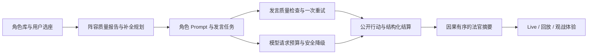
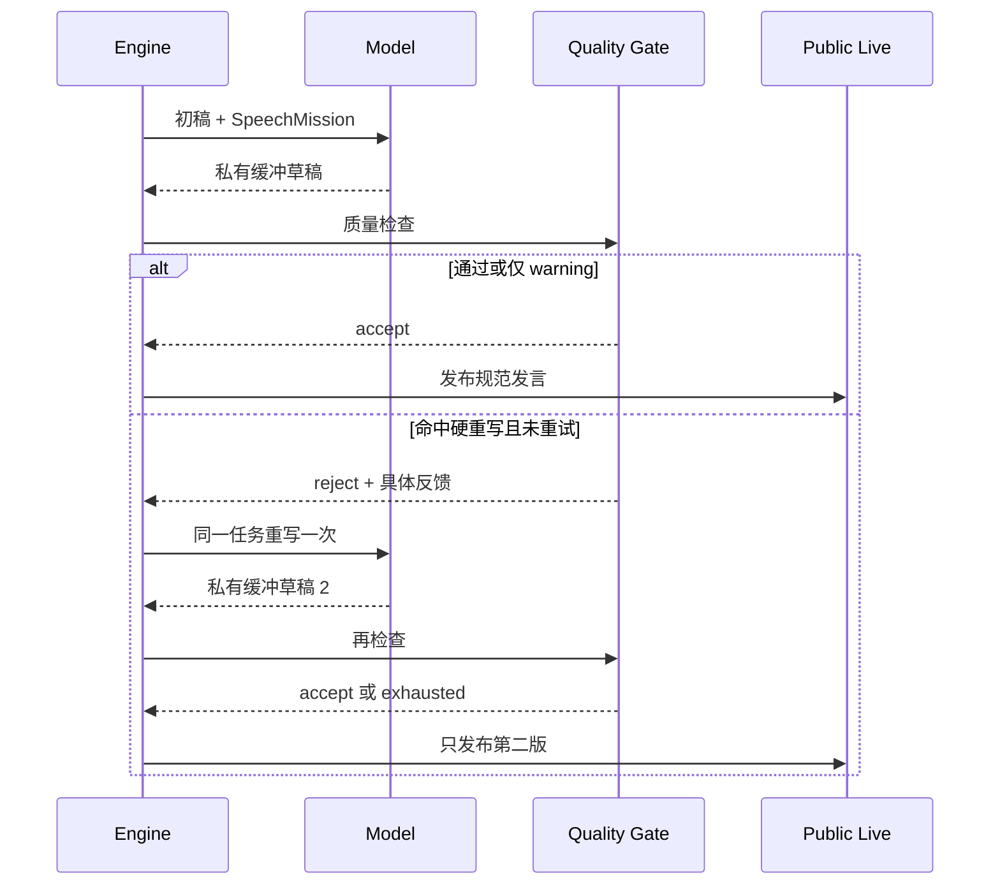

# 狼人杀 P2 阵容、发言质量、性能与结算表达修复开发设计

## 1. 文档信息

- 依据对局：`run_05aa0b0f2b92`
- 对局记录：`game_0c46d70d`
- 上游问题清单：`docs/run-05aa0b0f2b92-quality-remediation-plan.md`
- P0 设计：`docs/superpowers/specs/2026-07-14-p0-game-integrity-remediation-design.md`
- P1 设计：`docs/superpowers/specs/2026-07-14-p1-game-flow-experience-remediation-design.md`
- P1 基线提交：`1f001d11 fix(werewolf): remediate P1 game flow and experience issues`
- 模型接入基线：`fd94ac88 feat(werewolf): add Ark Agent Plan models`
- 目标问题：P2-01、P2-02、P2-03、P2-04、P2-05
- 文档状态：代码开发完成，灰度观察中（P2-T01～P2-T24 已完成；P2-O01 自然流量观察进行中）
- 编写日期：2026-07-14

本文是 P2 的可执行开发设计。P0 已保证事实、隐私和终局正确，P1 已补齐关键流程状态、法官 Cue、语音物化、行动资格和连续自爆约束。P2 不再修正规则主链，而是解决“同一套规则是否能稳定生成有差异、有推进、等待可控且容易看懂的完整对局”。

除非某一任务的验收项、测试和兼容方案同时完成，否则不能在总 Plan 中把对应 P2 问题标记为“已修复”。本文任务清单以第 13 节勾选状态为准，完成一项、验证一项、勾选一项。

## 2. 总体结论

本局 P2 问题并非单纯的人设或文案问题，而是五条产品链路缺少明确质量契约：



P2 的核心决策如下：

1. 阵容质量从“创建后 warning”前移为“创建前可预览、自动补全可修复、服务端最终校验”；
2. 发言质量从“事后提示重复”升级为“给每轮发言分配任务、发布前检查、最多重写一次”；
3. 模型时延从统一的长超时改为按动作类型分配总预算，超时后走可解释且可复现的安全降级；
4. 公开摘要不再从多个结果字段拼接中文，而从有序、去隐私的公开结算事件生成；
5. 动作选项先做严格、无歧义的格式归一化，再决定是否让模型重试，避免 `5` 与 `5号玩家` 这种等价输入改变行动结果。

## 3. P2 范围、优先级与非目标

### 3.1 本期范围

| ID | 问题 | 本期交付 | P2 内优先级 |
| --- | --- | --- | --- |
| P2-01 | 阵容人格、口头禅和头像高度同质化 | 版本化阵容质量策略、确定性多样化补全、创建前预览、移动端风险提示与一键打散 | A |
| P2-02 | 发言重复、集体附和、信息推进不足 | 发言任务、确定性新颖度检查、发布前一次重试、耗尽告警与质量指标 | A |
| P2-03 | 离散动作慢、批量请求被最慢玩家拖住 | 分动作请求预算、批次截止时间、安全降级、进度事件收敛、时延 SLO | A |
| P2-04 | 公开总结缺少因果层级且可能重复死亡信息 | 内部结算到公开事件的隐私投影、有序摘要生成器、旧 checkpoint 保守兼容 | B |
| P2-05 | 等价动作选项缺少容错归一化 | 严格别名索引、唯一匹配、原始值留痕、规范值发布、避免无效重试 | B，但作为 P2-03 前置 |

### 3.2 推荐开发顺序

推荐按以下依赖顺序落地，而不是按界面可见程度排序：

1. 先完成 P2-05 动作归一化，建立“模型原始输出 → 规范公开选项”的稳定边界；
2. 完成 P2-01 阵容质量契约和预览接口，避免继续生成新的同质化对局；
3. 完成 P2-02 发言任务和发布前质量门禁；
4. 在动作结果已可稳定归一化后完成 P2-03 请求预算、批次截止和降级；
5. 完成 P2-04 公开结算事件和摘要生成，并用目标对局做端到端回归；
6. 最后运行离线确定性回归；真实模型指标通过自然对局被动积累，达到观测门槛后再逐项勾选。

### 3.3 非目标

- 不修改规则修订 2 的阵营、角色能力、自爆、警徽或屠边胜负条件；
- 不根据本局结果重新平衡任何阵营胜率；
- 不使用自由文本猜测隐藏身份、夜间死亡原因或玩家真实意图；
- 不把模型的第一版重复草稿发布后再删除；被拒绝草稿从始至终不得进入公开 Live、语音和回放；
- 不为了降低耗时跳过规则结算、强制所有模型使用同一短回答，或静默丢弃合法必选动作；
- 不使用编辑距离、姓名前缀或任意子串匹配动作对象；歧义输入必须失败而不能猜测；
- 不在 P2 引入在线向量数据库。发言“语义相近”先使用可解释的命题签名和词面相似度；
- 不要求 CI 访问火山引擎或其他在线模型服务；默认不为 P2 专门发起高额度批量模型压测；
- 不迁移或重写历史对局数据。旧回放使用兼容投影，新的结构只作用于新写入的数据。

### 3.4 Admin 交付范围

P2 同时为运营和开发诊断补齐 Admin 能力，但不新建一套独立导航。功能落在现有两个详情页：

- `运行监控详情`：观察进行中或已结束 Run 的模型时延、超时、降级、质量重试和规范化统计；
- `对局记录详情`：查看阵容质量报告、发言质量结果、公开结算因果链和整局质量结论；
- 普通 `runs.read` / `games.read` 权限只返回聚合指标、稳定 reason code 和公开事件；
- `runs.debug.read` / `games.debug.read` 继续使用现有按需加载入口，只提供排障必需的受限证据；
- 私密夜间选择、隐藏死亡原因、完整 Prompt、模型原始响应和被拒绝发言草稿在 Admin 页面中仍不可见；
- P2 不允许 Admin 直接修改历史动作、重放单个行动、覆写摘要或在线调整质量策略。策略切换继续走受控配置和发布流程。

## 4. 当前代码基线与差距

| 领域 | 已有能力 | 当前缺口 |
| --- | --- | --- |
| 阵容 | `lineup_quality_warnings()` 能检查部分人格、口头禅和标签重复；创建结果可携带 warning | 只告警不阻断；没有头像、策略风格、规模化阈值；随机补位不考虑多样性；前端启动前不可预览 |
| 发言 | `dialogue_quality_warnings()` 能检查口头禅、重复短语和 4-gram 重叠；Prompt 有基础发言位置指导 | 普通辩论大多不缓存；warning 不触发重写；没有本轮任务、命题推进和集体附和检查 |
| 请求 | Provider 有基础 HTTP/流式超时；批量行动使用线程池 | 非流式统一 `120s`；批量等待所有 future；重试会重新获得完整超时；缺少动作级预算、批次截止和降级留痕 |
| 摘要 | `RoundState` 保存夜间/白天死亡、猎人开枪、放逐和白痴翻牌；P1 有显式 Cue | `_public_round_brief()` 直接拼接多个字段，猎人目标可能重复；先后和因果不稳定；内部死亡原因不能直接公开 |
| 动作选项 | 引擎把内部玩家 ID 映射为 `5号玩家` 等公开选项；LM 会检查 allowed values 并重试 | `_normalize_allowed_value()` 只做精确值/字符串转换；`5`、`5号` 无法命中 `5号玩家`，无效重试后可能改变目标 |

## 5. 跨模块设计原则

### 5.1 服务端是唯一最终裁判

- 前端可展示即时预览，但创建游戏、接受动作和发布结算前必须由服务端再次校验；
- 前端不得复制一套独立阈值并把它当作最终结果；
- 所有策略、报告和新增持久化结构都带 `schema_version=1`；
- 同一输入、规则版本、角色库快照和随机种子必须得到同一结果。

### 5.2 公开叙事与内部因果分离

- 内部 `DeathEvent` 可记录真实 cause/source，用于规则结算和受限调试；
- `PublicOutcomeEventV1` 只能包含当前公开可知事实；
- 夜间出局在规则未公开原因时只能描述为“夜间出局”，不能暴露狼刀或女巫毒药；
- 摘要、法官 Cue、Live 和回放只消费公开投影，不读取内部死亡原因拼台词。

### 5.3 有界重试与可复现降级

- 发言质量失败最多重写一次；
- 动作格式归一化在格式重试之前执行；
- 模型请求的所有重试共享同一个动作总截止时间，不能每次重置预算；
- 降级选择只在合法候选集合内进行，使用 run seed、round、phase、actor、action kind 派生的确定性随机源；
- 每次重试、超时和降级都必须记录原因，但普通观众不看到底层错误和隐藏选项。

### 5.4 新字段只做加法兼容

- 新版 checkpoint 可以写入 P2 字段；旧 checkpoint 缺少字段时提供安全默认值；
- 读取旧对局时不得根据最终身份反推当时公开原因；
- 关闭 P2 feature flag 后，旧规则链仍可正常运行和回放；
- 新客户端遇到旧服务端字段缺失时退回现有表现，旧客户端忽略新增字段。

## 6. P2-05：动作选项容错归一化

### 6.1 新增纯函数契约

建议在 `apps/api/app/werewolf/action_choice.py` 新增纯函数和类型：

```python
@dataclass(frozen=True)
class ChoiceNormalizationResult:
    raw_value: object
    canonical_value: object | None
    kind: Literal["exact", "string_exact", "seat_alias", "special_alias", "invalid", "ambiguous"]
    matched_alias: str | None = None

def normalize_action_choice(
    raw_value: object,
    allowed_values: Sequence[object],
    *,
    aliases: Mapping[object, Sequence[str]] | None = None,
) -> ChoiceNormalizationResult: ...
```

处理顺序固定为：

1. 对原始对象做类型一致的精确匹配；
2. 所有候选为字符串时，做 Unicode NFKC、首尾空白和连续空白规范化后的精确匹配；
3. 对明确的座位候选生成受限别名，例如 `5`、`05`、`5号`、`5号玩家`、`玩家5号`；
4. 对“不使用毒药”“不开枪”“不自爆”等固定特殊项只接受显式登记的别名；
5. 别名索引只命中一个候选时返回规范值；命中多个候选时返回 `ambiguous`；
6. 不命中时返回 `invalid`，之后才进入现有无效选项反馈和重试。

禁止事项：

- 不按名字前缀匹配玩家；
- 不允许 `5abc` 命中 5 号；
- 不使用编辑距离自动纠错；
- 不把已死亡、自己或其他不在 allowed values 内的座位补回候选；
- 不因候选顺序不同改变歧义处理结果。

### 6.2 引擎接入位置

- `lm.generate_action()` 和 `generate_action_with_events()` 在收到 provider JSON 后先调用归一化器；
- 归一化成功后，后续引擎只接收 canonical value；
- 归一化失败才消耗格式重试次数；
- 引擎公开事件、语音和回放只发布 canonical public value；
- `ActionLog` 增加可选字段 `raw_choice`、`choice_normalization_kind`，私密行动仍按原有可见性隔离；
- checkpoint 新字段缺失时按 `exact` 处理历史规范值，不修改历史日志。

### 6.3 验收标准

- `5`、`05`、`5号`、`5号玩家`、`玩家5号` 在唯一合法时都规范到同一个公开选项；
- 上述等价输入不触发第二次模型请求，模型目标不会因为格式重试而漂移；
- 不合法座位、歧义别名和模糊姓名仍被拒绝；
- 普通 Live、语音和 playback 不暴露私密行动的 `raw_choice`；
- 相同输入和候选集合重复运行 100 次结果一致。

## 7. P2-01：阵容质量门禁与自动修复

### 7.1 版本化质量策略

新增 `LineupQualityPolicyV1`，默认参数作为服务端配置集中管理：

```text
schema_version = 1
mode = observe | repair | enforce
max_same_personality = 3
max_same_catchphrase = 2
max_same_avatar = 3
max_same_strategy_profile = 3
min_style_buckets = 4          # 8～12 人局
min_style_buckets_small = 3    # 6～7 人局
```

阈值说明：

- `personality` 使用稳定 `personality_id`，不比较自由文本；
- `catchphrase` 做 NFKC、空白和标点规范化后计数，空值不计；
- `avatar` 优先用 `avatar_asset_id`，缺失时用 `appearance_id`，两个都为空不形成重复组；
- `strategy_profile` 使用角色库枚举值；
- `style_bucket` 由 `personality_id + strategy_profile` 的显式映射产生，不让模型或自由文本临时分类；
- 标签重复作为信息提示，不作为首版硬门禁，避免通用标签导致误阻断。

模式语义：

| 模式 | 完整人工阵容 | 有空位的自动补全 | 用途 |
| --- | --- | --- | --- |
| `observe` | 允许，返回报告 | 随机兼容补全并返回报告 | 影子观测、紧急回滚 |
| `repair` | 允许显式确认风险 | 只修改未锁定座位并尽量消除阻断项；无法满足时返回明确错误 | 默认灰度模式 |
| `enforce` | 有阻断项则拒绝 | 必须规划出无阻断阵容，否则拒绝 | 稳定后默认模式 |

### 7.2 质量报告契约

新增 `LineupQualityReportV1`：

```json
{
  "schema_version": 1,
  "policy_mode": "repair",
  "is_blocked": false,
  "was_repaired": true,
  "style_bucket_count": 4,
  "violations": [
    {
      "code": "personality_overrepresented",
      "severity": "error",
      "key": "analytical",
      "count": 5,
      "limit": 3,
      "seat_numbers": [1, 2, 3, 4, 5]
    }
  ]
}
```

要求：

- `code`、`severity`、`count`、`limit` 和座位是结构化字段，前端不解析 `detail` 中文；
- 报告不包含隐藏身份、API Key、内部 Prompt 或未公开行动；
- 老的 `lineup_quality_warnings` 在兼容期由新报告投影生成，不能维护两套判定；
- 不引入一个无法解释的综合分作为启动条件，阻断只由具名规则决定。

### 7.3 确定性多样化补全

服务端新增 lineup planner：

1. 用户已选且锁定的座位保持不变；
2. 候选仅来自已发布、可用、未重复占座的角色档案；
3. 每次加入一个候选，计算其对人格、口头禅、头像、策略和风格桶的增量冲突；
4. 优先选择能减少阻断项并增加缺失风格桶的候选；
5. 同分时使用 `run seed + library snapshot + profile id` 的稳定排序打破平局；
6. 规划结束后必须重新跑完整质量报告，不能只相信增量分；
7. 候选库无法满足时返回 `lineup_quality_unsatisfied` 和缺少的维度，不偷偷放宽门槛。

“一键打散全部”是显式操作，可重新选择全部未收藏/未锁定座位；“智能补位”只能填空位。模型选择、玩家显示名和用户锁定信息不得被静默修改。

### 7.4 API 与移动端交互

新增创建前预览接口，建议为：

```text
POST /api/v1/games/lineup-preview
```

请求包含规则集、随机种子、当前 player configs、锁定座位和 `repair_scope=empty_only|unlocked_all`；响应返回补全后的 configs、质量报告和角色库快照标识。创建游戏接口增加：

- `lineup_quality_policy_version`；
- `allow_lineup_quality_warnings`，仅在 `repair` 模式、完整人工阵容且用户已确认时有效；
- 服务端创建时重新校验，不能直接信任 preview 结果。

移动端改动：

- 阵容区展示“风格 3/4、同人格 5/3”等明确风险；
- 阻断时启动按钮旁提供“一键打散”主动作；
- 手工阵容在 `repair` 模式允许二次确认，不允许默认勾选忽略；
- `enforce` 模式不展示无效绕过入口；
- 预览请求失败时保留用户当前选座并提示重试，不能清空阵容。

### 7.5 验收标准

- 8～12 人默认自动阵容至少覆盖 4 个风格桶；6～7 人至少覆盖 3 个；
- 默认自动阵容没有人格、口头禅、头像或策略的超限项；
- 相同 seed、规则、锁定座位和角色库快照产生完全相同的补全结果；
- 不足候选库会给出可解释错误，不死循环、不重复占用档案；
- 创建接口能拒绝绕过前端直接提交的违规阵容；
- 本局全员同人格 fixture 能稳定产生阻断报告，并可通过一键打散修复。

## 8. P2-02：发言任务、相似度检查与一次重写

### 8.1 发言任务

每次警长竞选或普通辩论发言前，由确定性调度器分配一个 `SpeechMissionV1`：

| 任务 | 最低输出要求 |
| --- | --- |
| `fact_checker` | 纠正或确认一条已发生的公开事实 |
| `vote_analyst` | 对已有票型、警徽或站边关系给出变化解释 |
| `contradiction_hunter` | 指出一名玩家前后表述的具体矛盾 |
| `devil_advocate` | 对当前多数结论提出最强反例或风险 |
| `risk_controller` | 给出失败成本、轮次资源或终局风险 |
| `consolidator` | 合并已有信息并明确一个下一步可验证结论 |

调度规则：

- 根据 round、phase、seat、已分配任务和 personality 选择，确保同一轮任务不过度集中；
- 任务只使用该角色可见的公开事实和合法私密记忆；
- 当连续两名玩家支持同一放逐目标且没有新证据时，下一名优先分配 `devil_advocate`；
- 任务是发言结构提示，不强制角色改变阵营利益或公开隐藏身份；
- 没有足够公开事实时允许 `consolidator`，不能虚构“必须引用”的事实。

### 8.2 发言质量报告

新增 `SpeechQualityReportV1`，首版使用可解释的确定性混合检查：

1. 规范化中文文本，保留玩家座位、否定词、身份词和投票动词；
2. 计算字符 4-gram Jaccard 和长句 containment；
3. 提取“主体座位 + 立场/动作 + 对象座位/身份 + 极性”的命题签名；
4. 对比同一阶段前若干条公开发言和该玩家自己的最近发言；
5. 判断是否完成任务、是否回应目标、是否新增命题或改变置信度；
6. 输出具名 code，而非只输出一个黑盒相似度。

建议首版硬重写条件：

- `repeated_debate_phrase` 且没有新增命题；
- `low_proposition_novelty` 且未完成本轮 mission；
- `group_agreement_without_evidence` 且本轮任务为反方/核查；
- 大段重复自己的口头禅并挤占有效内容。

以下情况只告警不重写：合理引用上一位的短句、法官固定用语、必要的身份声明、短篇明确投票结论。

### 8.3 发布前重写流程



- 警长发言和普通辩论全部使用服务端缓冲；
- 第一版 token delta、完成事件和文本不得进入公开事件表、语音任务或 playback；
- 第二版仍失败时接受第二版，发布 `quality_retry_exhausted` 内部指标和不扰乱观众的质量 warning；
- 每次发言最多一次质量重写；模型格式重试和质量重写共享动作预算；
- 离散选票、用药、开枪、自爆选择不进入发言相似度检查。

### 8.4 验收标准

- 连续照抄 fixture 必须触发一次重写；包含明确新事实/新票型的相似开场不误拒绝；
- 第一版被拒绝后，公开 Live、语音、playback 和数据库公开事件中均为 0 条；
- 第二次失败不会形成无限重试，且能正常推进阶段；
- 连续附和时确定性插入反方或核查任务；
- 发布前质量检查不得读取角色不可见的私密信息；
- 自然流量真实模型观测中，连续三条低新颖度发言窗口比例不高于 5%，质量重试耗尽率不高于 2%。

## 9. P2-03：动作级时限、批次截止与安全降级

### 9.1 执行预算模型

新增 `ActionExecutionBudgetV1`，以 deadline 而不是每次调用独立 timeout 表达：

| 动作类型 | 初始请求上限 | 动作总预算 | 批次截止 | 降级方向 |
| --- | ---: | ---: | ---: | --- |
| 必选离散动作（投票、选择目标） | 12s | 15s | 15s | 在合法集合中确定性选择 |
| 可选离散动作（毒、救、开枪、自爆等） | 10s | 12s | 12s | 安全地不使用技能/不行动 |
| 公开发言 | 首 token 10s | 45s | 不适用 | 发布中性短句并继续流程 |
| 私密讨论/策略文本 | 首 token 8s | 25s | 25s | 空讨论文本；必选目标单独按离散策略补齐 |

表中数值是 P2 首版默认值，必须支持配置，并在自然流量真实模型观测后确认。实现规则：

- `deadline_at` 在引擎开始动作时产生；
- Provider 每次 HTTP/流式调用获得“剩余预算”，不能继续使用固定 `120s`；
- 格式重试、质量重写和 provider 重试都消耗同一预算；
- 剩余时间不足以完成下一次请求时直接降级；
- 线程池层的 batch deadline 是第二层保护，底层网络超时必须更早生效；
- future 超时后不能继续向公开流写入迟到事件。

### 9.2 Provider 接口演进

为 provider 请求增加可选 `ModelCallOptions`：

```python
@dataclass(frozen=True)
class ModelCallOptions:
    deadline_at_monotonic: float
    request_timeout_seconds: float
    first_token_timeout_seconds: float | None = None
    max_output_tokens: int | None = None
```

- 更新所有 provider 和测试 fake，默认 `None` 时保持旧行为；
- 非流式 transport 取 `min(request_timeout, remaining_deadline)`；
- 流式分别检查首 token、无内容间隔和总 deadline；
- 取消或超时后关闭响应并阻止 late delta；
- 不以线程 `future.cancel()` 代替底层连接时限，因为运行中的阻塞线程不能可靠取消。

### 9.3 安全降级表

| 情况 | 降级结果 | 公平性要求 |
| --- | --- | --- |
| 女巫用药、猎人开枪、自爆等可选动作超时 | 选择明确的“不使用/不开枪/不自爆” | 不替模型主动消耗稀缺技能 |
| 必须投票或必须选择目标 | 从当时 allowed values 通过派生 seed 稳定选择 | 不按列表第一项，避免固定座位偏置；结果可复现 |
| 公开发言超时 | 使用固定中性文本，表达“本轮暂不追加判断，投票时给出选择” | 不捏造身份、查验、票型和私密信息 |
| 狼人讨论文本超时但夜刀必须完成 | 讨论文本留空，夜刀目标按合法集合稳定选择 | 目标仍走私密可见性 |
| 候选集合为空 | 记录 `no_legal_choice` 并走现有规则分支 | 不制造非法选项 |

降级必须新增 `ActionLog.execution_status`（`completed|timed_out|fallback|failed`）、`duration_ms`、`budget_ms`、`fallback_reason`。公开层只显示必要的流程结果，不暴露 provider 错误、模型名称内部路由和私密候选。

### 9.4 批量动作与进度事件

- `_player_actions_batch()` 在提交任务时记录统一 batch deadline；
- 到期后只接受已完成结果，未完成动作逐个应用对应降级；
- 结果按规则需要的座位顺序提交，而不是按 future 完成顺序改变游戏语义；
- 迟到 future 只能清理资源，不能二次提交动作；
- 每个 `request_id` 的进度从每 2 秒 tick 改为 3s、8s、15s、30s 里程碑，超长请求之后每 15s 一次；
- 前端按 `request_id + stage` 去重，只保留当前动作最新进度，不在聊天流堆积“思考中”。

### 9.5 指标与 SLO

服务端新增低基数指标：

- `werewolf_model_action_duration_seconds{action_kind,provider,result}`；
- `werewolf_model_first_token_seconds{action_kind,provider,result}`；
- `werewolf_model_timeout_total{action_kind,provider}`；
- `werewolf_action_fallback_total{action_kind,reason}`；
- `werewolf_action_batch_duration_seconds{action_kind,result}`；
- `werewolf_model_progress_event_total{stage}`。

禁止把 run ID、player ID、自由文本、API Key 或 endpoint 作为指标 label。

发布目标：

- 离散动作 P95 小于 15 秒；
- 公开发言首 token P95 小于 10 秒；
- 12 人完整对局中位耗时不高于 18 分钟，受控环境 P95 不高于 22 分钟；
- 稳定在线模型环境降级率不高于 1%；
- 任何单个慢请求都不能让一批离散动作等待超过批次截止时间；
- 超时后公开流中迟到 delta、重复动作和重复结算均为 0。

## 10. P2-04：公开结算事件与因果摘要

### 10.1 双层结算结构

保留现有内部 `DeathEvent(player, cause, source)`，新增公开投影：

```python
@dataclass(frozen=True)
class PublicOutcomeEventV1:
    schema_version: Literal[1]
    event_id: str
    sequence: int
    kind: Literal[
        "night_death", "hunter_shot", "self_explosion", "exile",
        "idiot_reveal", "badge_transferred", "badge_lost"
    ]
    actor_player_id: str | None
    target_player_id: str | None
    outcome: str
    caused_by_event_id: str | None
    occurred_phase: str
```

隐私投影示例：

- 内部事实“狼人袭击 4 号，4 号为猎人”在天亮时只投影为“4 号夜间出局”；
- 猎人随后公开开枪可投影为“因 4 号出局触发猎人技能，4 号开枪带走 3 号”；
- 若规则导致猎人不能开枪，则只播报相应公开结论，不暴露导致禁枪的隐藏用药原因；
- 女巫毒杀和狼刀同夜发生时，除非规则公开原因，否则均为有顺序的“夜间出局”，不标注 source。

### 10.2 唯一事件顺序

- 引擎在规则结果正式提交时追加公开结算事件；
- `sequence` 由同一 round 的单调计数器产生；
- `event_id` 用 run、round、phase、sequence 稳定生成，checkpoint 恢复后不得重复；
- 猎人开枪、白痴翻牌、警徽转移/流失用 `caused_by_event_id` 连接到触发事件；
- `night_deaths`、`day_deaths`、`hunter_shot` 等旧字段继续写入兼容，但摘要不再同时扫描这些字段；
- P1 `judge_cue` 从相同公开事件生成，禁止另写一套结果顺序。

### 10.3 摘要生成规则

新增纯函数 `render_public_round_summary(events)`：

1. 按 sequence 排序并拒绝重复 event ID；
2. 先表达触发事实，再表达其直接结果；
3. 同一玩家在同一摘要中只保留一个主结论，技能结果用因果从句连接；
4. 猎人目标不会先以死亡名单出现、又在“猎人带走”中重复；
5. 自爆、放逐、白痴免死、警徽去向各自使用明确动词；
6. 没有事件时输出规则定义的“本阶段无公开结算”，不输出空字符串；
7. 文案只消费公开字段，不读取最终身份补充解释。

旧 checkpoint 没有公开事件列表时，兼容层可从旧公开字段生成“保守事件”：只表达当时明确保存的出局、放逐、猎人开枪和警徽结果；无法确定的内部先后不猜测，原始 `public_summary` 可作为最终兜底。

### 10.4 验收标准

- 夜间死亡触发猎人开枪时，目标只出现一次，且先触发、后结果；
- 同夜多名玩家出局、白痴免死、自爆、放逐和警徽流转顺序稳定；
- 摘要、Judge Cue 和客户端状态对同一事件没有顺序冲突；
- 公开 payload 中隐藏死亡原因和内部 source 泄露数为 0；
- checkpoint 恢复不会重复追加结算事件或重复法官播报；
- 历史 P0/P1 fixture 可回放，缺少新字段不会报错。

## 11. API、持久化与兼容变更总表

| 层 | 新增/修改 | 兼容策略 |
| --- | --- | --- |
| 创建请求 | policy version、warning override、锁定座位/repair scope | 均为可选字段；缺失按服务端默认 |
| 创建/预览响应 | `LineupQualityReportV1`、resolved configs | 保留旧 warnings 投影一个版本 |
| Run/checkpoint | lineup report、execution status、public outcome events、next sequence | 缺失时用空列表/旧字段保守恢复 |
| ActionLog | raw choice、normalization kind、duration、budget、fallback | 可选字段；旧记录不回填 |
| Live | 可选 outcome/progress/quality reason code | 旧客户端忽略；不发布拒绝草稿 |
| Playback | 消费 public outcome events 和规范动作 | 旧对局退回现有事件/摘要 |
| Provider | 可选 ModelCallOptions | `None` 保持旧调用，逐个更新 fake |
| Admin Run 详情 | `AdminRunP2DiagnosticsV1` | `runs.read` 返回安全聚合；debug 证据按现有权限和终局条件加载 |
| Admin Game 详情 | `AdminGameP2QualityV1`、公开 outcome timeline | `games.read` 只返回公开事实；旧对局标记 `data_status=legacy` |

新增字段必须通过普通 API、Admin API、Live、语音和 playback 的 P0 隐私矩阵复核。尤其 `raw_choice`、内部 cause、private candidates 和拒绝草稿默认都不属于公开契约。

### 11.1 Admin P2 诊断契约

Admin API 不直接返回引擎对象或完整 `ActionLog`，而由单独的安全投影生成两个版本化摘要。

`AdminRunP2DiagnosticsV1` 至少包含：

```json
{
  "schema_version": 1,
  "data_status": "available",
  "performance": {
    "request_count": 92,
    "discrete_action_p50_ms": 5200,
    "discrete_action_p95_ms": 14300,
    "speech_first_token_p95_ms": 9100,
    "timeout_count": 1,
    "fallback_count": 1,
    "active_request_count": 0
  },
  "speech_quality": {
    "checked_count": 24,
    "retry_count": 3,
    "exhausted_count": 0
  },
  "choice_normalization": {
    "exact_count": 60,
    "seat_alias_count": 1,
    "invalid_count": 0
  }
}
```

`AdminGameP2QualityV1` 至少包含：

- `lineup_quality`：模式、是否修复、风格桶数量和结构化 violations；
- `speech_quality`：检查数、重写数、耗尽数和低新颖度窗口数；
- `performance`：整局时长、离散动作 P95、发言首 token P95、超时和降级数；
- `choice_normalization`：按 `kind` 聚合的计数，不默认返回原始选择；
- `public_outcomes`：按 round/sequence 排序的公开事件、因果关联和摘要校验结果；
- `quality_gates`：每项显示 `pass|warn|fail|unavailable`，同时返回阈值、实际值和稳定 code。

权限与展示边界：

| 权限/状态 | 可见内容 | 禁止内容 |
| --- | --- | --- |
| `runs.read` | 运行中聚合耗时、超时/降级计数、当前请求数量、质量重试计数 | 行动候选、原始输出、隐藏角色和私密 cause |
| `runs.debug.read` | 按需加载 provider 错误分类、timeout stage、attempt 序号和截断状态 | 完整 Prompt、模型原文、API Key、私密行动内容 |
| `games.read` | 终局或不可恢复对局的质量摘要、阵容报告和公开结算链 | 被拒绝发言草稿、内部 DeathEvent source、私密 raw choice |
| `games.debug.read` | 按需加载具名质量 code、规范化 kind、预算与耗时证据 | 私密夜间目标；未终局时的身份和行动内容 |

`raw_choice` 首版不进入 Admin Web。需要定位格式问题时展示 `normalization_kind`、action kind、attempt count 和 canonical public value；只有已经公开的行动才允许显示 canonical value。这样可以诊断 `5 → 5号玩家` 是否生效，同时不扩张 P0 的隐私边界。

### 11.2 Admin 页面信息架构

不新增路由，直接扩展：

- `LiveRunDetailPage` 增加“P2 运行质量”区：延迟分位数、首 token、timeout/fallback、重试耗尽和当前请求；
- `GameRecordDetailPage` 增加“P2 对局质量”区：五项质量门槛总览、阵容冲突、发言推进度和动作规范化；
- `GameRecordDetailPage` 的轮次摘要下增加“公开结算链”：按 sequence 展示事件和 `caused_by_event_id`，不展示内部 cause/source；
- 受限诊断继续沿用现有 Debug Panel 的显式“加载诊断”交互，不在页面初始化时预取；
- `data_status=legacy|collecting|available|unavailable` 必须有明确空态，旧对局不能错误显示为“全部通过”；
- 单局样本不足时显示样本量和最大值，不伪造 P95 或用 `0ms` 表示缺失。

## 12. 预期代码改动范围

后端重点文件：

- `apps/api/app/werewolf/action_choice.py`：新增选项归一化纯函数；
- `apps/api/app/werewolf/lm.py`：归一化接入、共享 deadline、重试预算；
- `apps/api/app/werewolf/debate_realism.py`：阵容报告、发言任务、命题签名和质量报告；
- `apps/api/app/werewolf/action_quality.py`：发布前硬重写 code 和耗尽结果；
- `apps/api/app/werewolf/engine.py`：缓冲发布、动作预算、批次截止、公开结算事件；
- `apps/api/app/werewolf/providers.py`：请求选项、底层 timeout、流式取消；
- `apps/api/app/werewolf/models.py`：`DeathEvent`、`ActionLog`、`RoundState` 的 P2 版本化字段；
- `apps/api/app/werewolf/player_configs.py`、`apps/api/app/models/virtual_player_profile.py`：阵容质量所需的稳定档案字段；
- `apps/api/app/api/routes/games.py`：阵容预览、创建门禁和报告响应；
- `apps/api/app/api/routes/admin_games.py`、`apps/api/app/api/schemas/admin_games.py`：Admin 对局质量安全投影；
- `apps/api/app/api/routes/admin_live_runs.py`、`apps/api/app/api/schemas/admin_live_runs.py`：Admin Run 性能与质量诊断投影；
- `apps/api/app/werewolf/voice.py`、Judge Cue 相关模块：消费统一公开结算事件；
- playback/live 路由：新增事件兼容投影和隐私过滤。

前端重点文件：

- `packages/game-client/src/lineup/lineupUtils.ts`：从随机补位迁移到服务端规划结果的应用；
- `packages/game-client/src/types.ts`：P2 报告、公开事件和请求字段；
- `apps/mobile-web/src/components/lobby/lobbyModel.ts`：质量状态和启动条件；
- `apps/mobile-web/src/components/lobby/LobbyLineupSection.tsx`：风险卡、一键打散和显式确认；
- `apps/mobile-web/src/pages/GamesPage.tsx`：预览请求、创建前复核；
- Live/回放状态层：按 request ID 收敛进度并消费公开结算事件。

Admin Web 重点文件：

- `apps/admin-web/src/features/live-runs/{api,types,parsers,query-keys}.ts`：运行质量契约和按需诊断请求；
- `apps/admin-web/src/features/live-runs/LiveRunDetailPage.tsx`：性能、超时、降级和质量重试面板；
- `apps/admin-web/src/features/game-records/{api,types,parsers,query-keys}.ts`：整局质量和公开结算链契约；
- `apps/admin-web/src/features/game-records/GameRecordDetailPage.tsx`：阵容、发言、规范化和因果结算展示；
- 对应 `contracts.test.ts`、Flow 测试和 test fixtures：权限、旧数据、加载、空态和隐私回归。

具体文件名可随现有模块边界调整，但纯函数、服务端最终校验、公开/内部因果分离和共享 deadline 四项设计约束不可省略。

## 13. 开发任务清单

完成一项开发和对应测试后，才能把该任务从 `[ ]` 改为 `[x]`。只写代码、未补测试或未通过对应验收时不得勾选。

### 13.1 PR-A：动作归一化基础（P2-05）

- [x] **P2-T01：新增动作选项归一化纯函数和结果类型**
  - 完成精确值、规范字符串、座位别名、特殊项别名、歧义和非法结果；
  - 加入 NFKC、空白处理和无模糊猜测约束；
  - 单元测试覆盖数值、字符串、中文座位形式和别名冲突。

- [x] **P2-T02：在 LM 重试前接入归一化**
  - `generate_action` 两条路径共用同一实现；
  - 成功归一化不消耗格式重试；
  - 引擎映射只接收 canonical value。

- [x] **P2-T03：补齐原始值留痕和隐私兼容**
  - `ActionLog`/checkpoint 写入可选字段；
  - 公开事件仅使用规范值；
  - 私密原始选择不进入普通 API、Live、语音和 playback。

### 13.2 PR-B：阵容质量门禁（P2-01）

- [x] **P2-T04：实现版本化阵容策略与结构化报告**
  - 集中定义阈值、模式、severity 和稳定 code；
  - 旧 warning 从新报告投影；
  - 覆盖 6/8/12 人阈值和空字段。

- [x] **P2-T05：实现风格桶、头像键和冲突维度提取**
  - 使用稳定 ID 和显式映射；
  - 不依赖自由文本猜测；
  - 测试人格、策略、口头禅和头像回退键。

- [x] **P2-T06：实现确定性多样化 lineup planner**
  - 支持只补空位和重排未锁座位；
  - 固定 seed 可复现；
  - 候选不足返回可解释失败，不修改锁定座位。

- [x] **P2-T07：新增阵容预览 API 与创建时最终门禁**
  - 支持 observe/repair/enforce；
  - 校验 override 只在允许的模式生效；
  - 防止绕过前端直接创建违规阵容。

- [x] **P2-T08：完成移动端风险提示与一键打散**
  - 展示结构化超限维度和风格覆盖；
  - 接入 preview/repair 结果；
  - 请求失败保留当前阵容；
  - 补齐交互和状态测试。

### 13.3 PR-C：发言质量门禁（P2-02）

- [x] **P2-T09：实现 SpeechMission 调度器**
  - 覆盖六类任务、轮内分散和连续附和反方触发；
  - 任务只读取角色可见上下文；
  - 固定输入确定性输出。

- [x] **P2-T10：实现命题签名和 SpeechQualityReport**
  - 复用并升级现有 4-gram 检查；
  - 区分合理引用、新事实和低新颖度；
  - 产出稳定 code、分数和证据位置，不落原始私密文本到指标。

- [x] **P2-T11：把全部公开发言改为发布前缓冲和一次重写**
  - 警长发言、PK 发言、普通辩论统一处理；
  - 被拒绝初稿的公开事件、语音和回放为 0；
  - 与格式重试共享动作 deadline。

- [x] **P2-T12：补齐重写耗尽行为、指标和客户端兼容**
  - 第二次仍失败时只发布第二版并继续；
  - 记录 retry/exhausted/novelty 指标；
  - 客户端不展示中间草稿或重复完成事件。

### 13.4 PR-D：模型请求预算和降级（P2-03）

- [x] **P2-T13：实现 ActionExecutionBudget 与 Provider 请求选项**
  - deadline 使用 monotonic clock；
  - 全部重试共享剩余时间；
  - 更新在线 provider 和测试 fake。

- [x] **P2-T14：实现动作级安全降级与执行留痕**
  - 可选技能、必选目标、公开发言和私密讨论分别处理；
  - 必选目标仅从合法集合确定性选择；
  - 新 ActionLog 字段兼容 checkpoint 恢复。

- [x] **P2-T15：实现批次截止、迟到结果隔离和进度收敛**
  - 最慢请求不超过 batch deadline；
  - 迟到 delta/结果不能二次发布；
  - 结果提交顺序不受线程完成顺序影响；
  - 前端按请求和阶段去重。

- [x] **P2-T16：接入性能指标与假时钟测试**
  - 覆盖首 token、总时长、timeout、fallback、batch 时长；
  - 指标 label 无高基数和敏感信息；
  - 假时钟测试不依赖真实等待。

### 13.5 PR-E：公开结算因果链（P2-04）

- [x] **P2-T17：新增 PublicOutcomeEventV1 和 checkpoint 序列**
  - 覆盖夜间出局、猎人、自爆、放逐、白痴和警徽；
  - 内部 cause 到公开事件有显式隐私投影；
  - 恢复后 event ID/sequence 不重复。

- [x] **P2-T18：让规则结算、Judge Cue 和公开摘要消费同一事件源**
  - 逐个迁移关键结算出口；
  - 保留旧字段写入兼容；
  - 删除摘要对多个旧结果字段的重复拼接依赖。

- [x] **P2-T19：实现确定性摘要与旧对局保守回退**
  - 因果顺序、同人去重、无结果文案稳定；
  - 旧 checkpoint 不推断隐藏原因；
  - Live、语音、playback 对同一事件顺序一致。

### 13.6 PR-F：Admin 质量诊断（跨 P2-01～P2-05）

- [x] **P2-T20：新增 Admin P2 安全投影和权限契约**
  - 为 Run 和 Game 详情增加版本化聚合结构、质量门槛和 `data_status`；
  - 复用 `runs.read/runs.debug.read/games.read/games.debug.read`，不新增宽泛权限；
  - 普通详情和 Debug 响应都执行字段白名单，私密选择、隐藏 cause、Prompt、模型原文和拒绝草稿为 0；
  - 补齐后端 schema、API、权限、终局条件和旧数据契约测试。

- [x] **P2-T21：在 Admin 对局详情增加阵容与发言质量面板**
  - 展示阵容模式、修复状态、风格桶和具名 violations；
  - 展示发言检查、重写、耗尽和低新颖度窗口，不展示发言草稿；
  - 五项质量门槛使用 `pass|warn|fail|unavailable`，缺数据不能显示通过；
  - 覆盖 available、legacy、partial、unavailable 和 API 失败状态。

- [x] **P2-T22：在 Admin 运行详情增加模型性能、降级和规范化诊断**
  - 展示请求量、离散动作耗时、首 token、timeout、fallback 和活动请求；
  - 展示 choice normalization 各 kind 与重试计数，不显示私密 raw choice；
  - 活跃 Run 沿用现有刷新节奏，Debug 证据仍按需加载且不自动轮询；
  - 单样本/小样本显示样本量和最大值，不误报 P95。

- [x] **P2-T23：在 Admin 对局详情增加公开结算因果链并完成 Admin 回归**
  - 按 round/sequence 展示 public outcome、因果连接和摘要校验结果；
  - 不展示内部 `DeathEvent.cause/source`，旧对局使用 legacy 空态或保守公开投影；
  - 完成 parser、contract、Flow、权限和响应式页面测试；
  - 验证无 debug 权限不发请求、未终局不提前展示身份/私密行动、断线刷新不重复事件。

### 13.7 PR-G：目标对局回归与发布门禁

- [x] **P2-T24：建立 P2 脱敏 fixture 和端到端确定性发布门禁**
  - [x] fixture 包含同质阵容、连续重复发言、关键耗时样本、猎人死亡链和原始选项 `5`；
  - [x] CI 完成确定性测试、checkpoint/replay/Admin/隐私回归；

- [ ] **P2-O01：通过自然流量完成 P2-02/P2-03 观察和最终关闭**
  - [ ] 按同模型版本和一致条件，从自然产生的真实对局被动积累观测样本；
  - [ ] 达到第 16 节门槛后更新本文实测记录，再在总 Plan 将 P2-02、P2-03 标记为已修复。

## 14. 测试矩阵

### 14.1 单元测试

| 模块 | 必测场景 |
| --- | --- |
| 选项归一化 | `5`/`05`/`5号`/`5号玩家`；全角数字；非法座位；自己/死人不在 allowed；特殊不行动；别名冲突；候选换序 |
| 阵容报告 | 6/8/12 人阈值；空口头禅；共享头像；appearance 回退；4 风格桶；旧 warning 投影 |
| lineup planner | 固定 seed；锁座不变；只填空位；一键打散；候选不足；档案未发布；不重复选人 |
| 发言任务 | 轮内分散；连续附和；无足够事实；不同人格；角色可见性 |
| 发言质量 | 完整复制；改写复制；合理引用；新票型；短身份声明；口头禅过度；第二次耗尽 |
| 执行预算 | 剩余 deadline；重试共享预算；首 token 超时；流中断；batch 到期；late delta 丢弃 |
| 降级 | 可选技能 abstain；必选目标稳定选择；空候选；公开中性文本；私密行动不泄漏 |
| 公开结算 | 多夜死；猎人链；猎人不能开枪；自爆；白痴免死；警徽流转；同人去重；旧字段回退 |

### 14.2 集成测试

1. preview 修复后的阵容与 create 再校验结果一致；
2. `enforce` 模式直接调用创建 API 无法绕过质量门禁；
3. 重复发言第一版不会写入公开事件、语音任务和 playback；
4. 模型输出 `5` 时一次请求完成，并执行公开候选 `5号玩家` 对应的内部玩家；
5. 批量投票中一名 provider 卡住，其余结果和降级在 15 秒虚拟时间内提交；
6. 超时后 provider 迟到返回不能产生第二条 action log 或第二次结算；
7. 夜间死亡 → 猎人开枪 → 新死亡 → 胜负判断的状态、Cue、语音和回放顺序一致；
8. P0 隐私哨兵在 raw choice、内部 cause、拒绝草稿和私密候选中公开命中数为 0；
9. P1 checkpoint 中断位置恢复后不重复语音、公开事件和降级动作；
10. P2 feature flags 全关时，现有 P0/P1 fixture 保持通过。

### 14.3 前端测试

- 阵容风险加载、修复中、修复成功、不可满足和网络失败五种状态；
- 用户锁定座位在智能补位和一键打散中的差异；
- warning 二次确认只在 `repair` 模式出现；
- `enforce` 阻断时启动按钮和说明一致；
- 思考进度同 request ID 不在时间线重复堆积；
- 新公开结算事件和旧回放 fallback 均能渲染；
- 断线恢复后不重复显示法官结算和模型降级文本。

### 14.4 Admin 测试

- `games.read` 能读取聚合质量与公开结算，但不能读取 debug 证据；
- `runs.read` 能观察运行指标，但不能读取模型错误细节和行动内容；
- debug 权限只在用户显式点击后发起对应请求，无权限时请求数为 0；
- Admin 普通/Debug 响应中的私密 raw choice、内部 cause/source、Prompt、模型原文和拒绝草稿命中数均为 0；
- 进行中、已终局、可恢复、历史 legacy 和数据不可用状态均使用正确空态；
- 小样本不展示虚假的 P95，timeout/fallback/normalization 计数与 ActionLog 聚合一致；
- 公开结算链按 round/sequence 排序，刷新和断线恢复后不重复；
- `apps/admin-web` parser 拒绝非法枚举和缺失必需字段，新增可选字段不破坏旧响应；
- 桌面和窄屏下质量卡、表格与结算链可读，错误重试不丢失已加载的安全摘要。

## 15. 可观测性与评估数据

### 15.1 阵容指标

- `werewolf_lineup_quality_violation_total{code,severity,mode}`；
- `werewolf_lineup_repair_total{result,scope}`；
- `werewolf_lineup_style_bucket_count{player_count_bucket}`。

### 15.2 发言指标

- `werewolf_speech_quality_total{code,result,phase}`；
- `werewolf_speech_quality_retry_total{result,phase}`；
- `werewolf_speech_novelty_score{phase}`；
- 连续三条低新颖度发言窗口比例，作为离线评估指标而非高基数在线 label。

### 15.3 结算与归一化指标

- `werewolf_choice_normalization_total{kind,action_kind}`；
- `werewolf_choice_retry_total{reason,action_kind}`；
- `werewolf_public_outcome_total{kind}`；
- `werewolf_public_summary_validation_total{result,reason}`。

原始发言、玩家名字、run ID、模型回答和内部死亡原因只进入受控调试日志或脱敏 fixture，不进入聚合指标标签。

## 16. 发布门槛

P2 同时使用确定性 CI 门槛和自然流量真实模型观测门槛。

### 16.1 CI 硬门槛

- P2 新增单元、集成、前端测试全部通过；
- P0/P1 回归全部通过；
- 本局脱敏 fixture 的重复死亡、隐藏原因泄漏、第一版草稿泄漏和迟到动作数均为 0；
- 常见座位等价格式归一化成功率为 100%，且不增加模型请求数；
- 固定 seed 的 lineup、fallback 和公开摘要重复运行结果一致；
- 旧 checkpoint、旧 playback 和 feature flags 关闭路径通过。
- Admin 权限、字段白名单、legacy 空态和公开结算链测试通过，所有私密哨兵公开命中数为 0。

### 16.2 自然流量真实模型观测门槛

不为本任务专门批量消耗模型额度。指标由正常创建的真实对局被动积累，并记录模型 ID、provider、Prompt 版本、规则版本、角色库快照、并发度、网络区域和测试时间；不同条件数据不能直接混算。

- 12 人完整对局中位耗时不高于 18 分钟，P95 不高于 22 分钟；
- 离散动作 P95 小于 15 秒；
- 公开发言首 token P95 小于 10 秒；
- 稳定环境 fallback 率不高于 1%；
- 连续三条低新颖度发言窗口比例不高于 5%；
- 发言质量第二次仍失败的耗尽率不高于 2%；
- 默认自动阵容阻断项为 0，8～12 人局至少 4 个风格桶；
- 结算顺序、同人重复和公开隐私违规均为 0。

若样本不足以稳定计算 P95，报告必须同时给出样本量和最大值，不得仅以单局达标替代发布门槛。

被动积累规则：

1. 代码提交和确定性灰度不以真实模型样本为前置条件，但不得对外宣称真实环境 SLO 已达标；
2. Admin 只读取已落库的安全聚合，不为观测额外触发模型请求，也不采集 Prompt、模型原文或私密行动内容；
3. 同一观测分组至少累计 20 局完整对局后，才报告整局 P95；不足 20 局时仅展示样本量和最大值；
4. 离散动作和首 token 可随自然对局持续累计，仍须按相同模型与版本条件分组；
5. 专项付费基准、单局冒烟或扩大样本量必须另行获得明确授权，不能由 CI 或普通发布流程自动触发；
6. 达到本节阈值后完成 P2-O01，并在总 Plan 中将 P2-02、P2-03 标记为已修复。

## 17. 灰度、开关与回滚

建议 feature flags：

```text
WEREWOLF_CHOICE_NORMALIZATION_V1_ENABLED
WEREWOLF_LINEUP_QUALITY_MODE=observe|repair|enforce
WEREWOLF_SPEECH_QUALITY_RETRY_ENABLED
WEREWOLF_ACTION_BUDGETS_ENABLED
WEREWOLF_PUBLIC_OUTCOME_V1_ENABLED
```

灰度顺序：

1. 动作归一化先以指标观测 canonical 结果与旧逻辑是否一致，再开启免重试；
2. 阵容质量先 `observe`，确认角色库可满足阈值后转 `repair`，最后评估 `enforce`；
3. 发言质量先只报告，再对小流量开启一次重写；
4. 动作预算先记录 would-timeout，再开启真实 deadline 和 fallback；
5. 公开结算事件先双写校验，与旧摘要一致后切换读取源；
6. 每个阶段至少跨过完整创建、游戏、断线恢复、终局和回放链路。

回滚原则：

- 开关关闭后恢复旧行为，但保留对新增 checkpoint 字段的读取能力；
- 已写入的 canonical action 和 public outcome 仍可回放；
- 不通过回滚删除或重写历史事件；
- 关闭新摘要时旧字段仍存在，关闭 lineup enforce 时退回 observe 而非清空角色配置；
- Provider 预算回滚不能让已超时的迟到 future 重新获得发布资格。

## 18. 风险与缓解

| 风险 | 后果 | 缓解 |
| --- | --- | --- |
| 阵容门槛高于角色库供给 | 无法创建游戏 | 先 observe 统计；候选不足明确报错；按人数缩放风格桶 |
| 一键打散覆盖用户偏好 | 用户不信任阵容工具 | 锁定座位默认不变；全量重排必须显式操作 |
| 词面相似度误伤合理引用 | 发言被不必要重写 | 命题签名和任务完成联合判断；短身份声明只告警 |
| 一次重写增加整体耗时 | P2-02 与 P2-03 目标冲突 | 共享动作 deadline；接近截止不再重写；监控重试耗时 |
| 超时降级造成座位偏置 | 影响对局公平 | 使用派生 seed，不选择固定首项；离线检测座位分布 |
| 运行中线程无法真正取消 | late delta、重复动作 | Provider 底层 deadline + 发布 token/attempt ID 防线 |
| 公开因果链泄露夜间原因 | 破坏信息边界 | 内部事件到公开事件显式投影；隐私哨兵和负向测试 |
| 新旧摘要双写期间重复播报 | 观感恶化 | 事件 source/version 标记；单一消费开关；event ID 幂等 |
| 客户端与服务端阈值漂移 | 展示可启动但服务端拒绝 | 服务端报告为真源；客户端不自行计算最终阻断 |
| 指标高基数或含敏感内容 | 成本与隐私风险 | 固定枚举 label；自由文本只进脱敏离线评估 |

## 19. 完成定义

单个 P2 问题只有同时满足以下条件才算完成：

1. 对应任务代码、单元测试、集成测试和必要的前端测试完成；
2. 新增结构有版本号，旧 checkpoint 和旧回放可读取；
3. P0 隐私、P0 终局和 P1 流程/Cue/语音回归通过；
4. feature flag、指标、灰度和回滚路径可用；
5. 本局脱敏 fixture 中对应问题被复现并消失；
6. 对依赖模型输出质量或真实时延的 P2-02、P2-03，自然对局指标有足够样本并记录测试条件；P2-01、P2-04、P2-05 可在确定性验收完成后标记修复并保留持续观察；
7. 本文对应任务被勾选，测试结果和提交号写入第 20 节；
8. 满足对应问题适用的验收条件后，才在总 Plan 中将该条目标记为“已修复”。

## 20. 实施记录

> P2 代码开发与确定性门禁已完成；当前仅 P2-O01 自然流量观察仍在进行。

| 项目 | 当前值 |
| --- | --- |
| P2 开发提交 | `bb5112c5 fix(werewolf): remediate P2 game quality and performance` |
| 后端阶段回归 | 591 passed，2 skipped（T01～T08 受影响模块） |
| 发言与性能阶段回归 | 361 passed（T09～T16 受影响模块） |
| 公开结算阶段回归 | 182 passed（T17～T19 受影响模块） |
| Admin 后端联合回归 | 592 passed，10 skipped（Admin、Live、Store、Runner、Resume、Games API） |
| Game Client 阶段回归 | 279 passed，typecheck 通过 |
| Mobile Web 阶段回归 | 196 passed，lint/build/bundle budget 通过 |
| 后端完整测试 | 1545 passed，10 skipped；Ruff 通过 |
| 前端完整测试 | Game Client 279 + Mobile Web 196 + Admin Web 276 = 751 passed |
| Admin Web 完整测试 | 276 passed，lint/typecheck/build 通过 |
| 本局 fixture | P0/P1/P2 共 6 passed；P2 fixture v3 已覆盖同质阵容、重复发言、耗时、猎人链、原始选项 `5` 和隐私哨兵 |
| 自然流量真实模型样本量 | 0（观测切点为 `2026-07-14T15:00:23Z`；仅统计新 12 人角色库对局，随正常对局被动积累，不发起专项付费批量压测） |
| 12 人对局耗时 | 待填写 |
| 离散动作 P95 | 待填写 |
| 发言首 token P95 | 待填写 |
| 发言低新颖度窗口比例 | 待填写 |
| fallback 率 | 待填写 |
| 隐私违规/重复结算 | 确定性 fixture：0 / 0；真实模型待测 |
