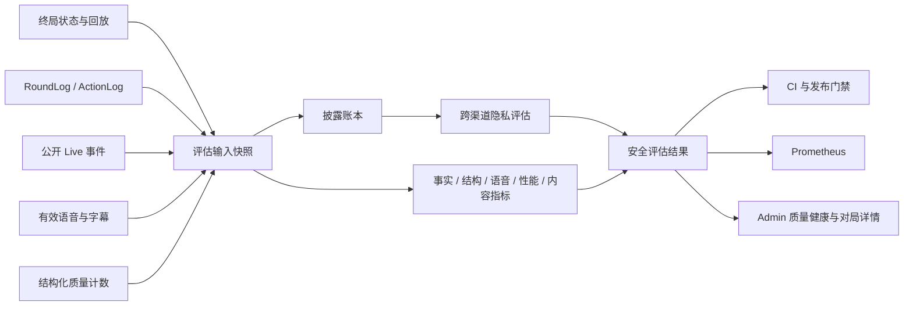

# 狼人杀 P3 质量评估、发布门禁与可观测性开发设计

## 1. 文档信息

- 依据对局：`run_05aa0b0f2b92`
- 对局记录：`game_0c46d70d`
- 上游问题清单：`docs/run-05aa0b0f2b92-quality-remediation-plan.md`
- P0 设计：`docs/superpowers/specs/2026-07-14-p0-game-integrity-remediation-design.md`
- P1 设计：`docs/superpowers/specs/2026-07-14-p1-game-flow-experience-remediation-design.md`
- P2 设计：`docs/superpowers/specs/2026-07-14-p2-game-quality-performance-remediation-design.md`
- P3 开发基线：`bb5112c5 fix(werewolf): remediate P2 game quality and performance`
- 目标问题：P3-01、P3-02
- 文档状态：已开发，待 P3-T24 部署与自然流量验证（P3-T01～P3-T23 已完成）
- 编写日期：2026-07-14
- 后续变更：2026-07-15 移除文件型离线评估器与 fixture CLI；生产质量评估只走 PostgreSQL 队列和在线 Worker，确定性验证直接测试领域函数。

本文是 P3 的可执行开发设计。P0～P2 已分别处理事实、隐私、终局、流程、语音、阵容、发言、时延和结算表达；P3 的目标不是再叠加一层自由文本检查，而是把这些质量约束变成可复现的终局评估、确定性发布门禁、低基数运行指标和安全的 Admin 诊断能力。

除非任务实现、测试、隐私检查和验收门槛同时完成，否则不能在总 Plan 中把对应 P3 问题标记为“已修复”。本文任务清单以第 14 节为准，完成一项、验证一项、勾选一项。

## 2. 总体结论

本局暴露出的根因是：对局质量数据分散在终局状态、轮次日志、Live 事件、语音物化记录和进程内指标中，设计基线中的离线评估器只读取了其中一部分，因此既无法完整发现真实泄密路径，也无法用统一口径回答“事实是否被记住、终局是否播完、动作到底慢在哪里”。该离线评估器现已退役。

P3 建立一条异步、只读、可重放的质量链路：



核心决策如下：

1. 评估以“同一时间点哪些事实已经公开”为准，不能把狼人自爆、白天公布死讯或终局身份揭示误判为泄密；
2. 私密证据只在评估进程内参与比对，评估结果、指标和普通 Admin 均不得保存或返回泄密原文；
3. 终局结算只负责可靠落库和投递评估任务，评估器异步执行，故障不能阻塞对局结束；
4. P0 级泄密通过确定性 fixture 进入 CI 和发布门禁，生产自然流量只读诊断，不自动改写历史对局；
5. 覆盖率必须先定义分母。关键事实写入率以结构化“应写机会”为分母，Prompt 覆盖率以本次行动应携带的关键事实为分母；
6. 时延使用固定桶直方图，不再把只有 `_sum` / `_count` 的结构描述成可计算 P95 的 Summary；
7. Prometheus 标签只使用稳定枚举，禁止把 Run、Session、玩家、模型 ID、事实 ID 或自由文本放进标签；
8. P3 不新增在线模型调用，真实模型质量和性能仅通过自然对局被动积累。

## 3. P3 范围、优先级与非目标

### 3.1 本期范围

| ID | 问题 | 本期交付 | P3 内优先级 |
| --- | --- | --- | --- |
| P3-01 | 现有质量评估没有覆盖真实泄密路径 | 跨状态、日志、事件、字幕、语音的时间线评估；P0 泄密确定性门禁；安全问题报告 | A |
| P3-02 | 缺少事实、结构、语音、性能和内容质量指标 | 明确分母的数据契约、持久化终局指标、Prometheus 指标、Admin 质量健康视图 | A |

### 3.2 依赖关系

推荐按以下顺序开发：

1. 先定义评估输入、披露账本、安全输出和问题码；
2. 完成跨渠道隐私检测与目标对局 fixture，使 P3-01 先形成确定性门禁；
3. 增加评估结果表、终局投递和异步 Worker，确保生产评估可恢复；
4. 补齐事实机会、Prompt 覆盖、结构、语音、性能和内容质量采集；
5. 接入低基数 Prometheus 指标和 Admin 安全视图；
6. 最后执行完整回归、故障恢复和灰度观测。

### 3.3 非目标

- 不让评估器参与游戏规则判定、修改胜负、回滚事件或重写玩家发言；
- 不把自然语言相似度模型、向量数据库或另一次 LLM 审核引入 P3；
- 不用宽泛正则直接判断全部泄密。只靠“我是狼人”无法区分非法提前暴露与合法自爆；
- 不把完整 Prompt、模型原始响应、被拒绝草稿、夜间目标、隐藏角色或内部死亡原因暴露给 Admin；
- 不为历史数据猜造缺失分母。旧对局明确展示为 `legacy` 或 `unavailable`；
- 不为了生成指标额外自动开局、批量调用真实模型或执行高额度压测；
- 不在 Prometheus 中为每局、每名玩家、每条事实创建时间序列；
- 不承诺从进程内计数恢复历史真实 P95。P3 只对新数据建立可聚合的固定桶；
- 不新增独立的 Admin 权限体系或第三套诊断导航；
- 不把生产评估失败等同于对局失败，也不因评估 Worker 暂时不可用阻塞对局结算。

### 3.4 完成状态约定

P3 使用三层状态，防止“代码已合并”与“自然流量已验证”混为一谈：

| 状态 | 含义 | 总 Plan 可用标记 |
| --- | --- | --- |
| 设计完成 | 本文及任务拆分已完成，尚未开发 | 已规划 |
| 确定性门禁通过 | 所有任务和不依赖在线模型的测试通过 | 已开发，待自然流量验证 |
| 自然流量门槛通过 | 样本量、Worker 稳定性和质量阈值满足第 16 节 | 已修复 |

## 4. 当前基线与明确缺口

| 领域 | 已有能力 | 当前缺口 |
| --- | --- | --- |
| 历史离线评估 | 设计基线曾支持文件型回放评估，现已移除 | 生产诊断统一读取 PostgreSQL，并由在线质量 Worker 生成安全结果 |
| 事实 | `PublicFact` 已有稳定 `fact_id` 和保留级别 | 没有“本应写入”的结构化分母；无法证明关键事实写入率；每次 Prompt 是否携带应有事实也没有快照 |
| 语音 | 已能计算可叙事事件、有效语音、缺失数、终局法官语音和物化滞后 | 尚未形成终局持久化质量结果；中断、补播和物化失败口径未统一 |
| 性能 | P2 有动作耗时、首 Token、超时、降级、批次和进度计数 | 当前耗时输出只有 sum/count，无法计算 P50/P95/P99；进程重启后丢失；缺少整局耗时聚合 |
| 内容质量 | P2 有发言检查、重试和耗尽计数，阵容报告可持久化 | 缺少统一终局分母和跨局聚合；泄密数、重复率、阵容警告尚未进入同一报告 |
| 持久化 | Live、回放、语音和 P2 诊断均已落库；Voice Worker 已有租约和重试模式 | 没有版本化评估任务/结果；无法幂等重跑、恢复失败或区分旧数据不可评估 |
| Admin | Overview、运行详情和对局详情已有安全字段投影与按需 Debug | 没有评估积压、P0 泄密告警、来源覆盖率、指标分母和安全问题坐标 |

## 5. 统一评估架构

### 5.1 评估触发时机

终局链路只执行以下同步操作：

1. 写入终局状态、RoundLog、回放和最终 Live 事件；
2. 确保需要的语音物化任务已经可靠投递；
3. 创建或更新一条 `pending` 的质量评估记录；
4. 提交事务并返回终局，不等待评估结果。

评估 Worker 仅在以下条件全部满足时开始：

- 对局状态已经终局；
- 回放有效且终局事件已经持久化；
- 截至触发水位的语音任务已完成、失败或超过配置等待窗口；
- 同一 `session_id + evaluator_version + source_revision` 没有已完成结果。

语音等待窗口到期后仍要完成评估，但 `source_coverage.voice_status` 必须标记为 `partial`，不能伪装为完整，也不能无限等待。

### 5.2 内部输入契约

新增内部只读 `QualityEvaluationBundleV1`。它不是 API 响应，不得序列化到普通日志或 Admin：

```text
QualityEvaluationBundleV1
  schema_version = 1
  session_id / run_id
  rule_revision / evaluator_version
  terminal_state
  round_logs[]
  action_logs[]
  public_live_events[]
  effective_voice_utterances[]
  public_subtitle_segments[]
  public_fact_opportunities[]
  prompt_fact_coverage[]
  p2_quality_counters
  source_watermark
```

`source_watermark` 至少包含：

- 回放更新时间或内容 revision；
- 最大持久化 Live event ID；
- 最大可叙事 event ID；
- 最大有效语音 source event ID；
- 语音 pending / processing / failed 数；
- 终局状态 revision；
- 评估输入构建时间。

Bundle 构建器必须按稳定顺序读取并规范化数据。`source_revision` 只对内容 revision、单调水位和来源状态求摘要，明确排除“评估输入构建时间”；后者只用于观测。相同数据、相同评估版本必须得到相同 `source_revision` 和评估结果。

### 5.3 私密证据与公开制品分区

评估输入在内存中分为两类：

| 分区 | 示例 | 可否进入安全报告 |
| --- | --- | --- |
| 私密证据 | 狼队讨论、夜刀候选、女巫用药、预言家查验原始结果、角色私密总结、被拒绝草稿、内部死亡原因 | 否，只能用于本次比对 |
| 公开制品 | 已发布 Live 文本、公开字幕、有效语音文本、普通回放公开摘要、公开事实 | 只能输出渠道、坐标和问题码，仍不得复制整段文本 |

Bundle、私密文本、规范化分词和临时匹配片段均不得写入通用应用日志。异常日志只记录稳定错误码、Session 的内部标识和数据水位，不能记录 Payload。

### 5.4 披露账本

新增确定性 `DisclosureLedgerV1`，按公开制品的事件顺序维护“截至该坐标已经合法公开的事实”。来源只允许是公开规则结算和公开事件，不读取模型自述作为事实。

至少支持以下披露类型：

- `player_dead`：白天公布夜间死讯或公开死亡事件后可知；
- `player_exiled`：放逐结算后可知；
- `player_claimed_role`：玩家公开跳身份后，只能视作“其声称”，不能视作真实角色；
- `role_revealed`：猎人发动、白痴翻牌、自爆或规则明确公开身份后可知；
- `winner_revealed`：终局公布阵营和身份后可知；
- `public_vote`：公开票型生成后可知；
- `public_investigation_claim`：预言家公开报验人后只表示公开声明；
- `public_outcome`：法官已公布的公开结算结果。

以下内容即使结果已经公开，仍不得从内部因果中直接披露：

- 夜间死亡究竟来自狼刀还是毒药；
- 狼队讨论、候选人、队友身份和投票过程；
- 女巫是否持有药、对谁使用了哪瓶药；
- 预言家尚未公开的真实查验；
- 模型私密总结、Prompt 和原始响应。

每个公开制品都必须在“读取该制品之前”的账本状态下评估，评估完成后才应用该制品对应的合法公开结果，避免同一事件用自己的非法文本为自己解密。

## 6. P3-01：跨渠道隐私评估设计

### 6.1 检测层级

隐私评估使用三层确定性检测，结果合并并去重：

1. **渠道不变量**：私密 action、private visibility、被拒绝草稿或内部死亡 cause/source 被写入公开事件、语音或字幕，直接判定 P0；
2. **受控重叠检测**：对私密证据和公开制品做内存规范化、长片段重叠和固定 fixture 哨兵比对；命中且披露账本未授权时判定 P0；
3. **语义规则码**：检测“真实狼队友、未公开夜间目标、未公开查验结果、仅角色本人应知资源”等结构化禁区；单纯词面命中但无法由结构化证据确认时只生成 P2 warning，避免误阻断。

不得使用在线模型做隐私裁判。所有规则必须可解释、可版本化、可使用 fixture 复现。

### 6.2 文本规范化边界

文本重叠检测仅用于发现私密原文或近似原文被错误复制，规范化步骤固定为：

1. Unicode NFKC；
2. 统一中文标点和空白；
3. 座位称谓规范为稳定 seat token；
4. 去除不影响语义的说话人前缀；
5. 生成配置下限以上的连续片段；
6. 仅在同局私密证据与同局公开制品之间比较。

短词如“刀”“验”“毒”不能单独构成 P0。只有受控哨兵、足够长的重叠、结构化私密字段跨区，或多个证据同时满足时才升级为 P0。

比对过程不持久化私密片段或可逆 Hash。安全问题 ID 只由服务端 HMAC 对 `session + evaluator_version + code + channel + coordinate` 生成，不包含原文；密钥由 `QUALITY_EVALUATION_HMAC_KEY` 提供，缺失时生产 Worker 拒绝启动，测试使用固定假密钥。

### 6.3 渠道范围

每条公开信息必须归一为以下渠道之一：

| 渠道码 | 数据来源 | 坐标 |
| --- | --- | --- |
| `live_event` | 持久化公开 Live 事件及公开 Payload 字段 | event ID |
| `voice` | 状态为有效、可播放的语音 utterance | utterance ID + source event ID |
| `subtitle` | 已发布字幕或语音字幕段 | utterance ID + segment ordinal |
| `replay` | 普通回放可见摘要、发言和公开结算 | round + item ordinal |
| `public_state` | 终局公开投影、round summary、public facts | round + field path code |

ActionLog、private summary 和内部状态不是公开渠道，它们只作为证据源。若这些内容本身被错误标记为 public，则由渠道不变量生成问题。

### 6.4 问题码与严重级别

问题码必须来自代码枚举，不允许动态拼接：

| 问题码 | 等级 | 判定 |
| --- | --- | --- |
| `private_action_public_artifact` | P0 | 私密 action 或 private visibility 直接进入任一公开渠道 |
| `private_text_public_overlap` | P0 | 未披露私密证据与公开文本存在受控长片段重叠 |
| `private_voice_materialized` | P0 | 私密或被拒绝内容被生成有效语音 |
| `private_subtitle_materialized` | P0 | 私密或被拒绝内容进入公开字幕 |
| `internal_death_cause_public` | P0 | 公开渠道暴露狼刀、毒药等隐藏死因或内部来源 |
| `hidden_role_public_before_reveal` | P0 | 真实角色在合法揭示前由系统制品公开 |
| `wolf_team_public_before_reveal` | P0 | 真实狼队关系在合法揭示前公开 |
| `private_role_result_public` | P0 | 未公开查验、用药或其他角色专属结果外泄 |
| `rejected_draft_public` | P0 | 被质量门禁拒绝的草稿进入公开渠道 |
| `suspicious_private_term` | P2 | 仅词面可疑但缺少结构化证据，不参与阻断 |

合法的玩家诈身份、玩家公开报假验人、狼人自爆、猎人发动和终局身份公布不应被判定为系统泄密。角色发言只有在证据证明系统把私密内容复制进公开文本时才构成 P0，不能因角色在游戏中撒谎或猜中身份而误判。

### 6.5 安全输出契约

新增 `GameQualityEvaluationV1`，持久化和 API 均使用白名单字段：

```text
GameQualityEvaluationV1
  schema_version = 1
  evaluator_version
  evaluation_status
  data_status
  verdict
  source_revision
  source_coverage
  issue_counts
  facts
  structure
  voice
  performance
  content
  safe_issues[]
  evaluated_at
```

状态语义如下：

| 字段 | 值 | 语义 |
| --- | --- | --- |
| `evaluation_status` | `pending` / `processing` / `completed` / `failed` / `superseded` / `not_scheduled` | Worker 生命周期 |
| `data_status` | `collecting` / `available` / `partial` / `legacy` / `unavailable` | 输入数据可用程度 |
| `verdict` | `pass` / `warn` / `fail` / `unavailable` | 只有完整或允许部分评估的数据才给质量结论 |

`failed` 是执行状态，不能伪装成 `pass`；`unavailable` 是没有足够数据形成结论，也不能显示成零问题。

`safe_issues[]` 每项只允许：

- `issue_id`：不可逆、局内稳定的 HMAC ID；
- `code`：固定问题码；
- `severity`：P0 / P1 / P2；
- `channel`：固定渠道枚举；
- `round_number`：可空；
- `event_id`、`utterance_id` 或安全 field path code；
- `first_detected_at`。

禁止包含：原始问题文本、私密片段、玩家名称、角色、目标、Prompt、模型输出、完整 Payload、数据库错误堆栈。

### 6.6 CI 和发布门禁

不提供文件型评估 CLI。确定性门禁通过 pytest 直接调用 `build_quality_evaluation_bundle` 和 `evaluate_quality_bundle`；生产评估只由 PostgreSQL 队列触发。

目标对局应脱敏为两份固定 fixture：

1. `leaking`：在 Live、语音、字幕、回放和 public state 分别注入唯一哨兵，要求每个渠道都被准确检出；
2. `sanitized`：保留合法自爆、白天死讯、公开身份声明和终局揭示，要求 P0 为零，验证无误报。

发布门禁不得访问数据库、火山引擎或其他在线服务。

## 7. 评估任务、持久化与 Worker

### 7.1 数据模型

新增 `game_quality_evaluations` 表，一张表同时承载任务状态和安全结果，避免额外拆分 Job / Result 表：

| 字段 | 说明 |
| --- | --- |
| `id` | 主键 |
| `session_id` / `run_id` | 关联对局和运行；Run 可空 |
| `evaluator_version` | 评估器和规则版本 |
| `source_revision` | 输入水位指纹 |
| `status` | pending / processing / completed / failed / superseded |
| `data_status` / `verdict` | 结果状态 |
| `safe_summary` | `GameQualityEvaluationV1`，只存安全字段 |
| `max_event_id` / `max_voice_source_event_id` | 来源覆盖水位 |
| `attempt_count` / `not_before` | 有界重试 |
| `worker_id` / `lease_expires_at` | 租约和故障恢复 |
| `last_error_code` | 固定错误码，不存原始异常文本 |
| `created_at` / `updated_at` / `completed_at` | 生命周期时间 |

索引和约束：

- 唯一约束：`(session_id, evaluator_version, source_revision)`；
- Claim 索引：`(status, not_before, lease_expires_at, id)`；
- 对局查询索引：`(session_id, completed_at DESC)`；
- Overview 聚合索引：`(status, completed_at DESC)` 和 `(verdict, completed_at DESC)`；
- `safe_summary` 不增加任意 JSON 路径索引，常用过滤字段必须提升为有类型列；
- 外键删除策略与现有 Game Session 保持一致，不因评估结果阻止会话清理。

迁移基于当前 Alembic head 新增一个 revision；迁移只建表和索引，不回填历史对局，也不扫描大 JSON。

### 7.2 幂等投递

终局保存完成时调用 `enqueue_quality_evaluation()`：

1. 读取当前评估版本与可用来源水位；
2. 生成稳定 `source_revision`；
3. 以唯一键执行 insert-or-ignore；
4. 已完成且 revision 未变化时不重复评估；
5. 语音水位补齐或评估器版本升级时允许生成新 revision；
6. Admin 手动重试只能复用同一安全入口，不能创建无限重复任务。

投递与终局记录尽可能在同一数据库事务中完成。若现有事务边界无法直接复用，则使用可恢复的终局扫描器只扫描“近期已终局且无当前版本评估”的小窗口，禁止每轮全表扫描。

Worker Claim 后必须重新构建来源水位。若当前 revision 已不同于任务 revision，则将旧任务标记为 `superseded` 并幂等投递新 revision，不允许用新数据完成旧 revision。语音在等待窗口内补齐时走同一规则；等待窗口到期可对当前 revision 生成 `partial` 结果，后续语音补齐再生成新的完整 revision。

### 7.3 Worker 生命周期

Worker 复用 Voice Materializer 的成熟模式：

- 使用 `FOR UPDATE SKIP LOCKED` Claim；
- Claim 后设置 `worker_id` 和 `lease_expires_at`；
- 长任务定期续租；
- 进程退出、租约过期后其他 Worker 可接管；
- 来源 revision 漂移时终止旧任务并标记 `superseded`；
- 指数退避并增加小幅抖动；
- 默认最多 5 次，超过后进入 `failed`；
- 数据缺失、契约不兼容、数据库暂时错误使用不同 `last_error_code`；
- 重试不得重复写入问题或累加终局计数；
- 提供 `--once`、空闲轮询、健康检查和优雅退出。

建议命令：

```text
python -m app.werewolf.quality_worker
python -m app.werewolf.quality_worker --once
```

### 7.4 历史数据与重评估

- 没有当前版本记录的旧对局显示 `legacy`，不能显示“质量通过”；
- 提供受控 CLI：`--dry-run`、按时间窗口、按 Session、`--limit` 的补投递能力；
- 默认部署不自动全量回填；
- 评估器升级通过 `evaluator_version` 生成新结果，旧结果保留用于审计，但 API 默认返回最新完成版本；
- 同一版本发现实现 Bug 时必须升级 patch version，不能用同一版本静默改变历史 verdict；
- 清理策略只删除超过保留期的旧版本安全结果，不删除当前版本和 fail 记录。

### 7.5 配置与开关

| 配置 | 默认值 / 约束 |
| --- | --- |
| `QUALITY_EVALUATION_ENABLED` | 默认关闭，迁移和 Worker 就绪后灰度开启 |
| `QUALITY_EVALUATION_VERSION` | 显式版本，如 `p3-v1` |
| `QUALITY_EVALUATION_HMAC_KEY` | 生产必填，不写入仓库 |
| `QUALITY_EVALUATION_VOICE_WAIT_SECONDS` | 有界等待窗口 |
| `QUALITY_EVALUATION_MAX_ATTEMPTS` | 默认 5 |
| `QUALITY_EVALUATION_LEASE_SECONDS` | 大于单次正常评估 P99，并支持续租 |
| `QUALITY_EVALUATION_RETENTION_DAYS` | 只作用于非当前旧版本结果 |

所有开关关闭时，游戏、语音和回放主链必须保持原行为。

## 8. P3-02：事实与记忆指标

### 8.1 关键事实写入率

不能用 Live 事件数或日志行数猜分母。新增 `PublicFactOpportunityV1`，在规则引擎发生“应形成长期公开事实”的确定性转折处创建：

```text
opportunity_id
schema_version = 1
round_number / stage
category
retention = critical | important
status = expected | recorded | superseded | not_applicable
fact_id?
reason_code?
```

至少覆盖：公开身份声明、PK 发言结果、公开票型、警徽归属与流失、自爆中断、猎人发动、白痴翻牌、放逐、公开死亡和终局。

当 `_add_public_fact()` 写入事实时，通过 `source_opportunity_id` 关联机会。兼容旧 checkpoint 时该字段可空，但新产生的关键事实必须关联。

公式：

```text
critical_fact_write_rate
= recorded_critical_opportunities
/ eligible_critical_opportunities
```

- `superseded` 和 `not_applicable` 不进入分母；
- 分母为 0 时状态为 `unavailable`，不能返回 100%；
- 重放相同事件不得重复创建 opportunity；
- 每个机会使用稳定 ID，写入事实和评估均可幂等。

### 8.2 后续 Prompt 关键事实覆盖率

每次需要公共记忆的模型行动，在 Prompt 渲染前生成 `FactPromptCoverageV1`：

```text
action_kind / round_number / stage
expected_critical_count
included_critical_count
missing_critical_count
coverage_status
missing_reason_counts
```

`expected` 是当前行动按 retention 和适用阶段应看到的关键 fact ID 集合，`included` 是实际送入 Prompt 的集合。事实文本不复制到 coverage 记录；单条 fact ID 只保留在 ActionLog 内部，不作为 Prometheus 标签或普通 Admin 字段。

公式：

```text
critical_fact_prompt_coverage_rate
= sum(included_critical_count)
/ sum(expected_critical_count)
```

当 Prompt 因预算压缩丢弃事实时，必须记录固定 `missing_reason_code`，例如 `token_budget`、`stage_filter`、`legacy_fact`、`assembly_error`。P0/P1 规定的 critical facts 不允许因普通 token budget 被静默丢弃。

### 8.3 确定性事实矛盾

矛盾评估只检查结构化、可判定命题，不对全部自由发言做真假裁判。命题签名为：

```text
subject + predicate + object + scope + polarity
```

同一 scope 中，相同 subject/predicate/object 出现相反 polarity，且没有显式 `correction_of`、`supersedes` 或状态转移依据时，计为 `deterministic_fact_contradiction`。

典型覆盖：玩家生死、警长归属、是否已发言、投票资格、公开身份声明是否发生、终局阵营。玩家观点变化、策略推理、诈身份或模型猜测不计入确定性矛盾。

## 9. 对局结构、语音、性能与内容指标

### 9.1 对局结构

| 指标 | 分子 / 值 | 分母 / 口径 |
| --- | --- | --- |
| 连续自爆最大长度 | 同一局连续自爆链的最大值 | 自爆会打断白天但不被夜晚清零，正常白天完成后清零 |
| 连续三爆次数 | 长度首次达到 3 的链数 | 每条链只计一次 |
| 正常白天辩论轮数 | 至少产生一条合法普通辩论发言且进入正常投票的白天轮次 | 不含被首个发言前自爆完全中断的轮次 |
| 警长模型请求比例 | `sheriff_*` action 请求数 | 全部 public-facing model action 请求数；分母 0 为 unavailable |
| 阶段中断次数 | 结构化 interruption 事件数 | 按 reason code 聚合，重放不重复计数 |

### 9.2 语音覆盖

| 指标 | 口径 |
| --- | --- |
| `voice_source_event_lag` | 最大可叙事 source event ID - 最大完成有效语音 source event ID；若 ID 不连续，同时展示缺失事件数 |
| `voice_coverage_rate` | 有效语音覆盖的可叙事事件数 / 应生成语音的可叙事事件数 |
| `terminal_judge_voice_coverage` | 应有的终局法官 Cue 是否全部存在有效语音，不是仅检查任意一条终局语音 |
| `voice_interruption_count` | 客户端播放中断或服务端取消的结构化次数 |
| `voice_replay_count` | 用户或恢复流程触发的补播次数；同一播放 session 内去重 |
| `voice_materialization_failed_count` | 语音任务最终失败数，与尚在排队分开 |

必须区分 `queued`、`processing`、`failed` 和 `missing`。评估等待窗口结束时仍在排队属于 `partial`，不能计为合成失败，也不能让覆盖率默认变成 100%。

### 9.3 性能直方图

将动作耗时和首 Token 指标改为 Prometheus Histogram 语义，并在每局安全结果中保存固定桶计数，以便 Admin 在进程重启后仍可聚合。

建议固定桶：

- 动作总耗时秒：`0.5, 1, 2, 3, 5, 8, 10, 12, 15, 20, 30, 45, 60, +Inf`；
- 首 Token 秒：`0.25, 0.5, 1, 2, 3, 5, 8, 10, 15, 20, +Inf`；
- 整局时长秒：`60, 180, 300, 600, 900, 1080, 1320, 1800, +Inf`。

指标至少包括：

- 各 action kind 的 count、sum 和 bucket；
- 整局从 `started_at` 到终局持久化的时长；
- timeout、retry、fallback 和 deadline exhausted 次数；
- 批次完成、截止、取消和安全降级次数。

P50/P95/P99 从桶或可控样本集合推导，不持久化原始请求明细。Admin 样本量小于 20 时不展示 P95/P99，只展示 count、max 和桶分布；不得用 `0ms` 代替无数据。

### 9.4 内容质量

| 指标 | 口径 |
| --- | --- |
| 重复发言率 | 发布前被判为重复的候选数 / 进入发言质量检查的候选数 |
| 重写恢复率 | 重写后通过的发言数 / 触发重写的发言数 |
| 低新颖度耗尽率 | 重写后仍不通过但降级发布的发言数 / 进入质量检查的候选数 |
| 私密泄漏数 | P0 隐私问题去重后的 issue 数，按渠道和 code 聚合 |
| 阵容同质化告警数 | 创建时版本化 lineup report 中 warning 数 |
| 阵容门禁失败数 | 因不可修复阵容质量而拒绝开始的次数，只进入服务指标，不属于已结束对局分母 |

### 9.5 Prometheus 指标与标签

建议新增或修正：

```text
werewolf_quality_evaluation_jobs_total
werewolf_quality_evaluation_job_duration_seconds_bucket
werewolf_quality_evaluation_backlog
werewolf_quality_issues_total
werewolf_fact_opportunities_total
werewolf_prompt_fact_coverage_total
werewolf_fact_contradictions_total
werewolf_voice_events_total
werewolf_voice_source_event_lag
werewolf_terminal_judge_voice_coverage_total
werewolf_action_duration_seconds_bucket
werewolf_action_first_token_seconds_bucket
werewolf_game_duration_seconds_bucket
werewolf_speech_quality_checks_total
```

允许的标签仅限固定枚举：

- `action_kind`；
- `provider_family`，使用有限集合，不能直接使用任意模型 ID；
- `result`；
- `channel`；
- `issue_code`；
- `severity`；
- `player_count_bucket`；
- `evaluator_version`，只保留受控当前版本。

禁止的标签：`run_id`、`session_id`、player ID / name、model ID、fact ID、event ID、utterance ID、Prompt、错误文本和任意用户输入。

比率指标必须同时保留 numerator / denominator 计数，避免聚合多个实例时平均百分比。全局 `/metrics` 只输出进程安全聚合；逐局数据由数据库和 Admin API 查询，不进入标签。

其中事实机会按固定 `retention` / `status` 统计，Prompt 覆盖按 `expected` / `included` / `missing` 统计，语音事件按 `expected` / `covered` / `missing` 统计；覆盖率由查询端用这些计数计算，不直接跨实例平均 Gauge 百分比。

## 10. Admin 设计

### 10.1 权限与导航

P3 不新增独立顶级导航和宽泛权限：

- `overview.read`：读取全局质量健康、评估任务积压和近期 cohort 聚合；
- `games.read`：读取单局 verdict、来源覆盖和五类安全指标；
- `games.debug.read`：用户显式点击后读取安全问题码与事件坐标；
- 普通详情不自动请求 Debug 接口；
- 运行中临时指标仍复用现有 Run 监控，终局质量结论归属 Game 详情。

### 10.2 Overview 质量健康

在现有 Overview 增加“对局质量健康”区域：

1. 最近 24 小时 / 7 天完成评估数、pass / warn / fail / unavailable；
2. P0 泄密对局数和最近发现时间，仅展示 code 与计数；
3. pending、processing、failed、最老 pending age 和租约过期数；
4. 关键事实写入率、Prompt 覆盖率、语音覆盖率；
5. 动作时延样本数和满足门槛时的 P95；
6. 重复发言率、低新颖度耗尽率、阵容告警数；
7. 明确 cohort 时间范围、样本数和 `partial / legacy` 数量。

当样本不足时显示“样本不足（n/N）”，不能显示绿色 100%。P0 fail 应使用高优先级告警，但不得在卡片中展示泄密原文。

### 10.3 Game 详情

增加“P3 质量评估”面板：

- 状态：排队中、评估中、可用、部分数据、旧数据、执行失败；
- verdict 与 evaluator version；
- 来源覆盖：state / logs / events / voice / subtitle；
- 事实：机会数、写入数、Prompt expected / included、矛盾数；
- 结构：连续自爆、正常辩论轮、警长请求占比；
- 语音：覆盖、尾段 gap、终局法官覆盖、中断 / 补播 / 失败；
- 性能：整局耗时、动作 count、固定桶和满足样本门槛的分位数；
- 内容：重复、重写、耗尽、阵容告警、隐私问题计数。

`games.debug.read` 的按需抽屉只展示：问题码、级别、渠道、轮次、event / utterance 坐标和 issue ID。不得展示对应文本，也不得提供“复制原始 Payload”按钮。

### 10.4 Admin API

建议接口：

```text
GET /api/v1/admin/overview
GET /api/v1/admin/games/{session_id}
GET /api/v1/admin/games/{session_id}/quality-evaluation
GET /api/v1/admin/games/{session_id}/quality-evaluation/issues
POST /api/v1/admin/games/{session_id}/quality-evaluation/retry
```

- Overview 和 Game 详情可以内嵌紧凑 summary；
- issues 与 retry 必须独立授权、显式触发并写审计日志；
- retry 只允许 `failed`、`partial` 或版本过期结果，且受速率限制；
- API schema 使用明确字段，不能直接返回数据库 `safe_summary` JSON；
- 列表若增加 `quality_verdict` 过滤，只查询提升为列并已有索引的字段；
- 所有时间范围和分页有上限，防止 Overview 扫描全量历史 JSON。

## 11. 隐私、安全与故障语义

### 11.1 数据最小化

- 评估器在同一进程内完成私密与公开文本比对，结果只保存安全 issue；
- 不创建“泄密文本表”、可逆文本 Hash 或原始 Prompt 镜像；
- 一般日志、Sentry tag、Prometheus 和 Admin 不出现任何私密证据；
- `last_error_code` 使用枚举，原异常仅按现有受控服务端日志策略记录且必须先脱敏；
- issue ID 使用 HMAC，不使用可被枚举的低熵裸 SHA；
- Debug 接口仍只提供坐标，不因权限较高而返回私密内容。

### 11.2 Fail closed 与 fail open 边界

| 场景 | 行为 |
| --- | --- |
| CI fixture 缺失、无法读取或评估器异常 | fail closed，退出 2，阻止发布 |
| CI 检出 P0 | fail closed，退出 1，阻止发布 |
| 生产终局投递失败 | 不阻塞已完成对局；记录固定错误并由恢复扫描器补投递 |
| 生产 Worker 失败 | 结果为 failed / unavailable，告警并允许重试；不能伪装 pass |
| 语音仍在有界等待窗口内 | collecting，不提前给 pass |
| 语音窗口到期但部分缺失 | partial，执行其余评估并明确覆盖不足 |
| Admin 查询评估不可用 | 返回显式状态，不回退为空指标或零问题 |

### 11.3 不可变性

- 评估只读游戏、回放、事件和语音；
- 重新评估生成新版本结果，不覆写原始游戏数据；
- 评估问题不能触发删除语音、修改字幕或更改历史胜负；
- 如需清理真实泄密数据，必须另立安全处置方案并经过明确授权，不属于本开发文档。

## 12. 代码改动范围

以下文件名可在实现时按现有模块边界微调，但职责不能混淆：

### 12.1 API / Domain

- `apps/api/app/werewolf/quality_evaluation.py`：在线评估领域逻辑、问题枚举和安全输出；
- `apps/api/app/werewolf/evaluation_bundle.py`：组装 Bundle、来源水位和披露账本；
- `apps/api/app/werewolf/quality_worker.py`：异步 Claim、租约、重试和 CLI；
- `apps/api/app/werewolf/public_facts.py`：事实机会、事实关联和 Prompt 覆盖；
- `apps/api/app/werewolf/engine.py`：在确定性转折创建 opportunity，终局可靠投递；
- `apps/api/app/werewolf/voice.py` / `voice_store.py`：终局语音覆盖、中断、补播和来源水位；
- `apps/api/app/werewolf/execution_telemetry.py`：固定桶 Histogram 语义；
- `apps/api/app/werewolf/quality_telemetry.py`：安全质量计数和分母；
- `apps/api/app/api/routes/metrics.py`：输出低基数指标；
- `apps/api/app/models/*` 与 Alembic：评估记录和索引；
- `apps/api/app/admin/*` 与 Admin routes：Overview / Game 安全投影、issues 和 retry。

### 12.2 Admin Web

- 现有 Overview：增加质量健康、Worker backlog 和样本状态；
- 现有 Game 详情：增加 P3 面板；
- 显式 Debug 抽屉：只展示安全 issue 坐标；
- API types / client：使用版本化安全 schema；
- i18n / UI states：区分 collecting、partial、legacy、unavailable 和 failed。

### 12.3 测试与 fixture

- `apps/api/tests/test_werewolf_quality_evaluation.py`：跨渠道、披露账本和误报回归；
- 新增 Bundle / Worker / persistence / metrics / Admin contract 测试；
- `apps/api/tests/fixtures/werewolf_quality/`：目标对局脱敏 leaking / sanitized fixture；
- Admin Web：Overview、Game 详情、权限、按需加载和隐私快照测试；
- 部署配置：独立 Worker 进程、健康检查、开关和 Secret 注入。

## 13. 实施批次

| 批次 | 内容 | 合并条件 |
| --- | --- | --- |
| P3-A | Bundle、披露账本、安全报告、跨渠道隐私检测、严格 fixture 门禁 | leaking 全命中、sanitized 零 P0、无原文输出 |
| P3-B | 评估表、终局投递、Worker、重试、版本与历史状态 | 幂等、并发 Claim、崩溃恢复、主链不阻塞 |
| P3-C | 事实机会、Prompt 覆盖、结构、语音、性能、内容指标 | 分母准确、重放不重复、Histogram 单调、低基数 |
| P3-D | Admin Overview、Game 面板、issues / retry | 权限、隐私、分页和状态语义通过 |
| P3-E | 端到端回归、部署灰度、自然流量观察 | 确定性门禁全通过；自然流量只被动积累 |

P3-A 可以先合并纯函数和 fixture，但生产评估开关保持关闭；P3-B～P3-D 完成后再启用小比例 Worker。任何批次都不得要求在线模型才能通过 CI。

## 14. 开发任务清单

> 执行约定：每个任务完成代码、测试和本节验收项后，将 `[ ]` 改为 `[x]`，并在第 18 节填写提交或验证记录。不得提前批量勾选。

### P3-A：评估契约与隐私门禁

- [x] **P3-T01：定义评估版本、问题枚举和安全报告契约**
  - 建立 `GameQualityEvaluationV1`、状态枚举、verdict 和固定 issue code；
  - 删除或隔离现有 `ReplayEvaluationIssue.detail` 自由文本对外路径；
  - 为普通 Admin、Debug Admin 和内部 Bundle 分别定义 schema 白名单；
  - 验收：序列化快照中不存在 text、prompt、response、private target 或任意 Payload。

- [x] **P3-T02：实现统一 Bundle 和来源水位**
  - 从终局状态、RoundLog、ActionLog、Live、有效语音、字幕和 P2 计数构建稳定输入；
  - 对来源排序、去重并生成 `source_revision`；
  - 明确 complete / partial / legacy / unavailable；
  - 验收：相同输入构建两次得到完全相同的 revision 和顺序。

- [x] **P3-T03：实现按事件推进的披露账本**
  - 只从规则结算与公开事件建立合法披露；
  - 支持自爆、猎人、白痴、公开声明、死讯、票型和终局揭示；
  - 公开制品先评估、后更新账本；
  - 验收：合法自爆和终局揭示不误报，提前公开真实身份必报。

- [x] **P3-T04：实现渠道不变量检测**
  - 阻止 private visibility、私密 action、内部 cause/source 和 rejected draft 进入公开制品；
  - 覆盖 Live、voice、subtitle、replay 和 public state；
  - 验收：每类错误输出唯一、安全、可重放的 P0 issue。

- [x] **P3-T05：实现受控重叠与结构化隐私检测**
  - 完成文本规范化、长片段重叠、fixture 哨兵和角色专属结构化证据；
  - 使用 HMAC issue ID，不落私密片段或可逆 Hash；
  - 单一短词只产生 warning，不触发 P0；
  - 验收：11 号夜刀计划 fixture 被检出，干净 fixture 无误报。

- [x] **P3-T06：接入严格 CLI / CI 发布门禁**
  - 实现 0 / 1 / 2 退出码；
  - 创建 leaking 与 sanitized 脱敏 fixture；
  - 测试不访问数据库和在线模型；
  - 验收：任一公开渠道哨兵遗漏、评估异常或 P0 都使 CI 失败。

### P3-B：持久化与异步执行

- [x] **P3-T07：新增评估表、迁移、索引和 ORM**
  - 创建任务/结果共用表、唯一约束、Claim、Game 和 Overview 索引；
  - 常用过滤字段使用有类型列；
  - 不回填历史 JSON；
  - 验收：upgrade / downgrade、空库和已有数据迁移测试通过。

- [x] **P3-T08：实现终局可靠投递和幂等 revision**
  - 终局落库时创建 pending；
  - 同 version + revision 不重复；语音补齐或版本变化可重评；
  - 投递失败不阻塞终局，并可由近期窗口恢复；
  - 验收：重复终局回调只保留一条当前任务。

- [x] **P3-T09：实现 Worker Claim、租约、续租和有界重试**
  - 复用 `SKIP LOCKED` 模式；
  - 支持崩溃接管、revision 漂移 supersede、退避、最大次数、错误码、优雅退出和 `--once`；
  - 结果写入一次且重试不重复累计；
  - 验收：双 Worker 不并发处理同一 revision，租约过期可恢复。

- [x] **P3-T10：实现历史状态、受控补投递和版本升级**
  - 旧对局明确 `legacy`；
  - CLI 支持 session、时间窗口、limit 和 dry-run；
  - API 默认选择最新完成版本；
  - 验收：默认部署不会全表回填，dry-run 不写数据库。

- [x] **P3-T11：补齐 Worker 配置、部署、健康和进程指标**
  - 增加开关、Secret、等待窗口、租约、重试和 retention 配置；
  - 接入本地、容器和生产进程定义；
  - 输出 backlog、oldest age、completed / failed 和耗时；
  - 验收：开关关闭不改变主链，Worker 停止时对局仍能正常结束。

### P3-C：覆盖率与质量指标

- [x] **P3-T12：实现关键事实机会与写入率**
  - 定义 `PublicFactOpportunityV1`、稳定 ID 和适用状态；
  - 在关键规则转折创建机会并关联 fact；
  - 兼容旧 checkpoint；
  - 验收：目标对局 fixture 的分子、分母和缺失机会可逐项核对。

- [x] **P3-T13：实现 Prompt 关键事实覆盖快照**
  - Prompt 渲染前记录 expected / included / missing 计数和 reason；
  - critical facts 不能被静默压缩；
  - fact ID 不进入指标标签和普通 Admin；
  - 验收：故意移除 PK 身份声明时覆盖率下降且原因稳定。

- [x] **P3-T14：实现确定性事实矛盾评估**
  - 使用结构化命题签名、polarity、correction 和 supersedes；
  - 仅覆盖规则可判定事实；
  - 验收：同一事实正反冲突计一次，合法状态转移和观点变化不计。

- [x] **P3-T15：实现对局结构指标**
  - 统计连续自爆链、正常辩论轮、警长请求比例和阶段中断；
  - 固化链开始/结束和分母为零语义；
  - 重放不重复计数；
  - 验收：本局三爆和多次警长重启 fixture 的结果与人工标注一致。

- [x] **P3-T16：实现语音终局覆盖指标**
  - 复用有效语音定义，补齐 source lag、缺失事件、完整终局 Cue、中断、补播和失败；
  - 区分排队、处理中、失败和缺失；
  - 验收：断连后补建语音为 complete，窗口到期仍缺失为 partial。

- [x] **P3-T17：把动作与整局耗时升级为固定桶 Histogram**
  - 输出 count / sum / bucket；
  - 每局安全结果保存固定桶计数；
  - 支持动作、首 Token 和整局耗时；
  - 验收：桶累计单调，`+Inf == count`，小样本不伪造 P95/P99。

- [x] **P3-T18：汇总内容质量与低基数 Prometheus 指标**
  - 聚合重复、重写、耗尽、泄密和阵容质量；
  - 比率同时提供 numerator / denominator；
  - 审核所有 labels 并增加防高基数测试；
  - 验收：指标中不存在 run/session/player/model/fact/event ID 和自由文本。

### P3-D：Admin 质量诊断

- [x] **P3-T19：实现 Admin 安全 schema、查询和权限**
  - 增加 quality summary、issues、retry API；
  - 复用 `overview.read`、`games.read`、`games.debug.read`；
  - issues / retry 显式加载并写审计；
  - 验收：普通权限看不到 issue 坐标，Debug 仍看不到原文和私密字段。

- [x] **P3-T20：实现 Overview 质量健康与 Worker 状态**
  - 展示 cohort、样本数、P0 fail、覆盖率、时延和 backlog；
  - 区分 fail、failed、partial、legacy 和 unavailable；
  - 使用索引列与有界时间窗；
  - 验收：空数据和小样本不会显示绿色 100% 或 0ms P95。

- [x] **P3-T21：实现 Game P3 面板和按需问题抽屉**
  - 展示五类指标、来源覆盖、版本和状态；
  - Debug 抽屉只显示 code、severity、channel、坐标和 issue ID；
  - 覆盖桌面端、窄屏和加载/错误状态；
  - 验收：页面初始加载不请求 Debug issues，前端快照无原始文本。

### P3-E：端到端、灰度与文档闭环

- [x] **P3-T22：完成目标对局跨渠道端到端回归**
  - 将脱敏目标对局贯穿 Bundle、Worker、DB、API 和 Admin；
  - 验证 leaking 必 fail、sanitized 必 pass；
  - 验证 P0/P1/P2 已修复行为不回退；
  - 验收：固定输入重复运行结果、issue ID 和指标一致。

- [x] **P3-T23：完成故障恢复、性能与隐私回归**
  - 覆盖 Worker 崩溃、租约、重复投递、语音延迟、数据缺失、版本升级和关闭开关；
  - 对评估时间、DB 查询数和 Admin 查询执行计划建立门槛；
  - 扫描日志、API、指标和前端 fixture 中的私密哨兵；
  - 验收：所有故障状态可恢复或明确失败，不阻塞游戏主链、不泄密。

- [ ] **P3-T24：灰度上线并被动完成自然流量验证**
  - [x] 灰度清单已准备：staging 单 Worker 开启，production 保持关闭；CI 固定校验该目标状态；
  - [ ] 实际部署 staging 并开始被动累计自然流量；
  - [ ] 满足 7 个完整自然日、50 局和第 16.2 节其余门槛；
  - 先启用持久化，再启用单 Worker，最后开放 Admin 展示；
  - 不额外自动发起模型对局；
  - 按第 16 节记录样本量、阈值和观察结论；
  - 验收：确定性门禁通过后可标记“已开发，待自然流量验证”；自然流量门槛通过后才标记“已修复”。

## 15. 测试矩阵

### 15.1 P3-01 隐私与披露

| 测试建议 | 预期 |
| --- | --- |
| `test_quality_bundle_collects_all_public_channels` | 五类公开渠道和私密证据区完整 |
| `test_disclosure_ledger_evaluates_before_applying_event` | 同一事件不能为自己的泄密文本解密 |
| `test_replay_evaluator_detects_public_wolf_plan` | 11 号夜刀计划触发 P0 |
| `test_private_summary_leak_is_detected_in_live_event` | Live 命中且不输出原文 |
| `test_private_summary_leak_is_detected_in_voice` | 有效语音命中 |
| `test_private_summary_leak_is_detected_in_subtitle` | 字幕命中 |
| `test_private_summary_leak_is_detected_in_replay` | 普通回放命中 |
| `test_private_summary_leak_is_detected_in_public_state` | public state 命中 |
| `test_rejected_speech_draft_never_becomes_public` | 被拒绝草稿进入任一渠道均 fail |
| `test_legal_self_explosion_role_reveal_is_not_leak` | 自爆公开身份不误报 |
| `test_terminal_role_reveal_is_not_leak` | 终局身份揭示不误报 |
| `test_player_false_claim_is_not_system_leak` | 玩家诈身份不误报 |
| `test_night_death_does_not_disclose_internal_cause` | 只公开死讯，不暴露刀/毒来源 |
| `test_strict_evaluator_has_three_exit_states` | pass / P0 / evaluator error 退出码正确 |

### 15.2 Worker 与持久化

| 测试建议 | 预期 |
| --- | --- |
| `test_terminal_enqueue_is_idempotent` | 相同 version/revision 只有一条任务 |
| `test_voice_watermark_change_creates_new_revision` | 语音补齐后允许重评 |
| `test_quality_workers_claim_distinct_jobs` | 并发 Worker 不抢同一任务 |
| `test_expired_quality_lease_is_reclaimed` | 崩溃后可接管 |
| `test_quality_retry_does_not_duplicate_issues` | 重试结果幂等 |
| `test_quality_worker_failure_does_not_block_terminal_game` | Worker 故障不影响终局 |
| `test_legacy_game_is_not_reported_as_pass` | 旧数据明确 legacy |
| `test_backfill_dry_run_does_not_write` | dry-run 零写入 |

### 15.3 指标口径

| 测试建议 | 预期 |
| --- | --- |
| `test_critical_fact_write_rate_uses_opportunities` | 分母来自结构化机会 |
| `test_zero_fact_denominator_is_unavailable` | 零分母不返回 100% |
| `test_prompt_fact_coverage_records_missing_reason` | 缺失事实有稳定原因 |
| `test_fact_opportunities_are_replay_idempotent` | 重放不重复 |
| `test_deterministic_contradiction_ignores_correction` | 显式纠正不计矛盾 |
| `test_chain_explosion_is_counted_once` | 三爆链只计一次达到阈值 |
| `test_sheriff_request_ratio_has_explicit_denominator` | 请求比例可核对 |
| `test_terminal_voice_requires_all_judge_cues` | 终局覆盖不是任意一条即通过 |
| `test_voice_pending_is_not_synthesis_failure` | 排队与失败分开 |
| `test_histogram_buckets_are_cumulative` | 桶单调且 +Inf 等于 count |
| `test_small_samples_do_not_report_percentiles` | 小样本不伪造分位数 |
| `test_metrics_reject_high_cardinality_labels` | 禁止 ID 与自由文本标签 |

### 15.4 Admin 与隐私

| 测试建议 | 预期 |
| --- | --- |
| `test_game_quality_summary_requires_games_read` | 普通 summary 权限正确 |
| `test_quality_issues_require_games_debug_read` | issue 坐标需要 Debug 权限 |
| `test_quality_issue_response_contains_no_evidence_text` | 响应无原文和私密字段 |
| `test_quality_retry_is_audited_and_rate_limited` | 重试有审计和限流 |
| `test_overview_distinguishes_fail_from_failed` | 质量 fail 与执行 failed 不混淆 |
| `test_overview_does_not_show_zero_p95_without_samples` | 无样本不显示 0ms |
| `test_game_page_does_not_prefetch_quality_issues` | 初始加载不拉 Debug 数据 |
| `test_admin_quality_queries_use_bounded_ranges` | 查询时间窗和分页有上限 |

### 15.5 回归命令建议

实现时根据仓库现有命令更新准确路径，最低要求包含：

```text
pytest apps/api/tests/test_werewolf_quality_evaluation.py
pytest apps/api/tests/test_werewolf_quality_worker.py
pytest apps/api/tests/test_werewolf_quality_metrics.py
pytest apps/api/tests/test_admin_game_quality.py
pytest apps/api/tests/test_admin_overview.py
pytest apps/api/tests/test_werewolf_p0.py
pytest apps/api/tests/test_werewolf_p1.py
pytest apps/api/tests/test_werewolf_p2.py
```

前端至少执行类型检查、相关组件测试和构建；数据库至少执行 migration upgrade / downgrade / upgrade；最终执行 API 全量测试和仓库既有质量门禁。

## 16. 验收与发布门槛

### 16.1 确定性硬门禁

以下全部通过，P3 才能标记“已开发，待自然流量验证”：

1. leaking fixture 的 Live、voice、subtitle、replay、public state 五类哨兵检出率 100%；
2. sanitized fixture 的 P0 误报为 0；
3. 所有 issue 和 Admin 响应均不包含哨兵原文、私密目标、Prompt 或模型响应；
4. 相同输入重复评估的 `source_revision`、verdict、issue ID 和指标完全一致；
5. Worker 重复投递、双实例 Claim 和租约恢复测试通过；
6. 关键事实写入率和 Prompt 覆盖率的分子、分母与人工 fixture 标注一致；
7. Histogram 桶累计单调，`+Inf == count`，低基数扫描通过；
8. 语音完整、部分、失败和旧数据四类状态不混淆；
9. Admin 权限、按需加载、空数据、小样本和隐私快照测试通过；
10. P0/P1/P2 回归和数据库迁移门禁通过；
11. 评估开关关闭或 Worker 故障时，对局仍可正常终局和回放；
12. CI 全程不调用在线模型。

### 16.2 自然流量观察门槛

自然流量只被动观察，不额外生成对局。达到以下条件后才能把 P3-01 / P3-02 标记“已修复”：

当前状态（2026-07-14）：灰度代码与清单已准备，目标状态为 staging 单 Worker 被动观察、production 保持关闭；本地测试库已清除旧对局并升级至 `20260714_20`，统一观测切点记录为 `2026-07-14T15:00:23Z`，仅统计使用新 12 人角色库创建的对局。尚未执行环境部署，也未开始 7 天 / 50 局自然流量计数。此状态不消耗额外模型额度，P3-T24 和总 Plan 的“已修复”保持未完成。

| 观察项 | 当前值 | 门槛 | 状态 |
| --- | ---: | ---: | --- |
| 完整自然日 | 0 | 7 | 待部署后被动累计 |
| 来源可用终局 | 0 | 50 | 不自动生成对局 |
| 最终完成率 | 无样本 | >= 99% | 待观察 |
| 持续超 15 分钟积压 | 无样本 | 0 | 待观察 |
| P0 隐私 issue | 无样本 | 0 | 待观察 |
| 事实写入 / Prompt 覆盖 | 无样本 | >= 99% | 待观察 |
| 终局法官语音覆盖 | 无样本 | >= 99% | 待观察 |
| 人工抽查 | 0 | 10 | 待观察 |

- 至少 7 个完整自然日；
- 至少 50 局终局且来源数据可用的对局；
- 评估任务最终完成率不低于 99%，没有持续超过 15 分钟的非预期 backlog；
- Worker 重试后仍 failed 的比例低于 1%；
- P0 隐私 issue 为 0；如出现任意 P0，立即停止“已修复”判定并进入事故分析；
- 完整来源对局的关键事实写入率和 Prompt 关键事实覆盖率均不低于 99%；
- 终局法官语音完整覆盖率不低于 99%，partial 必须有明确排队或失败原因；
- 指标、Admin 和离线抽样对同一局的分子、分母一致；
- 至少抽查 10 局 pass / warn / partial 结果，未发现系统性误报或漏报。

性能和内容质量阈值沿用 P2 已定义的自然流量目标；P3 的职责是准确采集和展示，不因未达到 P2 产品阈值而把评估基础设施自身判为失败。

## 17. 灰度、回滚与风险

### 17.1 灰度顺序

1. 部署 schema 和只读代码，`QUALITY_EVALUATION_ENABLED=false`；
2. 开启新对局投递，但 Worker 保持关闭，验证无主链影响；
3. 单实例 Worker 小流量处理，观察耗时、DB 查询和 backlog；
4. 开启 Prometheus 告警和 Overview，只对内部管理员可见；
5. 开启 Game 详情和显式 issues / retry；
6. 达到样本门槛后扩大 Worker，并记录自然流量结论。

### 17.2 回滚策略

- 第一优先回滚：关闭评估投递和 Worker 开关，不回滚游戏主链；
- 第二优先回滚：隐藏 Admin P3 区域，保留已生成的安全结果；
- 指标异常时停止对应 exporter，不删除原始游戏数据；
- 数据库迁移只有新增表和索引，应用回滚时可保留表；确认无旧应用依赖后再执行 downgrade；
- HMAC Key 泄露时轮换密钥并升级 evaluator version，旧 issue ID 保留但不再生成；
- 发现误报时先降级对应规则为 warning 并升级版本，不能用同一版本静默改 verdict；
- 发现真实 P0 时关闭相关公开发布路径或模型版本，评估器不得自动删改证据。

### 17.3 主要风险与缓解

| 风险 | 缓解 |
| --- | --- |
| 把合法自爆或终局揭示误判为泄密 | 披露账本按制品前状态评估；sanitized fixture 覆盖合法揭示 |
| 文本规则漏掉改写后的私密内容 | 渠道不变量与结构化证据优先，长片段重叠作为补充；不宣称解决任意语义改写 |
| 评估器自身泄露私密原文 | 内存比对、安全 schema 白名单、哨兵扫描和日志测试 |
| Worker 拖慢终局 | 终局只投递，Worker 异步；有界语音等待和独立资源限制 |
| 数据库扫描放大 | 有类型索引、近期窗口、有界分页、不索引/聚合任意 JSON |
| 指标高基数或内存增长 | 标签枚举、禁止各类 ID、固定桶和有界计数器 |
| 旧数据被误显示为通过 | 明确 legacy / unavailable，禁止空值转零 |
| 评估版本升级造成结果漂移 | version + source revision 幂等，保留旧安全结果并显示当前版本 |
| 自然流量验证再次消耗模型额度 | 只观察正常业务对局，不自动跑真实模型 benchmark |

## 18. 开发与验证记录

开发时按任务追加，格式固定：

| 任务 | 状态 | 主要文件 / 提交 | 验证命令与结果 | 备注 |
| --- | --- | --- | --- | --- |
| P3-T01～P3-T05 | 已完成 | `evaluation_bundle.py`、`quality_evaluation.py` | `ruff` 通过；质量评估领域测试通过 | 五渠道检出、披露账本、安全 issue、稳定 revision / issue ID；离线入口后续已移除 |
| P3-T06 | 已完成 | `tests/fixtures/werewolf_quality/`、`test_werewolf_quality_evaluation.py` | leaking / sanitized 确定性领域测试通过 | 测试直接调用领域函数，不提供文件型评估 CLI |
| P3-T07 | 已完成 | migration `20260714_20`、`models/quality_evaluation.py` | SQLite 全链 upgrade / downgrade / upgrade 通过；Alembic 单 head | 任务/结果共表和 4 组索引 |
| P3-T08～P3-T10 | 已完成 | `quality_store.py`、`quality_worker.py`、`replay.py`、`voice_store.py` | Worker/投递测试 6 passed | 幂等、租约接管、revision supersede、错误码、Dry-run |
| P3-T11 | 已完成 | `config.py`、`cli.py`、`quality_evaluation_telemetry.py`、Compose/Kubernetes | 相关后端测试 49 passed；Compose 校验和双环境 Kustomize 渲染通过 | 独立 Worker、探针、Secret、backlog 与耗时指标 |
| P3-T12～P3-T14 | 已完成 | `public_facts.py`、`models.py`、`checkpoint.py`、`engine.py` | P3 指标单测与引擎/checkpoint 回归通过 | opportunity、Prompt expected/included/missing、结构化矛盾 |
| P3-T15～P3-T18 | 已完成 | `quality_evaluation.py`、`execution_telemetry.py`、`quality_evaluation_telemetry.py` | P0/P1/P2、语音、引擎、指标组合回归 230 passed | 结构/语音/内容指标、动作/首 Token/整局固定桶、低基数聚合 |
| P3-T19 | 已完成 | `admin/quality_evaluations.py`、Admin Game schema/routes | Admin Games / Dashboard 定向回归 20 passed | 普通摘要、Debug issues、CSRF retry、审计和隐私哨兵通过 |
| P3-T20 | 已完成 | Admin Overview schema/route、`dashboard/*` | API Dashboard 9 passed；前端 Dashboard 3 passed；ESLint / TypeScript 通过 | 7 天有界 cohort、Worker / backlog、分子分母和小样本 P95 语义 |
| P3-T21 | 已完成 | `game-records/*` P3 types/parser/API/panel | Game Records contract / flow 19 passed；ESLint / TypeScript 通过 | 五类指标、来源覆盖、按需 issues、CSRF retry；首屏不请求 issues |
| P3-T22 | 已完成 | `test_run_05aa0b0f2b92_p3_regression.py` | 目标局 P3 端到端 2 passed | leaking / sanitized 贯穿 Bundle、Worker、DB、Admin schema；revision、issue ID、指标可重放 |
| P3-T23 | 已完成 | Worker / Admin / 指标 / 索引与隐私回归 | API 1568 passed、10 skipped；Admin Web 279 passed；ESLint、build、迁移循环、Compose 与双环境清单通过 | latest current evaluation 与 Overview 查询命中专用索引；全程无在线模型调用 |
| P3-T24 | 灰度清单已完成，待外部验证 | staging 1 replica + enabled；production 0 replica + disabled；CI 固定断言 | `docker compose config`、staging / production render 通过 | 未执行环境部署；自然流量 0/7 天、0/50 局，保持未勾选 |

总 Plan 更新规则：

- P3-T01～P3-T23 与第 16.1 节完成后，将 P3-01 / P3-02 标记为“已开发，待自然流量验证”；
- P3-T24 和第 16.2 节完成后，才标记为“已修复”；
- 若任一确定性硬门禁失败，必须撤销“已开发”标记；
- 若自然流量出现 P0 泄密，必须撤销“已修复”标记并记录关联事故。

## 19. 完成定义

P3 完成必须同时满足：

1. 终局状态、RoundLog、ActionLog、Live、字幕、有效语音和回放进入同一版本化评估输入；
2. 披露账本能区分未授权私密信息与合法公开结果；
3. 目标对局 11 号夜刀计划在任一公开渠道出现都会触发 P0 发布门禁；
4. 评估结果、指标、日志和 Admin 不复制泄密原文或私密字段；
5. 评估异步、幂等、可恢复，不能阻塞终局；
6. 关键事实写入率和 Prompt 覆盖率都有结构化分母；
7. 矛盾、结构、语音、性能和内容质量指标均有稳定口径；
8. 性能指标使用可计算分位数的固定桶，标签维度有界；
9. Admin 能看见质量健康、数据覆盖和安全问题坐标，但看不到秘密；
10. 旧数据、部分数据、执行失败和质量失败不会被混为通过；
11. 确定性测试不依赖真实模型，生产观察不额外消耗模型额度；
12. 第 14 节任务逐项勾选并留下验证记录，总 Plan 状态按第 18 节规则更新。
