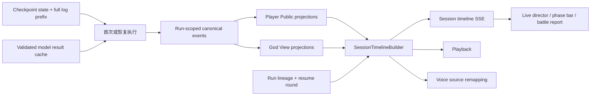

# 对局恢复连续性、跨 Run 战报与模型空响应修复开发设计

**Date:** 2026-07-15

**Status:** Ready for implementation

**Priority:** P0 Data Integrity / P1 Live Experience

**Source Run:** `run_cb51a628afaf` / `game_1c63db64`

**Scope:** `apps/api` 的恢复、checkpoint、Live Event、Playback、Voice、Provider 与数据修复；`packages/game-client` 和 `apps/mobile-web` 的实时观战、战报、阶段导航与继续对局体验

**Related Designs:**

- `docs/superpowers/specs/2026-07-06-game-records-db-storage-design.md`
- `docs/superpowers/specs/2026-07-06-mobile-live-record-playback-design.md`
- `docs/superpowers/specs/2026-07-07-live-voice-streaming-design.md`
- `docs/superpowers/specs/2026-07-15-privacy-audience-contract-v2-remediation-design.md`

## 1. 文档目标

本文把 `run_cb51a628afaf` 暴露的恢复连续性问题整理为可实现、可迁移、可测试、可灰度的工程方案。

本次修复不把“继续对局”视为重新开始一局，也不把多个 `run` 粗暴拼接为回放。目标是建立两个明确概念：

1. `run` 是一次可失败、可重试的执行尝试；
2. `session` 是用户看到的一局连续游戏，必须拥有唯一、完整、无重复的规范时间线。

完成后需要同时满足：

- 恢复不会再次播报“本局游戏开始”；
- 当前 Live 页面和历史回放都能看到此前所有已确认轮次；
- 失败轮次重新执行后，旧的失败尝试不会与新结果重复出现；
- 多次“失败 → 继续 → 再失败”不会逐轮丢失 `RoundLog`；
- 模型返回空内容或无效 JSON 时，不会被误记为 checkpoint 成功缓存；
- 单个玩家公共发言空答不再直接击穿整局；
- Player Public 与 God View 继续遵守现有独立投影和 fail-closed 隐私契约。

## 2. 已确认运行证据

### 2.1 同一 session 的四次执行尝试

`run_cb51a628afaf` 不是单独重复运行，而是 `game_1c63db64` 下的第一次执行。用户每次点击“继续对局”都会创建新的 `run`。

| Run | 北京时间 | 覆盖轮次 | 事件数 | 终止原因 |
| --- | --- | ---: | ---: | --- |
| `run_cb51a628afaf` | 03:54:45–04:00:34 | 1–2 | 229 | Agent Plan SSL `UNEXPECTED_EOF`，第 2 轮白天上警请求中断 |
| `run_ad450acc7171` | 11:17:16–11:28:03 | 2–3 | 220 | `林砚 did not return a valid sheriff speech.` |
| `run_7c1703012179` | 11:28:09–11:39:11 | 3–4 | 168 | `林砚 did not return a valid debate message.` |
| `run_9d6e5c759ea8` | 11:39:15–11:42:19 | 4 | 39 | `林砚 did not return a valid debate message.` |

恢复行为具有明确规律：

- 第一次失败发生在第 2 轮白天，但恢复从第 2 轮夜晚重新执行；
- 第二次失败发生在第 3 轮白天，但下一次恢复从第 3 轮夜晚重新执行；
- 第三、四次都在第 4 轮白天失败，第四次继续仍从第 4 轮夜晚重新执行。

这说明 checkpoint 的恢复粒度是“轮初”，不是“失败动作”。轮初恢复本身可以接受，但产品时间线必须用新尝试替换该轮旧尝试，不能同时保留两个版本。

### 2.2 当前持久化状态不一致

数据库当前状态：

| 数据 | 当前值 | 应满足的不变量 |
| --- | ---: | --- |
| `game_sessions.round_count` | 4 | 与 `state.rounds` 一致 |
| `state.rounds` | 4 轮 | 轮号应为 1、2、3、4 |
| `game_replay_payloads.logs` | 2 轮 | 应覆盖 `state.rounds` 中所有已开始轮次 |
| 实际 `logs.number` | 3、4 | 第 1、2 轮日志已丢失 |
| `checkpoint.logs_before_round` | 0 | 第 4 轮轮初应至少保留第 1～3 轮日志 |
| `checkpoint.cached_model_responses` | 4 | 其中包含无效的林砚空响应 |

因此当前 session 同时存在两类历史：

- `state.rounds` 仍有 4 轮结构化状态；
- `logs` 和 checkpoint 前缀已经在多次恢复中衰减。

### 2.3 模型空响应证据

后续失败集中在 5 号玩家林砚，快照模型为 `glm-5-2-260617`。

最新 checkpoint 中该玩家第 4 轮 `debate` 的 `raw_response` 只包含连续空响应拼接后的 `--- retry ---` 分隔符，最终 `action_parsed.result` 为 `{}`。当前 OpenAI-compatible adapter 只读取：

```python
response["choices"][0]["message"]["content"]
```

现有证据只能确认 `message.content` 为空，不能在没有原始 Provider 响应的情况下进一步断言内容是否出现在 `reasoning_content`、是否被输出预算截断，或是否由上游兼容层丢失。

### 2.4 战报读取证据

四个 run 均有 God View 投影事件：

| Run | God View 投影事件数 |
| --- | ---: |
| `run_cb51a628afaf` | 189 |
| `run_ad450acc7171` | 183 |
| `run_7c1703012179` | 145 |
| `run_9d6e5c759ea8` | 36 |

现有 `playback_events_for_session()` 明确只选择“最后一个有事件的 run”，因此回放最终只保留最新 36 条投影事件。Live 页面继续成功后也会导航到新 `run_id`，客户端随 `runId` 变化清空原事件列表。

## 3. 根因拆解

### 3.1 恢复运行错误地产生 `game_started`

`resume_game()` 重新构造 `GameEngine` 并调用统一的 `run()`。`GameEngine.run()` 无条件发布 `game_started`，没有区分首次运行和恢复运行。

后果：

1. Live 导播将恢复尝试当成新局；
2. `liveNarrative` 显示“本局游戏开始”；
3. `voice.py` 将其映射到静态资产 `game_intro`；
4. 每次继续都再次播放开场语音。

### 3.2 Live 与 Playback 使用 run 级历史，不是 session 级历史

当前链路：

```text
继续成功
  -> 创建新 run
  -> 页面导航 /games/{new_run_id}/live
  -> useGameRunEvents(new_run_id)
  -> 清空旧 events
  -> 战报只从新 run 推导
```

Playback 虽然以 `session_id` 为入口，但只取最新 eventful run，再覆盖由 `state + logs` 重建的回放。这使接口名是 session 级，实际内容仍是 run 级。

### 3.3 checkpoint 只保存当前恢复段的局部日志

`resume_game()` 正确读取了旧 `logs_before_round`，但它只在终局保存时执行：

```python
record_store.save_game(state, logs_before_round + logs_after_resume)
```

新 `ResumeCheckpointManager` 没有收到旧日志前缀。`GameEngine.run()` 每次从新的空 `logs` 开始，并在下一轮轮初把这个局部列表写入 `checkpoint.logs_before_round`。

因此每跨过一次新的轮次，checkpoint 都会只保留“本次恢复以后”的日志，历史逐段向前丢失。

### 3.4 无效模型响应被提前写入成功缓存

当前单动作和批量动作都在完整业务校验前调用 checkpoint success：

- Provider 返回空字符串仍会形成 `PlayerActionResult`；
- `raw_response` 被加入 `cached_model_responses`；
- 随后的 `debate` / `sheriff_speech` 非空校验才抛错；
- checkpoint 同时留下“成功缓存”和 `failed_request`；
- 下一次恢复先重放这个已知无效响应，再进入新的模型重试。

这解释了第 4 轮恢复后先快速消费一次无效缓存，随后仍等待多轮在线重试的现象。

### 3.5 空响应和无效 JSON 缺少明确分类与可用性降级

`generate_action_with_events()` 对 JSON 解析失败直接进入下一次循环，最终返回 `None`。当前事件与日志不能稳定区分：

- `empty_content`；
- `invalid_json`；
- `missing_result_key`；
- `invalid_choice`；
- `provider_network_error`；
- `provider_deadline_exceeded`。

公共发言属于无候选项的必需字符串动作，返回 `None` 后没有合法 fallback，最终直接终止整局。

## 4. 目标与非目标

### 4.1 目标

1. 建立 session 级规范游戏时间线，覆盖首次 run 和所有恢复 run；
2. 失败轮次重跑时用新版本替换旧版本，不产生重复夜晚、重复白天或重复死亡；
3. 首次运行发布 `game_started`，恢复运行发布 `game_resumed`；
4. Live 战报、阶段条、席位状态、历史回放和回放语音消费同一规范时间线；
5. checkpoint 在任意次数恢复后都保留完整历史 RoundLog 前缀；
6. 只缓存通过语法和业务语义校验的模型结果；
7. 对空响应提供可观察的错误分类、有限重试和必需公共发言 fallback；
8. 兼容现有 Player Public / God View 独立投影，不重新引入 raw event 公开旁路；
9. 为 `game_1c63db64` 和同类历史 session 提供 dry-run 优先的数据修复工具；
10. 使用确定性 Provider 构造多次失败与恢复的端到端发布门禁。

### 4.2 非目标

- 不把恢复粒度从轮初改为任意动作级断点；
- 不修改狼人杀规则、胜负条件或角色行动顺序；
- 不把 Prompt、reasoning、raw response 暴露给 C 端战报；
- 不把多个 run 的原始事件按时间戳直接拼接；
- 不伪造无法从历史数据恢复的私密 LLM 日志；
- 不通过修改虚拟玩家当前 Profile 强行改写已创建 session 的模型快照；
- 不依赖在线模型完成 CI 回归。

## 5. 产品目标行为

### 5.1 首次开局

- 只产生一次 `game_started`；
- 法官播放 `game_intro`；
- session 规范时间线从该事件开始；
- `attempt_no = 1`。

### 5.2 首次失败

- 当前 run 产生 `game_failed`；
- session 标记为 `partial + resumable`；
- 失败轮次之前的轮次保留为规范历史；
- 失败轮次暂时显示本次尝试，直到继续后被新尝试替换。

### 5.3 点击继续

- 新建恢复 run，并保存父 run、恢复轮次和尝试序号；
- 新 run 发布 `game_resumed`，不发布第二个 `game_started`；
- 法官播报“本局游戏继续”，随后进入该轮夜晚 Cue；
- Live 导播从本次恢复边界开始自动播放；
- 战报和阶段条仍包含此前所有已确认轮次。

### 5.4 同一轮再次失败并继续

- 新恢复 run 替换规范时间线中该轮的旧尝试；
- 更早的完整轮次不变；
- 旧失败事件保留在内部 run 诊断中，但不进入当前规范游戏战报；
- 事件 ID 在返回的 session 时间线内唯一且单调。

### 5.5 历史回放

- 按 session 展示最终规范时间线；
- partial/resumable 对局展示当前最新有效尝试；
- 不显示已经被后续恢复替换的旧轮次版本；
- 语音、字幕和事件使用同一时间线 ID 映射。

## 6. 核心不变量

### 6.1 恢复与日志不变量

在任一轮 `R` 的轮初 checkpoint：

```text
checkpoint.round_number == R
len(state_at_round_start.rounds) == R - 1
logs_before_round 覆盖所有 round number 1..R-1
```

允许历史数据因旧缺陷缺少动作明细，但不允许缺少对应轮号占位，也不允许新写入继续扩大缺口。

### 6.2 时间线不变量

对任意 session 的规范时间线：

1. 只有一个 `game_started`；
2. 每个恢复 run 最多一个 `game_resumed`；
3. 同一轮只存在当前有效尝试；
4. 旧 `game_failed` / `game_canceled` 不得在恢复后的当前战报中继续作为终点；
5. 只有最新 run 的终态事件可以成为 session 当前终态；
6. 返回事件 `id` 唯一、递增；
7. 每个事件保留内部源键 `(source_run_id, source_event_id)`；
8. Player Public 与 God View 对同一源事件分别经过现有受众投影。

### 6.3 模型缓存不变量

`cached_model_responses` 只能保存：

- 可解析为 JSON object；
- 包含要求的 result key；
- 值通过允许项归一化或字符串非空校验；
- 没有被后续业务语义校验拒绝；
- 明确记录 `validation_status=valid` 的响应。

旧 checkpoint 中没有状态字段的缓存必须重新校验后才能重放，不能默认视为成功。

## 7. 总体架构



设计原则：

1. **保留 run 诊断证据。** 不删除失败尝试的 canonical events；
2. **规范时间线按 session 投影。** C 端不直接承担跨 run 去重；
3. **恢复轮次替换。** 以 `resume_from_round` 为边界替换旧尝试；
4. **查询期兼容历史。** 首期使用纯函数构建器折叠现有数据，不要求先完成全量物化；
5. **源键可追踪。** 时间线重编号不能丢失原始 run/event 关联；
6. **隐私投影优先。** SessionTimelineBuilder 只消费 `public_live_events` 或 `god_view_live_events`，禁止读取 raw payload 后再临时过滤；
7. **语音同源。** 语音通过源键映射到 session timeline ID，避免不同 run 的本地 event ID 冲突。

## 8. Run 血缘与恢复元数据

### 8.1 `live_runs` 新增字段

建议新增：

```text
parent_run_id       varchar(32) nullable
resume_from_round   integer nullable
attempt_no          integer not null default 1
```

约束：

- 首次 run：`parent_run_id IS NULL`、`resume_from_round IS NULL`、`attempt_no = 1`；
- 恢复 run：父 run 必须属于同一 session；
- `resume_from_round >= 1`；
- `(session_id, attempt_no)` 唯一；
- parent 使用自引用外键，删除策略为 `SET NULL`，避免清理单次 run 时破坏 session；
- 新 run 的 `resume_from_round` 来自已验证 checkpoint，不由客户端提交。

历史 backfill 可按 `session_id, created_at, run_id` 排序生成 `attempt_no`，并从每个 run 的首个 `round_started` 推导 `resume_from_round`。无法可靠推导时保持 `NULL`，时间线构建器进入保守兼容路径。

### 8.2 Run DTO

`GameRun` 增加只读字段：

```json
{
  "parent_run_id": "run_previous",
  "resume_from_round": 4,
  "attempt_no": 4
}
```

普通公开 DTO 不暴露内部错误文本，但可以暴露恢复轮次和尝试序号，用于 Live 状态与调试标识。

## 9. SessionTimelineBuilder

### 9.1 输入与输出

新增纯服务：

```python
build_session_timeline(
    *,
    session_id: str,
    runs: Sequence[LiveRunRecord],
    projected_events_by_run: Mapping[str, Sequence[ProjectedLiveEvent]],
) -> SessionTimeline
```

建议 DTO：

```python
@dataclass(frozen=True)
class SessionTimelineEvent:
    id: int
    source_run_id: str
    source_event_id: int
    type: str
    session_id: str
    round: int | None
    phase: str | None
    actor: str | None
    action: str | None
    payload: dict[str, object]
    created_at: str

@dataclass(frozen=True)
class SessionTimeline:
    session_id: str
    current_run_id: str
    current_run_start_event_id: int
    latest_event_id: int
    events: tuple[SessionTimelineEvent, ...]
    version: Literal["session-timeline-v1"]
```

`source_run_id` 和 `source_event_id` 对普通客户端可以作为不透明定位字段；它们不能绕过受众投影读取其他数据。

### 9.2 折叠算法

按 `attempt_no`，兼容旧数据时按 `created_at, run_id` 排序处理每个 run：

1. 首次 run：保留允许进入产品时间线的事件；
2. 恢复 run：读取 `resume_from_round = R`；
3. 从已累计时间线移除所有 `round >= R` 的游戏事件；
4. 移除旧终态 `game_failed` / `game_canceled` / `game_completed`；
5. 保留最初的 `game_started`；
6. 将恢复 run 的 `game_started` 兼容转换为 `game_resumed`，新代码直接生产 `game_resumed`；
7. 追加恢复 run 中从第 `R` 轮开始的事件；
8. 只保留最新 run 的终态；
9. 按最终顺序重新分配 `id = 1..N`；
10. 生成源键到 timeline ID 的双向映射。

示例：

```text
run-1: round 1 complete + round 2 failed
run-2: round 2 complete + round 3 failed
run-3: round 3 complete + round 4 failed
run-4: round 4 failed

最终时间线:
round 1 from run-1
round 2 from run-2
round 3 from run-3
round 4 from run-4
latest game_failed from run-4
```

禁止直接按时间戳拼接，否则同一轮会出现多次夜晚、死亡、警长竞选和发言。

### 9.3 无轮次事件分类

| 事件 | 规范时间线策略 |
| --- | --- |
| `run_created` / `run_started` | 仅内部诊断；C 端时间线可省略 |
| 首个 `game_started` | 永久保留 |
| 恢复 run 的 `game_started` | 转换为 `game_resumed` |
| `game_resumed` | 每次恢复保留一个，用于边界和导播起点 |
| 旧 `game_failed` / `game_canceled` | 被后续恢复替换 |
| 最新终态 | 保留 |
| `game_completed` | 只有最新、真实完成状态可保留 |

### 9.4 API 与 SSE

新增 session 时间线路由，保留现有 run SSE 作为 Admin/诊断兼容路径：

```text
GET /api/v1/games/runs/{run_id}/timeline-events
GET /api/v1/games/runs/{run_id}/god-view/timeline-events
```

路由通过 `run_id` 找到 session 和当前 run，返回历史前缀并继续跟随当前 run。God View 路由继续使用现有公共会话鉴权。

SSE 约束：

- `Last-Event-ID` 使用 timeline ID；
- 同一 active run 生命周期内映射稳定；
- 创建新恢复 run 后客户端导航并重新建立时间线，允许 ID 重新计算；
- 首包需要携带 `current_run_start_event_id`，Live 导播从恢复边界开始，而战报与阶段条可以读取完整历史；
- 未知或投影失败事件继续 fail closed。

Playback 的 `events` 也必须来自同一个 `SessionTimelineBuilder`，删除“最新 eventful run 覆盖完整回放”的行为。

## 10. `game_resumed` 事件契约

新增事件：

```json
{
  "type": "game_resumed",
  "round": 4,
  "phase": null,
  "payload": {
    "schema_version": 1,
    "resume_from_round": 4,
    "attempt_no": 4,
    "active_players": ["..."],
    "message": "本局游戏继续。"
  }
}
```

生产规则：

- `run_game()` 使用 `execution_mode="new"`，发布 `game_started`；
- `resume_game()` 使用 `execution_mode="resume"`，发布 `game_resumed`；
- 不允许恢复 run 同时发布两个事件；
- `game_resumed` 加入 Player Public / God View 投影白名单；
- payload 不包含 checkpoint、角色私密状态、Prompt 或失败原文。

语音规则：

- 新增静态法官资产 `game_resume`，文本“本局游戏继续。”；
- 不复用 `game_intro`；
- `game_resumed` 后由现有 `night_start` 和夜间角色 Cue 继续主持；
- Playback 和 Live 使用同一映射；
- 旧数据兼容转换出的 `game_resumed` 也使用 `game_resume`。

客户端规则：

- `LiveGameEventType`、labels、narrative、debug trace 和测试加入 `game_resumed`；
- `deriveLiveSpectatorState` 不因 `game_resumed` 重置已有玩家出局状态；
- 玩家座位初始化仍优先使用最初 `game_started`；必要时 `game_resumed` 只补充缺失展示信息；
- `useLiveDirector` 支持明确的 `startAtEventId`，恢复后从当前 run 边界开始自动播放；
- 历史战报仍可以跳转到更早的 timeline event。

## 11. checkpoint 完整日志修复

### 11.1 前缀注入

`ResumeCheckpointManager` 增加不可变的 `logs_prefix`：

```python
checkpoint_manager = ResumeCheckpointManager(
    ...,
    logs_prefix=logs_before_round,
)
```

`start_round()` 保存：

```python
full_logs_before_round = [*self.logs_prefix, *logs]
```

首次运行的 `logs_prefix=[]`。恢复运行中，`logs` 仍只表示本次执行段，避免改变 Engine 的轮次循环；checkpoint 负责组合完整前缀。

### 11.2 写入前验证

`save_resume_checkpoint()` 增加结构校验：

- `round_number` 必须与 `state_at_round_start.rounds` 对齐；
- `logs_before_round` 中轮号唯一、递增；
- 每个已完成状态轮至少有同号 RoundLog；
- 新写入不接受“状态 3 轮、日志 0 轮”的 checkpoint；
- 兼容历史缺口只能经过显式 repair 标记，不能静默当成完整数据。

### 11.3 多次恢复回归

必须新增场景：

1. 第 2 轮失败，checkpoint 含第 1 轮日志；
2. 恢复后第 3 轮失败，checkpoint 含第 1、2 轮日志；
3. 再恢复后第 4 轮失败，checkpoint 含第 1、2、3 轮日志；
4. 最终完成，`payload.logs` 与 `state.rounds` 轮号完全一致。

## 12. 模型响应有效性与 fallback

### 12.1 Provider 响应分类

OpenAI-compatible adapter 在读取响应时提取安全元数据：

```text
content_present
content_length
finish_reason
reasoning_content_present
usage_present
```

不得记录原始 reasoning 或认证信息。`content` 为 `None`、空串或纯空白时抛出类型化 `EmptyModelResponseError`，不能把空串当正常 completion 返回。

### 12.2 重试原因

`model_retry_scheduled` 增加低基数 `reason_code`：

```text
empty_content
invalid_json
missing_result_key
invalid_choice
quality_rewrite
```

网络、超时和 HTTP 错误继续使用 `model_request_failed`，但内部诊断记录安全错误码；公开流只显示通用失败信息。

### 12.3 checkpoint 成功时机

调整动作执行顺序：

```text
Provider 返回
  -> JSON 解析
  -> result key 校验
  -> allowed value / 非空字符串校验
  -> 业务语义与质量门禁
  -> 生成最终 ActionLog 或合法 fallback
  -> checkpoint success
  -> 发布 action_parsed
```

批量动作不得在 `_finalize_player_action_result()` 之前统一写 success。任一无效结果只能记录 failure，不能同时留在 `cached_model_responses`。

建议缓存结构升级：

```json
{
  "actor": "林砚",
  "action": "debate",
  "phase": "day",
  "model": "glm-5-2-260617",
  "prompt": "...",
  "raw_response": "...",
  "validation_status": "valid"
}
```

旧缓存没有 `validation_status` 时，`ReplayThenLiveProvider` 必须重新执行解析和业务校验；空白响应直接丢弃并调用 live delegate。

### 12.4 必需公共发言 fallback

为以下无候选项、必需字符串动作提供确定性可用性 fallback：

- `sheriff_speech`；
- `sheriff_pk_speech`；
- `debate`。

执行顺序：

1. 原模型有限重试；
2. 可选的受控 fallback model 一次；
3. 仍失败时使用只基于公开上下文的中性模板发言；
4. `ActionLog.execution_status = "fallback"`；
5. `fallback_reason` 使用低基数枚举；
6. 发布公开质量告警，但对局继续。

中性模板不得推导私密身份或替玩家生成策略，例如：

```text
我暂时没有新增信息，建议结合本轮公开发言、出局情况和票型继续判断。
```

该 fallback 的目标是允许玩家“公开过麦”，不是替代正常模型表现。Admin 和质量评估必须统计使用率；自然流量 fallback 率超过门槛时需要告警，而不是长期掩盖模型故障。

### 12.5 当前 session 的恢复兼容

部署修复后，`game_1c63db64` 的旧 checkpoint 仍含已知空响应。继续前的数据修复应：

- 删除或标记无效的空白 cached response；
- 保留其他可重新验证的有效缓存；
- 修复 `logs_before_round` 的轮号覆盖；
- 不修改玩家 Profile 快照和角色状态；
- 由新的公共发言 fallback 保证林砚再次空答时不会击穿整局。

## 13. 语音、字幕与事件定位

现有 Voice 记录以 `(run_id, source_event_id)` 关联源事件，而 session timeline 会重新编号。新增映射步骤：

```text
(source_run_id, source_event_id)
    -> timeline_event_id
    -> client voice source_event_id
```

要求：

- Playback response 中 voice 的 `source_event_id` 使用 timeline ID；
- 内部保留原始源键用于审计，不在客户端依赖复合主键；
- Session timeline SSE 对当前 run 新事件使用同一映射；
- 历史事件没有保存语音时继续使用静态法官资产或标记 unavailable；
- `game_resumed` 使用 `game_resume`，不得映射为 `game_intro`；
- 被替换轮次的旧语音不能进入规范 Playback。

## 14. 数据迁移与历史修复

### 14.1 Schema migration

实现时使用当前 Alembic head 之后的下一个可用 revision，不在本文预占固定 revision 编号。

迁移内容：

- `live_runs.parent_run_id`；
- `live_runs.resume_from_round`；
- `live_runs.attempt_no`；
- 自引用外键、唯一键和 session 查询索引；
- upgrade / downgrade / upgrade 测试；
- PostgreSQL 与 SQLite 测试兼容。

### 14.2 历史血缘 backfill

新增 CLI，默认 dry-run：

```bash
cd apps/api
.venv/bin/python -m app.werewolf.resume_repair --session-id game_xxx
.venv/bin/python -m app.werewolf.resume_repair --session-id game_xxx --apply
```

输出只包含：

- session 数；
- run 数；
- 可推导/不可推导血缘数；
- 缺失 RoundLog 轮数；
- 无效 cached response 数；
- 可修复/需人工检查数；
- reason code。

不得输出 Prompt、raw response、角色私密状态或密钥。

### 14.3 RoundLog 缺口处理

历史修复按以下优先级处理：

1. 从现有 `payload.logs` 保留完整 RoundLog；
2. 从 checkpoint 完整日志补齐；
3. 只为 `state.rounds` 中缺失的轮号创建最小 `{number: R}` 占位；
4. 不从公开事件反向伪造私密 LmLog；
5. 标记 `historical_log_coverage=incomplete` 供质量评估跳过不可靠指标；
6. C 端规范时间线从受众投影跨 run 重建，不依赖伪造 LmLog。

### 14.4 `game_1c63db64` 定向验收

dry-run 应确认：

- 4 个 run 的 attempt_no 为 1～4；
- 恢复轮次为 `NULL, 2, 3, 4`；
- 第 1、2 轮 RoundLog 缺失；
- 至少 1 条林砚空白缓存无效；
- 构建后的 God View 规范时间线包含第 1～4 轮；
- 当前终态仍来自 `run_9d6e5c759ea8`；
- `game_started` 只有 1 个，其余 3 个边界呈现为 `game_resumed`。

## 15. API、客户端与兼容策略

### 15.1 后端兼容

- 现有 `/runs/{run_id}/events` 保留一版，定义为 run-scoped；
- Mobile Live 切换到 timeline endpoint；
- Playback 直接切到 SessionTimelineBuilder；
- Admin run 诊断继续使用 run-scoped 事件，不能误用规范游戏时间线排查执行错误；
- 老客户端仍可读取当前 run，但不会获得跨 run 历史；
- 新字段全部向后兼容，未知事件仍由旧客户端忽略。

### 15.2 game-client

涉及：

- `types.ts`：新增 timeline 元数据、source key、`game_resumed`；
- `useGameRunEvents.ts`：新增或替换为 session timeline hook；
- `liveDirector.ts`：支持 `startAtEventId`，游标使用 timeline ID；
- `livePhaseBar.ts`：从完整规范时间线构建阶段；
- `liveSpectator.ts`：恢复边界不重置累计出局状态；
- `liveGodView.ts`：战报读取完整 timeline，保留现有 60 条 UI 上限时必须提供按轮筛选或完整 sheet 数据源；
- `liveVoiceStream.ts`：使用 timeline ID 与服务端映射。

战报“全部”面板不能继续只接收 `eventLines.slice(-60)`。首页横向 rail 可以保留视觉上限，但 sheet 必须能访问全部规范战报，或按轮次分页加载。

### 15.3 mobile-web

- `LivePage` 先读取 run，随后订阅 timeline endpoint；
- 继续成功仍导航到新 run URL，便于诊断和刷新恢复；
- `resetKey` 使用新 run ID，但事件数据包含完整 session 历史；
- Director 初始位置使用 `current_run_start_event_id`；
- 战报 sheet 显示第 1 轮至当前轮；
- 历史阶段可以跳转，当前 Live 恢复后默认不从第 1 轮重新播放；
- `LiveReplayPage` 与 `PlaybackPage` 使用相同规范时间线。

## 16. 指标、日志与告警

新增低基数指标建议：

```text
werewolf_resume_attempts_total{outcome}
werewolf_session_timeline_build_total{outcome}
werewolf_session_timeline_replaced_rounds_total
werewolf_checkpoint_log_gap_total{reason}
werewolf_model_response_invalid_total{reason,provider}
werewolf_required_action_fallback_total{action,reason}
werewolf_game_resumed_voice_total{outcome}
```

禁止把以下字段写入 Prometheus label：

- session ID / run ID；
- 玩家名；
- Prompt / raw response；
- API Key；
- 任意自由错误文本。

结构化日志允许记录经过采样或哈希的关联 ID，并必须使用 reason code。告警建议：

- 15 分钟内必需公共发言 fallback 率超过 2%；
- 任一新 checkpoint 出现 RoundLog 缺口；
- session timeline 构建失败；
- 恢复 run 产生 `game_started`；
- Playback 只含最新 run 且 session 存在多个 run；
- voice timeline 映射缺失率超过 0.1%。

## 17. 测试策略

### 17.1 API 单元与集成测试

新增或扩展：

- `test_werewolf_resume.py`
  - 三次连续失败和恢复仍保留完整 RoundLog 前缀；
  - 恢复只发布 `game_resumed`；
  - 无效缓存不会被重放；
  - 空公共发言进入 fallback 而不是终止。
- `test_game_record_store.py`
  - checkpoint 完整性校验；
  - legacy repair 标记；
  - migration 字段读写。
- `test_live_store.py`
  - 多 run 按恢复轮次折叠；
  - 旧轮次替换；
  - timeline ID 唯一递增；
  - source key 映射；
  - Player Public / God View 分区不串线。
- `test_games_api.py`
  - timeline SSE、Last-Event-ID、鉴权；
  - Playback 包含全部规范轮次；
  - `current_run_start_event_id` 正确；
  - 语音 source ID 重映射。
- `test_werewolf_lm.py`
  - content 为 `None`、空串、空白；
  - reasoning_content 存在但 content 为空；
  - invalid JSON、missing result key、invalid choice 分类；
  - 不记录敏感原文。
- `test_voice_materializer.py` / voice tests
  - `game_resumed -> game_resume`；
  - 不生成第二个 `game_intro`；
  - 被替换轮次语音不进入 Playback。

### 17.2 game-client

```bash
pnpm --dir packages/game-client test -- --run \
  src/live/useGameRunEvents.test.tsx \
  src/live/liveDirectorHook.test.tsx \
  src/live/livePhaseBar.test.ts \
  src/live/liveSpectator.test.ts \
  src/live/liveGodView.test.ts \
  src/live/liveNarrative.test.ts \
  src/live/livePlaybackVoice.test.tsx
```

重点断言：

- 新 run 到来后历史轮次仍在；
- Director 从 `game_resumed` 边界开始；
- 战报 sheet 可看到全部轮次；
- 恢复不重置座位死亡标记、警长和公开事实；
- timeline ID 与 voice ID 对齐。

### 17.3 mobile-web

```bash
pnpm --dir apps/mobile-web test -- --run \
  src/pages/LivePage.test.tsx \
  src/pages/LiveReplayPage.test.tsx \
  src/pages/PlaybackPage.test.tsx \
  src/components/MobileLiveEventRail.test.tsx
```

重点断言：

- 第 4 次恢复页面仍显示第 1～4 轮阶段；
- 法官不显示、不播放“本局游戏开始”；
- 当前播放点位于第 4 轮恢复边界；
- 点击历史战报可以跳转且不会破坏实时追赶；
- partial playback 显示所有规范历史而不是最新 36 条事件。

### 17.4 确定性端到端场景

使用 Scripted Provider，不调用在线模型：

1. 第 2 轮白天注入网络错误；
2. 恢复后第 3 轮警上发言返回空内容；
3. 再恢复后第 4 轮 debate 返回无效 JSON；
4. 最后一次恢复触发公共发言 fallback 并完成游戏；
5. 经过真实 PostgreSQL、投影表、timeline API、Playback、Voice 和客户端 adapter；
6. 断言只有一个 `game_started`、三个 `game_resumed`；
7. 断言最终时间线每轮只有一个版本；
8. 断言 Player Public 无隐藏身份/夜间秘密，God View 合法信息完整。

## 18. 开发任务清单

### 阶段 A：冻结契约与复现

- [ ] **RESUME-T01：固化来源 run 的脱敏回归 fixture**
  - 记录四个 run 的轮次边界、终态和投影事件计数；
  - 不保存 Prompt、角色私密 raw response 或密钥；
  - 验收：fixture 能复现单一 session 多 run、重复轮次和最新战报缺失。

- [x] **RESUME-T02：增加当前缺陷的失败测试**
  - 多次恢复日志衰减；
  - 恢复发布 `game_started`；
  - Playback 只取最新 run；
  - 无效响应进入成功缓存；
  - 验收：修复前测试稳定失败，错误信息指向单一不变量。

### 阶段 B：修 checkpoint 与模型有效性

- [x] **RESUME-T03：为 ResumeCheckpointManager 注入完整日志前缀**
  - 实现 prefix 组合和结构校验；
  - 保持首次运行行为不变；
  - 验收：三次连续恢复不丢轮次。

- [x] **RESUME-T04：延后 checkpoint success 到业务校验之后**
  - 修复单动作与批量动作顺序；
  - 旧无状态缓存重放前重新校验；
  - 验收：空内容和无效 JSON 不进入成功缓存。

- [ ] **RESUME-T05：实现模型空内容错误分类与安全遥测**
  - 增加类型化异常和 reason code；
  - 记录 finish_reason 等安全元数据；
  - 验收：错误可定位且日志不含敏感内容。

- [x] **RESUME-T06：实现必需公共发言 fallback**
  - 覆盖 sheriff speech、PK speech、debate；
  - 标记 ActionLog、公开告警和质量指标；
  - 验收：空答不终止对局，fallback 不包含私密事实。

### 阶段 C：建立 run 血缘和 session 时间线

- [x] **RESUME-T07：新增 run lineage migration 与 ORM 字段**
  - parent、resume round、attempt number；
  - 索引、约束、迁移循环；
  - 验收：首次和恢复 run 元数据正确。

- [x] **RESUME-T08：实现 SessionTimelineBuilder 纯函数**
  - 跨 run 折叠、轮次替换、终态替换、ID 重排；
  - 分别消费 Player Public / God View 投影；
  - 验收：来源 session 输出第 1～4 轮且无重复。

- [x] **RESUME-T09：实现 `game_resumed` 生产与兼容转换**
  - Engine/runner execution mode；
  - 投影规则和旧数据转换；
  - 验收：恢复 run 不再产生第二个 `game_started`。

- [x] **RESUME-T10：新增 timeline SSE 并切换 Playback**
  - Last-Event-ID、当前 run 边界、鉴权；
  - 删除 latest-eventful-run 覆盖逻辑；
  - 验收：Live 和 Playback 使用同一规范时间线。

### 阶段 D：语音与客户端切换

- [x] **RESUME-T11：实现 voice source 到 timeline ID 的映射**
  - Live、Playback、静态法官语音一致；
  - 被替换轮次不进入规范语音；
  - 验收：历史与当前语音定位正确。

- [x] **RESUME-T12：新增 `game_resume` 静态法官资产与管理端状态**
  - 资产注册、使用状态、缺失检测；
  - 验收：继续只播“本局游戏继续”。

- [x] **RESUME-T13：切换 game-client 到 session timeline**
  - 类型、hook、director、phase、spectator、God View；
  - 验收：完整历史与当前恢复边界同时正确。

- [x] **RESUME-T14：修复 Mobile Live 战报与回放**
  - rail 保持紧凑；
  - sheet 可访问全部轮次；
  - LiveReplay/Playback 同源；
  - 验收：来源 session 显示第 1～4 轮全部规范战报。

### 阶段 E：历史修复、门禁与发布

- [x] **RESUME-T15：实现 resume_repair dry-run/apply CLI**
  - run lineage、日志轮号占位、无效缓存清理；
  - 幂等、分批、安全输出；
  - 验收：来源 session dry-run 与预期一致。

- [ ] **RESUME-T16：增加真实 PostgreSQL 多次恢复端到端门禁**
  - 覆盖投影、SSE、Playback、Voice、客户端 adapter；
  - 验收：确定性场景全部通过且不调用在线模型。

- [ ] **RESUME-T17：完成来源 session 修复与人工复核**
  - 先 dry-run，保留审计结果，再 apply；
  - 再次继续对局，确认能跨过第 4 轮林砚发言；
  - 验收：不重播开局、历史完整、对局可继续。

- [ ] **RESUME-T18：灰度与自然流量观察**
  - staging 先观察多 run session；
  - production 统计至少 7 个完整自然日；
  - fallback 率、timeline 构建失败、日志缺口均满足门槛；
  - 验收：没有新 session 出现历史衰减或重复轮次。

## 19. 推荐提交与发布拆分

### PR-A：checkpoint 与模型有效性

包含 RESUME-T02～T06。优先停止继续制造日志缺口和无效缓存，不改变客户端协议。

### PR-B：run 血缘与 SessionTimelineBuilder

包含 RESUME-T07～T10。增加 migration、纯函数折叠、`game_resumed` 和新读路径。

### PR-C：语音与客户端切换

包含 RESUME-T11～T14。后端 timeline API 稳定后再切客户端，避免客户端先上线读取不到完整历史。

### PR-D：历史修复与发布门禁

包含 RESUME-T15～T18。CLI 默认 dry-run；来源 session apply 需要单独审计记录。

PR-A 可以先发布以阻止数据继续恶化。PR-B 与 PR-C 应在同一发布窗口完成；不能长期保留“后端有规范时间线、客户端仍只看当前 run”的半完成状态。

## 20. 重点文件与模块

| 文件/模块 | 计划改动 |
| --- | --- |
| `apps/api/app/werewolf/runner.py` | 区分 new/resume、注入日志前缀、构造恢复上下文 |
| `apps/api/app/werewolf/engine.py` | `game_resumed`、checkpoint success 时机、公共发言 fallback |
| `apps/api/app/werewolf/checkpoint.py` | 完整日志前缀、缓存 validation status、legacy revalidation |
| `apps/api/app/werewolf/lm.py` | 空内容/无效 JSON 分类和 retry reason |
| `apps/api/app/werewolf/providers.py` | ProviderCompletion 安全元数据与 EmptyModelResponseError |
| `apps/api/app/models/live.py` | run lineage 字段和索引 |
| `apps/api/app/werewolf/live_store.py` | SessionTimelineBuilder 数据读取、删除 latest-run-only 行为 |
| `apps/api/app/werewolf/privacy_projection.py` | `game_resumed` Player Public / God View 投影 |
| `apps/api/app/api/routes/games.py` | timeline SSE、Playback 切换、current run boundary |
| `apps/api/app/werewolf/replay_playback.py` | 规范 session timeline fallback 与旧数据兼容 |
| `apps/api/app/werewolf/voice.py` | `game_resumed -> game_resume` |
| `apps/api/app/werewolf/voice_stream.py` | timeline ID/source key 映射 |
| `apps/api/app/werewolf/resume_repair.py` | 历史 dry-run/apply 修复 CLI |
| `packages/game-client/src/types.ts` | timeline 和 `game_resumed` 类型 |
| `packages/game-client/src/live/useGameRunEvents.ts` | 切换 session timeline 数据源 |
| `packages/game-client/src/live/liveDirector.ts` | `startAtEventId` 和恢复边界 |
| `packages/game-client/src/live/liveSpectator.ts` | 恢复不重置累计状态 |
| `packages/game-client/src/live/liveGodView.ts` | 完整战报数据与 UI 摘要分离 |
| `packages/game-client/src/live/liveNarrative.ts` | “本局游戏继续”叙事 |
| `apps/mobile-web/src/pages/LivePage.tsx` | 完整历史 + 当前 run 播放起点 |
| `apps/mobile-web/src/pages/LiveReplayPage.tsx` | 复用规范 session timeline |
| `apps/mobile-web/src/components/MobileLiveEventRail.tsx` | rail 摘要与完整 sheet 分离 |

## 21. 发布、回滚与完成状态

### 21.1 发布顺序

1. 部署 PR-A，开始拒绝空响应成功缓存并保全新 checkpoint；
2. 部署 migration 和 timeline backend；
3. 用来源 session 和确定性 fixture 验证 Player Public / God View 时间线；
4. 部署 game-client、Mobile 与 `game_resume` 资产；
5. 对历史数据执行 dry-run；
6. 单独修复 `game_1c63db64` 并人工复核；
7. 扩大历史 apply 范围；
8. 进入自然流量观察。

### 21.2 回滚原则

- checkpoint 完整性修复和无效缓存拒绝不回滚；
- timeline 客户端可暂时回退到 run-scoped SSE，但必须明确会失去跨 run 历史；
- 不允许回退到 raw canonical event 公开路径；
- migration 回滚前必须确认没有新 run 依赖 lineage 字段；
- 历史 repair apply 不通过数据库整体回滚，必须生成逐 session 审计和可逆变更记录；
- 公共发言 fallback 可通过配置关闭，但关闭后空答会重新成为对局可用性风险，必须有告警。

### 21.3 确定性发布门槛

```bash
cd apps/api
.venv/bin/python -m pytest -q \
  tests/test_werewolf_resume.py \
  tests/test_game_record_store.py \
  tests/test_werewolf_lm.py \
  tests/test_live_store.py \
  tests/test_games_api.py \
  tests/test_voice_materializer.py

cd ../../
pnpm --dir packages/game-client test -- --run
pnpm --dir packages/game-client typecheck
pnpm --dir apps/mobile-web test -- --run
pnpm --dir apps/mobile-web lint
pnpm --dir apps/mobile-web build
git diff --check
```

还必须验证：

- Alembic 只有一个 head；
- PostgreSQL upgrade / downgrade / upgrade 通过；
- 来源 session dry-run 结果符合第 14.4 节；
- 确定性端到端场景不调用在线模型；
- Player Public 隐私哨兵为 0；
- God View 合法夜间信息没有被错误删除。

### 21.4 完成状态定义

| 状态 | 定义 |
| --- | --- |
| 已设计 | 本文完成并评审，尚未修改代码 |
| 本地已开发 | RESUME-T01～T16 完成，确定性测试通过 |
| 已部署 | migration、API、客户端、语音资产和修复 CLI 已进入目标环境 |
| 来源局已修复 | `game_1c63db64` 已 dry-run、apply、继续运行并人工复核 |
| 已验证 | 至少 7 个完整自然日没有新日志缺口、重复轮次或错误开场语音 |
| 已修复 | 已验证门槛满足，运行手册、告警和回滚证据齐全 |

在“来源局已修复”和自然流量门槛完成前，不应仅凭单元测试将该问题标记为“已修复”。
