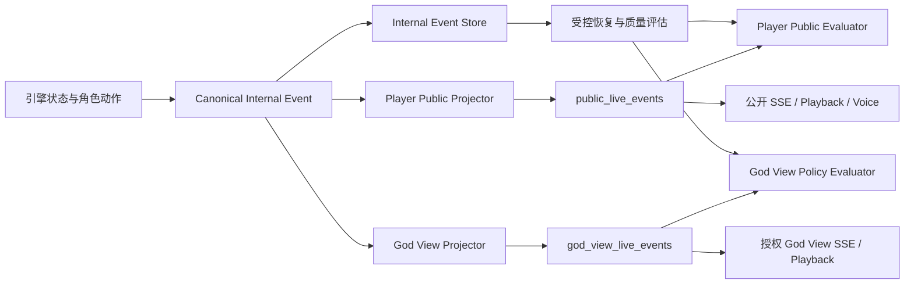

# 狼人杀隐私受众契约 V2 与公开事件链路修复开发设计

**Date:** 2026-07-15

**Status:** Ready for implementation

**Priority:** P0 Privacy / Release Blocker

**Source Run:** `run_ae590a89d9f9` / `game_a75ef39f`

**Scope:** `apps/api` 事件生产、持久化、SSE、Playback、语音、质量评估、Admin，以及 `packages/game-client`、`apps/mobile-web` 的 Live 消费链路

**Related Designs:**

- `docs/superpowers/specs/2026-07-14-p0-game-integrity-remediation-design.md`
- `docs/superpowers/specs/2026-07-14-p1-game-flow-experience-remediation-design.md`
- `docs/superpowers/specs/2026-07-14-p2-game-quality-performance-remediation-design.md`
- `docs/superpowers/specs/2026-07-14-p3-quality-evaluation-observability-remediation-design.md`
- `docs/run-05aa0b0f2b92-quality-remediation-plan.md`

## 1. 文档目标

本文解决 2026-07-14 隐私设计与实际 Live 产品契约之间的冲突，并把隐私边界落实为可开发、可迁移、可测试、可灰度的工程方案。

本次修复的核心不是继续给现有 SSE 增加零散字段过滤，而是建立版本化的受众契约：

1. 区分服务端内部事件、角色私密信息、玩家公开信息、授权 God View 和终局揭示；
2. 普通公开接口不再直接读取或序列化原始 `LiveEvent`；
3. 玩家公开流和 God View 使用独立投影、独立存储和独立访问控制；
4. Live、Playback、语音、字幕、普通 Game API 和 Admin 使用同一套投影规则；
5. P3 评估器按受众判断合法披露，既能发现真实泄密，也不会把授权 God View 误报为玩家公开泄密；
6. 失败、取消和可恢复对局不得因为流程终止而提前公开隐藏身份；
7. 将真实的“引擎 → PostgreSQL → SSE → 客户端 → Playback/Voice → Evaluator”链路加入发布门禁。

完成标准不是“某个接口看起来没有秘密字段”，而是所有 C 端公开制品都只能来源于经过验证的受众投影。

## 2. 已确认问题与 7 月 14 日设计冲突

### 2.1 已确认现象

`run_ae590a89d9f9` 暴露了以下结构性问题：

1. `game_started` 使用完整玩家序列化，事件中包含真实角色；
2. 狼队私密模型生命周期虽然已静默，但狼人投刀和最终刀口又被手工发布为公开 `action_parsed`；
3. `night_resolved` 公开状态仍携带 `attacked`、`investigated`、`saved_by_witch`、`poisoned`、内部死亡 `cause/source`；
4. `/runs/{run_id}/events` 直接返回原始事件，没有受众参数、公开投影或 God View 授权；
5. Live 与 Playback 测试明确要求展示每只狼的投刀和最终刀口；
6. P3 同时把隐藏角色、狼队关系、夜间目标、角色结果和内部死亡原因定义为 P0 泄密；
7. P3 Worker 没有部署，失败局也不会自动进入终局质量评估；
8. P3 sanitized fixture 只有两条 Live 事件，没有覆盖真实引擎发布路径。

### 2.2 7 月 14 日文档中的契约冲突

P0 设计已经确立正确的安全原则：私密动作不能“先发布、后过滤”，而应在公开事件源头保持静默。但是该设计同时限定“本次不修改其他夜间 God View 行为”，导致该原则只覆盖 `summarize` 和部分狼人模型生命周期。

P3 设计则把所有 `live_event` 视为同一种公开渠道，并把 God View 当前合法消费的身份和夜间动作统一判为 P0。两份文档对“公开”的含义不同：

| 文档/实现 | “公开”的实际含义 |
| --- | --- |
| P0 部分实现 | 不公开私密模型文本，但保留 God View 结构化夜间行为 |
| Mobile / game-client | 面向观众的 God View，可展示角色与狼刀 |
| P3 评估 | 玩家安全公开渠道，不允许隐藏角色和夜间行为 |
| 当前 SSE | 无受众区分的原始事件流 |

本设计废止“一个原始事件流同时承担所有受众”的隐式约定。

本设计也明确覆盖 P0 文档中“不新增数据库表”的旧非目标。该限制适用于当时的私密总结热修复，不足以安全承载 Player Public 与 God View 两种受众；从本设计开始，以独立投影存储换取源头隔离和可审计性。

### 2.3 已修复行为不得回退

以下 7 月 14 日修复继续保留：

- `summarize` / `private_round_memory` 不产生公开模型生命周期事件、字幕或玩家语音；
- 被质量门禁拒绝的草稿不进入公开事件；
- 终局后不继续请求玩家总结；
- 公开事实与角色私密观察继续分离；
- 私密证据不进入普通 Admin 返回值和低基数指标标签。

## 3. 目标与非目标

### 3.1 目标

1. 建立单一、版本化、可测试的受众和披露契约；
2. 玩家公开接口在任何游戏状态下都不包含未授权秘密；
3. God View 只展示产品明确允许的结构化真相，不展示 Prompt、推理或私密策略文本；
4. 失败、取消、partial、resumable 对局不触发终局身份揭示；
5. 公开 SSE、Playback、Game API、语音和字幕共享同一安全投影；
6. 原始事件只用于服务端恢复、受控评估和受权限保护的内部诊断；
7. 投影失败时 fail closed，不回退到原始事件；
8. 历史原始事件停止通过 C 端接口暴露，并可审计地完成分类和扫描；
9. P3 能分别评估玩家公开、God View 和 Admin 安全制品；
10. 真实数据库与路由链路进入确定性发布门禁。

### 3.2 非目标

- 不修改狼人杀角色规则、夜间结算顺序或胜负条件；
- 不把角色私密 Prompt 改成公开 Prompt；
- 不引入另一个 LLM 判断事件是否可以公开；
- 不依靠自由文本正则代替结构化受众策略；
- 不在本次设计中建立新的通用 IAM 平台；God View 复用现有会话和签名能力；
- 不要求立即删除全部历史内部证据；先停止公开读取，再按保留策略清理；
- 不把 God View 的访问 token、run ID、玩家名或模型名写入 Prometheus 标签；
- 不允许通过 feature flag 回滚到原始 SSE 公开路径。

## 4. 隐私受众契约 V2

### 4.1 受众枚举

统一定义：

```python
class EventAudience(StrEnum):
    INTERNAL = "internal"
    ACTOR_PRIVATE = "actor_private"
    TEAM_PRIVATE = "team_private"
    PLAYER_PUBLIC = "player_public"
    SPECTATOR_GOD_VIEW = "spectator_god_view"
    TERMINAL_REVEAL = "terminal_reveal"
```

语义：

| Audience | 可见对象 | 典型数据 | 是否进入 C 端普通接口 |
| --- | --- | --- | --- |
| `internal` | 服务端与受控评估 | 完整状态、Prompt、原始响应、内部死因 | 否 |
| `actor_private` | 单个角色的后续决策上下文 | 查验结果、女巫资源、私密观察 | 否 |
| `team_private` | 同阵营私密决策上下文 | 狼队队友、讨论、投刀原始结果 | 否 |
| `player_public` | 所有参赛者都合法知道的信息 | 公开发言、票型、自爆、公开死亡、警徽 | 是 |
| `spectator_god_view` | 获得授权的观众 | 结构化角色、狼刀、查验、用药结果 | 独立接口 |
| `terminal_reveal` | 正常终局后的公开消费者 | 完整身份和胜负 | 满足终局条件后是 |

`actor_private` 和 `team_private` 首期不新增浏览器 SSE，只用于明确内部数据归属，防止未来误用 `public/private` 二值语义。

### 4.2 字段披露矩阵

| 数据 | Player Public | God View | Terminal Reveal | Internal |
| --- | --- | --- | --- | --- |
| 座位、显示名、头像、模型展示名 | 允许 | 允许 | 允许 | 允许 |
| 存活状态、公开发言、公开票型 | 允许 | 允许 | 允许 | 允许 |
| 真实角色、阵营 | 禁止 | 允许结构化展示 | 允许 | 允许 |
| 狼队关系 | 禁止 | 允许结构化展示 | 允许 | 允许 |
| 每只狼的投刀、最终刀口 | 禁止 | 允许结构化展示 | 可按回放产品策略允许 | 允许 |
| 狼队讨论文本和欺骗计划 | 禁止 | 禁止 | 禁止 | 允许 |
| 预言家查验目标和结果 | 禁止 | 允许结构化展示 | 可按回放产品策略允许 | 允许 |
| 女巫用药目标和剩余资源 | 禁止 | 允许结构化展示 | 可按回放产品策略允许 | 允许 |
| 内部死亡 `cause/source` | 禁止 | 允许经过枚举投影的 cause | 可允许 | 允许 |
| Prompt、reasoning、raw response | 禁止 | 禁止 | 禁止 | 允许 |
| 私密回合记忆、被拒绝草稿 | 禁止 | 禁止 | 禁止 | 允许 |
| 访问 token、密钥和 Provider 认证信息 | 禁止 | 禁止 | 禁止 | 仅受控配置 |

### 4.3 终局揭示条件

只有同时满足以下条件才允许生成 `terminal_reveal`：

1. `GameSessionRecord.status == "complete"`；
2. `LiveRunRecord.status == "completed"`；
3. `resumable is False`；
4. winner 已持久化；
5. 终局连锁结算和 checkpoint 清理完成；
6. 揭示事件由服务端确定性生成，不从模型输出复制。

`failed`、`canceled`、`partial` 和 `resumable` 一律不能通过普通接口提前揭示角色。

## 5. 总体架构



设计原则：

1. **源头投影。** 公开制品只从投影表读取，不从原始事件临时删字段；
2. **默认拒绝。** 未命中明确策略的事件默认只进入 `internal`；
3. **共享投影。** Live、Playback、普通 API 和语音不能各写一套隐私过滤；
4. **投影纯函数。** 相同 canonical event、游戏状态和策略版本必须产生相同结果；
5. **可审计。** 每条投影记录保存策略版本和原始 `source_event_id`，但不复制禁止字段；
6. **失败关闭。** 投影异常只能导致该渠道缺失并告警，禁止回退输出原始事件；
7. **兼容有界。** 旧客户端可忽略新字段，但旧原始 SSE 必须按计划退役，不能长期双轨公开。

## 6. 数据模型与持久化

### 6.1 保留原始事件作为内部证据

现有 `live_events` 重新定义为内部 canonical store。它可以继续保存恢复、回放重建和质量评估所需信息，但：

- C 端路由不得直接查询并序列化该表；
- Admin 普通详情不得返回该表原文；
- 数据库访问和应用 service 必须使用显式 internal repository；
- 日志不得打印完整 payload；
- 历史清理按保留策略独立执行。

### 6.2 新增公开投影表

建议新增：

```text
public_live_events
god_view_live_events
```

公共字段：

```text
run_id
event_id                 # 沿用 canonical event ID，允许有间隔
source_event_id
session_id
type
round
phase
actor                    # 已转换为公开座位引用
action
payload                  # 已投影的安全 payload
projection_version
created_at
```

约束：

- `(run_id, event_id)` 唯一；
- `source_event_id` 必须指向同 run 的 canonical event；
- `projection_version` 首版为 `privacy-audience-v2`；
- 一个 canonical event 在同一 audience 最多产生一条投影；
- 无公开制品的事件不插入投影表；事件 ID 允许有间隔；
- 投影表不保存 Prompt、raw response、reasoning 或 private summary。

### 6.3 投影写入时机

事件持久化流程：

1. 构造 canonical event；
2. 通过纯函数分别计算 player-public 和 God View 投影；
3. 在同一数据库事务中写入 canonical event 和成功生成的投影；
4. 语音任务只从 player-public 投影创建；
5. 投影函数异常时不写入该渠道、不回退原始 payload，记录低基数错误码；
6. 对关键公开事件可由 outbox 重放投影，但重放必须幂等。

### 6.4 投影 DTO

新增显式类型：

```python
@dataclass(frozen=True)
class ProjectedLiveEventV2:
    audience: Literal["player_public", "spectator_god_view", "terminal_reveal"]
    projection_version: str
    source_event_id: int
    type: str
    round_number: int | None
    phase: str | None
    actor: str | None
    action: str | None
    payload: dict[str, JsonValue]
```

`format_sse()` 只接受 `ProjectedLiveEventV2`，不再接受原始 `LiveEvent`。

## 7. Player Public 投影规则

### 7.1 `game_started`

公开 DTO 只允许：

```json
{
  "players": [
    {
      "seat": 1,
      "name": "鹿眠",
      "avatar_image_url": "...",
      "model_display_name": "...",
      "is_alive": true
    }
  ],
  "active_players": ["1号玩家", "2号玩家"]
}
```

禁止复用 `Player.to_dict()`。禁止字段包括但不限于 `role`、`team`、`wolf_teammates`、`gamestate`、`observations`、资源和私密策略字段。

### 7.2 夜间动作

以下动作不产生 player-public `action_requested`、模型生命周期或 `action_parsed`：

```text
remove
werewolf_discuss
werewolf_kill_vote
protect
investigate
witch_save
witch_poison
```

玩家公开流只保留合法法官 Cue 和结算后的公开结果，例如：

```json
{
  "type": "public_outcome",
  "payload": {
    "schema_version": 1,
    "kind": "night_death",
    "target_player_id": "8号玩家",
    "outcome": "eliminated"
  }
}
```

不得携带 `attacked`、`investigated`、`protected`、`saved_by_witch`、`poisoned`、`cause` 或 `source`。

### 7.3 白天公开动作

以下内容允许进入 player-public：

- 公开发言与质量门禁接受后的最终文本；
- 警长竞选、退水、警长票型和当选结果；
- 白天放逐票型；
- 狼人自爆后的公开狼人身份；
- 猎人公开发动和目标；
- 白痴合法翻牌；
- 警徽移交、撕毁和流失；
- 公开死亡名单、存活名单和胜负；
- 正常终局后的确定性身份揭示。

### 7.4 永久禁止的 C 端文本

以下内容即使终局后也不得进入普通 Live、God View、语音或字幕：

- 完整 Prompt；
- 模型 reasoning；
- raw response；
- 私密回合总结；
- 狼队讨论或欺骗计划原文；
- 被质量门禁拒绝的草稿；
- Provider 错误体中的认证信息或请求正文。

## 8. God View 投影与授权

### 8.1 God View 允许范围

God View 可以展示：

- 座位真实角色和阵营；
- 狼队关系；
- 每轮结构化投刀与最终刀口；
- 守卫目标；
- 预言家查验目标和确定性结果；
- 女巫救、毒目标及结构化资源变化；
- 枚举化内部死亡原因；
- 终局完整身份。

God View 仍禁止模型推理、私密讨论、私密总结、Prompt、raw response 和被拒绝草稿。

### 8.2 访问控制

新增：

```text
GET /api/v1/games/runs/{run_id}/god-view/events
GET /api/v1/games/{session_id}/god-view/playback
```

访问要求：

1. 使用现有登录会话或签名 spectator capability；
2. capability 绑定 `run_id`、audience、过期时间和 nonce；
3. 服务端验证权限后再读取 God View 投影表；
4. `run_id` 不作为授权凭证；
5. 拒绝结果只返回低信息错误，不透露 run 是否存在敏感内容；
6. 访问日志记录主体、run、结果和固定 reason code，不记录 token；
7. God View 未配置或鉴权服务异常时 fail closed。

如果产品最终决定 God View 可匿名公开，也必须通过显式的 run disclosure policy 授权，并继续使用独立 endpoint 和投影；不能重新暴露原始 SSE。

## 9. Live、Playback、语音和 Admin 消费规则

### 9.1 Live SSE

普通 `/runs/{run_id}/events`：

- 只查询 `public_live_events`；
- `after_id` / `Last-Event-ID` 继续使用 canonical event ID；
- 允许 ID 有间隔；
- SSE serializer 只接受 player-public DTO；
- 不提供内部 fallback。

God View SSE：

- 先鉴权，再查询 `god_view_live_events`；
- 返回明确 `audience=spectator_god_view` 和 `projection_version`；
- 客户端拒绝把 God View event 注入普通 Live store。

### 9.2 Playback 与普通 Game API

- 普通 Playback 从 player-public 投影或同一 projector 重建；
- God View Playback 从 God View 投影重建；
- 普通 `GET game` DTO 不读取内部 RoundLog 的私密 action；
- 历史 fallback 必须经过与实时事件相同的 projector；
- 禁止单独维护“safe wolf votes”特殊逻辑。

### 9.3 语音与字幕

- 只有 player-public narratable event 可创建普通语音物化任务；
- God View 首期不为秘密夜间动作生成语音；如后续需要，使用独立 speaker 和独立任务 audience；
- job 保存 `source_event_audience` 和 `projection_version`；
- 私密、内部、被拒绝或投影失败事件创建任务数必须为 0；
- Playback 合并语音时再次校验 audience；
- 历史错误语音继续执行读取过滤和清理命令。

### 9.4 Admin

- Admin 普通 Game 详情默认使用 player-public 投影；
- God View 预览需要独立权限；
- internal evidence 需要更高 debug scope、二次权限检查和审计；
- P3 issue 只返回 code、channel、event ID 和安全摘要，不返回秘密原文；
- Admin 导出功能同样复用投影，不允许直接导出 canonical payload。

## 10. P3 质量评估修订

### 10.1 Bundle 分区

质量 Bundle 调整为：

```text
private_evidence
player_public_artifacts
god_view_artifacts
admin_safe_artifacts
terminal_reveal_artifacts
```

每个 artifact 必须携带 `audience`、`projection_version` 和 `source_event_id`。

### 10.2 判定规则

P0：

- 私密 action 或秘密字段进入 `player_public`；
- 原始事件通过普通 C 端接口可访问；
- God View 未授权即可访问；
- God View 出现 Prompt、reasoning、raw response、私密讨论或私密总结；
- failed/partial/resumable 对局产生 terminal reveal；
- 私密或内部事件生成普通语音/字幕；
- 被拒绝草稿出现在任一 C 端渠道。

合法行为：

- 狼人自爆后公开该玩家是狼人；
- 白痴按规则翻牌；
- 猎人公开发动；
- 正常终局后公开完整身份；
- 经过授权的 God View 展示契约允许的结构化身份和夜间结果。

### 10.3 失败局评估

质量任务投递覆盖：

```text
complete
partial
failed
canceled
```

状态不同只影响 `data_status` 和适用指标，不影响隐私扫描。失败局缺少终局语音不应产生终局语音 P1，但提前角色揭示仍应产生 P0。

### 10.4 事实覆盖指标修复

事实覆盖比较必须在同一命名空间完成：

- 内部姓名先投影为公开座位引用；
- 对事实和 Prompt 使用相同的文本投影和截断函数；
- coverage 保存 fact ID 集合或 HMAC，而不是依赖原始字符串精确比较；
- 不保存秘密事实原文到评估结果。

## 11. 安全不变量与代码约束

以下不变量进入运行时断言和 CI：

1. C 端 SSE serializer 不接受 canonical `LiveEvent`；
2. Player-public payload 出现禁止字段立即拒绝投影；
3. 未知 event/action 默认没有公开投影；
4. `private_round_memory` 永远没有 C 端投影；
5. 夜间私密 action 永远没有 player-public action lifecycle；
6. God View payload 永远没有自由文本 reasoning、Prompt 或 raw response；
7. terminal reveal 必须满足完整终局条件；
8. 语音任务必须引用允许播报的投影事件；
9. 投影失败不得调用 raw serializer；
10. Public、God View 和 internal repository 使用不同接口类型，禁止隐式互换。

建议新增静态检查：

- 扫描 C 端 route 是否直接引用 `LiveEventRecord` 或 internal repository；
- 扫描业务代码是否绕过类型化 emitter 直接发布私密 action；
- 扫描公开 schema 是否出现禁止字段；
- 扫描前端普通 Live 类型是否包含 God View-only 字段。

## 12. 数据迁移与历史处理

### 12.1 上线前读路径止血

迁移历史数据前，先完成：

1. 新建 player-public 投影；
2. 普通 SSE 和 Playback 切换到安全投影；
3. 禁止 C 端读取原始 `live_events`；
4. 关闭旧 raw endpoint；
5. 对缺少投影的历史事件 fail closed。

### 12.2 历史投影回填

提供 dry-run / apply CLI：

```text
backfill-live-event-projections
scan-public-privacy-violations
```

回填要求：

- 使用锁定的 `privacy-audience-v2` projector；
- 幂等写入；
- 支持按时间、run、session 和批次大小过滤；
- dry-run 输出计数和固定 reason code，不输出秘密原文；
- 旧事件无法安全识别时只保留 internal，不生成公开投影；
- 记录投影版本、成功、拒绝和异常计数；
- 不把历史 terminal 状态不明的角色数据推断为合法揭示。

### 12.3 历史公开制品

扫描范围：

- 原始 SSE 持久化事件；
- Playback 重建结果；
- 已保存语音和字幕；
- Admin fixture、导出和缓存；
- 测试快照；
- 应用日志中的事件 payload。

内部证据的删除或加密保留由独立数据保留策略决定，不与本次公开读路径止血互相阻塞。

## 13. 指标、日志与告警

低基数指标：

```text
werewolf_event_projection_total{audience,event_family,result}
werewolf_event_projection_rejected_total{audience,reason_code}
werewolf_public_projection_lag_seconds_bucket
werewolf_god_view_auth_total{result,reason_code}
werewolf_privacy_issue_total{audience,code,severity}
werewolf_terminal_reveal_total{result,reason_code}
werewolf_voice_job_rejected_total{reason_code}
```

禁止标签：

```text
run_id
session_id
player_name
model_id
event_id
token
自由文本
```

告警：

- 任一 `player_public` P0 立即阻止发布并告警；
- 原始 route 被访问或 raw serializer 被调用立即告警；
- God View 连续鉴权异常或无授权成功访问立即告警；
- 投影积压超过 15 分钟告警，但不得回退到 raw；
- failed/partial 对局出现 terminal reveal 立即告警；
- 私密事件创建普通语音任务立即告警。

## 14. 测试策略

### 14.1 投影纯函数测试

覆盖：

- 每种 event/action 的 Player Public 允许和禁止字段；
- God View 允许字段和永久禁止文本；
- 未知事件默认拒绝；
- 名称到座位映射；
- terminal reveal 状态矩阵；
- 投影重复运行完全一致；
- payload 深层嵌套禁止字段；
- malformed legacy event fail closed。

### 14.2 数据库与 API 集成测试

真实写入 PostgreSQL 测试库后验证：

- canonical、public 和 God View 投影同事务或可重放一致；
- 普通 SSE 只读取 public 表；
- God View 无授权为 401/403；
- `after_id` 和断线恢复允许事件 ID 有间隔；
- Playback 与 Live 的同源事件隐私结果一致；
- 失败、取消、可恢复状态不揭示角色；
- 旧 raw route 已删除或固定拒绝；
- Admin 权限和审计生效。

### 14.3 真实引擎全链路门禁

新增固定 seed 对局，不调用在线模型，使用确定性 provider 覆盖：

- 四狼投刀和多轮不一致投票；
- 狼队私密讨论；
- 预言家查验；
- 女巫救、毒和资源变化；
- 守卫目标；
- 自爆、白痴、猎人和警徽；
- 私密总结；
- 被拒绝草稿；
- 正常终局；
- 中途 provider 超时形成 partial/resumable；
- 取消和失败。

测试必须实际经过：

```text
GameEngine
→ Database Event Sink
→ PostgreSQL projection tables
→ public / God View SSE routes
→ Playback routes
→ voice job creation
→ game-client / Mobile adapter
→ P3 quality bundle and evaluator
```

不得用手写两条事件的 sanitized fixture 替代该门禁。

### 14.4 隐私哨兵

为以下秘密分别使用唯一哨兵：

- 真实角色；
- 狼队关系；
- 狼队讨论；
- 每只狼的投刀；
- 最终刀口；
- 查验目标和结果；
- 女巫用药和剩余资源；
- 内部死亡原因；
- 私密总结；
- Prompt、reasoning、raw response；
- 被拒绝草稿。

Player Public 的 Live、Playback、Game API、voice、subtitle、Mobile store 和 Admin safe DTO 中哨兵命中必须为 0。

God View 只允许契约批准的结构化哨兵，永久禁止文本哨兵命中必须为 0。

## 15. 依次执行的开发任务清单

以下任务按依赖顺序执行。前一阶段的契约或门禁未完成时，不进入后一阶段的公开流切换。

### 阶段 A：冻结契约与建立类型边界

- [ ] **PRIV-T01：冻结隐私受众契约 V2**
  - 将第 4 节披露矩阵固化为版本化策略；
  - 明确普通 Live 与 God View 的产品受众和访问方式；
  - 永久投影上线前，原始 SSE 只能临时关闭或收紧为 God View 授权访问，禁止以临时字段过滤继续匿名输出；
  - 修订 P0/P3 中“公开”定义冲突；
  - 更新总 Plan 中 P1/P3 的状态口径；
  - 验收：产品、后端、客户端和评估器引用同一版本与同一字段矩阵。

- [ ] **PRIV-T02：新增 audience、projection DTO 和禁止字段类型**
  - 增加 `EventAudience`、`ProjectedLiveEventV2`、策略版本常量；
  - 定义 player-public / God View schema；
  - 将 SSE serializer 参数收窄为 projected DTO；
  - 验收：原始 `LiveEvent` 无法直接传给 C 端 serializer。

- [ ] **PRIV-T03：实现纯函数 Player Public Projector**
  - 覆盖 game lifecycle、白天动作、公开结算、Cue 和终局；
  - 未知 event/action 默认返回无投影；
  - 深层扫描禁止字段并 fail closed；
  - 验收：完整事件矩阵与恶意嵌套 payload 单测通过。

- [ ] **PRIV-T04：实现纯函数 God View Projector**
  - 只允许结构化身份和夜间结果；
  - 永久拒绝 Prompt、reasoning、raw response、私密总结和讨论原文；
  - 验收：God View 合法字段通过、文本秘密负向测试通过。

### 阶段 B：建立独立持久化和可靠投影

- [ ] **PRIV-T05：新增投影表、索引、ORM 和 migration**
  - 新增 `public_live_events`、`god_view_live_events`；
  - 增加唯一键、source event 外键、projection version 和查询索引；
  - 验证 PostgreSQL migration upgrade/downgrade/upgrade；
  - 验收：Alembic 单一 head，迁移循环通过。

- [ ] **PRIV-T06：将投影接入 Database Event Sink**
  - canonical event 写入时生成两类投影；
  - 保证幂等、顺序和 source event 关联；
  - 投影异常不得回退原始 payload；
  - 增加重放投影能力和错误码；
  - 验收：事务失败、重复投递和恢复测试通过。

- [ ] **PRIV-T07：补齐投影 outbox、积压与恢复机制**
  - 对可重试投影失败建立有界重试；
  - 增加 backlog、lag、失败原因指标；
  - 关键公开事件缺失可恢复但始终 fail closed；
  - 验收：Worker 重启、租约接管和重复处理不产生重复事件。

### 阶段 C：修复事件生产源头

- [ ] **PRIV-T08：拆分类型化事件 emitter**
  - 新增 internal、player-public、God View 语义入口；
  - 逐步禁止业务代码直接调用无受众语义的 `_publish()`；
  - 验收：私密 action 不能通过通用入口生成 player-public payload。

- [ ] **PRIV-T09：修复 `game_started` 玩家 DTO**
  - 停止公开 `Player.to_dict()`；
  - Player Public 只输出允许的玩家展示字段；
  - God View 单独投影角色和阵营；
  - 验收：普通 SSE 角色/阵营/队友字段为 0，God View 合法展示。

- [ ] **PRIV-T10：移除狼人投刀手工公开旁路**
  - 私密讨论、每狼投刀和最终刀口只进入 internal/team-private；
  - God View 从 canonical event 投影结构化结果；
  - 删除“safe wolf vote”普通公开兼容逻辑；
  - 验收：普通 Live/Playback 无投刀，God View 保留批准的战报表现。

- [ ] **PRIV-T11：修复守卫、预言家和女巫动作边界**
  - 私密动作 lifecycle 不进入 Player Public；
  - God View 只投影目标、结果和批准的资源枚举；
  - 验收：角色结果哨兵在普通渠道为 0。

- [ ] **PRIV-T12：移除公开夜间结算中的内部 cause/source 双写**
  - Player Public 只消费 `public_outcome_events`；
  - 停止公开 `attacked/investigated/protected/saved_by_witch/poisoned`；
  - `night_deaths` 不再携带内部 cause/source；
  - 验收：公开死讯正确，内部死因 P0 为 0。

- [ ] **PRIV-T13：实现严格终局揭示状态机**
  - 只有 complete + completed + non-resumable 才生成 reveal；
  - 覆盖失败、取消、partial、checkpoint 恢复和 winner 缺失；
  - 验收：状态矩阵全部通过，失败局无提前身份揭示。

### 阶段 D：切换路由与客户端

- [ ] **PRIV-T14：切换普通 SSE 到 Player Public Store**
  - `/runs/{run_id}/events` 不再读取原始表；
  - 保持 `after_id`、`Last-Event-ID` 和事件间隔兼容；
  - 删除 raw fallback；
  - 验收：路由级源码和集成测试均证明无法返回 canonical payload。

- [ ] **PRIV-T15：新增 God View SSE 与访问控制**
  - 增加 God View route、鉴权、token/capability 校验和审计；
  - 无授权、过期、跨 run 和重放 token fail closed；
  - 验收：授权矩阵、CSRF/会话边界和低信息错误响应通过。

- [ ] **PRIV-T16：统一普通 Playback、Game API 和历史 fallback**
  - 普通读取全部复用 Player Public Projector；
  - God View Playback 使用独立投影；
  - 删除普通 Playback 中的狼刀特殊公开逻辑；
  - 验收：实时 Live 与 Playback 对同 source event 的公开结果一致。

- [ ] **PRIV-T17：切换 game-client 与 Mobile Live 类型和数据源**
  - 普通 Live store 不再接收 God View-only 类型；
  - `liveGodView` 只连接授权 God View endpoint；
  - 更新战报、断线恢复和终局展示；
  - 验收：普通视图无角色/狼刀，God View 体验保持完整。

- [ ] **PRIV-T18：修复语音、字幕与物化任务 audience**
  - job 引用 projected event 和 audience；
  - 私密/internal/God View 秘密动作不生成普通语音；
  - Playback 合并前复核 audience；
  - 验收：所有私密语音哨兵为 0，公开发言和法官 Cue 覆盖不回退。

- [ ] **PRIV-T19：修复 Admin 安全投影与 Debug 权限**
  - 普通 Game 详情只读取 player-public；
  - God View 和 internal evidence 使用独立 scope；
  - 导出、分页、重试和审计保持相同隐私边界；
  - 验收：普通 Admin DTO 和前端状态中秘密原文为 0。

### 阶段 E：修订 P3 评估与自动投递

- [ ] **PRIV-T20：按 audience 重构 Quality Evaluation Bundle**
  - 分离 private evidence、Player Public、God View、Admin 和 terminal reveal；
  - artifact 保存 projection version 和 source event；
  - 验收：同一 canonical event 在不同受众下的评估输入正确。

- [ ] **PRIV-T21：修订披露账本与 P0 规则**
  - Player Public 严格执行秘密字段禁区；
  - God View 按授权和允许矩阵判断；
  - 终局揭示按状态机判断；
  - 验收：合法 God View 零误报，非法普通披露全部命中。

- [ ] **PRIV-T22：将 failed/partial/canceled 纳入隐私评估**
  - 调整任务投递和 source coverage；
  - 非 complete 对局跳过不适用的终局体验指标，但执行隐私检查；
  - 验收：本次来源 run 可生成 partial 隐私报告。

- [ ] **PRIV-T23：修复事实覆盖名称投影误报**
  - 使用 fact ID/HMAC 和同源文本投影；
  - 内部姓名与公开座位映射统一；
  - 验收：已实际进入 Prompt 的关键事实覆盖率为 100%，不再产生姓名映射假缺失。

### 阶段 F：真实门禁、历史处理与上线

- [ ] **PRIV-T24：建立真实引擎到 C 端的隐私端到端门禁**
  - 使用确定性 provider 跑完整、失败、取消和恢复场景；
  - 实际经过 PostgreSQL、SSE、Playback、Voice、客户端 adapter 和 Evaluator；
  - 替换手写 sanitized fixture 作为主要发布证据；
  - 验收：Player Public 全渠道 P0 为 0，God View 合法字段无误报。

- [ ] **PRIV-T25：增加静态旁路检查与恶意 payload 测试**
  - 检查 C 端 route 直接读取原始表；
  - 检查公开 serializer 接受 raw event；
  - 检查禁止字段深层嵌套和未知 action；
  - 验收：任何新增旁路使 CI 失败。

- [ ] **PRIV-T26：实现历史投影回填与隐私扫描 CLI**
  - 支持 dry-run/apply、批次、时间和 run/session 过滤；
  - 无法安全判断的旧事件只保留 internal；
  - 扫描历史 Live、Playback、voice、subtitle、Admin fixture 和日志；
  - 验收：输出只有安全计数和 reason code，执行幂等。

- [ ] **PRIV-T27：完成公开读路径切换和旧 raw endpoint 退役**
  - 先切普通 SSE/Playback，再开放 God View；
  - raw route 删除或固定拒绝；
  - 不允许使用 feature flag 回滚到 unsafe path；
  - 验收：部署后网络层无法访问原始事件流。

- [ ] **PRIV-T28：部署并启用 P3 Worker 与健康门禁**
  - staging 单 Worker 先启用；
  - 验证 heartbeat、backlog、租约、积压告警和失败恢复；
  - production 开启前检查 Player Public P0 为 0；
  - 验收：服务实际运行，不只验证 Compose/Kubernetes 渲染。

- [ ] **PRIV-T29：完成自然流量观察和人工抽查**
  - 被动累计至少 7 个完整自然日和 50 局来源可用对局；
  - 包含正常终局、失败/partial 和至少 10 局人工抽查；
  - Player Public P0 必须为 0；
  - God View 未授权访问成功数必须为 0；
  - 验收：记录样本、部署版本、策略版本和结论后才能标记“已修复”。

- [ ] **PRIV-T30：更新总 Plan、运行手册与事故响应流程**
  - 修正“已开发/已部署/已验证/已修复”状态；
  - 记录 God View 授权、token 轮换、Worker 和历史扫描手册；
  - 定义发现 P0 后的关闭路径和证据保留方式；
  - 验收：文档状态与实际部署、开关和自然样本一致。

### 15.1 2026-07-15 本地开发进度

本节记录当前工作区实现状态，不等同于已部署或已验证。第 20、21 节的自然流量门槛未完成前，不得将问题标记为“已修复”。

| 状态 | 任务 | 当前结果 |
|---|---|---|
| 本地代码完成 | PRIV-T02～T06 | 已增加 audience DTO、fail-closed 双投影器、独立投影表、单一 Alembic head、事务内 shadow write、重复写与投影失败回滚测试 |
| 本地代码完成 | PRIV-T09～T14 | `game_started`、私密夜间动作、死因字段和失败终局均由统一投影器约束；普通 SSE 从 projected store 读取，原始事件不能直接序列化 |
| 本地代码完成 | PRIV-T16～T18 | 普通 Game/Playback 复用 Player Public 投影；God View Live/Playback 使用独立认证路由；客户端、语音、字幕和物化任务携带 audience 并消费公开投影 |
| 本地代码完成 | PRIV-T22～T23 | partial/failed replay 自动进入隐私评估；事实覆盖在同一座位名称投影后计算 |
| 本地代码完成 | PRIV-T25（核心门禁） | 未知事件/action 默认无投影，嵌套禁止字段测试、raw SSE serializer 拒绝测试和普通 Game API 负向测试已加入 |
| 部分完成 | PRIV-T01、T07～T08、T15、T19～T21、T24、T26～T27、T30 | 已具备同步原子投影、公共会话鉴权、Admin 安全 DTO、Player Public P3 输入和历史重建 CLI；仍缺 capability 级跨 run 授权、异步积压指标、完整 God View 评估分区、PostgreSQL 真实全链路门禁、全渠道历史扫描和部署运行手册 |
| 未开始或需环境执行 | PRIV-T28～T29 | P3 Worker 部署、健康门禁、7 天/50 局自然流量观察和人工抽查必须在 staging/production 完成 |

本地已验证命令：

```bash
cd apps/api && uv run alembic heads
cd apps/api && uv run pytest -q
pnpm --dir packages/game-client test -- --run
pnpm --dir apps/mobile-web test -- --run
pnpm --dir apps/mobile-web build
pnpm --dir apps/admin-web test -- --run
pnpm --dir apps/admin-web build
```

历史投影重建默认 dry-run，只输出安全计数：

```bash
cd apps/api
uv run python -m app.werewolf.projection_backfill --run-id run_xxx
uv run python -m app.werewolf.projection_backfill --run-id run_xxx --apply
```

## 16. 推荐提交与发布拆分

### PR-A：契约、类型与纯函数投影

包含 PRIV-T01～T04。只建立安全边界和测试，不切生产读路径。

### PR-B：持久化与投影可靠性

包含 PRIV-T05～T07。合并 migration 和双投影 shadow 写入，只在受控环境验证；不得在仍由匿名原始 SSE 提供公开流的环境中单独发布。

### PR-C：引擎生产源修复

包含 PRIV-T08～T13。消除完整角色、狼刀、角色行动和内部死因旁路。

### PR-D：接口、客户端、语音与 Admin 切换

包含 PRIV-T14～T19。普通接口切到 Player Public，God View 改为独立授权链路。

### PR-E：P3 评估修订

包含 PRIV-T20～T23。解决受众误报、失败局漏评和事实覆盖误报。

### PR-F：发布门禁、历史迁移与部署

包含 PRIV-T24～T30。完成真实端到端门禁、旧路径退役、Worker 部署和自然流量闭环。

PR-D 与 PR-F 的公开路径切换属于同一个发布窗口，不能只上线客户端或只上线后端一侧。

## 17. 重点文件与模块

| 文件/模块 | 计划改动 |
| --- | --- |
| `apps/api/app/werewolf/engine.py` | 类型化 emitter、game_started DTO、夜间动作与终局揭示 |
| `apps/api/app/werewolf/live.py` | canonical/projected event 类型、SSE serializer 收窄 |
| `apps/api/app/werewolf/live_store.py` | canonical 写入、投影写入、outbox 和重放 |
| `apps/api/app/models/live.py` | public/God View 投影表和 voice audience |
| `apps/api/alembic/versions/*` | 投影表、索引与约束 migration |
| `apps/api/app/api/routes/games.py` | 普通 SSE、God View SSE、Playback 和鉴权 |
| `apps/api/app/werewolf/replay_playback.py` | Player Public / God View 同源回放投影 |
| `apps/api/app/werewolf/voice.py` | 只接受允许播报的 projected event |
| `apps/api/app/werewolf/voice_materializer.py` | audience 校验、指标和拒绝原因 |
| `apps/api/app/werewolf/evaluation_bundle.py` | artifact audience 分区 |
| `apps/api/app/werewolf/quality_evaluation.py` | audience-aware P0、终局披露与指标修复 |
| `apps/api/app/werewolf/replay.py` | complete/partial/failed/canceled 评估投递 |
| `apps/api/app/admin/*` | 普通安全投影、God View/internal scope 与审计 |
| `packages/game-client/src/types.ts` | Public/God View 类型分离 |
| `packages/game-client/src/live/liveGodView.ts` | 只消费授权 God View endpoint |
| `apps/mobile-web/src/pages/LivePage.tsx` | 普通 Live 与 God View 数据源切换 |
| `apps/api/tests/*` | 投影、API、恢复、语音、P3 和真实链路回归 |
| `apps/mobile-web/src/pages/LivePage.test.tsx` | 将狼刀展示测试迁移到 God View 契约 |

## 18. 发布、灰度与回滚

### 18.1 发布顺序

1. 合并契约和投影纯函数；
2. 执行 migration；
3. 开启双投影写入和 shadow 校验；
4. 运行真实端到端隐私门禁；
5. 切换普通 SSE、Playback、Voice 和 Admin；
6. 确认 raw route 已不可访问；
7. 开放授权 God View；
8. 启用 P3 Worker；
9. 执行历史 dry-run 和受控回填；
10. 开始自然流量观察。

### 18.2 回滚原则

- 可以关闭 God View endpoint；
- 可以暂停历史回填和 P3 Worker；
- 可以让 Player Public 暂时缺少非关键事件；
- 可以回滚客户端 God View 展示；
- 不得回滚到原始 SSE 公开；
- 不得通过关闭投影校验恢复禁止字段；
- 不得为了可用性把投影失败 fallback 到 canonical payload；
- 已写入的 internal evidence 不在紧急回滚中删除。

## 19. 确定性发布门槛

以下全部通过后，代码状态才能标记为“已开发，待部署验证”：

1. Player Public 全渠道秘密哨兵命中数为 0；
2. God View 永久禁止文本哨兵命中数为 0；
3. 合法 God View 身份和夜间结构化事件误报为 0；
4. failed/partial/resumable 的 terminal reveal 数为 0；
5. 私密事件普通语音任务创建数为 0；
6. 普通 route 直接读取 canonical store 的静态检查命中数为 0；
7. raw serializer C 端调用数为 0；
8. Live 与 Playback 对同 source event 的 Player Public 投影一致率为 100%；
9. 断线恢复、事件 ID 间隔和旧客户端兼容测试通过；
10. migration、回填 dry-run、重复执行和 rollback 测试通过；
11. P0/P1/P2 已修复行为回归通过；
12. CI 不调用在线模型。

## 20. 自然流量验收门槛

达到以下条件后才能标记“已修复”：

- staging 和 production 实际使用 Player Public 投影；
- 原始 SSE 在网络层不可访问；
- God View 只通过授权链路访问；
- P3 Worker 实际运行且无持续超过 15 分钟的积压；
- 至少 7 个完整自然日；
- 至少 50 局来源可用对局；
- 至少包含 complete、failed/partial 两类状态；
- Player Public P0 issue 为 0；
- 未授权 God View 成功访问数为 0；
- failed/partial/resumable terminal reveal 为 0；
- 至少人工抽查 10 局，覆盖 Live、Playback、voice/subtitle 和 Admin；
- 实施记录包含部署版本、projection version、样本量和观察窗口。

发现任一真实 P0 时，立即停止“已修复”判定，关闭相关公开或 God View 路径，保留受控证据并进入事故分析。

## 21. 完成状态定义

| 状态 | 条件 |
| --- | --- |
| 已规划 | 本文评审完成，任务未实施 |
| 已开发 | PRIV-T01～T26 和第 19 节确定性门槛完成 |
| 已部署 | PRIV-T27～T28 完成，公开读路径已切换，raw route 已退役，Worker 实际运行 |
| 已验证 | PRIV-T29 的自然流量与人工抽查门槛完成 |
| 已修复 | 已部署、已验证，且观察窗口内 Player Public P0 为 0 |

任务勾选、测试通过、Compose 渲染或代码合并本身不能单独标记为“已修复”。
