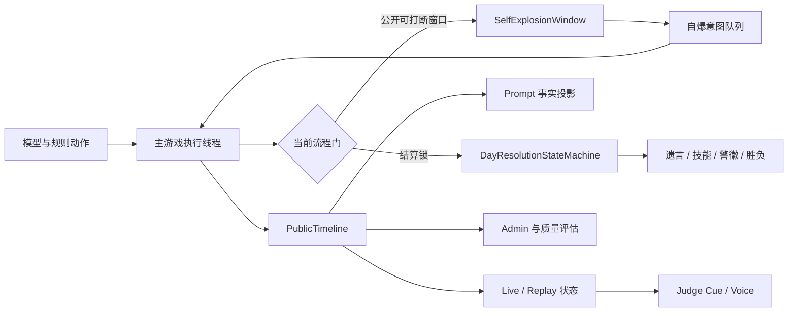

# 狼人杀即时自爆、驱逐遗言与玩家事实推理修复开发设计

## 1. 文档信息

- 编写日期：2026-07-17
- 文档状态：已实现基线；终局附属流程条款已被后续设计取代
- 依据对局：`game_dd132553`
- 依据运行：`run_f2d43ef7e0b5`
- 适用范围：`apps/api` 游戏引擎、规则快照、Prompt、Live/Replay、语音、Admin 诊断及共享客户端
- 上游设计：
  - `docs/superpowers/specs/2026-07-14-p0-game-integrity-remediation-design.md`
  - `docs/superpowers/specs/2026-07-14-p1-game-flow-experience-remediation-design.md`
  - `docs/superpowers/specs/2026-07-14-p2-game-quality-performance-remediation-design.md`
  - `docs/superpowers/specs/2026-07-14-p3-quality-evaluation-observability-remediation-design.md`
  - `docs/superpowers/plans/2026-07-16-live-replay-blocking-remediation.md`

本文把 `game_dd132553` 复盘及后续讨论确认的问题整理为一份可拆任务、开发、联调和验收的技术设计。本文不是对 P0～P3 的替代，而是在已有事实账本、公开结算、显式法官 Cue、语音物化、质量报告和恢复兼容基础上的增量修复。

> 2026-07-17 修订：本文的即时自爆、非终局驱逐遗言、隐私、回放和恢复基础合同已经实现；§8.2～§8.4 与 §10.8 中“终局后仍先执行遗言、警徽和独立总结”的条款，已由[《终局结算边界、Prompt 语义与决策质量修复开发设计》](./2026-07-17-terminal-settlement-prompt-semantics-and-quality-remediation-design.md)取代。普通非终局放逐仍保留遗言，合法猎人强制结算仍保留。

## 2. 总体结论

本次问题不能通过增加几句 Prompt、延长等待时间或再补一个页面级判断解决。需要同时改造四条相互依赖的链路：

1. 将自爆从“旧决定在后续检查点补执行”改为“有效窗口内即时抢占，结算锁内禁止，过期决定永不补执行”。
2. 将驱逐遗言补成正式规则阶段，并纳入技能、警徽、胜负和恢复的统一结算链。
3. 建立带顺序、阶段和可信等级的公开时间线，区分客观事实、玩家声明、私人推测和模型记忆。
4. 在模型结果公开前增加确定性的硬状态、客观事实和时间因果校验，同时修复静默 fallback、非法草稿泄露、长发言和诊断失真。

完成标准不是“这一局看起来更正常”，而是以下边界均可由状态、事件和自动化测试证明：

- 规则结算唯一且原子；
- 模型看到的客观事实完整、有序且分层；
- 玩家可以判断错误和战略欺骗，但不能改写已确认的公开历史；
- Live、Replay、语音和 Admin 对同一动作使用同一来源与状态；
- 超时、重试、fallback、取消和过期均可追溯，不再伪装成正常模型行动。

## 3. 对局证据与当前缺口

`game_dd132553` 的核心胜负与事件连续性正确，但暴露出以下系统性问题：

| 优先级 | 已确认事实 | 当前缺口 | 影响 |
| --- | --- | --- | --- |
| P0 | 猎人死亡后推理称自己仍存活并放弃开枪 | 只校验 JSON 和候选项，不校验行动阶段与自身硬状态 | 直接改变技能结果和胜负概率 |
| P0 | 7 号想阻止 1 号回应，但 1 号发言完成后旧自爆决定才执行 | 自爆批次不绑定执行窗口，完成后使用最新游标结算 | 自爆理由失效、流程被错误中断 |
| P0 | 狼人提议或最终票缺失后被系统静默补齐 | fallback 没有可靠 provenance，诊断仍显示零 fallback | 夜间击杀路径被系统暗中改变 |
| P0 | 项目有遗言静态语音，但没有驱逐遗言行动或状态 | 放逐后直接进入技能、警徽和胜负结算 | 不符合常规玩法，缺少影响后续判断的公开信息 |
| P0 | 10:1 票型被多名玩家说成 11:0 | 客观票型与玩家声明没有语义门禁 | 错误被后置位和下一轮记忆持续传播 |
| P0 | 玩家用警上发言追责此前已完成的女巫夜间行动 | 只有轮次信息，没有严格阶段因果 | 用未来信息评价过去动作 |
| P1 | 普通白天发言只在当前轮有序保存 | 跨轮上下文主要依赖自由文本总结 | 发言顺序、声明时间和回应关系丢失 |
| P1 | 两次非法 JSON 草稿进入公开投影 | 首次失败内容在最终校验前流向 Live/Replay | 重复发言、字幕和语音不一致 |
| P1 | 35 段公开语音平均约 64 秒，最长约 131 秒 | 没有发言字符数和预计语音时长硬限制 | 15 分钟后端对局形成 40～45 分钟播放积压 |
| P1 | 自爆轮缺少公共总结和私有记忆 | 自爆分支提前返回 | 后续玩家和战报丢失整轮信息 |
| P2 | 白痴、猎人、自爆法官音频仍为旧文案 | 静态资产与当前 narration 文案漂移 | 观众收到错误或含糊规则信息 |
| P2 | 大量质量告警不触发重写，部分告警误报 | 质量门禁侧重词面与新颖度，不检查事实 | 噪声高、真正逻辑错误未被拦截 |

## 4. 目标与非目标

### 4.1 目标

1. 自爆在允许窗口内收到有效意图后立即抢占当前公开行动。
2. 自爆在遗言、死亡技能、警徽、投票锁定和法官结算期间不可发生。
3. 任一自爆决定只能作用于生成它的窗口；窗口变化后结果必须过期。
4. 新增正式驱逐遗言，覆盖规则、状态、Prompt、事件、语音、战报、复播和恢复。
5. 放逐、遗言、技能、警徽、连锁死亡、胜负和总结由统一结算状态机驱动。
6. 所有公开发言和规则结果进入带稳定顺序的公开时间线。
7. Prompt 明确区分引擎事实、玩家声明、私人推测和模型记忆。
8. 公开发言发布前校验自身硬状态、票型、死亡、翻牌、行动资格和时间因果。
9. 模型重试草稿在被接受前不得进入任何公开消费者。
10. 狼队缺票、模型超时、fallback、自爆过期和遗言跳过均有稳定 reason code。
11. Live、Replay、字幕、语音和 Admin 使用相同的事件顺序和 provenance。
12. 新字段对旧 checkpoint、旧回放和旧客户端保持加法兼容。

### 4.2 非目标

- 不保证玩家永远判断正确，不禁止狼人撒谎、伪装身份或制造错误站边。
- 不使用第二个在线大模型裁判每段发言是否正确。
- 不公开隐藏身份、真实夜间行动原因、狼人推理或私有回合记忆。
- 不把夜间死亡遗言纳入本期；若未来需要首夜遗言，必须使用独立规则字段。
- 不重写 TTS 服务、音频格式、对象存储或 WebSocket 协议。
- 不回写历史对局来伪造当时不存在的遗言、事实时间线或自爆窗口。
- 不改变屠边胜负条件、警长票权、白痴免死和猎人中毒不能开枪等既有规则。
- 不以扩大 Prompt 字符预算替代结构化事实和上下文分层。

## 5. 优先级与阻断关系

| 顺序 | 工作包 | 优先级 | 阻断原因 |
| --- | --- | --- | --- |
| 1 | 统一结算状态机与公开时间线基础契约 | P0 | 自爆、遗言、技能、胜负和事实顺序均依赖 |
| 2 | 即时自爆窗口、取消与过期语义 | P0 | 当前行为可以错误中断公开流程 |
| 3 | 驱逐遗言及死亡结算链 | P0 | 缺少常规规则阶段且影响技能、警徽和终局 |
| 4 | 硬状态、客观事实与时间因果门禁 | P0 | 当前模型错误可直接改变行动结果 |
| 5 | 狼队行动 provenance 与公开草稿缓冲 | P0 | 静默改变路径或污染 Live/Replay |
| 6 | 玩家记忆、Prompt 投影和发言长度 | P1 | 错误跨轮传播并造成播放积压 |
| 7 | Live/Replay/语音与静态资产 | P1/P2 | 新状态必须被一致呈现 |
| 8 | Admin、指标、历史兼容与灰度门禁 | P2 | 没有证据不能安全发布和持续观察 |

前五项未完成前，不应只上线新的遗言画面或自爆动画。否则前端会展示一个后端没有原子语义的流程。

## 6. 跨模块设计原则

### 6.1 服务端是唯一规则裁判

- 自爆窗口、结算锁、遗言资格、技能顺序和胜负只能由引擎决定。
- 前端只消费状态和 Cue，不从中文台词推断规则。
- 后台 worker、模型线程和语音 worker不得直接修改 `GameState`。
- 任一规则状态变化必须由主游戏执行线程原子提交。

### 6.2 客观错误与策略错误分离

允许：

- 把好人判断成狼人；
- 不相信真实预言家；
- 狼人公开跳预言家并发布虚假查验；
- 对同一公开发言作出不同解释；
- 在公开发言中隐藏或伪装真实身份。

禁止：

- 把引擎确认的 10:1 票型说成 11:0；
- 声称某人已经翻牌但没有公开翻牌事件；
- 声称自己此前公开过一条实际上不存在的验人；
- 用后发生的信息解释先发生的行动；
- 在隐藏 reasoning 中忘记自己的真实身份、死亡状态或行动阶段。

### 6.3 状态先于文案

- `stage`、`window_id`、`truth_kind`、`execution_status` 和 `reason_code` 是业务契约。
- 中文文本只负责显示，不能成为恢复、判胜、去重或权限判断依据。
- 任何新增状态结构都带 `schema_version=1`。

### 6.4 公开结果在最终接受前保持缓冲

- 公开发言的模型 delta 在 JSON、候选项、长度和事实门禁完成前不得发布。
- 被拒绝或被自爆取消的草稿只进入受限诊断，不进入公开 Live、Replay、字幕或语音。
- 私密动作继续沿用现有 audience 和事件可见性边界。

## 7. 总体架构



公开信息链路固定为：

```text
引擎原子状态变化
→ 写入 PublicTimeline
→ 派生 PublicFact/Prompt 投影
→ 发布 state_updated
→ 发布 0..N 条 judge_cue
→ 创建语音物化任务
→ Live/Replay 消费同一事件序列
```

## 8. 统一白天结算状态机

### 8.1 状态定义

新增内部状态枚举：

```python
DayFlowStage = Literal[
    "public_open",
    "vote_collecting",
    "vote_locked",
    "exile_resolving",
    "exile_last_words",
    "role_skill_resolving",
    "sheriff_badge_resolving",
    "chained_death_resolving",
    "winner_resolving",
    "round_summary",
    "day_completed",
]
```

其中只有 `public_open` 允许创建自爆窗口。`vote_collecting` 是否允许自爆容易产生部分票已提交的竞态，本设计将其纳入不可打断区：第一张放逐票开始收集时即关闭自爆窗口。

### 8.2 标准放逐流程

```text
public_open
→ vote_collecting
→ vote_locked
→ exile_resolving
→ 白痴免死判断
→ exile_last_words（仅真正死亡者）
→ role_skill_resolving
→ sheriff_badge_resolving
→ chained_death_resolving
→ winner_resolving
→ round_summary
→ day_completed
```

### 8.3 终局规则

- 可以在结算链内部预计算潜在胜方，但不得提前写入最终 `winner` 或发布 `game_completed`。
- 遗言、合法死亡技能、警徽和连锁死亡完成后，才执行最终胜负判定。
- 被放逐的是最后一狼时，仍先完成遗言，再宣布好人胜利。
- 被放逐的猎人是最后一名神职时，仍允许完成遗言和合法开枪，再按最终存活状态判胜。
- 自爆不属于驱逐；自爆导致终局时没有遗言，直接进入自爆后的结算链和胜负判断。

### 8.4 统一收尾

任何提前结束白天的路径都不能绕过公共总结：

```python
try:
    run_day_flow()
finally:
    finalize_day_if_started()
```

实现不要求使用 `finally`，但必须保证以下路径均进入一次且仅一次收尾：

- 正常放逐；
- 白痴免死；
- 狼人自爆；
- 放逐 PK 后平票无人出局；
- 猎人连锁死亡导致终局；
- 警徽移交导致额外法官 Cue；
- 模型 fallback 后继续结算。

## 9. 即时自爆设计

### 9.1 当前实现必须替换的语义

当前 `PendingSelfExplosionBatch` 允许模型在旧公开位置生成决定，并在后续检查点使用新游标执行。新设计不再允许“批次完成后找一个安全点补执行”，而是使用绑定状态版本的意图。

### 9.2 自爆窗口结构

```python
@dataclass(frozen=True)
class SelfExplosionWindowV1:
    schema_version: Literal[1]
    window_id: str
    round_number: int
    state_version: int
    stage: str
    current_actor: str | None
    ordered_actors: tuple[str, ...]
    completed_actors: tuple[str, ...]
    opened_at_monotonic: float
    status: Literal["open", "accepted", "expired", "closed"]
```

窗口 ID 建议使用引擎确定性序号：

```text
r{round}:self-explosion:{window_sequence}
```

不能使用数据库事件 ID、墙钟时间或随机 UUID 作为恢复和测试的唯一依据。

### 9.3 自爆意图结构

```python
@dataclass(frozen=True)
class SelfExplosionIntentV1:
    schema_version: Literal[1]
    intent_id: str
    window_id: str
    expected_state_version: int
    actor: str
    choice: Literal["自爆", "不自爆"]
    execution_status: Literal[
        "completed", "timed_out", "fallback", "failed", "expired", "superseded"
    ]
    decision_audit: dict[str, str] | None
    received_sequence: int
```

后台模型线程只能生成并投递 `SelfExplosionIntentV1`，不得调用 `_resolve_werewolf_self_explosion()`。

### 9.4 窗口生命周期

1. 主游戏线程进入一个可打断公开动作前创建窗口。
2. 对所有存活狼人各发起一次秘密判断，请求携带同一 `window_id` 和 `state_version`。
3. 任一合法“自爆”意图到达后进入主线程意图队列。
4. 主线程通过 compare-and-set 校验：
   - 窗口仍为 `open`；
   - `window_id` 和状态版本一致；
   - actor 仍存活且仍为狼人；
   - 当前没有赢家；
   - 当前不处于结算锁。
5. 首个通过校验的意图将窗口置为 `accepted`，其他意图置为 `superseded`。
6. 当前公开动作收到取消信号，尚未公开的缓冲内容全部丢弃。
7. 主线程原子结算自爆、公开中断信息并进入白天收尾。
8. 窗口因任何公开状态变化关闭时，未完成请求最终结果只能记为 `expired`。

### 9.5 允许与禁止窗口

| 阶段 | 是否允许 | 说明 |
| --- | --- | --- |
| 警上公开发言 | 是 | 可在当前发言生成期间抢占 |
| 退水前公开空档 | 是 | 尚未开始批量动作时允许 |
| 普通白天发言 | 是 | 每个发言动作拥有独立窗口 |
| 警长 PK / 放逐 PK 发言 | 是 | 仍属于公开讨论 |
| 第一张票开始收集后 | 否 | 避免部分票型被异步作废 |
| 遗言 | 否 | 已进入死亡结算链 |
| 猎人等技能发动 | 否 | 不允许抢占角色技能 |
| 警徽移交或撕毁 | 否 | 不允许抢占警徽结算 |
| 法官死亡、票型、胜负结算 | 否 | 规则原子区间 |
| 夜间与昼夜切换 | 否 | 自爆只属于白天公开阶段 |

### 9.6 当前发言取消

为同时满足即时自爆和非法草稿不公开，所有公开发言应先写入 `_BufferedEventSink`：

- 自爆未发生且发言通过校验：按原顺序 flush 已接受的 delta 和最终动作；
- 自爆发生：取消 provider 流，buffer 标记为 `cancelled_by_self_explosion` 并丢弃；
- provider 不支持硬取消：允许请求在后台结束，但结果失去提交资格；
- 取消不能回滚已经提交的引擎状态，因此窗口只能覆盖尚未提交的原子公开动作。

模型延迟无法变成零。“立即”定义为服务器收到合法意图后立即取消当前动作并提交中断，而不是同步等待所有狼人判断。

### 9.7 自爆结算

自爆成功后必须：

1. 公开自爆者为狼人；
2. 从存活列表移除；
3. 记录 `PublicOutcomeEventV1(kind="self_explosion")`；
4. 记录被中断阶段、已完成和待行动玩家；
5. 终止当天发言和放逐；
6. 如果自爆者持有警徽，进入警徽结算锁；
7. 如果尚未产生警长，按现有首爆延期、双爆吞警徽规则处理；
8. 完成胜负判定；
9. 发布本轮公共总结；
10. 非终局时生成存活玩家私有记忆。

### 9.8 自爆事件可见性

- 窗口创建、狼人判断、`不自爆`、过期和被覆盖意图均为 private/admin-only。
- 只有被接受的自爆结果、中断名单、规则状态和法官 Cue 进入公开事件。
- Admin 可看 actor、window、status、duration、fallback reason；普通观众不能看到其他狼人曾考虑自爆。

### 9.9 验收标准

- 旧窗口意图在任何后续窗口都无法执行。
- `game_dd132553` 中“阻止 1 号发言”的意图若在 1 号发言窗口关闭后返回，只能是 `expired`。
- 遗言、猎人开枪和警徽处理期间不存在可接受自爆窗口。
- 多狼同时选择自爆时仅一个 intent 为 `completed/accepted`，其余为 `superseded`。
- 被取消发言没有公开 delta、最终动作、字幕、语音或 Replay cue。
- 自爆轮仍有且只有一个公共总结。

## 10. 驱逐遗言设计

### 10.1 规则字段

在规则集增加：

```python
exile_last_words_enabled: bool
```

规则说明：

- 所有新发布的官方常规规则集显式设为 `True`；
- 已锁定历史规则快照不原地修改；
- 新建对局写入包含该字段的新规则修订快照；
- 旧快照缺少字段时按 `False` 读取，避免历史回放凭空生成遗言；
- Admin 规则编辑、公开规则 DTO、移动端规则文案和快照校验同步支持。

本期不新增 `night_last_words_enabled`。

### 10.2 遗言资格矩阵

| 出局方式 | 是否有遗言 | 原因 |
| --- | --- | --- |
| 正常白天放逐死亡 | 是 | 标准驱逐遗言 |
| 被放逐的猎人 | 是 | 遗言后结算合法开枪 |
| 被放逐的警长 | 是 | 遗言后处理警徽 |
| 被放逐且同时为猎人、警长 | 是 | 遗言一次，再技能，再警徽 |
| 白痴翻牌免死 | 否 | 没有真正死亡 |
| 狼人自爆 | 否 | 自爆不是驱逐 |
| 夜间刀杀或毒杀 | 否 | 不属于本期驱逐遗言 |
| 猎人带走 | 否 | 连锁死亡不生成驱逐遗言 |
| 平票无人出局 | 否 | 没有遗言主体 |

### 10.3 行动契约

新增动作：

```python
ACTION_EXILE_LAST_WORDS = "exile_last_words"
```

JSON Schema：

```json
{
  "type": "object",
  "properties": {
    "reasoning": {"type": "string"},
    "say": {"type": "string"}
  },
  "required": ["reasoning", "say"]
}
```

遗言是公开发言，不是离散规则动作。玩家可以：

- 复盘票型和公开发言；
- 说明怀疑对象和可信对象；
- 公开声明或伪装身份；
- 给存活玩家留下策略建议；
- 若为猎人，可表达开枪倾向，但实际目标仍由后续 `hunter_shoot` 决定。

玩家不能：

- 改变放逐结果；
- 继续投票；
- 在遗言动作中直接发动角色技能；
- 以存活玩家口吻承诺下一轮行动；
- 引用尚未发生的技能、警徽和胜负结算结果。

### 10.4 状态与日志

`RoundState` 增加：

```python
exile_last_words: dict[str, str] | None = None
exile_last_words_status: Literal[
    "not_applicable", "pending", "completed", "skipped", "failed"
] = "not_applicable"
```

`RoundLog` 增加：

```python
exile_last_words: ActionLog | None = None
```

状态只保存已接受的公开遗言。`reasoning`、非法草稿和重试内容继续留在受限日志，不进入公开状态。

### 10.5 事件和法官 Cue 顺序

```text
state_updated(exile_resolved)
→ judge_cue(exile_result)
→ phase_started(exile_last_words)
→ judge_cue(exile_last_words_prompt)
→ 已接受的模型流和 action_parsed
→ state_updated(exile_last_words_completed)
→ phase_started(role_skill_resolution)
→ 猎人/其他死亡技能 Cue 与动作
→ phase_started(sheriff_badge_resolution)
→ 警徽 Cue 与动作
→ winner / summary
```

新增或复用静态资产：

- `exile_last_words_seat_{seat}`：已有素材，需接入真实 Cue；
- `exile_last_words_skipped`：遗言无有效内容时继续流程；
- 不额外播放“遗言结束”长台词，避免无价值延迟。

### 10.6 长度与失败处理

- 建议初始上限：150 个汉字；
- 预计 TTS 时长上限：30 秒；
- 超限先带确定性反馈重写一次；
- JSON 无效或事实门禁失败共用公开发言缓冲机制；
- 最终超时或失败时不伪造遗言文本，写入 `skipped` 和稳定 reason code 后继续结算；
- 遗言失败不能阻塞猎人、警徽或胜负结算。

### 10.7 恢复与幂等

- checkpoint 必须记录遗言状态和已接受的 action log；
- `completed` 的遗言在恢复后不得再次请求模型；
- `pending` 且没有已接受输出的遗言可以重新请求，但使用稳定 action identity 去重；
- 语音任务按接受遗言的 source event 幂等创建；
- 历史回放缺少遗言事件时不合成遗言。

### 10.8 验收标准

- 所有真正被放逐死亡且规则开启的玩家恰好获得一次遗言机会。
- 白痴免死、自爆、夜间死亡和猎人带走不生成驱逐遗言。
- 猎人顺序固定为“放逐结果 → 遗言 → 开枪选择 → 开枪结果”。
- 警长顺序固定为“放逐结果 → 遗言 → 警徽选择 → 警徽结果”。
- 最后一狼被放逐时先完成遗言，再发布胜负。
- 遗言期间任何自爆意图均无法提交。
- Live、Replay 和语音顺序一致。

## 11. 公开时间线与可信等级

### 11.1 当前问题

现有 `RoundState.debate` 能保存当前轮有序发言，但普通白天发言没有形成完整的跨轮事实时间线。玩家下一轮主要依赖自由文本总结；总结一旦记错发言顺序或票型，错误会作为“私人观察”继续进入 Prompt。

现有 `public_facts` 还存在三个边界：

1. 客观结果和玩家声明都最终渲染成相似自然语言；
2. 重要事实会受行数与字符预算影响；
3. `fact_prompt_coverage` 主要关注 critical 事实，无法证明当前动作所需票型、声明和时间关系完整。

### 11.2 统一时间线结构

新增引擎内结构：

```python
PublicTruthKind = Literal["engine_fact", "player_claim"]

@dataclass(frozen=True)
class PublicTimelineEventV1:
    schema_version: Literal[1]
    timeline_id: str
    sequence: int
    round_number: int
    phase: str
    stage: str
    turn_index: int | None
    actor_player_id: str | None
    event_type: str
    truth_kind: PublicTruthKind
    text: str
    details: dict[str, object]
    retention: Literal["critical", "important", "recent"]
    caused_by_timeline_id: str | None = None
```

时间线由引擎状态生成，不使用模型总结作为来源。`sequence` 在单局内严格递增，恢复后从 checkpoint 继续。

### 11.3 与现有结构的关系

- `PublicTimelineEventV1` 是 Prompt 和公开历史的新规范来源。
- `PublicFact` 在迁移期作为兼容投影保留，不允许新代码独立双写两份含义不同的数据。
- `PublicOutcomeEventV1` 继续表达公开结算因果，但写入时同时产生对应 timeline event。
- Live event ID 是传输顺序，不代替引擎 timeline sequence。
- Replay 首选持久化的 projected live events；旧回放 fallback 只做保守重建。

### 11.4 必须进入时间线的事件

| 类型 | `truth_kind` | 结构化字段 |
| --- | --- | --- |
| 夜间公开死亡结果 | engine_fact | players、公开 cause |
| 警上/PK/普通发言/遗言 | player_claim | speaker、turn_index、完整接受文本 |
| 警长候选、退水、票型 | engine_fact | candidates、voters、votes |
| 放逐票型 | engine_fact | votes、weights、winner、tie |
| 白痴翻牌 | engine_fact | player、vote_eligibility |
| 自爆中断 | engine_fact | actor、completed、pending、stage |
| 猎人结果 | engine_fact | actor、target或skip |
| 警徽结果 | engine_fact | from、to、destroyed |
| 玩家身份声明或验人声明 | player_claim | 由发言事件派生 proposition，不升级为客观事实 |

### 11.5 Prompt 分层

模型上下文固定分为：

1. `ENGINE_FACTS`：不可改写的客观事实；
2. `PLAYER_CLAIMS`：带 speaker、轮次、阶段和发言序号的声明；
3. `PRIVATE_HYPOTHESES`：玩家自己的怀疑和策略；
4. `MODEL_MEMORY`：模型生成但未被事实验证的摘要。

Prompt 必须明确：

```text
ENGINE_FACTS 的票型、死亡、翻牌、阶段顺序和行动资格为最终记录。
PLAYER_CLAIMS 可能真实、撒谎或记错，不得自动当作已确认事实。
PRIVATE_HYPOTHESES 与 MODEL_MEMORY 若和 ENGINE_FACTS 冲突，以 ENGINE_FACTS 为准。
```

### 11.6 事实投影预算

- 当前行动依赖的客观事实不得因普通字符预算被删除；
- 票型、死亡、翻牌、警徽、行动资格和阶段顺序使用结构化短行；
- 长发言原文可压缩，但保留 speaker、round、stage、turn index 和 proposition；
- `fact_prompt_coverage` 升级为 action-aware coverage：按动作声明所需事实集合；
- coverage 缺失时，不得假装正常，应记录 `prompt_fact_requirement_missing` 并走安全策略。

### 11.7 验收标准

- 普通白天发言跨轮仍可按 sequence 和 turn index 查询。
- 模型能明确知道谁先说、谁后说、谁因自爆未获得机会。
- 夜间女巫行动与之后警上发言具有可计算的 phase order。
- 10:1 票型在任何后续 Prompt 中都以结构化事实呈现。
- 玩家声明“4号是狼”不会被升级为“4号已翻狼”。
- 旧 `public_facts` 消费者在迁移期继续工作，但新 Prompt 不从两套来源拼接矛盾记录。

## 12. 玩家记忆重构

### 12.1 记忆结构

玩家跨轮记忆拆分为：

```python
@dataclass
class PlayerMemoryV1:
    schema_version: Literal[1]
    factual_recap_ids: list[str]
    public_claim_ids: list[str]
    hypotheses: list[dict[str, object]]
    strategy_notes: list[str]
    invalidated_hypothesis_ids: list[str]
```

- `factual_recap_ids` 只能引用公开时间线中的 engine facts；
- `public_claim_ids` 记录玩家认为重要的声明，但仍保留 claim 身份；
- `hypotheses` 保存怀疑、信任和待验证判断；
- 后续事实可以把旧假设标为 invalidated，但不删除历史。

### 12.2 自由文本总结降级

现有模型 `summary` 可以继续作为策略笔记，但不能再以无标签文本写入“私人观察”并与事实并列。

新的回合记忆流程：

```text
引擎生成事实 recap
→ 模型基于 recap 生成 hypotheses / strategy
→ 确定性校验引用的玩家和轮次
→ 写入 PlayerMemoryV1
```

若模型总结失败，事实 recap 仍然存在；游戏不因缺少策略笔记而丢失公开历史。

### 12.3 上下文上限

- `observations` 不再无限追加完整自由文本；
- 每轮事实通过 ID 和结构化短句引用；
- 最近一轮保留完整已接受发言，历史轮保留结构化声明和按需摘要；
- 玩家自己的公开发言历史单独保留，避免忘记自己此前说过什么；
- Prompt 记录各分区字符数和被裁剪数量。

## 13. 硬状态、事实与时间因果门禁

### 13.1 双层校验

模型结果发布前执行两层确定性检查：

1. `ActionStateGuard`：检查角色、存活、候选、阶段和技能资格。
2. `SpeechFactGuard`：检查公开文本和隐藏 reasoning 中可确定的客观断言。

不使用在线模型作为 guard。规则无法确定的观点默认放行，避免把策略差异误判为错误。

### 13.2 ActionStateGuard

必须覆盖：

- actor 是否存活；
- action 是否属于当前阶段；
- 猎人是否已经死亡且拥有开枪资格；
- 中毒猎人是否被禁止开枪；
- 白痴是否已经失去投票权；
- 警长投票、放逐投票和警徽目标资格；
- 候选玩家是否仍存活；
- 对局是否已进入终局或结算锁；
- 自爆 intent 是否仍属于当前窗口。

猎人提示和结果必须同时明确：

```text
你已死亡，当前是死亡技能结算。
当前存活玩家不包含你本人。
你可以选择合法目标或不发动技能。
```

### 13.3 SpeechFactGuard

初始确定性问题码：

| code | 说明 | 处理 |
| --- | --- | --- |
| `objective_vote_tally_mismatch` | 声称的确定票数与引擎票型不符 | 重写 |
| `objective_reveal_mismatch` | 声称某玩家已翻牌但无公开翻牌 | 重写 |
| `objective_alive_state_mismatch` | 声称已死玩家仍存活或相反 | 重写 |
| `temporal_information_leak` | 使用当时尚未公开的信息评价过去动作 | 重写 |
| `nonexistent_prior_public_claim` | 声称自己或他人此前说过不存在的内容 | 重写 |
| `self_role_reasoning_mismatch` | 隐藏 reasoning 与真实自身角色冲突 | 重写 |
| `action_phase_reasoning_mismatch` | reasoning 否认当前确定行动阶段 | 重写 |
| `unsupported_terminal_assumption` | 已可能终局却无依据承诺下一轮 | 反馈重写 |

### 13.4 战略欺骗边界

以下内容不得被 guard 错杀：

- 狼人现在声称“我是预言家，1号是金水”；
- 玩家说“我认为4号是狼”；
- 玩家对同一票型给出不同动机解释；
- 玩家故意隐瞒真实身份。

以下内容必须拦截：

- “我昨天已经报过1号金水”，但时间线上没有该声明；
- “4号已经翻狼”，但4号没有公开翻牌；
- “大家11票全投4号”，但硬票型是10:1；
- “女巫看到6号警上跳预言家后仍不救”，但用药发生在警上之前。

### 13.5 重试和失败语义

- 硬状态错误或客观事实错误最多带反馈重写一次；
- 第二次仍失败时，使用明确的安全公开发言 fallback 或跳过当前非必选发言；
- 必选离散动作按既有确定性 fallback 继续，但记录真实 provenance；
- 被拒绝草稿不得进入公开事件；
- `speech_quality_retry_enabled` 不再控制硬状态和客观事实门禁，事实门禁始终开启；
- 词面质量重试仍可独立灰度。

### 13.6 验收标准

- 猎人不能再以“仍存活”为理由跳过死亡技能。
- 10:1 不能发布为确定事实 11:0。
- 同轮不同 phase 的未来信息不能倒灌到先前行动理由。
- 狼人仍可合法伪装身份和发布当前虚假查验。
- 事实门禁失败时公开消费者只看到最终接受结果或安全 fallback。

## 14. 狼队行动 provenance 与 fallback

### 14.1 统一执行状态

所有狼人提议、最终票和决胜票使用：

```python
execution_status: Literal[
    "completed", "timed_out", "fallback", "failed", "cancelled"
]
fallback_reason: str | None
fallback_choice: str | None
```

### 14.2 规则

- 每名存活狼人每个要求阶段都必须有一条 ActionLog 或明确缺席记录；
- 模型响应缺失不能直接生成普通 `action_parsed`；
- 如规则需要继续并使用确定性目标，生成 `fallback` ActionLog；
- fallback 目标继续使用 run seed、round、phase、actor、action 派生，保证可复现；
- 私密狼队行动不向公开观众披露技术失败；
- Admin 和质量评估必须能还原 fallback 如何改变平票、决胜和最终击杀目标。

### 14.3 诊断一致性

- `timeout_count`、`fallback_count` 和 `failed_count` 从 ActionLog provenance 计算；
- 不再从“是否有最终合法 choice”反推模型是否成功；
- 无效尝试不能被计为仍活跃请求；
- 同一 request 的 retry attempts 与最终 action 分开统计。

## 15. 非法草稿与公开缓冲

### 15.1 发布规则

公开模型动作遵循：

```text
model_request_started（可公开无内容进度）
→ delta 写入私有 buffer
→ JSON/候选/长度/事实门禁
→ 失败：记录受限 attempt，重新请求
→ 成功：flush 接受版本的 delta 和 action_parsed
```

禁止：

- 首次非法 JSON delta 进入 player_public 或 spectator_god_view 投影；
- 被拒绝草稿生成 director cue；
- 被拒绝草稿创建语音任务；
- Replay 从 attempt 事件重建公开发言；
- Admin 把已结束失败 attempt 识别为 active request。

### 15.2 Cue 身份

- 接受的最终 action 使用稳定 `request_id + accepted_attempt` 形成 cue identity；
- `model_request_started` 本身不能创建永久不可压缩的玩家发言 cue；
- cue 只在首个被接受的公开文本到达时创建；
- 取消或自爆抢占必须发布稳定取消状态，Director 不再等待其语音。

## 16. Prompt、质量与发言长度

### 16.1 Prompt 顺序

推荐顺序：

1. 规则和自身真实硬状态；
2. 当前 phase、stage、行动资格和终局压力；
3. ENGINE_FACTS；
4. PLAYER_CLAIMS；
5. PRIVATE_HYPOTHESES / MODEL_MEMORY；
6. 当前轮有序发言；
7. 本次发言任务和长度限制；
8. 行动指令和 JSON Schema。

不得再让自由文本总结在没有可信标签的情况下与硬事实并列。

### 16.2 质量任务调整

- `fact_checker` 必须引用具体 timeline fact ID 或明确票型/事件；
- “新增命题”只有在有公开依据或明确标记为观点时才计为质量收益；
- `mission_not_completed` 与事实错误分开统计；
- 修复 `promises_ineligible_sheriff_vote` 把普通放逐票误判为警长票；
- `role_term_contradiction` 必须按主体和命题判断，不能只检查同段出现关键词；
- 词面重复告警不应压过事实错误；
- 事实重写失败必须阻断，普通风格告警可以 fail-open。

### 16.3 初始长度预算

以下是工程初始值，发布前可通过离线 fixture 微调，但不得无上限：

| 动作 | 最大汉字数 | 预计语音上限 |
| --- | ---: | ---: |
| 警上发言 | 180 | 35 秒 |
| 普通白天发言 | 220 | 40 秒 |
| 警长/放逐 PK 发言 | 180 | 35 秒 |
| 驱逐遗言 | 150 | 30 秒 |
| 狼队私聊 message | 60 | 不公开 |

超限流程：带目标长度反馈重写一次；仍超限时使用截断前的完整句边界或安全短发言 fallback，并记录 `speech_length_retry_exhausted`。不能在 TTS 已生成后才粗暴截音频。

## 17. Live、Replay 与语音设计

### 17.1 新增或扩展事件

| 事件/动作 | 受众 | 用途 |
| --- | --- | --- |
| `public_action_cancelled` | public | 当前公开动作因自爆失去提交资格 |
| `werewolf_self_explosion` state update | public | 自爆者、阶段中断、存活列表 |
| `exile_last_words` phase/action | public | 遗言开始、接受内容、完成或跳过 |
| `role_skill_resolution` phase | public | 技能结算锁和展示阶段 |
| `sheriff_badge_resolution` phase | public | 警徽结算锁和展示阶段 |
| self explosion intent lifecycle | private/admin | accepted、expired、superseded、fallback |

### 17.2 Director 行为

- `public_action_cancelled` 立即移除尚未激活的文字和语音 hold；
- 自爆 Cue 不等待被取消发言的 voice；
- 遗言 Cue 必须位于放逐结果之后、技能 Cue 之前；
- 显式新 Cue 使用稳定 source event ID，不从动态 payload 重算 identity；
- Replay 跳转、暂停和 audience 规则继续沿用现有单主时钟和 lazy voice 设计。

### 17.3 语音物化

- 只有被接受的公开发言创建 voice job；
- 遗言属于 `player_public`，God View 复用同一公开 utterance；
- 取消、非法草稿、fallback 技术原因不生成公开语音；
- 遗言失败时只播放必要的法官跳过 Cue；
- 自爆、遗言、技能和警徽的静态法官语音均从显式 Cue 物化。

### 17.4 静态资产修复

必须同步当前 narration 文案重新生成或更新：

- 白痴免死并失去后续投票权；
- 狼人自爆导致当天剩余发言和放逐终止；
- 猎人死亡，可以选择是否发动技能；
- 驱逐遗言座位提示；
- 遗言跳过；
- 开场语音 `duration_ms`、字幕结束时间和真实音频时长。

静态资产 manifest、服务端文案、字幕文本和测试 fixture 必须来自同一规范文本，不能继续各自维护近似副本。

## 18. Admin、指标与可观测性

### 18.1 Admin 运行详情

新增或修正：

- 自爆窗口与 intent 状态；
- accepted / expired / superseded 数量；
- 狼队提议、最终票、fallback provenance；
- 公开动作的 attempts、accepted attempt 和取消原因；
- 遗言适用性、执行状态、时长和跳过原因；
- SpeechFactGuard 问题码和重写结果；
- Prompt 事实需求覆盖率；
- 后端运行时长、公开语音总时长和 God View 语音总时长。

普通 `runs.read` / `games.read` 仅返回聚合状态和稳定 reason code。完整 Prompt、reasoning、私密狼队行动和拒绝草稿继续受 debug 权限保护。

### 18.2 指标

建议新增：

```text
werewolf_self_explosion_intent_total{status,stage}
werewolf_self_explosion_intent_latency_ms{stage}
werewolf_exile_last_words_total{status,role}
werewolf_exile_last_words_duration_ms{status}
werewolf_objective_fact_guard_total{code,result,action}
werewolf_prompt_fact_requirement_total{action,result}
werewolf_action_fallback_total{action,reason}
werewolf_public_attempt_total{action,result}
werewolf_speech_length_total{action,result}
werewolf_playback_estimated_duration_seconds{audience}
```

不得使用 player name、session ID、run ID 或自由文本作为 Prometheus label。

### 18.3 初始发布门禁

- 过期自爆意图被执行：0；
- 结算锁内接受自爆：0；
- 应有驱逐遗言但未产生 completed/skipped 终态：0；
- 被拒绝草稿进入公开投影：0；
- 必选动作缺少 execution provenance：0；
- 已确认客观事实矛盾仍公开发布：0；
- 私密内容进入 player_public：0；
- 新对局公开可发声事件无 voice job：0。

## 19. API、持久化与兼容

### 19.1 新字段只做加法

- `RoundState`、`RoundLog`、checkpoint 和 playback DTO 新字段均为可选；
- 旧客户端忽略新字段仍能显示基本对局结果；
- 新客户端遇到旧对局缺少遗言、自爆窗口和 timeline 时使用保守 fallback；
- 不根据终局真实身份反推旧对局当时的玩家声明或公开事实。

### 19.2 历史数据

- 不为历史游戏合成遗言；
- 不重写历史自爆发生时机；
- 可离线评估历史发言的事实矛盾，但不得修改原始事件；
- 旧回放继续使用已有 projected events；只有确实缺少投影时才进入 legacy reconstruction；
- legacy reconstruction 新增字段必须标记 `synthetic=true`。

### 19.3 规则修订

- `exile_last_words_enabled` 通过新的规则修订发布；
- 规则文本明确“被放逐且真正死亡的玩家发表一次遗言”；
- 规则文本明确遗言、技能、警徽和法官结算期间禁止自爆；
- 自爆窗口属于引擎执行语义，不暴露为玩家可配置的毫秒级参数。

### 19.4 数据库

本设计优先复用现有 JSON state、Live event、checkpoint 和语音任务表。若实现发现必须新增数据库列或表，迁移需满足：

- nullable/additive；
- 旧行安全默认；
- 可先部署 schema 再部署 writer；
- 回滚 writer 不要求删除新列；
- 不在迁移中重写大量历史事件 JSON。

## 20. 预期代码改动范围

### 20.1 API / Domain

| 文件或模块 | 预期修改 |
| --- | --- |
| `apps/api/app/werewolf/engine.py` | 统一结算状态机、自爆窗口、取消、遗言、收尾与 provenance |
| `apps/api/app/werewolf/models.py` | timeline、遗言、自爆 intent/window、记忆和日志结构 |
| `apps/api/app/werewolf/rules.py` | 遗言规则字段、规则文本和官方规则修订 |
| `apps/api/app/rule_sets/*` | 校验、快照、DTO、修订与 Admin 配置 |
| `apps/api/app/werewolf/prompts_zh.py` | 遗言 Prompt、硬状态、事实分层、长度和反馈 |
| `apps/api/app/werewolf/public_facts.py` | timeline 投影、action-aware coverage 与兼容适配 |
| `apps/api/app/werewolf/debate_realism.py` | 有依据的新命题、任务和长度报告 |
| `apps/api/app/werewolf/action_quality.py` | 主体化、阶段化的确定性问题码 |
| `apps/api/app/werewolf/lm.py` | 公开发言缓冲、取消令牌和 accepted attempt |
| `apps/api/app/werewolf/checkpoint.py` | 新状态恢复、遗言幂等和取消后无效结果过滤 |
| `apps/api/app/werewolf/replay_playback.py` | 遗言顺序、新事件和 legacy 保守兼容 |
| `apps/api/app/werewolf/judge_narration.py` | 遗言、取消、技能和结算 Cue |
| `apps/api/app/werewolf/judge_voice_assets.py` | 规范文案与新增静态资产 |
| `apps/api/app/werewolf/voice.py` | 新动作与 Cue 的语音映射 |
| `apps/api/app/werewolf/quality_*` | 新指标、事实门禁和诊断口径 |
| Admin API / schemas | intent、fallback、guard、遗言和时长诊断 |

### 20.2 共享客户端与 Mobile

| 文件或模块 | 预期修改 |
| --- | --- |
| `packages/game-client/src/live/liveDirector.ts` | 取消 cue、自爆抢占、遗言与结算锁顺序 |
| `packages/game-client/src/live/liveGodView.ts` | 新状态与 audience 保持 |
| `packages/game-client/src/live/liveVoiceStream.ts` | 取消语音立即 ACK/释放、遗言播放 |
| `packages/game-client/src/live/livePlaybackVoice.ts` | 遗言和取消后的消费边界 |
| `packages/game-client` 共享类型 | timeline、last words、cancel、provenance DTO |
| `apps/mobile-web/src/pages/LivePage.tsx` | 新阶段、取消和导演 hold |
| `apps/mobile-web/src/pages/LiveReplayPage.tsx` | 遗言和结算顺序 |
| `apps/mobile-web/src/components/MobileLiveTheater.tsx` | 遗言/结算阶段展示，不自行推断规则 |
| `apps/mobile-web/src/components/mobileLiveActionModel.ts` | 新 action 与可见性映射 |

### 20.3 Admin Web

- 运行详情显示真实 attempts、accepted attempt、fallback 和 active 状态；
- 对局详情显示 timeline、事实门禁、遗言和自爆窗口聚合；
- debug 区域按权限加载私密 intent 和拒绝原因；
- 不提供在线修改历史动作、遗言或事实的能力。

## 21. 推荐开发任务与 PR 拆分

### PR-A：统一契约与时间线基础

- [ ] 新增 `PublicTimelineEventV1`、truth kind 和兼容投影。
- [ ] 普通发言、票型、死亡、翻牌、警徽和中断写入 timeline。
- [ ] 新增 action-aware fact coverage。
- [ ] 补齐 checkpoint 和序列恢复测试。

### PR-B：白天结算状态机

- [ ] 引入 `DayFlowStage` 和结算锁。
- [ ] 统一放逐、白痴、技能、警徽、胜负和总结入口。
- [ ] 修复自爆轮缺少总结。
- [ ] 固化终局不早于技能和警徽的测试。

### PR-C：即时自爆

- [ ] 用 window/intent 替换旧 pending batch 提交语义。
- [ ] 增加状态版本、意图队列和 compare-and-set。
- [ ] 增加公开动作取消令牌。
- [ ] 补齐 expired、superseded、fallback provenance。
- [ ] 覆盖多狼竞态和所有结算锁。

### PR-D：驱逐遗言

- [ ] 新增规则字段和新规则修订。
- [ ] 新增 action、Prompt、状态、日志和恢复。
- [ ] 新增法官 Cue、语音资产和 materialization。
- [ ] 更新 Live/Replay/战报。
- [ ] 覆盖白痴、猎人、警长、终局矩阵。

### PR-E：事实门禁与玩家记忆

- [ ] 新增 `ActionStateGuard` 和 `SpeechFactGuard`。
- [ ] 重构 Prompt 事实/声明/假设/记忆分区。
- [ ] 自由文本 summary 降级为策略笔记。
- [ ] 增加事实 recap 和假设失效语义。
- [ ] 修复质量误报并接入事实重写。

### PR-F：模型 attempt、狼队 fallback 与长度

- [ ] 所有公开发言默认 buffered。
- [ ] accepted attempt 才进入公开事件。
- [ ] 狼队每个要求动作都有 provenance。
- [ ] 接入分阶段字符数和预计语音时长预算。
- [ ] 修复 Admin active request 计算。

### PR-G：共享客户端、回放与语音

- [ ] 新事件和 DTO 类型。
- [ ] Director 取消、自爆和遗言顺序。
- [ ] Replay seek/voice cursor 回归。
- [ ] 静态法官文案和时长元数据校准。
- [ ] Player Public/God View audience 回归。

### PR-H：诊断、目标对局 fixture 与发布门禁

- [ ] 基于 `game_dd132553` 制作脱敏确定性 fixture。
- [ ] 增加新的运行质量指标和 Admin 页面。
- [ ] 全量测试、真实 worker readiness 和语音队列排空验证。
- [ ] 灰度观察新对局，不修改历史原始事件。

每个 PR 必须保持独立可回滚；禁止把规则状态机、前端展示和 Admin 页面塞进一个不可审查的大提交。

## 22. 测试矩阵

### 22.1 引擎与规则

- 自爆只在 `public_open` 接受。
- 旧 window intent 到达后为 `expired`。
- 多狼同时自爆只有一个被接受。
- 第一张票开始收集后自爆被拒绝。
- 遗言、猎人、警徽和胜负结算期间自爆被拒绝。
- 自爆者为警长时按自爆后警徽链处理。
- 首爆延期和双爆吞警徽保持原规则。
- 自爆轮生成公共总结，非终局生成私有记忆。
- 白痴免死不生成遗言。
- 普通放逐、猎人、警长和终局遗言顺序正确。
- 遗言失败不阻塞后续规则。

### 22.2 事实与 Prompt

- 普通白天发言跨轮保留顺序。
- 票型、死亡、翻牌和 phase order 不受预算裁剪。
- ENGINE_FACT 与 PLAYER_CLAIM 分区明确。
- 10:1 被说成 11:0 时触发重写。
- 未公开翻牌被说成已翻牌时触发重写。
- 不存在的历史验人声明触发重写。
- 女巫夜间行动不能使用之后警上信息解释。
- 狼人当前伪装预言家和发布虚假验人仍合法。
- 猎人隐藏 reasoning 不得否认死亡技能阶段。

### 22.3 模型重试与 fallback

- 非法 JSON 首次草稿不进入公开 event projection。
- accepted attempt 只生成一段 cue 和一条语音。
- 自爆取消公开动作后 provider 晚到结果不能提交。
- 狼队缺失提议、最终票、决胜票均有 provenance。
- timeout/fallback 指标与 ActionLog 一致。
- 已结束失败 attempt 不计为 active request。
- 超长发言重写一次，耗尽后有稳定终态。

### 22.4 Live、Replay 与语音

- 被取消发言不产生播放 hold。
- 遗言位于放逐后、技能前。
- 直播和复播事件顺序一致。
- 公开遗言在 Player Public 和 God View 都存在且内容一致。
- 私密狼队 intent 不进入 Player Public。
- Replay 跳转不会补播取消或目标之前语音。
- 新静态资产字幕、音频和 duration 一致。
- 所有可发声新事件有且仅有一个 voice job。

### 22.5 恢复与历史兼容

- completed 遗言恢复后不重复生成。
- pending 遗言恢复后只有一个接受结果。
- open 自爆窗口不跨 checkpoint 错误复活；恢复时按安全关闭并重建当前窗口。
- 旧 checkpoint 缺少新字段可加载。
- 旧回放不合成遗言和自爆窗口。
- 新客户端可播放旧对局，新对局可被旧客户端忽略新增字段后基本展示。

### 22.6 建议验证命令

后端测试从 `apps/api` 目录运行：

```bash
pytest -q
```

共享客户端和移动端按各 workspace 现有脚本运行单测、typecheck、lint 和 build。若 Admin Web 在宽并发验证中出现已知负载型波动，使用单 worker 复验后再判定是否为真实回归。

## 23. 灰度、回滚与风险

### 23.1 灰度顺序

1. 先部署只写不读的 additive schema 和诊断字段。
2. 开启 timeline 双读比对，但 Prompt 仍使用旧投影，记录差异。
3. 开启事实门禁 shadow mode，只记录本应拦截的输出。
4. 开启统一结算状态机和遗言规则的新规则修订。
5. 开启即时自爆和公开动作取消。
6. 开启事实门禁强制重写和新 Prompt 投影。
7. 最后开启长度硬门禁和 Admin 发布 SLO。

### 23.2 回滚

- 数据字段和事件为 additive，不删除历史新字段；
- 可回滚新 Prompt 投影到兼容 `public_facts`，但不得把私密内容或拒绝草稿重新公开；
- 可关闭新规则修订的新建入口，但已开始的对局继续使用锁定快照；
- 不允许在同一运行中途从即时自爆切回旧 pending 语义；
- 结算状态机回滚必须保证遗言已开始的对局能完成或明确跳过，不能卡在中间态。

### 23.3 主要风险

| 风险 | 缓解 |
| --- | --- |
| 即时自爆与正在流式生成的发言并发修改状态 | 后台只投递 intent，主线程原子提交，公开发言默认缓冲 |
| 事实门禁把狼人欺骗误判为错误 | 只校验客观事件断言，观点和当前身份伪装默认放行 |
| 时间线与现有 public_facts 双写漂移 | 单写 timeline，旧结构由适配器派生并做 shadow diff |
| 遗言延长对局 | 150 字/30 秒硬预算，失败明确跳过 |
| 终局判断被推迟过度 | 只推迟公开 winner 到合法结算链结束，不新增无关模型动作 |
| 新 Cue 与旧推导重复播放 | `narration_mode` 和稳定 cue identity 去重 |
| 旧对局回放被新规则污染 | 历史快照缺少字段按 false，禁止合成遗言 |
| 质量重试增加模型成本 | 只对确定性硬错误强制一次重写，并记录命中率和收益 |

## 24. 完成定义

本开发文档对应工作只有在以下条件全部满足后才可标记完成：

- [ ] 自爆不再使用跨窗口补执行语义。
- [ ] 结算锁期间接受自爆的路径被代码和测试证明不存在。
- [ ] 驱逐遗言成为完整规则、状态、事件、语音、回放和恢复阶段。
- [ ] 放逐、遗言、技能、警徽、胜负和总结顺序唯一。
- [ ] 普通公开发言拥有跨轮稳定顺序和可信等级。
- [ ] 自由文本总结不再作为未标记的客观记忆。
- [ ] 猎人硬状态、票型、翻牌和时间因果错误能在发布前被拦截。
- [ ] 狼队所有必选动作都有真实 provenance。
- [ ] 非法或被取消草稿不会进入公开 Live、Replay、字幕和语音。
- [ ] 玩家公开发言和遗言有明确长度与语音预算。
- [ ] 法官静态文案、字幕和音频时长一致。
- [ ] Admin 统计不再把失败 attempt 当作 active request。
- [ ] `game_dd132553` 的关键失败链均有脱敏回归 fixture。
- [ ] API、game-client、mobile-web、admin-web 相关测试和构建全部通过。
- [ ] 新对局灰度满足第 18.3 节硬门禁。
- [ ] 旧对局、旧 checkpoint 和旧客户端兼容路径通过测试。

## 25. 当前状态

截至 2026-07-17，本文的即时自爆、非终局驱逐遗言、公开事实/隐私投影、质量门禁、回放、语音和恢复合同已作为实现基线落地。原文中允许“已形成终局后仍继续遗言、警徽或独立总结”的条款不再有效，统一由[《终局结算边界、Prompt 语义与决策质量修复开发设计》](./2026-07-17-terminal-settlement-prompt-semantics-and-quality-remediation-design.md)及其全链路验收记录取代；普通非终局遗言与合法猎人强制结算仍保持。
