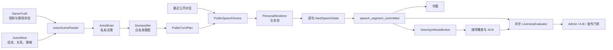

# 狼人杀虚拟玩家活人感系统重构开发设计

> 2026-07-21 状态说明：本文保留角色心智、关系记忆、发言规划、质量门禁与情绪表达的产品依据。speech-v2 第一至四期已经恢复；灰度分流、旧版本兼容、运行时开关和本文旧实施状态全部作废。当前唯一语音实施合同见[逻辑发言流 speech-v2：固定路径开发基线](./2026-07-20-logical-speech-streaming-v2-design.md)。

## 1. 文档信息

- 编写日期：2026-07-19；实施记录更新：2026-07-20
- 文档状态：活人感产品设计保留；语音交付、灰度和分期章节由固定 speech-v2 基线取代
- 适用模式：现有直播娱乐模式
- 适用范围：虚拟玩家角色心理、发言输入、表达策略、在线质量门禁、字幕、实时语音、恢复、Replay、质量评估、Admin 诊断与 Mobile 消费
- 当前实现状态：角色心智、关系记忆、ScenePacket、增量硬门禁、情绪 delivery、durable segment、SpeechPlaybackSession、连续 PCM、确定性 speech preempt、恢复、Replay、Admin 指标和 Mobile 字幕继续保留；灰度控制、Session 分流、旧协议兼容及终局 backlog 快进已删除。
- 产品北极星：完整音频时间线盲测中，“更像真人玩家在狼人杀现场自然接话”的偏好胜率

关联设计与证据：

- [直播娱乐模式规则、发言语音与可观测性升级设计](./2026-07-18-live-entertainment-rules-speech-voice-and-observability-design.md)
- [即时自爆、驱逐遗言与玩家事实推理修复设计](./2026-07-17-self-explosion-last-words-and-player-reasoning-remediation-design.md)
- [P2 对局质量与性能修复设计](./2026-07-14-p2-game-quality-performance-remediation-design.md)
- [P3 质量评估与可观测性修复设计](./2026-07-14-p3-quality-evaluation-observability-remediation-design.md)
- [隐私 Audience Contract v2](./2026-07-15-privacy-audience-contract-v2-remediation-design.md)
- [Live Voice 数据库设计](./2026-07-08-live-voice-streaming-db-design.md)
- [虚拟玩家发言真人感十轮实验复盘](../../speech-realism-study-summary.md)

本文是上述设计的增量合同，优先级如下：

1. 本文取代 2026-07-18 设计中第 6.1 节和第 6.3 节的首版缓冲、表现层重写方案，并扩展其 `SpeechOutputV2` 与语音演绎合同。
2. P2 中 `SpeechMission`、低新颖度、普通重复、口头禅和篇幅检查不再作为同步发布门禁，只保留为异步观察指标。
3. 规则冻结快照、合法行动、终局顺序、事实因果、恢复、隐私 Audience、Live/Replay 来源和语音 ACK 的既有安全合同继续有效，不能因追求活人感而放松。
4. 若本文与固定 speech-v2 基线冲突，以固定基线为准。本文涉及 experiment、variant、百分比、自动回退、`segments_v1` 或未来终局裁剪 backlog 的内容只保留为被否决的历史记录，不得据此实现。

## 2. 总体结论

当前系统的主要问题不是模型能力绝对不足，而是目标函数和执行链路共同把模型推向“分析报告”：

- 一次请求同时承担身份推理、策略选择、写稿、格式输出和语音演绎；
- Prompt 反复注入大量规则、事实、历史、任务和 JSON 示例；
- 每名玩家被要求引用事实、补充命题、分析票型或完成轮转任务；
- 公开发言整段缓冲，表现层告警会触发完整模型重写；
- 语音只有在全文接受后才开始合成，换人和首音频等待明显；
- 角色记忆偏事实摘要，没有持续的关系、情绪、承诺和未完成对话；
- 质量体系把“不重复”和“有新信息”当作真人感代理，但尚未证明二者与真人偏好正相关。

本次重构不再把重点放在“增加更口语的 Prompt”，而是将系统拆成五个责任明确的层次：

1. **GameTruth**：规则引擎继续掌管客观事实、合法行动和结算。
2. **ActorMind**：每个角色维护主观信念、关系、情绪、承诺和待回应问题。
3. **Turn Planning**：角色基于私人信息形成一个经过脱密的公开表达意图。
4. **Persona Rendering**：不接触私人事实的表达器把意图变成桌边口语，并逐句提交。
5. **Experience Delivery**：硬安全门、字幕、TTS、播放顺序和异步活人感评估各自独立。

目标不是让模型少犯所有错误，而是做到：

> 角色可以误判、犹豫、附和、嘴硬、撒谎和改口；系统不能泄露私人信息、执行非法动作、篡改确定事实或把未确认草稿送入 Live、Replay、字幕和语音。

## 3. 当前证据与基线

### 3.1 最近三局同步质量链路

最近三局只作为本次重构起点，不作为长期线上基线：

| 指标 | 当前值 | 口径 |
| --- | ---: | --- |
| 进入同步质量检测的公开发言 | 65 | 当前规则生效后的最近三局 |
| 发起模型重写 | 26 | 40.0% |
| 重写后仍耗尽 | 14 | 占检测数 21.5%；占重写数 53.8% |
| 重写额外耗时 P50 | 7.04 秒 | 只统计发生重写的 26 个条件样本 |
| 重写额外耗时 P95 | 10.85 秒 | 同上 |
| 重写耗时范围 | 2.78～12.39 秒 | 同上 |

初次触发原因：

- `repeated_debate_phrase`：18 次；
- `speech_too_long`：10 次；
- 两者同时出现：2 次。

以下原因必须继续分账，不能合并成一个笼统的“未发言率”：

- `provider_timeout`；
- `invalid_exhausted`；
- `hard_quality_exhausted`；
- `style_warning`；
- `self_explosion_cancelled`；
- `phase_advanced`；
- TTS 物化失败；
- 播放、跳过或 ACK 失败。

### 3.2 Prompt、角色与语音现状

当前普通辩论 Prompt 样本的中位长度约为 4770 字符，平均约为 4699 字符，最大约为 7927 字符。它最多同时包含公共规则、角色私有规则、身份与人设、公开状态、事实、自身历史、中断、残局、警长状态、资格、观察、模型记忆、硬状态、质量反馈、整轮讨论、发言任务、行动合同和 JSON 示例。

当前人物 Prompt 会同时组合性格、简介、背景、说话风格、策略、数值倾向、口头禅和示例消息。固定模板和示例容易被模型直接复刻；当前 12 名已发布玩家的基础语音 mood 均为 `neutral`，也不足以形成稳定而有差异的情绪轨迹。

当前公开发言虽然产生模型 delta，但质量链路先将整段输出扣留；实时语音也忽略未经最终接受的公开 delta，只在完整 `action_parsed` 到达后开始合成。因此当前链路更接近“整篇审稿后播报”，而不是即时对话。

### 3.3 十轮实验的边界

现有十轮实验没有得到可直接上线的“真人感增强 Prompt”。已经确认的收益主要来自收紧误杀边界和减少同轮任务碰撞，而不是增加口语化形容词、人物账本提示或更紧密的点名反驳。

因此本文不把以下代理指标直接视为活人感：

- 每句必须新增结构化命题；
- 点名或反驳越多越好；
- 同轮主题相似度越低越好；
- 角色固定口头禅出现越多越好；
- 仅由另一个模型给出更高主观分。

## 4. 目标、非目标与安全不变量

### 4.1 产品目标

1. 玩家像在听同一张桌上的人说话，而不是各自回答独立试题。
2. 不同玩家的差异来自反应方式、关系、情绪和表达节奏，而不只来自姓名、口头禅和音色。
3. 允许自然的短句、附和、停顿、反问、让步、犹豫、改口、局部重复和不完整表达。
4. 发言长度根据阶段、是否被点名、压力、活跃度和人物倾向变化。
5. 情绪有事件来源、跨轮连续并自然衰减，不在每轮重新回到中性。
6. 首个可听句和换人衔接明显快于当前版本。
7. 活人感能够通过冻结场景、人工盲测和完整对局 A/B 被复现，而不是依赖单局感受。

### 4.2 非目标

- 不让模型接管规则判定、候选集合、动作合法性、胜负或终局顺序；
- 不在局中纠正所有身份判断、规则理解、战术选择或主观归因；
- 不为了表演效果制造虚假的法官事实、票型、翻牌、死亡或历史发言；
- 不把原始 reasoning、ActorMind、私人 Prompt 或被拒绝草稿提供给普通观众、God View 或普通 Admin；
- 不在第一阶段训练或微调专用模型；
- 不在没有独立文本证据时先通过更换音色、提高 temperature 或增加情绪强度宣称问题已解决；
- 不在同一局按单句随机切换实验版本；
- 不改写历史 Live 事件、Replay、语音或已完成对局。

### 4.3 不可交换的安全不变量

以下指标不能被任何活人感收益抵消：

- 私密信息泄漏为 0；
- 非法动作和非法目标为 0；
- 错误改变胜负、终局顺序或状态机为 0；
- 被拒草稿进入 Live、Replay、字幕或 TTS 为 0；
- 新版客户端和旧 Replay 均保持 audience fail-closed；
- 运行中、恢复和 Replay 使用开局冻结版本，不读取 Admin 最新配置；
- `sourceEventId` 继续表示播放激活边界；
- `lastSourceEventId` 继续只表示语音覆盖范围、Replay 和去重边界，不能用来推迟播放开始；
- 每个 utterance 必须形成终态播放 observation：连接正常时由客户端报告 completed/interrupted/skipped/failed；断线或超时时由服务端记录 connection_lost/ack_timeout，任何状态都不能阻塞后续语音或改变游戏状态。

## 5. 术语与责任边界

| 名称 | 含义 | 可否包含私人事实 |
| --- | --- | --- |
| `GameTruth` | 引擎确定的规则、状态、候选、公开事实和私人角色事实 | 按原有 audience 分区 |
| `ActorMindV1` | 单个角色的信念、关系、情绪、承诺和未完成对话 | 可以，仅限该角色私有运行态 |
| `ActorScenePacketV1` | 给角色规划器的紧凑上下文 | 可以，只含该角色依法可见内容 |
| `PrivateTurnDecisionV1` | 角色基于身份和策略形成的私有决策 | 可以，不得公开或交给 TTS |
| `PublicTurnPlanV1` | 从私有决策脱密后的结构化表达意图 | 不可以 |
| `PublicSpeechSceneV1` | 给公开表达器的场景包 | 不可以 |
| `PersonaRenderer` | 将公开意图变成口语文本 | 不接触真实身份、夜间秘密和私人 reasoning |
| `speech_segment_committed` | 通过硬安全门、可进入字幕和 TTS 的领域语句；首版落库为 v2 committed delta | 公开或显式 God View audience |
| `HardSpeechGate` | 只检查隐私、确定事实、结构完整性和系统残片 | 同步、确定性、低延迟 |
| `LivenessEvaluator` | 评估回应性、口语、人设、情绪和节奏 | 异步，不参与发布 |

标识语义继续沿用现有合同：`action_id` 标识一次逻辑行动，同一行动的 Provider 重试共用；`request_id` 只标识某一次 Provider 尝试。segment、恢复 receipt、质量统计和语音去重不得混淆两者。

所有跨 run 的事件引用统一使用：

```text
EventCoordinateV1
  source_run_id
  source_event_id
```

不得把裸 `event_id` 当作 Session 全局坐标；恢复子 run 会重新产生自己的事件序列。

## 6. 目标架构



### 6.1 一次公开发言的执行顺序

1. 引擎确定当前行动者、阶段、合法边界和 audience。
2. `ActorMindReducer` 消费该角色自上次处理后依法可见的新事件。
3. `ScenePacketBuilder` 生成 `ActorScenePacketV1`。
4. `ActorBrain` 生成私有决策；`TurnPlanDeclassifier` 只允许白名单字段进入 `PublicTurnPlanV1`。
5. `PublicSpeechSceneV1` 只拼接公开事实、最近对话、人物表达倾向和脱密后的计划。
6. `PersonaRenderer` 以文本流输出；服务端按完整句或完整短分句形成候选 segment。
7. 每个候选 segment 通过 `HardSpeechGate` 后，才形成领域 `speech_segment_committed`，并按第 13 节映射为 v2 committed delta 持久化和发布。
8. 字幕和 TTS 只消费 committed segment，不消费原始模型 delta。
9. 全部 committed segment 拼成该次行动唯一有效的 `say`，再写入 `action_parsed` 和 ActionLog。
10. 风格、重复、长度分布、回应性和情绪连续性异步评估，不撤回已经提交的文本。

### 6.2 规划与语音并行

两阶段不应额外制造换人等待：

- 上一位玩家的全文一旦文本提交完成，下一位的 `ActorBrain` 即可开始规划，不必等待上一位音频播放结束；
- 规划输入包含上一位已经提交的全部文本，因此不是基于过期草稿的猜测；
- 上一位音频播放期间完成计划，轮到下一位时只需运行轻量表达器并提交首句；
- 第一位发言者或规划尚未完成时，按总 deadline 等待，不伪造台词；
- 不允许用上一位尚未 committed 的原始 delta 规划下一位，避免错误引用被拒草稿。

## 7. 活人感版本快照与实验归因

### 7.1 `LivenessExperienceSnapshotV1`

每局在创建 `game_session` 时冻结：

```text
LivenessExperienceSnapshotV1
  schema_version = 1
  experience_revision
  scene_packet_version
  actor_mind_version
  turn_policy_version
  renderer_version
  quality_gate_version
  speech_stream_version
  affect_mapping_version
  prompt_revision
  feature_modes
    style_gate = async_observe
    actor_mind = read
    sentence_stream = committed_segments_v2
    affect_delivery = on
    tts_prefetch_depth = 1
    voice_preempt = deterministic
```

持久化建议：

- `game_sessions.liveness_experience_revision`；
- `game_sessions.liveness_experience_snapshot`；
- `live_runs` 复制上述字段，恢复 run 必须与父 Session 完全一致；
- Replay 元数据保存同一固定快照摘要。

项目不兼容旧记录；字段缺失或模式不符时 fail-closed。

### 7.2 实验单位

关系、情绪、Prompt 和后续玩家输入均会跨轮传播，因此：

- 在线 A/B 必须按完整 `game_session` 分流；
- 断点恢复、子 run 和同一 Session 的后续尝试继承原 variant；
- 只有冻结 checkpoint 的单轮文本对比，以及相同确认文本的 delivery/TTS 对比，允许按单条发言配对；
- 动态 A/B 一旦生成不同公开台词，后续分支不再视为严格配对样本。

### 7.3 提前规划有效性栅栏

规划可以与上一位音频播放并行，但任何计划在生效前必须重新验证：

```text
TurnPlanFenceV1
  action_id
  phase_instance_id
  session_timeline_watermark = EventCoordinateV1
  active_roster_hash
  public_stage_cursor
  terminal_revision
```

如果上一位文本提交后又发生自爆、终局、停止请求、行动者变化、阶段游标推进或存活名单变化，旧计划必须确定性丢弃，记录 `late_result_discarded`，不得更新 ActorMind、启动 Renderer 或消耗发言机会。

### 7.4 正常回滚与紧急覆盖

- 正常回滚只影响新创建的 Session；运行中游戏继续使用开局冻结快照。
- 紧急安全覆盖只能关闭可选表现能力，例如禁用 ActorMind Prompt 投影或退回全文硬门确认；不得更换规则、候选、行动或已提交事实。
- 紧急覆盖必须写入 `experience_override_applied` 私有审计事件，记录原 revision、effective revision、原因和时间。
- 关闭句级流式时退回“全文硬安全确认后发布”，不能顺带恢复风格重写。

## 8. `ActorMindV1` 角色心理合同

### 8.1 数据结构

`ActorMindV1` 使用有界结构和整数刻度，避免自由文本无限增长以及浮点恢复漂移：

```text
ActorMindV1
  schema_version = 1
  actor
  revision
  last_processed_source = EventCoordinateV1
  beliefs[target]
    stance = trusted | lean_good | unknown | lean_wolf | suspected
    confidence = 0..100
    evidence_sources[0..6] = EventCoordinateV1
  relationships[target]
    trust = -100..100
    hostility = 0..100
    pressure = 0..100
    unresolved_thread_ids[0..4]
  affect
    valence = -100..100
    arousal = 0..100
    confidence = 0..100
    stress = 0..100
    last_trigger_source = EventCoordinateV1
  commitments[0..12]
    commitment_id
    kind = role_claim | vote_intent | trust_claim | suspicion_claim | promise
    target
    source = EventCoordinateV1
    status = active | changed | fulfilled | broken
  open_threads[0..8]
    thread_id
    source = EventCoordinateV1
    source_actor
    kind = direct_question | accusation | unresolved_claim | promised_followup
    urgency = 0..100
  recent_behavior
    speech_acts[0..6]
    length_bands[0..6]
    opening_fingerprints[0..4]
```

不得在 `ActorMindV1` 中保存：

- 大段自然语言人物总结；
- 完整 Prompt；
- 原始 reasoning；
- 被拒绝草稿；
- 其他玩家依法不可见的私人事实；
- 未绑定事件来源的“某人说过”文本。

### 8.2 更新来源

`ActorMindReducer` 只消费当前角色依法可见的事件，并按 `EventCoordinateV1` 幂等处理：

- 被某人直接点名或质疑：增加对应 `pressure`，创建或更新 open thread；
- 被某人投票：降低 trust、增加 hostility；
- 某人公开支持自己的判断：增加 trust 和 confidence；
- 自己公开改票或改身份声明：更新 commitment 状态；
- 进入 PK、遗言、生死轮或终局候选：提高 stress 和 arousal；
- 长时间没有新刺激：在轮次或阶段边界按确定性规则衰减，不使用墙上时钟；
- 私人查验、队友信息和夜间行动只进入依法可见角色的私有 belief，不直接进入公开计划文本。

低显著事件由确定性 reducer 更新；只有需要归纳复杂公开对话时才允许模型提出结构化 `ActorMindDeltaV1`。模型增量必须满足：

- 每项更新绑定合法 `EventCoordinateV1`；
- 引用对象存在且当时可见；
- 数值变化受单事件上限约束；
- reducer 可以拒绝、裁剪或去重；
- 不得用“未发言”推导支持、反对或回避立场。

### 8.3 情绪与公开演绎

公开语音可以受到角色私人心态的有界影响，这是狼人杀中可观察的“状态感”，但不能传递私人事实本身：

- TTS 只获得受控的 mood、intensity、pace 和白名单演绎词；
- TTS 不获得触发原因、角色名、座位、身份、阵营、夜间动作和 reasoning；
- `PublicAffectProjection` 将私有 affect 压缩为有限枚举，不携带事件因果；
- 私人狼人讨论和 God View 语音继续使用各自 audience，不能复用公开投影中的私密文本。

### 8.4 持久化与恢复

`ActorMind` 是私有运行态，不直接加入普通 `Player.to_dict()` 公共投影：

- 新增私有 `actor_mind_snapshots`，以 `(session_id, actor)` 为键保存当前规范化状态、revision、last processed coordinate 和 hash；
- checkpoint schema 同时升级，在 `private_runtime.actor_minds_at_round_start` 保存轮次起点副本，用于自包含恢复和交叉校验；
- 每个已缓存模型动作和私有 speech receipt 保存对应 `actor_mind_delta` 与 before/after revision；
- 某次行动产生的 ActorMind delta 只在 plan/receipt 被接受后应用，并与 receipt revision 更新原子提交；迟到、失效、取消或被拒计划不得改变心理状态；
- 恢复时从轮次起点快照按缓存动作顺序重放增量；
- 相同事件序列、缓存响应和版本必须得到字节等价的规范化 ActorMind；
- 完成对局清空 checkpoint 后，`actor_mind_snapshots` 继续作为内部最终快照；普通 Live、Replay、Mobile、God View 和普通 Admin 投影全部剔除；
- 只发布不含内容的私有审计坐标，例如 actor、revision、EventCoordinate 和 before/after hash。

`actor_mind_snapshots` 只允许引擎、恢复和受控质量 Worker 读取，随 `game_sessions` 级联删除；首版保留期与 Session 一致，不增加单独长期画像库。

## 9. `ScenePacket` 与 Prompt 合同

### 9.1 双包分区

不能把一个同时含有身份秘密和公开表达要求的大 Prompt 直接交给发言模型。系统必须构建两个不同的数据包：

```text
ActorScenePacketV1                 PublicSpeechSceneV1
  actor identity                    public actor name
  actor-visible private facts       compact persona style
  relevant public facts             public state boundary
  ActorMind                         recent committed turns
  legal action boundary             relevant public facts
  recent committed turns            public stimulus
  current pressure                  PublicTurnPlanV1
```

`ActorScenePacketV1` 只进入 ActorBrain。`PublicSpeechSceneV1` 只进入 PersonaRenderer，绝不包含真实身份、队友、夜间结果、私人 reasoning 或 ActorMind 的事件原因。

### 9.2 `PublicSpeechSceneV1` 初始预算

| 内容 | 初始上限 |
| --- | ---: |
| 稳定人物表达卡 | 250 字符 |
| 当前硬场景与合法边界 | 350 字符 |
| 最近已提交原话 | 3 条 |
| 更早公开讨论摘要 | 400 字符 |
| 相关公开事实 | 6 条 |
| 自己近期公开承诺/立场 | 3 条 |
| 当前具体刺激 | 1 个主刺激、1 个次刺激 |
| 完整 renderer Prompt | 2200 字符目标上限 |

超过预算时按确定性顺序裁剪：旧自我历史、低相关事实、次刺激、更早摘要。以下内容永不因预算删除：

- 当前行动和阶段；
- 依法可见且影响当前行动的硬规则；
- 当前存活、资格和候选边界；
- `PublicTurnPlanV1`；
- 被选作回应依据的原始 committed event 坐标。

### 9.3 相关性与防编造

- “回应某人”必须绑定其真实存在的 committed `EventCoordinateV1`；
- “你刚才说过”只能引用 `recent_turns` 或已检索的公开历史；
- 公开事实、历史、观察和总结先按 fact ID / EventCoordinate 去重，再按当前目标检索；
- 不把完整本轮 debate、全部 observations 和最近 8 条总结无差别重复注入；
- 不要求 renderer 输出 reasoning、复述规则或解释 JSON 格式；
- 固定规则进入系统前缀或 Provider 可缓存部分，结构约束由适配器负责。

## 10. `PublicTurnPlanV1` 与对话行为策略

### 10.1 脱密后的计划结构

```text
PublicTurnPlanV1
  schema_version = 1
  plan_id
  action_id
  fence
  stimulus_sources[0..2] = EventCoordinateV1
  response_targets[0..2]
  primary_speech_act
  secondary_speech_act optional
  social_goal = persuade | probe | defend_self | protect_target | shift_pressure | build_alliance | signal_uncertainty | close_turn
  public_points[0..3]
    kind = suspect | trust | defend | challenge | vote_intent | change_mind | ask
    target optional
    strength = low | medium | high
    basis_public_sources[0..3] = EventCoordinateV1
  must_reference_public_fact_ids[0..2]
  length_band = brief | normal | extended
  affect_impulse = restrained | steady | sharper | softer
```

该计划只允许枚举、合法玩家引用、公开 EventCoordinate 和 fact ID，不允许自由文本私人理由。狼人可以选择 `defend`、`redirect` 或 `deceive` 类社交目标，但 Renderer 不知道其真实身份和“为什么要保护某人”。

### 10.2 初始发言动作集合

- `respond`：直接接上一位或被点名者；
- `agree`：简短赞同或补一句理由；
- `challenge`：针对具体说法提出质疑；
- `ask`：追问未回答问题；
- `defend`：被质疑后的自我辩护；
- `hedge`：表达保留、暂不站死；
- `change_mind`：承认立场变化；
- `redirect`：把焦点转向另一处矛盾；
- `defuse`：缓和冲突或降低语气；
- `tease`：低频、无攻击性的轻微玩笑；
- `vote_only`：只报票口和一个简短依据；
- `brief_pass`：明确表示暂无新补充，但仍产生一条短发言；
- `summarize`：仅在确有收束价值时使用，不再按座位强制。

选择优先级：直接点名或高压事件 > 未回答问题 > 关系变化 > 最近一位玩家 > 自主提出新判断。每次只设一个主目标，最多一个次目标。

### 10.3 长度分布

保留现有动作字符硬上限，但不再把上限当目标长度。普通辩论初始目标分布：

- `brief`：20～50 字，约 45%；
- `normal`：51～100 字，约 45%；
- `extended`：101～160 字，约 10%。

警上竞选、PK 和遗言使用单独分布并提高 `normal/extended` 权重，但仍不得每个人都贴近上限。最终分布由 talkativeness、阶段压力、是否被点名和 recent behavior 调整。

### 10.4 人物差异

第一版复用现有角色档案中的 speaking style、risk、bluff、trust、leadership、talkativeness 和基础 delivery，不立即新增一组难以校准的性格列。处理规则：

- 固定 catchphrase 只作为低频可选素材，不进入必须覆盖要求；
- example messages 不原样注入 Renderer，先转成句式、节奏和互动偏好；
- “结论先放、一二三”“共识、分歧、待验证”等固定报告结构不再作为强制模板；
- recent behavior 对连续相同开头、动作和长度降权，但不通过同步重写惩罚结果；
- 只有盲测证明现有字段不足时，再讨论版本化 `expression_profile`。

## 11. 文本生成与失败语义

### 11.1 ActorBrain 与 PersonaRenderer

`ActorBrain` 可以复杂，但只输出结构化决策；`PersonaRenderer` 应轻量、可流式，并只输出公开说话文本。

目标合同：

- ActorBrain 使用现有主模型或策略模型，输出 `PrivateTurnDecisionV1`；
- Declassifier 将其转换为 `PublicTurnPlanV1`；
- PersonaRenderer 使用同模型的快速配置或独立低延迟模型；
- Renderer 的领域输出是纯文本流，不要求再次生成 reasoning 和 delivery；
- 对只支持 JSON schema 的 Provider，由适配器增量解析 `say` 字符串，但领域层仍只接收文本字符；
- delivery 由 ActorMind、人物基础风格和 speech act 确定性编译，不由 Renderer 自由生成。

### 11.2 失败与部分提交

| 情况 | 处理 |
| --- | --- |
| 规划超时且没有公开文本 | 按现有预算语义记为 provider timeout，不伪造玩家台词 |
| Renderer 在首句前失败 | 在剩余 deadline 内最多重试一次；仍失败则 `player_did_not_speak` |
| 首句硬门失败 | 丢弃该句；没有 committed segment 时允许一次硬重试 |
| 已提交一部分后 Provider 失败 | 保留已提交文本，结束为 `partial_provider_failure`，不称为“未发言” |
| 后续句硬门失败 | 丢弃该句及后续草稿，结束为 `partial_hard_gate_stop`，不得撤回前句 |
| 阶段被自爆或终局中断 | 停止生成；已 committed 文本保留，未 committed 草稿丢弃 |
| 文字已提交但 TTS 失败 | 文本、字幕和对局继续；语音独立记失败，不改写台词 |

任何自动闭合或截断只能从模型已经生成的文本中选取完整句或完整短分句，不能补写新的第一人称内容。

## 12. 在线质量门禁重构

### 12.1 同步硬门

同步门禁只处理确定性、可解释问题：

| code | 说明 | 处理 |
| --- | --- | --- |
| `invalid_public_speech` | 空输出、损坏编码、无法发布的结构 | 首句前可硬重试一次 |
| `private_information_leak` | 公开输入边界或结构化哨兵证明泄漏 | 立即拒绝并触发安全告警 |
| `objective_vote_tally_mismatch` | 确定票数与已经公开的引擎票型直接冲突 | 拒绝当前 segment |
| `objective_reveal_mismatch` | 声称已公开翻牌但实际没有 | 拒绝当前 segment |
| `objective_alive_state_mismatch` | 对确定存活/死亡状态作直接反事实陈述 | 拒绝当前 segment |
| `temporal_information_leak` | 用当时尚未公开的信息描述过去动作 | 拒绝当前 segment |
| `nonexistent_prior_public_claim` | 明确声称某人此前说过不存在的内容 | 拒绝当前 segment |
| `system_artifact` | Prompt、错误栈、占位符、JSON 残片等系统文本 | 拒绝当前 segment |

这些检测只约束可验证的事件和状态，不扩展为“系统替模型判断谁更合理”。

### 12.2 不同步阻断的内容

以下内容只异步记录：

- `repeated_debate_phrase`；
- `low_proposition_novelty`；
- `unsupported_group_agreement`；
- 未完成 `SpeechMission`；
- 与其他玩家表达相似；
- 普通口头禅或模板化开头；
- 角色判断错误、队友判断错误和主观票型解释；
- 对公开规则的错误理解，但未改变引擎行动与结算；
- 犹豫、附和、改口、撒谎和战术失误。

### 12.3 长度处理

- 优先通过 Renderer 输出预算和 `length_band` 控制长度；
- 达到动作字符上限时，服务端只提交剩余预算内最后一个完整句或完整短分句；
- 超长不再次调用模型；
- 被裁掉文本不进入 Live、Replay、字幕、TTS 或后续玩家上下文；
- `speech_too_long` 继续作为异步诊断码，记录目标、原长度和接受长度。

### 12.4 日志拆分

ActionLog 新增或替换为：

```text
speech_generation
  scene_packet_version
  scene_packet_chars
  turn_plan_id
  renderer_version
  committed_segment_count
  final_status
hard_speech_gate
  version
  rejected_segment_count
  codes[]
  retry_count
liveness_observation
  version
  warning_codes[]
  length_band
  actual_chars
  response_sources[] = EventCoordinateV1
  first_clause_commit_ms
```

旧 `speech_quality_*` 字段只为 legacy 读取保留；新版本不能继续把 style warning 计为 hard exhaustion。日志永不保存被拒绝草稿正文。

## 13. 已提交语句事件合同

### 13.1 为什么不能直接播放现有 delta

现有 `model_response_delta` 是模型草稿流，可能随后因格式、隐私、确定事实或阶段中断被拒绝。把它直接接到字幕或 TTS 会让拒绝稿不可撤回地公开。因此新版必须新增“已提交”语义，原始 delta 不再作为公开事实源。

### 13.2 领域事件与兼容落库

领域层新增 `speech_segment_committed`，但首版 durable/public Live event 复用现有 `model_response_delta`，通过 `schema_version=2` 和 `commit_state=accepted_segment` 明确它已经不可撤销。这样可以复用现有 Live 持久化、隐私投影、SSE 和客户端 delta 消费链路，同时不会把历史的原始 token delta 误当成已确认文本。

```text
model_response_delta
  schema_version = 2
  action_id
  request_id
  generation_stage = renderer
  field = say
  is_public = true
  commit_state = accepted_segment
  speech_id
  segment_id
  segment_index
  delta
  visible_text
  is_final_segment
  quality_gate_version
  presentation_id
```

约束：

- `speech_id = "sp_" + sha256("speech-v1:{session_id}:{action_id}:{speech_stream_version}")[:24]`，在第一次 Provider 调用前与 receipt 主记录原子创建；恢复和子 run 只能读取既有值，不能按 request_id 或 run_id 重新生成；
- `segment_id` 对 `speech_id + segment_index + text_hash` 稳定生成；
- `presentation_id` 对 `speech_id + segment_index + text_hash` 唯一稳定生成，不能由同一 `speech_id` 的多个 segment 共用；`speech_id` 才是整次发言的分组键；
- 同一 `speech_id` 的 `segment_index` 从 0 连续递增；
- canonical Live event、对应 public/God View projection、私有 segment receipt 和 voice job 在同一事务持久化成功后，才允许订阅者、字幕和语音消费；
- 同一 `segment_id` 重放必须幂等；
- `visible_text` 是唯一可公开的该段文本，`delta` 为旧客户端提供相同内容；原始 Provider token 不公开；
- audience 继续经过现有 privacy projection fail-closed 校验；
- `voice_snapshot` 可以存在于 canonical payload，但不向普通公开投影透出；它冻结 speaker、delivery、context、audience 和映射版本。
- legacy `model_response_delta` 没有 `commit_state=accepted_segment` 时仍按历史语义读取，绝不能创建新版语音任务。

可见性矩阵：

| 产生来源 | canonical visibility | `player_public` | `spectator_god_view` | 语音任务来源 |
| --- | --- | --- | --- | --- |
| 白天、警上、PK、遗言等公开发言 | public | committed segment | committed segment | 各 audience 的合法公开投影 |
| 狼人私聊和私密最终票 | private | 不可见 | 仅显式 God View committed segment | 只从 God View 投影创建 |
| ActorBrain、私人 reasoning、未提交 Renderer 草稿 | private internal | 不可见 | 不可见 | 永不创建 |

当前 private action 只允许最终 `action_parsed` 的旧投影必须升级；不能只增加 payload 字段白名单。每个 private v2 segment 都要分别验证 Public 隐藏、God View 可见和 job audience 正确。

新增字段必须同步进入 privacy projection 的已知字段白名单和正反向投影测试。若未来确认所有客户端均已迁移，再评估是否把 durable event type 独立为 `speech_segment_committed`；首版不为命名纯洁度扩大迁移面。

### 13.3 最终 `action_parsed` 与 `speech_turn_receipt`

发言结束时继续发布原有 `action_parsed`。`speech_turn_receipt` 不能等到全文结束才首次保存：逻辑行动创建时先写 receipt 主记录，每个 segment 与其 Live event 同事务追加，结束时只负责把状态改成终态。完整 receipt 同时进入私有运行态；ActionLog 只保存剔除 ActorMind 增量后的安全子集。

```text
action_parsed
  schema_version = 1
  speech_id
  speech_stream_mode = segments_v1
  segment_count
  speech_status = spoken | partial | interrupted
  visible_result.say

speech_turn_receipt
  action_id
  planner_request_id
  renderer_attempts[]
    request_id
    outcome
  accepted_renderer_request_id
  scene_packet_hash
  status
  segments[]
    segment_id
    segment_index
    text
    source_run_id
    source_event_id
    presentation_id
  final_text
  delivery_snapshot
  actor_mind_revision_before
  actor_mind_revision_after
  actor_mind_delta  # 只进入私有 checkpoint，ActionLog 安全子集不含此字段
```

ActorBrain 和 PersonaRenderer 的全部 lifecycle 事件必须携带同一个 `action_id`，并通过 `generation_stage=planner|renderer` 区分；每次 Provider 尝试仍使用唯一 `request_id`。segment 的 `request_id` 必须指向实际产生该文本的 Renderer 尝试。

- `visible_result.say` 等于全部 committed segment 按序拼接；
- `RoundState.debate.message`、ActionLog、Replay 最终公开发言必须与其完全一致；
- 新客户端不得把 `action_parsed.say` 再渲染或再合成一次；
- 旧客户端继续消费 v2 event 中的 `delta`，并使用最终 `action_parsed` 收尾；
- 新版本不向公开流发送原始 Provider token；legacy 对局仍按原事件读取；
- 没有 Live events、只能从 Replay payload 重建时，使用 ActionLog 的安全 `speech_turn_receipt` 子集确定性恢复 segment；只有 `legacy-v0` 且不存在任何 v2 committed event/receipt 痕迹时，字段缺失才允许生成旧式整段 `action_parsed`。任何已有 v2 committed segment 却缺少 durable receipt 的记录都属于完整性错误，必须 fail closed。
- 新版 `action_parsed` 不再创建整篇重复语音任务；只有 legacy 或无 committed segment 的非流式发言继续从 `action_parsed` 物化整段语音。

新增私有持久化：

```text
speech_turn_receipts
  session_id + action_id primary key
  origin_run_id / latest_run_id
  actor / round / phase / action
  experience_revision
  plan_id / fence / scene_packet_hash
  planner_request_id
  renderer_attempts
  accepted_renderer_request_id
  status = planning | rendering | partial | complete | interrupted | failed
  final_text
  delivery_snapshot
  actor_mind_revision_before / after
  actor_mind_delta

speech_turn_segments
  session_id + action_id + segment_index primary key
  segment_id unique
  request_id
  source_run_id / source_event_id
  text / text_hash
  presentation_id
```

两表均为内部私有表，随 `game_sessions` 级联删除，不进入普通 API。进程在任意 segment 后崩溃时，恢复从 receipt 表和 canonical committed events 交叉核对；任何一侧缺失或 hash 不同都 fail closed，不能重新公开一份不同文本。跨 run 的恢复和 Replay 始终使用 `(source_run_id, source_event_id)` 找回原 segment，不能只凭 Session 内 event ID。

推荐 canonical／内部生命周期写入顺序：

```text
action_requested
model_request_started
model_response_delta(v2 accepted segment 0..N)
model_attempt_completed
model_response_received
action_parsed
state_updated
```

这里描述的是服务端真源的先后关系，不等于 Public 或 God View 的投影清单。`model_attempt_completed` 及其 Provider 尝试细节始终是内部私有信息，对外投影必须省略；`model_request_started`、`model_response_received` 是否可见沿用现有 audience-safe 投影，以兼容客户端的“正在思考／请求完成”状态，但其公开载荷不得包含私有 Prompt、重试细节或原始响应。Public／God View 只能看到各自 audience 允许的状态、committed segment 和 `action_parsed`，不得为还原这条内部顺序扩大事件 audience。

### 13.4 中断事件

若阶段中断发生在首句前，沿用现有 `public_action_cancelled` 和 action cancellation；若已有 segment committed，不复用这个“整次行动从未播出”的旧语义，改为新增 `speech_turn_interrupted`：

```text
speech_turn_interrupted
  schema_version = 1
  speech_id
  speech_status = interrupted
  visible_text
  committed_segment_count
  interruption_mode = sentence_boundary
  reason = self_explosion | terminal_pending | phase_advanced | stop_requested
  trigger_source optional = EventCoordinateV1
  terminal_revision optional
```

首句前自爆继续是普通 canceled，无发言、无语音，也不发布 `player_did_not_speak`。首句后自爆只能在完整句边界停止；已提交语句进入公开历史和后续玩家上下文，未提交草稿不写入任何公开存储。产品不能同时要求“首句真正流式”和“自爆取消时此前一个字都没说过”。

只要 `committed_segment_count > 0`，引擎就必须用已提交文本写入 RoundState/ActionLog；不再为这次已经开口的 speech 发布旧 `public_action_cancelled`。阶段取消仍然生效，但不能把观众已经听见的内容从历史和后续玩家 Prompt 中抹掉。

事件顺序按原因拆分：

- 自爆或普通阶段取消：已提交 segment → 确定性 trigger event → `speech_playback_preempted` → 派生 WebSocket `voice_preempt` → `action_parsed(speech_status=interrupted)` → `speech_turn_interrupted`；
- 终局候选出现：先停止 Renderer 并固化 partial → `action_parsed(speech_status=interrupted)` → `speech_turn_interrupted(reason=terminal_pending, terminal_revision=...)` → `speech_playback_preempted` → 派生 WebSocket `voice_preempt` → 终局结算事件 → `game_completed`；
- `game_completed` 必须继续是该 run 的尾事件，任何 speech、voice 或 observation 事件都不得追加到它之后。

所有规则性中断都必须先提交 `speech_playback_preempted`，再发送对应 `voice_preempt`；如果持久化失败，不能只向当前连接发送一次不可重放的截断命令。上述顺序同时约束自爆、阶段取消和终局路径。

`trigger_source` 和 `terminal_revision` 至少一个存在；普通事件使用前者，尚未发布终局事件的 terminal pending 路径使用后者。

`speech_turn_interrupted` 是新增公开事件类型，必须进入 privacy projection 的明确 allowlist；旧客户端忽略它并仍能从 partial `action_parsed` 看到已说内容，新客户端额外显示“发言被打断”。

## 14. TTS、播放与情绪演绎

### 14.1 `AffectDeliveryMappingV2`

最终 delivery 由以下输入确定性编译：

- 人物冻结的基础 mood、intensity、pace、dialect；
- `ActorMind.affect` 的公开投影；
- `PublicTurnPlan.primary_speech_act`；
- 当前阶段压力和 segment 位置；
- 上一 segment 的 delivery，用于限制无因跳变。

输出仍使用现有受控枚举，`context_texts` 继续由后端模板生成。自由文本 instruction 不得包含事实、座位、玩家、身份、动作或 reasoning。

初始稳定性规则：

- 相邻普通事件不得从 low/calm 直接跳到 high/excited，除非存在高显著触发；
- 同一发言内 segment 只允许小幅变化；
- 情绪按事件和阶段衰减，不按随机数每句重新抽取；
- 高压力不等于所有人都大声、快速；人物基础风格决定外显程度。

### 14.2 单一语音生产者

引入 `VoiceSynthesisBroker` 作为唯一 TTS 生产者：

- 每个 committed segment 创建一个幂等物化任务；
- Broker 只合成一次，将相同音频块同时写入数据库并 fan-out 给直播 WebSocket；
- 直播断线不取消后台物化；重连读取已存在音频块；
- 直播服务不再在无法认领持久化任务后自行重复调用 TTS；
- TTS 会话预热或复用只能在 Provider 合同验证后启用。

数据模型采用加法兼容：

- `voice_utterances` 增加 `action_id`、`speech_id`、`segment_id`、`segment_index`、`segment_final`；
- 一个公开发言可对应多个按序的 segment utterance，使用同一 `speech_id` 分组，但每个 segment 使用唯一 `presentation_id`；
- `voice_materialization_jobs.source_event_id` 指向 `commit_state=accepted_segment` 的 v2 delta 事件；
- `tts_request_source` 固定为 `committed_speech_segment`；
- legacy 的整段 `action_parsed` utterance 保持可读，不要求历史拆段。

每个任务执行时只读取 segment commit 时冻结的 voice snapshot，不能读取后来修改的玩家档案、音色或 delivery 配置。新版 segment voice 也不能沿用 legacy“同 request_id 扩大 source range”的合并逻辑。

### 14.3 合成队列与播放队列

ACK 继续承担可靠播放回执，但不再阻止下一段或下一位玩家开始合成：

- synthesis queue：允许预取下一条，首版深度固定为 1；
- playback queue：严格按 committed event 顺序播放；
- ACK：只汇报最终播放状态，不作为下一条合成的开关；
- 客户端连接正常时，静音、跳过、打断和解码失败都必须形成终态 ACK；WebSocket 已断时由服务端形成 `connection_lost` observation；
- ACK tracker 必须保留暂时不属于当前 utterance 的乱序 ACK，不能取出后直接丢弃。

新版 ACK：

```text
voice_played
  utterance_id
  speech_id
  status = completed | interrupted | skipped | failed
  played_ms
```

服务端继续兼容只有 `utterance_id` 的 legacy ACK。

新增低敏私有 `voice_playback_observations`：

```text
voice_playback_observations
  playback_session_id + utterance_id primary key
  speech_id
  server_terminal_status = acked | connection_lost | ack_timeout
  client_status optional = completed | interrupted | skipped | failed
  played_ms optional
  first_observed_at / updated_at
```

客户端 ACK 幂等写入 `client_status`；服务端断线或超时先写 `server_terminal_status`，重连后的迟到 ACK 可以补充 client status，但不能删除原服务端观测。effective status 优先使用合法 client status，否则使用 server status。记录不含台词、用户标识或私人事实，首版保留 30 天后聚合删除，并随 Game Session 删除；ACK timeout 只释放播放队列，不改变对局。

### 14.4 播放激活与 Replay 边界

- 每个 segment utterance 的 `sourceEventId` 是该 segment 允许开始播放的 committed 事件；
- `lastSourceEventId` 表示该音频覆盖到的最后事件，只用于队列元数据、Replay 和去重；
- 同一 `speech_id` 的 segment 可以提前合成，但不得在自己的 `sourceEventId` 到达前播放；
- 客户端仍以唯一 `presentation_id` 做已消费去重；整次发言的 UI 聚合只看 `speech_id`，不能把去重键改成共享 presentation ID；
- Mobile director 的 hold 仍以当前应播放的 `sourceEventId` 和播放终态为准；
- Replay 按 `speech_id + segment_index` 恢复顺序，并保持与 Live 相同的文本来源。

### 14.5 确定性打断

首版只支持高价值、规则确定的打断：

- 狼人自爆；
- 终局即将提交；
- 当前阶段被确定性取消；
- 用户主动跳转或快进属于客户端本地打断，不写入全局 Replay 事实。

协议：

```text
voice_preempt
  speech_id
  utterance_id optional
  reason
  replacement_source optional = EventCoordinateV1
```

规则性打断必须先持久化 canonical 事件，再派生 WebSocket 命令：

```text
speech_playback_preempted
  schema_version = 1
  speech_id
  reason = self_explosion | terminal_pending | phase_advanced
  trigger_source optional = EventCoordinateV1
  terminal_revision optional
  cut_after_segment_index
  audience
```

客户端在 80～150ms 内淡出当前 PCM，清理该 speech 尚未播放的 segment，并回传 `status=interrupted`。Replay 以 `speech_playback_preempted` 为全局真源，在相同时间线坐标执行打断；不尝试复制某个观看连接实际听到的毫秒数。

`voice_played completed/interrupted/skipped/failed` 是单个连接或观看会话的播放 observation，不是全局 Replay 事实。它可以带 `playback_session_id` 进入低敏诊断或聚合指标，但不能覆盖 canonical 音频、改变游戏状态或决定历史 Replay 截断。

非语义的吸气、轻笑、叹气或多人抢话不进入首版范围；待主链稳定后，可作为独立 reaction lane 评估，不能携带事实或改变行动。

## 15. 持久化、恢复与 Replay

### 15.1 持久化真源

| 数据 | 真源 |
| --- | --- |
| 客观规则和状态 | 冻结 rule snapshot、GameState、RoundLog |
| 角色私有心理 | `actor_mind_snapshots` + checkpoint 私有副本 |
| 公开有效文本 | v2 `model_response_delta(commit_state=accepted_segment)` Live events |
| 行动生成收据 | 私有 `speech_turn_receipts/speech_turn_segments`，ActionLog 安全子集 |
| 行动最终摘要 | `action_parsed` |
| 语音 | `voice_utterances` + `voice_audio_chunks` |
| 规则性播放打断 | canonical `speech_playback_preempted` |
| 单连接播放结果 | `voice_played` observation，不是 Replay 真源 |
| 活人感版本 | Session/Run 的 `LivenessExperienceSnapshotV1` |
| 异步体验指标 | 质量评估结果中的版本化 `liveness` 区块 |

### 15.2 恢复不变量

- 已 committed segment 是不可变公开事实，恢复后不得重新生成、改写或重复发布；canonical event 与私有 segment receipt 必须逐项核对；
- 未 committed 的 Provider 草稿直接丢弃；
- checkpoint schema 升级并增加 `generation_runtime`、`actor_minds_at_round_start` 和 `speech_turn_receipts`；
- v1/v2 checkpoint 或缺少 `generation_runtime` 的旧记录继续使用 legacy buffered 模式，不能在恢复半局时静默切换新 Prompt 和新发言语义；
- 新恢复优先按 `action_id` 读取逻辑行动 receipt，不再只依赖“模型 + 完整 Prompt 文本相等”的缓存匹配；
- 缓存 Provider 只能返回完整 JSON、没有流式 callback 时，从 receipt/final text 确定性重建相同 segment，不能重新请求模型制造另一份切分；
- 如果恢复时已有 segment 但缺少最终 action 事件，按 durable receipt 确定性补齐兼容 `action_parsed`；
- 部分发言恢复为 partial，不再次调用模型“补完”同一次公开发言；
- 语音任务以 EventCoordinate、speaker kind 和 audience 幂等；
- 正常运行、checkpoint 恢复和 Replay 重建得到相同 committed 文本顺序、ActorMind revision 和 presentation ID；
- 恢复不能把其他玩家、其他 audience 或其他 Session 的 ActorMind 读入当前角色。

### 15.3 历史兼容

- 历史对局没有 v2 committed delta 时，继续从 legacy `action_parsed` 和 voice utterance 读取；
- 只有 experience 明确为 `legacy-v0` 且没有任何 v2 committed 痕迹时才允许 legacy fallback；新版本的 event/receipt 任一缺失或 hash 不一致都是完整性错误；
- 历史对局不推断 ActorMind、affect 或 response source；相关字段显示 `legacy/unavailable`；
- 新 Replay 可以同时读取 legacy 整段语音和新版 segment 语音，但一场发言只能选择一种来源，禁止双播；
- Session timeline 继续按恢复轮次替换父 run 的同轮事件，voice 继续通过 source run/source event 映射；
- 迁移只新增私有表、字段和索引，不删除旧质量、语音或 Replay 字段；
- projection/backfill 必须对缺失新字段 fail-safe，而不是编造默认实验版本。

## 16. API、Admin、Mobile 与 Game Client

### 16.1 后端 API

Run 与 Game 详情增加安全摘要：

```text
liveness_experience
  revision
  experiment_id optional
  variant optional
  feature_modes
  scene_packet_version
  actor_mind_version
  quality_gate_version
  speech_stream_version
  affect_mapping_version
```

普通 API 不返回 ActorMind、PrivateTurnDecision、原始 Prompt、被拒 segment 或私人事件来源。

### 16.2 Admin

Admin 负责配置可见摘要、诊断和评估，不承担普通观众播放：

- 显示每局冻结的 experience revision、variant 和各子版本；
- 分开展示 provider timeout、hard retry、style warning、partial speech、TTS、播放与 ACK；
- 展示 Prompt 字符数、首 clause、首音频和换人空档的 P50/P95；
- 展示 ActorMind 更新次数、恢复一致性和来源完整率，不显示角色私有内容；
- 提供冻结场景 A/B 的匿名人工评分入口或可导出评审包；
- 提供独立“灰度控制”页面，选择已注册体验版本、实验标识和 0～100% 新 Session 放量比例；
- 每次变更要求原因、生成递增修订并写审计日志，使用 expected revision 阻止多人管理时的静默覆盖；
- 页面明确提示只对保存后创建的新对局生效，进行中、恢复和 Replay 不读取最新配置；
- 任何原始私有证据只在受控评估进程内使用，不进入普通 Admin Payload。

### 16.3 Mobile 与 Game Client

- 新客户端只消费 `commit_state=accepted_segment` 的 v2 delta，逐句更新字幕；
- `action_parsed` 只用于收尾和兼容，不能重复追加文本；
- 相同 `speech_id` 的 segment 共用人物气泡和播放状态；
- 播放队列支持预合成、终态 ACK 和 deterministic preempt；
- 字幕时钟以真实音频 cue 为准，无音频时退回 committed 文本时间线；
- God View 继续显式使用 `spectator_god_view`，不能靠角色或座位推断 audience。

## 17. 活人感评估体系

### 17.1 双门体系

保留 P3 作为“能否安全上线”的门卫，新增独立 Liveness 轴回答“是否值得上线”：

- **Safety Gate**：隐私、事实因果、状态、语音覆盖、恢复和终局完整性；
- **Liveness Gate**：临场回应、口语自然、人设辨识、情绪连续、关系连续、节奏和完整可看性。

活人感分数不能抵消任何 P0、安全或非法状态问题。

### 17.2 北极星

给评审播放同一上下文下 A/B 两段完整音频时间线，不显示版本、模型或文本来源，只问：

> 哪一个更像真人正在狼人杀现场自然接话？

计分：

```text
(B 胜 + 0.5 × 平局) / 总判断数
```

发布门槛：

- B 点估计至少 60%；
- 冻结场景离线盲评以 `scenario_id` 聚类 bootstrap，完整动态对局以 `game_session` 聚类 bootstrap，95% 置信区间下界高于 50%；
- 警上、普通辩论、PK、遗言和终局高压场景各切片不得低于 50%；
- 最终北极星必须包含等待、停顿、字幕、音频和换人衔接，不能只评文本。

### 17.3 冻结场景集

至少覆盖：

- 首置位、中置位、末置位；
- 被点名、被质疑、被多数支持、票型变化；
- 狼人伪装、神职持有信息、平民缺少新信息；
- 普通轮、警上、PK、遗言、四人及以下终局；
- 上一轮建立信任、被冒犯、被背叛和改站边；
- Provider 超时、部分提交、恢复和语音失败等故障场景。

ScenePacket 阶段正式离线门禁建议至少 120 个冻结上下文；完整发布前至少 200 个场景对、每对至少 3 名匿名人工评审。最终样本量仍需根据预期效果、同一场景内相关性和目标功效预注册计算，不能只凭“200”宣称充分。

### 17.4 人工维度

1. 临场回应：是否像听见上一位，而不是独立答题；
2. 口语自然：是否像即兴说话，而不是报告或稿件；
3. 人设辨识：遮住姓名后是否仍能感到人物差异；
4. 情绪适配：情绪是否符合刚发生的事且不过度表演；
5. 关系连续：信任、敌意、尴尬和改口是否有来源；
6. 策略连贯：允许犯错和撒谎，但不能无缘无故失忆；
7. 整体活人感：是否愿意相信这是一个真实玩家。

模型评审只能预筛，不得独立决定上线。主题重合、bigram cosine 和命题新增率必须先证明与人工偏好正相关，才能升级为门槛。

### 17.5 冻结场景评审工具

首版采用可导出评审包，不把私人证据或答案键暴露给普通 Admin：

```bash
cd apps/api
.venv/bin/python -m app.cli export-liveness-review \
  --manifest frozen-scenes.json \
  --output-dir review-output \
  --randomization-seed '<pre-registered-secret>'

.venv/bin/python -m app.cli analyze-liveness-review \
  --answer-key review-output/private/answer_key.json \
  --ratings reviewer-a.json \
  --ratings reviewer-b.json \
  --ratings reviewer-c.json \
  --output review-result.json
```

- manifest 只接受冻结的公开 context 和 baseline/candidate 完整时间线；
- 导出时按 `scenario_id` 稳定随机左右位置，公开包不含 experiment、variant、model、revision 或原始音频路径；
- 本地音频复制到匿名 `media/<item_id>/<side>-<index>`，答案键单独写入 `private/`；
- 同一评审者对同一 item 只能提交一次，选择为 left/right/tie/skip，损坏和缺失音频独立记录；
- 结果按 `scenario_id` 聚类 bootstrap，报告点估计、95% 区间、切片结果、每题最少评审数和缺失率；工具只计算门槛，不代替人工评审。

当暂时找不到三名真人评审时，可以使用三席异构模型作为**预筛面板**，但不得把它写成“人工门槛已通过”：

- 每席记录 provider、完整模型版本、调用时间、完成状态和原始响应；未完成或结构不合法的调用不能进入统计；
- 每席对同一匿名包评两遍，第二遍交换全部左右位置；归一化后不一致的题记为 `tie`，并单独报告方向稳定率；
- 评审提示必须把事实落地设为否决项，不能因为短、口语化或语气词多就放过错引、编造和角色关系错误；
- 至少包含一个不参与候选生成的评审模型，避免 generator 自评成为唯一意见；
- 在模型结果产生前用预注册随机种子抽取用户题目，不按答案、分歧或模型偏好挑题；
- 用户或后续真人评分应保留独立 reviewer id，不能用模型评分冒充真人评分补足“三人”；
- 模型面板可以筛掉明显差稿、定位争议题和估算效应方向，最终发布仍按 17.2～17.4 的完整音频时间线与真人盲评门槛执行。

首个三模型文本预筛实录位于
`docs/reviews/2026-07-20-liveness-panel-pilot/REPORT.md`。该实录同时验证了左右复评的必要性：外部模型在交换左右后存在显著改口，并出现自然语气掩盖角色关系事实错误的反例。

### 17.6 线上 A/B

- 按完整 Session 分流；
- 先影子生成，不播放 B；
- 再按 10% → 25% → 50/50 扩量；
- 50/50 阶段先做工程观察，再按预注册功效分析得到的样本量和观察窗口运行；若要证明 1 个百分点完成率非劣或 0.5 个百分点 TTS 非劣，通常需要远多于每组 50 局，不能用小样本宣称统计通过；
- 达标后保留 5%～10% 长期对照；
- 在线辅助指标包括完整观看率、提前退出、静音/跳过、下一局继续率和局后真人感反馈。

## 18. 指标与 SLO

### 18.1 时点

每次公开发言至少记录：

- `turn_ready_at`；
- `actor_brain_started_at`；
- `turn_plan_ready_at`；
- `renderer_started_at`；
- `first_model_delta_at`；
- `first_clause_committed_at`；
- `tts_started_at`；
- `first_audio_chunk_at`；
- `playback_started_at`；
- `playback_finished_at`；
- `ack_received_at`。

时间数据写入持久化 ActionLog/voice 诊断；Prometheus 只使用阶段、动作、结果和 bounded mode 等低基数标签，禁止 run、玩家、模型 ID、Prompt、自由文本和任意 experiment ID 标签。

### 18.2 分阶段门槛

| 指标 | 阶段门槛 |
| --- | ---: |
| 新时点覆盖率 | ≥99% |
| 风格类同步重写率 | 0% |
| 全部硬重试率 | ≤5% |
| 硬质量耗尽率 | ≤1% |
| 硬门自身 P50 / P95 | ≤25ms / ≤100ms |
| 被拒稿公开 | 0 |
| Prompt 中位字符数 | 相对当前下降至少 50% |
| 明确虚构他人原话或错误归因率 | ≤1%，且不高于对照 |
| 精确整句复制率 | ≤1% |
| 有效公开发言可听覆盖率 | ≥99% |
| TTS 失败率 | ≤1%，且不比对照恶化 0.5 个百分点 |
| 字幕与音频起点偏差 P95 | ≤500ms，稳定后目标 ≤300ms |
| 换人静默 P50 / P95 | ≤800ms / ≤2s，排除规则要求停顿 |
| preempt 到静音 P95 | ≤150ms |
| 对局完成率 | ≥99%，且不比对照下降 1 个百分点 |

首轮不把“首音频绝对 P95 <1.5 秒”直接设为硬门槛，因为当前 Provider 的首 Token 可能已超过该值。第一发布门槛采用同 Provider、同期对照的端到端首音频 P50/P95 至少下降 30%；链路稳定后再将“首个可播句到用户听见 P95 <1.5 秒”设为目标 SLO。

### 18.3 统计口径

- 安全不变量使用零容忍逐样本门禁，不依赖显著性检验；
- 延迟按 Session 聚类 bootstrap，并同时报告样本量、点估计和 95% 区间；
- 完成率、TTS 失败率、硬重试率等比例使用预注册的 Wilson/Newcombe 或等价方法；
- 对 1 个百分点或 0.5 个百分点非劣目标，实验前根据同期基线和目标功效反推分母；样本不足时只能写“未观察到恶化”，不能写“证明非劣”；
- 冻结场景的聚类单位是 `scenario_id`，动态线上实验的聚类单位是 `game_session`；
- Provider/TTS 失败不能从体验样本中删除，应进入失败率，并在完整体验偏好中按预注册规则计为 variant 失败；
- 评审跳过、音频损坏和缺失评分分别报告，替补样本仍保留原缺失率，禁止只保留成功生成样本。

## 19. 分阶段实施与工作包

### WP-00：观测基线

- 补齐第 18.1 节全部时点；
- 持久化明确分母和 experience revision；
- 不改变当前文本、语音、Replay 或 ACK 行为；
- 验证旧对局和开关关闭时输出完全兼容。

晋级：新对局时点覆盖率 ≥99%，指标重复写入幂等。

### WP-01：同步质量链路止损

- 将重复、新颖度、任务完成、口头禅和普通长度改为异步 warning；
- 长度改为预算加完整句边界裁剪；
- 只保留第 12.1 节硬门；
- 拆分 timeout、hard exhaustion、style warning 和 cancellation。

晋级：至少 100 次合格公开发言和 10 局完整对局；风格同步重写 0%，硬重试 ≤5%，硬耗尽 ≤1%，安全不变量全部为 0。

### WP-02：版本快照和 ScenePacket

- 增加 `LivenessExperienceSnapshotV1` 与数据库迁移；
- 构建 Actor/Public 两种 ScenePacket；
- Prompt 去重、相关性检索和预算裁剪；
- 引入 `PublicTurnPlanV1` 和 SpeechActPolicy，暂不启用 ActorMind read。

晋级：Prompt 中位长度下降 ≥50%；冻结上下文文本盲评偏好 ≥60%，95% CI 下界 >50%；公开关键事实覆盖 100%。

### WP-03：ActorMind 影子与读取

1. 先 `shadow`：更新、持久化和恢复，但不进入计划；
2. 证明正常运行、checkpoint 恢复和重建一致；
3. 再按 Session 灰度 `read`；
4. 评估关系连续、情绪连续和错误引用。

晋级：相同事件序列得到相同 ActorMind；全部增量有合法来源；公开投影无私人字段；关系和情绪人工评分优于 WP-02，错误引用不增加。

### WP-04：公开表达器与已提交语句

- 先发布 additive schema、私有 receipt 表、API reader，以及 Mobile/Game Client 对 v2 segment、partial、队列、ACK 和 preempt 的兼容消费；所有新 feature mode 保持关闭；
- 再拆出 PersonaRenderer，新增 HardSpeechGate、segmenter 和 committed event writer；
- 建立 partial、interrupt、崩溃窗口和恢复语义；
- 只有新旧客户端、历史 Replay 和 feature-off 回归通过后，才灰度启用 committed text；此阶段仍可保持 segment TTS 关闭。

晋级：未经硬门确认的字幕/TTS 为 0；恢复不重复 segment；部分提交不伪装成未发言；Live 与 Replay 文本一致。

### WP-05：情绪语音与单一生产者

- 先对相同文本做 AffectDeliveryMapping A/B；
- 在 WP-04 客户端能力已发布后，再启用 segment TTS、单一 Broker、预合成深度 1 和新版 ACK；
- 最后加入 deterministic preempt。

晋级：高压力事件情绪匹配率 ≥80%；相邻发言无因跳变 ≤5%；首音频相对对照下降 ≥30%；可听覆盖 ≥99%；TTS 失败不恶化。

### WP-06：评估、Admin 与完整灰度

- 增加 liveness 评估区块和冻结场景评审工具；
- Admin 展示版本、分账指标和安全摘要；
- Admin 持久化控制候选版本、实验标识和新 Session 放量比例，所有变更可审计且有并发修订保护；
- 执行 10% → 25% → 50/50 完整 Session 灰度。

最终晋级：完整体验人工偏好 ≥60% 且 95% CI 下界 >50%，所有安全不变量为 0，对局完成率和关键语音覆盖不劣于对照。

### 19.1 PR 拆分原则

每个工作包至少拆成独立、可回滚的 PR；一次 PR 不同时更改 Prompt、ActorMind、TTS 和评估器。推荐顺序：

1. 观测与持久化字段；
2. 质量门禁收窄；
3. ScenePacket 与 TurnPlan；
4. ActorMind shadow；
5. ActorMind read；
6. additive 协议、私有 receipt 表与客户端兼容消费，功能默认关闭；
7. PersonaRenderer、committed text 与 partial/恢复语义；
8. Voice Broker、预合成和 ACK；
9. Affect delivery；
10. Admin、盲评和灰度门禁。

## 20. 预期代码改动范围

### 20.1 后端领域与生成

- `apps/api/app/werewolf/engine.py`：公开发言编排、计划并行、partial/interrupt、质量门拆分；
- `apps/api/app/werewolf/lm.py`：规划器和 Renderer 适配器、时点、文本流；
- `apps/api/app/werewolf/prompts_zh.py`：Actor/Public ScenePacket Prompt；
- `apps/api/app/werewolf/debate_realism.py`：SpeechActPolicy、异步 liveness 指标、长度分布；
- 新增 `actor_mind.py`、`scene_packet.py`、`turn_planning.py`、`speech_gate.py`、`liveness_store.py`、`liveness_telemetry.py` 和 `liveness_review.py`；
- `apps/api/app/werewolf/models.py`：版本化领域结果和 ActionLog 字段。

### 20.2 持久化、恢复与隐私

- `apps/api/app/models/game_session.py`、`models/live.py`：experience snapshot 与语音 segment 字段；
- 新增私有 ActorMind snapshot、speech turn receipt、segment receipt 和 playback observation ORM/Store；
- 新 Alembic 迁移：只加私有表、字段和索引，可逆，不改写历史内容；
- `apps/api/app/werewolf/checkpoint.py`：ActorMind 私有快照、增量重放和 schema 升级；
- `apps/api/app/werewolf/replay.py`、`replay_playback.py`：新版/legacy 双读；
- `apps/api/app/werewolf/privacy_projection.py`：新事件 allowlist、私有字段 fail-closed；
- `apps/api/app/werewolf/live_store.py`：committed segment 幂等持久化。

### 20.3 语音

- `apps/api/app/werewolf/voice.py`：speech/segment 标识和映射；
- `apps/api/app/werewolf/voice_stream.py`：只消费 committed segment、合成/播放队列解耦、新 ACK 和 preempt；
- `apps/api/app/werewolf/voice_materializer.py`、`voice_store.py`：单一 Broker 和 segment job；
- `apps/api/app/werewolf/speech_delivery.py`：`AffectDeliveryMappingV2`；
- Provider adapter：短 segment 合成、首音频时点和可选会话预热。

### 20.4 前端

- `packages/game-client/src/live/liveVoiceStream.ts`：segment 分组、预取、终态 ACK、preempt；
- `packages/game-client/src/live/liveDirector.ts`、`liveGodView.ts`：sourceEventId 激活和 hold 回归；
- `apps/mobile-web`：逐句字幕、同 speech 气泡、partial/interrupted 呈现；
- `apps/admin-web`：experience revision、分账诊断和 liveness 指标；首版盲评采用第 17.5 节匿名导出工具。

## 21. 测试与验收矩阵

| 层级 | 必测内容 |
| --- | --- |
| ActorMind 单元 | audience、跨 run EventCoordinate、事件来源、数值边界、衰减、幂等、未发言不推导立场 |
| ScenePacket 单元 | 预算、去重、相关性、硬信息不被裁剪、Public 包无私密字段 |
| TurnPlan 单元 | enum、合法引用、事件绑定、脱密、长度和动作分布 |
| HardSpeechGate | 每个问题码正反例、误杀边界、局部拒绝、无草稿正文日志 |
| 引擎集成 | planner/renderer ID 分账、稳定 speech ID、fence 失效、complete、partial、timeout、self-explosion、terminal、game_completed 保持尾事件、provider failure |
| Checkpoint | 每个 segment 后崩溃、v2 receipt 缺失 fail closed、receipt/event hash 交叉校验、正常/恢复 ActorMind 等价、partial 不重复发布、旧 schema 可读 |
| 完成态私有存储 | checkpoint 清理后 ActorMind/receipt 仍可内部读取，Session 删除时级联删除，普通 API 不可见 |
| Privacy | Public、God View、private wolf v2 segment audience，新事件和新字段 fail-closed |
| Replay | legacy 整段、新版 segment、Live/Replay 文本音频一致、无双播 |
| Voice Store | segment job 幂等、唯一合成、断线继续物化、重连补块 |
| Voice Client | 每段唯一 presentation ID、speech ID 聚合、第二段不被误跳过、sourceEventId 激活、lastSourceEventId 不延迟、预取不抢播、乱序 ACK、断线/超时服务端 observation |
| Preempt | canonical 规则打断与连接 observation 分离，自爆、终局、跳转，150ms 内淡出，不阻塞下一语音 |
| Mobile | 逐句字幕、partial/interrupted、无音频 fallback、God View audience |
| Admin | null/legacy/new contract、版本归因、安全摘要、无私有内容 |
| 数据库 | upgrade/downgrade、默认值、Session/Run 快照一致、旧记录不伪造 |
| 真实模型 | 冻结场景、三随机样本、匿名人工盲评、动态整局 A/B |

完整回归至少覆盖 API、Mobile、Admin、game-client、迁移单头、lint/typecheck、build 和 `git diff --check`。真实模型或 TTS 的偶发失败不能通过放宽确定性测试解决。

## 22. 灰度、晋级与回滚

### 22.1 灰度顺序

1. 纯观测；
2. 风格 warning 异步化；
3. ScenePacket/TurnPlan 离线候选；
4. ActorMind shadow；
5. 在线影子生成，不公开 B；
6. 10% 新 Session；
7. 25% 新 Session；
8. 50/50 同期对照；
9. 达标后成为新 Session 默认，长期保留小比例对照。

Admin 灰度配置存放在 `liveness_rollout_configs` 单例记录中。表为空时兼容读取环境变量；首次从 Admin 保存后以数据库修订为准。开局只读取一次有效配置，将完整 experience snapshot、experiment id 和 variant 固化到 Session/Run。切换实验标识会重新计算稳定分桶，因此必须作为显式、可审计的版本边界操作。

### 22.2 立即停止新局分流

任一出现即停止：

- 任意 P0 私密泄漏；
- 非法动作、错误胜负或终局顺序；
- 被拒草稿进入 Live、Replay、字幕或 TTS；
- committed segment 绕过 HardSpeechGate；
- 恢复读取到其他玩家、audience 或 Session 的 ActorMind；
- 新旧来源导致同一句文本或语音双播。

### 22.3 暂停晋级并回退对应组件

达到第 18.3 节预注册的最小样本或工程 stop threshold 后出现以下任一情况：

- 对局完成率低于 99% 或比对照差超过 1 个百分点；
- 首音频 P95 比同期对照恶化超过 10%；
- TTS 失败率超过 1% 或比对照恶化 0.5 个百分点；
- 硬重试率超过 5%；
- 硬质量耗尽率超过 1%；
- 明确错误引用率超过 1%；
- 人工偏好点估计低于 55%，或 95% CI 无法排除不优于对照。

回滚不删除新字段、事件、评估记录或已经物化的语音，不改写历史。每次回滚保留原 experiment/variant 和 effective revision，确保结果仍可归因。

## 23. 主要风险与缓解

| 风险 | 缓解 |
| --- | --- |
| 两阶段模型增加总耗时 | 规划与上一位音频重叠；先测同模型快速配置；首句时延设独立 SLO |
| Planner 根据错误引用形成集体围攻 | 只读取 committed event；所有回应绑定 EventCoordinate；错误引用率单独门禁 |
| ActorMind 漂移或恢复不一致 | 整数状态、事件 reducer、before/after revision、shadow 先行 |
| 私人心态通过文字泄漏 | Renderer 不接触私人事实；PublicTurnPlan 白名单脱密；硬隐私哨兵 |
| 情绪过度表演 | 有界映射、相邻变化限制、事件来源、同文本 delivery A/B |
| segment 公开后无法撤回 | 原始 delta 不公开；完整句硬门；后续失败只结束 partial |
| 语音 segment 造成断裂 | 短句级 TTS、预取深度 1、同 speech 分组、句间停顿受控 |
| ACK 解耦后乱序或抢播 | 合成队列与播放队列分离；播放仍严格按 EventCoordinate 映射的时间线排序 |
| 指标变好但真人感无提升 | 人工盲测作为北极星，自动指标只作诊断和安全门 |
| 一次打开所有功能无法归因 | 每个工作包独立 variant 和 PR，只改变一个主要假设 |

## 24. 完成定义

只有以下全部满足，才能把本文状态改为“本地回归完成，待灰度”：

- [x] `LivenessExperienceSnapshotV1` 已冻结、持久化并支持恢复继承；
- [x] 风格类同步重写率为 0，长度不再调用模型重写；
- [x] `ActorScenePacketV1` 与 `PublicSpeechSceneV1` 完成 privacy contract；
- [x] `PublicTurnPlanV1` 不含私人自由文本且所有引用可追溯；
- [x] ActorMind shadow/read 正常运行，恢复、Replay 重建一致；
- [x] 完成局清理 checkpoint 后，私有 ActorMind/receipt 仍可受控读取并随 Session 删除；
- [x] 原始模型 delta 不进入公开字幕或 TTS；
- [x] stable speech ID、committed segment、partial、interrupt 和 action_parsed 兼容完成；
- [x] VoiceSynthesisBroker 保证 accepted segment 只合成一次；
- [x] sourceEventId、lastSourceEventId、ACK 和 preempt 回归通过；
- [x] legacy Live、Replay、voice、checkpoint 和 Admin 详情可读；
- [x] 确定性回归中 P0、非法动作、错误结算、拒稿公开均为 0；
- [x] API、Mobile、Admin、game-client 和迁移验证全部通过；
- [ ] 冻结场景人工盲评达到对应工作包门槛；
- [x] 所有新指标有明确分母和低基数标签；
- [x] 灰度开关、稳定 Session 分流、停止条件和回滚路径通过确定性演练。

只有完整 Session 50/50 灰度达到第 17、18 和 22 节门槛后，才能改为“已发布”。

## 25. 当前实施记录

| 工作包 | 状态 | 证据 |
| --- | --- | --- |
| WP-00 观测基线 | 本地代码完成 | 第 18.1 节生成、TTS、播放和 ACK 时点均已持久化；分母、覆盖率、P50/P95 与低基数 Prometheus 指标已实现；新真实对局覆盖率 ≥99% 待验证 |
| WP-01 质量链路止损 | 本地代码完成 | liveness-v1 下风格/新颖度不再同步重写，长度按完整句裁剪，旧版本保持原语义；尚未完成真实模型 10 局晋级验证 |
| WP-02 版本快照与 ScenePacket | 本地代码完成 | 快照冻结与恢复、Actor/Public 双包、白名单 PublicTurnPlan、隐私投影和数据库迁移已通过确定性测试；盲评门槛待验证 |
| WP-03 ActorMind | 本地代码完成 | 确定性 reducer、私有持久化、checkpoint/数据库一致性、恢复去重、shadow/read 模式均已完成；treatment Session 才读取，默认分流 0% |
| WP-04 committed segment | 本地代码完成 | Renderer token 流在完整句边界立即过硬门并原子发布，stable ID、私有 receipt、partial/interrupted、崩溃窗口、恢复与 Replay 均已实现；Mobile 只消费 accepted v2 segment 并按 speech 聚合 |
| WP-05 情绪语音与单一生产者 | 本地代码完成 | AffectDeliveryMappingV2、唯一物化生产者、Broker fanout、预取深度 1、80～150ms 淡出、deterministic preempt、终态 ACK/observation 与播放毫秒数均已完成；真实 TTS 指标待验证 |
| WP-06 评估、Admin 与灰度 | 本地代码完成 | Admin 已展示版本与分账指标，并提供持久化灰度控制、修订冲突保护和审计；匿名评审包、答案键隔离、聚类 bootstrap 门禁和稳定 Session 哈希分流已实现；人工盲评及 10% → 25% → 50/50 线上执行尚未开始 |

### 25.1 2026-07-20 本地验证结果

- API：`2028 passed, 10 skipped`；Ruff 全量通过；
- game-client：`353 passed`，typecheck 通过；
- Admin：`309 passed`，lint 与 production build 通过；
- Mobile：`223 passed`，lint、production build 与 bundle budget 通过；
- 数据库：Alembic 唯一 head/current 均为 `20260720_33`，本地 PostgreSQL 已从 `20260720_32` 升级；
- 仓库：`git diff --check` 通过。

当前结论是“本地代码与评估工具完成”，不是“产品已晋级”。首次 Admin 保存前仍使用 `WEREWOLF_LIVENESS_ROLLOUT_PERCENT=0` 的环境默认值，因此新 Session 进入 control；之后可在 Admin“灰度控制”页面按 10% → 25% → 50/50 逐级执行。每次晋级前仍必须用真实模型/TTS 生成冻结样本、完成匿名盲评并跑完整对局工程观察。人工盲评、真实供应商调用和线上分流不是本次本地开发可代替的结果。
