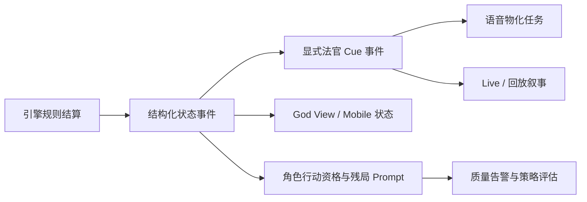

# 狼人杀 P1 流程、法官叙事与观战体验修复开发设计

## 1. 文档信息

- 依据对局：`run_05aa0b0f2b92`
- 对局记录：`game_0c46d70d`
- 上游问题清单：`docs/run-05aa0b0f2b92-quality-remediation-plan.md`
- P0 设计：`docs/superpowers/specs/2026-07-14-p0-game-integrity-remediation-design.md`
- P0 基线提交：`12320701 fix(werewolf): remediate P0 game integrity issues`
- 目标问题：P1-01、P1-02、P1-03、P1-04、P1-05
- 文档状态：待开发
- 编写日期：2026-07-14

本文是 P1 的可执行开发设计。它假设 P0 已建立以下边界：

1. 关键公开事实和玩家公开自我历史可以进入后续 Prompt；
2. 自爆中断拥有结构化 completed/pending 语义；
3. 私密回合记忆不会进入公开事件、语音和普通回放；
4. 决胜结算链结束后立即判胜，终局后不再请求玩家模型。

P1 不重复修复上述问题，而是在正确状态之上补齐“状态如何被可靠发布、法官如何按因果播报、语音如何脱离客户端连接持久化、角色如何理解行动资格、极端自爆策略如何被约束”。

## 2. 总体结论

P1 不能被拆成五组互不相关的文案修改。当前问题共享同一条链路：



正确的职责边界是：

- 引擎负责产生唯一的规则状态；
- `state_updated` 负责发布可计算状态；
- `judge_cue` 负责发布按顺序可播放的公开叙事；
- 语音系统只物化 Cue 或已确认的公开发言，不重新猜规则；
- 前端状态层消费结构化状态，叙事层消费 Cue；
- Prompt 从同一结构化状态生成行动资格和残局压力；
- 自爆质量约束不修改历史规则，只改变新模型决策上下文和发布门禁。

## 3. P1 范围与非目标

### 3.1 本期范围

| ID | 问题 | 本期交付 |
| --- | --- | --- |
| P1-01 | 警徽流失等关键状态没有唯一 Live 事件 | 统一警长竞选/警徽结算结构、reason code、状态事件和客户端消费 |
| P1-02 | 法官台词缺少流程与因果 | 显式 Cue 协议、集中式台词渲染、关键流程有序 Cue 链 |
| P1-03 | 终局语音尾段不完整 | 服务端语音物化任务、静态法官回放兜底、断线与幂等恢复 |
| P1-04 | Prompt 缺少行动资格与终局压力 | 明确资格结构、空警下名单、残局提示、确定性质量校验 |
| P1-05 | 连续自爆策略缺少质量约束 | 连爆上下文、收益审计、指标与批量模拟发布门禁 |

### 3.2 非目标

- 不修改已发布规则修订 2 的自爆合法性、双爆吞警徽规则或屠边胜负条件；
- 不在 P1 重做角色人格、头像和阵容差异化；
- 不处理普通模型动作 P95 延迟和动作格式归一化，它们属于 P2；
- 不将隐藏的狼刀、女巫用药原因或角色身份通过法官台词公开；
- 不让前端根据中文台词反向修改游戏状态；
- 不要求单元测试访问在线模型或真实 TTS 服务；
- 不把“所有 Live 事件最大 ID”直接当作语音覆盖目标，只统计应产生语音的事件。

## 4. 当前代码基线与差距

### 4.1 已存在且应复用的能力

- `_elect_sheriff()` 已发布当选状态；
- `RoundState` 已保存候选、警下、票型、PK、自爆中断和警徽字段；
- `voice.py` 已能为部分 `state_updated`、`phase_started` 和 `game_completed` 生成一条法官语音；
- `judge_voice_assets.py` 已定义平安夜、警长平票、自爆终止、猎人技能、警徽和胜负等大量静态台词；
- playback API 已能用持久化事件重建静态法官语音；
- P0 已加入 `endgame_context`、`sheriff_election` Prompt 段和终局后的动作防御；
- 自爆 Prompt 已含基础收益说明，Evaluator 已能报 `chain_self_explosion_overuse`。

### 4.2 尚未解决的真实缺口

1. `_lose_sheriff_badge()` 只修改状态、公告和 public fact，没有发布统一 `state_updated`；
2. 警长当选、流失、首轮平票、二轮平票、自爆延期使用自由文本原因，没有稳定 reason code；
3. `voice.py` 对一个大状态事件最多返回一条 Cue，多个因果结果会被优先级分支吞掉；
4. 新增显式 Cue 前若不加兼容标记，旧 `state_updated` 推导和新 Cue 会重复播报；
5. 当前语音落库由 `LiveVoiceStreamService.stream_run()` 驱动，客户端断开会直接停止合成和持久化；
6. `sheriff_voters=[]` 在 Prompt 中被渲染成“没有这一段”，而不是“明确没有警下投票者”；
7. 角色自己的警长投票资格没有独立字段，退水者容易承诺不存在的投票；
8. 残局压力已有基础提示，但缺少与行动资格联合的确定性质量检查；
9. 自爆上下文只有警长产生前爆数，没有总自爆数、连续轮次、剩余狼数和最后隐狼风险；
10. 现有连爆 Evaluator 只能赛后发现问题，不能形成模型/Prompt 版本发布门禁。

## 5. 总体架构决策

### 5.1 三层公开契约

P1 将公开链路拆成三个互不替代的契约：

| 层 | 事件或数据 | 唯一职责 |
| --- | --- | --- |
| 规则状态层 | `state_updated` | 供客户端、回放和 Prompt 计算当前状态 |
| 法官叙事层 | `judge_cue` | 供字幕、时间线、无障碍文本和语音按顺序播放 |
| 语音物化层 | `voice_materialization_jobs`、`voice_utterances` | 把可发声事件变成持久化音频，不参与规则判断 |

任何一层都不能代替另一层：

- 只有 Cue 没有状态，前端无法稳定恢复；
- 只有状态没有 Cue，语音和叙事会继续猜测；
- 只有 WebSocket 音频没有事件，回放无法重建；
- 语音任务失败不能回滚游戏结算。

### 5.2 事件顺序规则

普通结算遵守：

```text
修改 GameState / RoundState
-> 发布 state_updated
-> 发布 1..N 条 judge_cue
-> 进入下一动作或下一阶段
```

需要法官先提示玩家选择的技能遵守：

```text
judge_cue(skill_start)
-> judge_cue(skill_choose)
-> 玩家秘密动作
-> 修改状态
-> state_updated
-> judge_cue(skill_result)
```

终局遵守：

```text
决胜结算链全部完成
-> 最终 state_updated
-> 对应结果 judge_cue
-> 引擎返回
-> game_completed
```

`game_completed` 本身继续负责“游戏结束，X 阵营获胜”的终局 Cue，不在引擎中再发布第二条胜负事件。

### 5.3 一条 Cue 一个事件

不把 Cue 数组塞进一个事件。每句可独立播放的法官台词都拥有独立 Live event ID，原因如下：

- WebSocket、字幕和语音可以逐条确认；
- 中间失败可以从具体 Cue 恢复；
- `source_event_id` 可以唯一指向一条语音；
- 不需要修改现有“一条 utterance 对应一个来源事件”的大部分假设；
- 避免 `_merge_playback_voices()` 因同源多 Cue 错误去重。

### 5.4 新旧叙事兼容标记

新状态事件在 payload 增加：

```json
{
  "narration_mode": "explicit_v1"
}
```

兼容规则：

- 新事件：状态只更新画面，叙事和语音消费相邻的 `judge_cue`；
- 旧事件：没有 `narration_mode`，保留当前从 `state_updated` 推导一条法官 Cue 的 fallback；
- fallback replay builder 对新生成的回放直接构造显式 Cue；
- 前端不得同时为 `explicit_v1` 状态事件和对应 Cue 各生成一条重复叙事。

## 6. P1-01：警长竞选与警徽状态事件

### 6.1 新增结构

在 `models.py` 增加只包含公开字段的结构：

```python
SheriffElectionOutcome = Literal["elected", "badge_lost", "postponed"]

SheriffElectionReason = Literal[
    "single_candidate",
    "first_vote_winner",
    "runoff_vote_winner",
    "no_candidates",
    "all_candidates_withdrew",
    "no_off_sheriff_voters",
    "first_vote_empty",
    "runoff_tied",
    "first_pre_election_self_explosion",
    "double_pre_election_self_explosion",
]

@dataclass(frozen=True)
class SheriffElectionResolution:
    schema_version: int
    outcome: SheriffElectionOutcome
    reason_code: SheriffElectionReason
    reason_text: str
    sheriff: str | None
    candidates: list[str]
    withdrawn: list[str]
    final_candidates: list[str]
    voters: list[str]
    votes: dict[str, str]
    pk_candidates: list[str]
    runoff_votes: dict[str, str]
    badge_lost: bool
    election_pending: bool
```

`RoundState` 新增：

```python
sheriff_election_resolution: SheriffElectionResolution | None = None
```

旧的扁平字段继续保留一个兼容周期，但新逻辑只从 resolution 构造事件和叙事。

### 6.2 竞选中间态

首轮平票不是终态，需要单独发布：

```json
{
  "type": "state_updated",
  "action": "sheriff_pk_started",
  "payload": {
    "narration_mode": "explicit_v1",
    "sheriff_pk_candidates": ["5号玩家", "8号玩家"],
    "sheriff_voters": ["2号玩家", "4号玩家"],
    "sheriff_votes": {
      "2号玩家": "5号玩家",
      "4号玩家": "8号玩家"
    }
  }
}
```

之后发布 `sheriff_tie` Cue，再开始 PK 发言。

### 6.3 竞选终态事件

所有终态统一使用：

```text
type=state_updated
action=sheriff_election_resolved
```

示例：本局第四轮没有警下投票者。

```json
{
  "narration_mode": "explicit_v1",
  "sheriff_election": {
    "schema_version": 1,
    "outcome": "badge_lost",
    "reason_code": "no_off_sheriff_voters",
    "reason_text": "警下无人可投票",
    "sheriff": null,
    "candidates": ["5号玩家", "10号玩家", "11号玩家", "12号玩家"],
    "withdrawn": ["11号玩家", "12号玩家"],
    "final_candidates": ["5号玩家", "10号玩家"],
    "voters": [],
    "votes": {},
    "pk_candidates": [],
    "runoff_votes": {},
    "badge_lost": true,
    "election_pending": false
  },
  "sheriff": null,
  "sheriff_badge_lost": true,
  "sheriff_badge_lost_reason": "警下无人可投票"
}
```

payload 顶层的旧字段是兼容镜像。客户端完成迁移后，后续版本可以删除重复字段；P1 内不删除。

### 6.4 统一结算入口

将以下分散分支收口到一个 helper：

```python
_resolve_sheriff_election(
    round_state,
    active_players,
    *,
    outcome,
    reason_code,
    sheriff=None,
)
```

该 helper 依次完成：

1. 修改 `GameState` 和所有玩家 `is_sheriff`；
2. 写入 `RoundState.sheriff_election_resolution`；
3. 写入 critical public fact；
4. 发布唯一 `sheriff_election_resolved` 状态事件；
5. 根据 resolution 生成法官 Cue；
6. 记录 outcome/reason 指标。

所有原 `_elect_sheriff()`、`_lose_sheriff_badge()` 调用点必须传稳定 reason code，禁止继续只传中文自由文本。

### 6.5 警徽移交结构

警长死亡后的移交和撕毁不是警长竞选终态，新增独立公开结构：

```python
SheriffBadgeOutcome = Literal["transferred", "destroyed", "lost_no_target"]

@dataclass(frozen=True)
class SheriffBadgeResolution:
    schema_version: int
    outcome: SheriffBadgeOutcome
    from_player: str
    to_player: str | None
    reason_code: str
```

事件：

```text
type=state_updated
action=sheriff_badge_resolved
```

任何 `transferred` 事件必须把新警长同步到 `GameState.sheriff`、玩家 `is_sheriff` 和前端 God View；任何 `destroyed/lost_no_target` 事件必须显式把 sheriff 设为 `null`。

### 6.6 P1-01 验收

- 八类普通竞选终态和两类自爆竞选终态都有且只有一个 resolution 事件；
- 本局 `no_off_sheriff_voters` 状态可以在 Live、持久化事件和 fallback playback 中检索；
- God View、Mobile 和 replay adapter 收到 `badge_lost` 后都清空警长；
- 旧回放没有 resolution 时仍使用扁平字段；
- checkpoint 恢复后不会重复发布已经完成的 resolution；
- 中文 `reason_text` 只用于显示，业务判断只使用 `reason_code`。

## 7. P1-02：显式法官 Cue 与因果台词链

### 7.1 Cue 事件协议

新增集中式 `judge_narration.py`，由纯函数生成：

```python
@dataclass(frozen=True)
class JudgeCueSpec:
    cue_id: str
    visible_text: str
    static_asset_id: str | None
    params: dict[str, object]
```

Live 事件格式：

```json
{
  "type": "judge_cue",
  "action": "sheriff_no_voters",
  "payload": {
    "schema_version": 1,
    "cue_id": "sheriff_no_voters",
    "visible_text": "本轮没有警下投票者，警徽流失。",
    "static_asset_id": "sheriff_no_voters",
    "params": {
      "reason_code": "no_off_sheriff_voters"
    }
  }
}
```

约束：

- `visible_text` 是服务端生成的公开文本，不接受模型文本；
- `params` 只能放公开值；
- `static_asset_id` 不存在时允许服务端 TTS，但必须保留完整 visible text；
- Cue 渲染必须是纯函数，输入相同结构时输出和顺序相同；
- 引擎、voice 和前端不得分别维护三份不同中文文案。

### 7.2 必须覆盖的 Cue 链

| 规则转折 | 有序 Cue |
| --- | --- |
| 夜间零死亡 | `dawn_peaceful` |
| 夜间有人出局 | `dawn_deaths`，只公开名单 |
| 警长首轮平票 | `sheriff_tie` -> PK 发言提示 -> `sheriff_runoff_vote` |
| 无警下投票者 | `sheriff_no_voters` |
| 二轮仍平票 | `sheriff_runoff_tied` -> `sheriff_no_badge` |
| 警长当选 | `sheriff_result` |
| 狼人自爆 | `werewolf_self_explosion` -> `self_explosion_skip` |
| 猎人死亡可开枪 | `hunter_shot_start` -> `hunter_shot_choose` -> `hunter_shot_result` |
| 白痴翻牌 | `idiot_reveal` -> `idiot_stays` |
| 警徽移交 | `badge_owner_out` -> `badge_transfer` |
| 警徽撕毁 | `badge_owner_out` -> `badge_destroyed` |
| 白天放逐 | `exile_result` |
| 对局结束 | `game_completed` 映射对应阵营胜利 Cue |

### 7.3 平安夜判定

新增公开结果枚举：

```python
NightPublicOutcome = Literal["peaceful", "deaths"]
```

判定只依据结算完成后的 `round_state.night_deaths`：

- 列表为空就是 `peaceful`；
- 列表非空就是 `deaths`。

不要通过 `protected == attacked` 猜测平安夜，因为女巫救人、无刀口、守卫保护和其他规则都可能产生零死亡。`saved_by_witch` 可以存在于受控状态，但法官不得说“女巫救了谁”，只说“昨夜平安夜”。

第一夜延迟公布死亡时，Cue 在 `_finish_deferred_night_deaths_if_needed()` 完成全部死亡连锁后发布；非延迟夜晚在当前公开死亡结果确定后发布。两条路径必须调用同一个 `_publish_dawn_result()`，保证恰好一次。

### 7.4 夜间死亡的公开边界

虽然 `DeathEvent` 内部有 `werewolf_attack`、`witch_poison` 等 cause，法官公开播报不得因此暴露夜间秘密：

- 黎明只播报“昨夜死亡的是 X、Y”；
- 猎人发动和枪杀属于公开技能，可以单独说明因果；
- 自爆属于公开身份揭示，可以说明该玩家自爆为狼人；
- 不得播报“X 被狼人刀死”或“Y 被女巫毒死”，除非未来规则明确允许公开死因。

### 7.5 自爆链

状态更新之后发布两条独立 Cue：

```text
9号玩家自爆为狼人，立即出局。
本轮剩余发言和放逐投票终止，直接进入夜晚。
```

第二条 Cue 的 params 同时携带公开的 `stage`、`completed_actors` 和 `pending_actors`，前端可展示“哪些玩家尚未获得发言机会”，但语音正文第一版不逐个念完整名单，避免过长。

### 7.6 猎人链

猎人结算顺序必须是：

1. 确认死亡原因允许开枪；
2. 发布 `hunter_shot_start`；
3. 发布 `hunter_shot_choose`；
4. 请求猎人秘密选择；
5. 目标出局并完成警徽等连锁；
6. 发布包含完整 `day_deaths/night_deaths` 的状态；
7. 发布 `hunter_shot_result`。

如果死亡原因不允许开枪，不发布 start/choose Cue。猎人选择“不发动技能”时发布可选的 `hunter_shot_skipped`，不得伪造目标出局。

### 7.7 台词资产复用与补充

优先复用 `judge_voice_assets.py` 已有：

- `dawn_peaceful`；
- `sheriff_tie`、`sheriff_no_badge`；
- `self_explosion_skip`；
- `hunter_shot_start/choose/result`；
- `badge_transfer/badge_destroyed`；
- 三类 game over。

需要新增或调整：

- `sheriff_no_voters`；
- `sheriff_runoff_vote`；
- `sheriff_runoff_tied`；
- `hunter_shot_skipped`；
- 更明确的自爆第一句；
- 必要的座位模板展开和字幕 timing。

发布前执行资产清单测试：所有带 `static_asset_id` 的 Cue 必须能在文件 manifest 或数据库资产表中解析到非空音频。

### 7.8 P1-02 验收

- 每个 transition fixture 的 Cue ID 和顺序完全匹配快照；
- 同一状态在 Live、playback、桌面和 Mobile 只出现一次叙事；
- 女巫救人产生零死亡时稳定播报平安夜；
- 猎人死亡、选择和目标出局因果顺序正确；
- 自爆 Cue 明确说明出局、终止发言和投票；
- 本局第四轮警徽流失、放逐和狼人获胜可以连续重建；
- Cue payload 全文扫描不含隐藏刀口、用药和私密记忆。

## 8. P1-03：服务端语音物化与终局尾段可靠性

### 8.1 设计原则

当前 WebSocket 是“语音生成者 + 持久化者 + 播放者”，客户端一断开三件事同时停止。P1 将其拆开：

- Live event 是语音输入真相；
- 服务端持久任务负责语音物化；
- WebSocket 只负责低延迟交付，可以断开；
- playback 读取完整语音行，并对静态法官 Cue 做确定性兜底。

### 8.2 新增任务表

新增 `voice_materialization_jobs`：

```text
run_id                 varchar(32)  PK part
source_event_id        bigint       PK part
speaker_kind           varchar(20)  PK part
session_id             varchar(32)
status                 pending | processing | complete | failed
attempt_count          int
not_before             timestamptz
worker_id              varchar(64) nullable
lease_expires_at       timestamptz nullable
last_error             text nullable
created_at             timestamptz
updated_at             timestamptz
completed_at           timestamptz nullable
```

唯一键 `(run_id, source_event_id, speaker_kind)` 保证同一可发声事件只产生一个任务。因为 P1 规定一条 judge Cue 一个事件，所以无需 cue index。

### 8.3 任务创建条件

纯函数 `voice_job_candidate(event)` 只接受以下事件：

- `game_started` 和应播报的 `phase_started`；
- `judge_cue`；
- `game_completed`、`game_failed`、`game_canceled`；
- `action_parsed` 且 action 属于公开发言，`visible_result.say` 为非空字符串。

不从 `model_response_delta` 创建持久任务，原因是 delta 不完整且会导致一个发言产生多条任务。实时 WebSocket 仍可消费 delta，历史语音统一从最终 `action_parsed` 的完整公开文本生成。

`action_parsed` 需要补充 `request_id`，用于追踪实时流和最终物化是否对应同一模型请求。

私密 `summarize` 不会产生 `action_parsed`，任务分类器还必须保留显式拒绝测试。

### 8.4 事件与任务的事务关系

`DatabaseLiveStore` 在保存可发声事件的同一事务内以 `ON CONFLICT DO NOTHING` 插入任务：

- 插入任务只是轻量 outbox 写入，不执行 TTS；
- worker 下线时游戏继续，任务保持 pending；
- 同一事件因恢复重放再次进入 store 时不重复建任务；
- 数据库事务失败时 event 和 job 一起失败，不产生孤儿任务；
- 内存 registry 仍可继续当前 Live 展示，数据库错误走已有恢复/失败观测。

### 8.5 物化 worker

新增命令：

```bash
python -m app.cli run-live-voice-materializer
```

worker 行为：

1. 使用 `FOR UPDATE SKIP LOCKED` 领取 pending 或租约过期任务；
2. 重新读取 source event，使用统一 `event_to_voice_materialization()`；
3. 生成确定性 utterance ID：

   ```text
   voice_{sha256(run_id:source_event_id:speaker_kind)[:24]}
   ```

4. 静态法官 Cue 直接复制受控资产，不调用在线 TTS；
5. 动态 Cue 和玩家公开发言调用 TTS；
6. 写入 utterance、字幕 timing 和 chunks 后标记 complete；
7. 临时失败指数退避，超过最大次数标记 failed；
8. 若确定性 utterance 已 complete，直接把任务标记 complete；
9. worker 崩溃后由 lease 过期重新领取，不重复音频。

新增 worker heartbeat/probe，复用 `RuntimeWorkerTelemetry`，worker type 使用 `live_voice_materializer`。

### 8.6 WebSocket 迁移

P1 完成后，`LiveVoiceStreamService` 不再是唯一持久化写入者：

- 实时客户端可以继续对公开 delta 做低延迟临时合成；
- 历史持久化只认 materializer 的确定性 utterance；
- WebSocket 不得因断开把 materializer 任务标记失败；
- 如果确定性语音已经 complete，WebSocket 优先直接重放保存 chunks；
- 若尚未完成，可以继续当前实时合成，但不得写入另一条随机 ID 的重复历史语音；
- 后续可优化为 worker 合成后 fan-out，本期先保证正确性和幂等。

### 8.7 Playback 兜底

定义“有效语音”如下：

```text
complete 的保存语音
或
可由 source event + 已存在静态资产确定性重建的法官语音
```

`build_static_judge_playback_voices()` 继续作为 worker 延迟或故障时的安全兜底。合并规则使用确定性 key，不把 failed/synthesizing 行视为覆盖成功。

必须保证：

- 最终投票开始 Cue 可回放；
- 放逐结果 Cue 可回放；
- `game_completed` 胜负 Cue 可回放；
- 同一个 source event 不同时返回保存版和静态 fallback；
- 多次访问 playback 不新增数据库记录，也不改变排序。

### 8.8 覆盖指标定义

不使用：

```text
max(live_events.id) - max(voice.last_source_event_id)
```

因为很多模型生命周期事件本来不应发声。

改用：

```text
narratable_event_count
effective_voice_event_count
missing_narratable_event_count
terminal_judge_voice_present
voice_materialization_lag_ms
```

`effective_voice_event_count` 同时包含保存成功和可静态重建的事件。

### 8.9 P1-03 验收

- 没有任何 WebSocket 客户端连接时，公开发言和法官事件仍创建物化任务；
- 客户端在最终投票前断开，回放仍包含投票开始、放逐和获胜阵营；
- `game_completed` 的有效语音覆盖率为 100%；
- 同一任务重复领取、worker 重启和 playback 重复读取都不产生重复语音；
- materializer 下线时游戏继续，静态终局法官语音仍可由 playback 重建；
- 私密动作任务创建数永远为 0。

## 9. P1-04：行动资格、空集合语义与残局压力

### 9.1 P0 后的剩余问题

P0 已加入：

- 当前存活人数；
- 公开已出狼人数量；
- 四人及以下的错误放逐压力；
- 非空警上/警下名单。

P1 仍需解决：

- 空警下名单被省略；
- 玩家不知道自己是否属于合法警长投票者；
- 退水者容易把“退水”误解为自动获得警下投票权；
- 角色会把“可能有下一轮”说成“必然有下一轮”；
- 质量告警缺少结构化资格上下文。

### 9.2 新增资格结构

`_world_state()` 增加：

```python
@dataclass(frozen=True)
class PublicActionEligibility:
    sheriff_election_active: bool
    original_candidates: list[str]
    original_voters: list[str]
    final_candidates: list[str]
    actor_was_candidate: bool
    actor_withdrew: bool
    actor_can_sheriff_vote: bool
    sheriff_vote_reason: str
    actor_can_exile_vote: bool
```

`sheriff_vote_reason` 使用稳定值：

- `eligible_original_voter`；
- `candidate_not_eligible`；
- `withdrew_candidate_not_original_voter`；
- `no_off_sheriff_voters`；
- `election_resolved`；
- `sheriff_disabled`。

该结构只基于公开报名、退水和规则，不含隐藏身份。

### 9.3 Prompt 文案

警长公开信息必须显式渲染空集合：

```text
警长竞选资格：
- 原始上警玩家：5号、10号、11号、12号。
- 原始警下投票者：无。
- 本轮没有警下投票者；任何上警或退水玩家都不能进行警长投票。
- 你已退水，但你不是原始警下玩家，因此你没有本轮警长投票权。
```

残局段落使用公开风险，不泄露谁是最后神职或平民：

```text
残局压力：
- 当前存活4人，本局采用屠边规则。
- 本轮放逐可能直接触发任一阵营胜利，不能假定一定存在下一夜或下一轮。
- 如果讨论明天，必须同时说明本轮错误放逐可能立即结束游戏。
```

### 9.4 确定性质量代码

扩展 `action_quality.py`：

| code | 条件 |
| --- | --- |
| `appeals_to_missing_sheriff_voters` | voters 为空却向“警下玩家”拉票或要求投票 |
| `promises_ineligible_sheriff_vote` | actor 无资格却承诺“我会投给 X” |
| `assumes_future_round_in_endgame` | 残局中无条件承诺“明天/下一轮再处理” |
| `ignores_terminal_risk` | 提到未来轮次但没有任何当前轮可能终局的表述 |

先把结构化上下文传给检测器，不允许检测器再从 Prompt 字符串反推资格。

### 9.5 带反馈重试的公开边界

确定性硬错误可以最多重试一次，但被拒绝的草稿不能先进入公开 delta 或语音。

实现选择：

1. 对需要硬校验的 sheriff speech、PK speech 和残局 debate 使用 buffered publication；
2. 模型响应先在内存中完整生成；
3. 运行资格质量检测；
4. 失败时把 code 和简短纠正说明加入 `quality_feedback`，重试一次；
5. 只有通过的文本才发布公开 speech event 和 `action_parsed`；
6. 第二次仍失败时接受文本以保证对局可用性，但发布高优先级 warning 和指标，发布门禁据此失败。

不得在已经公开流出第一版错误文本后再重试，否则观众和语音会同时看到两个版本。

### 9.6 P1-04 验收

- `sheriff_voters=[]` 时每名相关玩家 Prompt 都明确写“没有警下投票者”；
- 上警后退水但不是原始警下的玩家，`actor_can_sheriff_vote=false`；
- 固定无效第一稿会触发一次 buffered retry，第一稿不进入 Live、voice 或 playback；
- 第二稿正确时只发布第二稿；
- 四人屠边残局明确“本轮可能直接决定胜负”；
- 所有新增提示只使用公开状态，狼人和好人看到的资格事实一致。

## 10. P1-05：连续自爆决策质量与发布门禁

### 10.1 原则

P1 不把合法自爆改成非法动作，也不静默改写规则修订 2。控制分成三层：

1. 给狼人模型更完整的私密决策上下文；
2. 记录结构化收益判断和风险；
3. 用批量模拟指标决定 Prompt/模型版本是否可发布。

### 10.2 自爆决策上下文

新增私密 world state：

```python
@dataclass(frozen=True)
class SelfExplosionDecisionContext:
    total_self_explosions: int
    consecutive_self_explosion_rounds: int
    active_wolves_before: int
    actor_is_last_wolf: bool
    active_players_before: int
    current_stage: str
    completed_public_speakers: int
    pending_public_speakers: int
    sheriff_election_open: bool
    pre_election_bomb_count: int
    badge_impact: str
    explosion_would_end_game: bool
```

该结构只能进入狼人私密自爆 Prompt 和受控日志，不能进入公开事件。

### 10.3 结构化收益声明

新 Prompt JSON 示例增加：

```json
{
  "reasoning": "当前已经连续两轮自爆；本次只有在能保护最后隐狼并形成直接胜势时才值得。",
  "self_explode": "不自爆",
  "benefit_type": "none",
  "expected_gain": "保留白天发言和抗推空间",
  "primary_risk": "继续自爆会暴露最后隐狼并耗尽狼队人数"
}
```

`benefit_type` 建议值：

- `immediate_win`；
- `secure_badge_denial`；
- `protect_last_hidden_wolf`；
- `deny_confirmed_public_information`；
- `force_valuable_night`；
- `none`。

通用动作解析仍以 `self_explode` 为 result key。额外字段用于质量审计，不写入公开事件。

### 10.4 连爆提示策略

| 连续自爆轮数 | Prompt 规则 |
| ---: | --- |
| 0 | 正常比较公开身份代价与阵营收益 |
| 1 | 必须填写 benefit type 和 primary risk |
| 2 及以上 | 默认建议不自爆；只有直接胜势、关键警徽收益或保护最后隐狼等高价值理由才支持继续 |

“阻止好人形成信息”不能单独作为第三次连续自爆的充分理由，因为任何自爆都会产生该通用效果。

### 10.5 恢复兼容

旧 checkpoint 的 cached response 可能只有 `reasoning + self_explode`。P1 必须：

- 继续按原响应重放，不能因为缺少新增审计字段改变已经缓存的决策；
- 对旧响应记录 `decision_schema=legacy`；
- 只对新的 live response 要求审计字段；
- 第一版不对自爆结果做服务器硬覆盖，避免合法规则动作被隐式篡改；
- 如果未来需要 hard policy，必须进入新规则修订或显式策略配置。

### 10.6 指标与离线发布门禁

新增：

```text
werewolf_self_explosion_decision_total{streak,choice,benefit_type}
werewolf_chain_self_explosion_game_total{chain_length}
werewolf_normal_day_debate_game_total
werewolf_self_explosion_missing_benefit_total{streak}
```

初始发布基线：

- 固定规则修订和模型版本；
- 50 个固定 seed，每个运行 2 次，共 100 局；
- 连续三爆对局占比不高于 5%；
- 至少 80% 的非提前终局对局出现一个完成普通辩论和放逐的白天；
- streak >= 1 的自爆选择中，审计字段完整率 100%；
- 本局 fixture 中第三次自爆 Prompt 明确显示 streak=2 和最后隐狼风险。

若当前模型基线无法一次达到阈值，禁止通过修改历史规则数据“做低指标”；应调整 Prompt/模型后重新跑同一 seed 集合。

### 10.7 P1-05 验收

- 自爆决策上下文对不同轮次、剩余狼数和警徽状态计算正确；
- 公开序列化中不存在 decision context、benefit 或私密 reasoning；
- 旧 cached response 恢复行为不变；
- evaluator 同时输出单局问题和批量 chain rate；
- 100 局发布基线达到阈值并把结果写回本文实施记录；
- 历史回放继续按原始动作展示，不被新策略重新解释。

## 11. 前端与回放消费设计

### 11.1 类型

`packages/game-client/src/types.ts` 增加：

- `SheriffElectionResolution`；
- `SheriffBadgeResolution`；
- `JudgeCuePayloadV1`；
- `narration_mode`；
- playback voice 的 `cue_id` 或等价稳定动作标识。

新字段全部可选，保证旧客户端 fixture 可解析。

### 11.2 God View

`liveGodView.ts`：

- 优先消费 `payload.sheriff_election`；
- `badge_lost` 时同步清空 sheriff；
- `postponed` 时保留 election pending，不显示已有警长；
- `transferred` 时替换警长；
- 没有嵌套结构时退回旧扁平字段；
- 不从 judge visible text 解析状态。

### 11.3 Live Narrative 与 Director

- `narration_mode=explicit_v1` 的状态事件只更新场景，不生成重复法官句；
- `judge_cue` 生成正式叙事 Cue；
- Cue ID 决定时长、是否不可压缩、镜头焦点和字幕类型；
- 自爆、猎人结果、放逐和 game over 保持不可压缩；
- 同一个 source event 的 Cue 在重连后按 event ID 去重。

### 11.4 Mobile

`mobileLiveActionModel.ts` 与桌面使用同一 Cue ID 语义：

- 警徽流失显示 reason text；
- 平安夜不显示守卫或女巫私密原因；
- 自爆中断展示 pending 人数；
- 终局 Cue 不被最后一个玩家发言卡片覆盖；
- 旧 state event 仍保留 fallback 文案。

### 11.5 Replay Adapter

- 新回放保留 resolution 和显式 Cue；
- 旧回放没有 Cue 时由 adapter/fallback builder 推导最少的一条兼容叙事；
- 不反向猜测旧自爆 pending 名单；
- playback voice 按 source event ID 排序，终局胜负必须是最后一条法官语音之一。

## 12. Checkpoint、历史数据与兼容

### 12.1 Checkpoint

- `SheriffElectionResolution` 和 `SheriffBadgeResolution` 使用加法字段；
- 旧 checkpoint 字段缺失时为 `None`；
- 恢复时如果当前轮尚未完成竞选，可以继续产生 resolution；
- 已写入 resolution 的完成轮不得重复结算；
- 旧 cached 自爆响应不因新审计字段失效。

### 12.2 历史 Live 事件

- 旧事件没有 `narration_mode`，保留现有推导；
- 不对历史事件批量伪造 reason code；未知就是 `legacy_unknown`；
- 新客户端必须把 `legacy_unknown` 当显示兼容值，不能据此修改规则状态；
- P1 不要求改写旧 `GameReplayPayload`。

### 12.3 语音任务迁移

- 新表为空上线，不回填全部历史玩家语音；
- 可选择只为目标 run 的关键法官事件生成任务进行上线演练；
- 旧 complete utterance 继续可读；
- deterministic utterance ID 不与旧随机 ID 冲突；
- playback 合并优先 complete 保存语音，其次静态 fallback。

### 12.4 API 兼容

- 普通 game API 继续使用公开 DTO；
- 新 resolution 不得带私密 role、刀口、用药或 reasoning；
- playback 添加字段但不移除旧字段；
- Admin 可以看到 job 状态和失败原因，但普通接口不返回 worker/lease 信息。

## 13. 代码改动区域

| 文件/模块 | 计划改动 |
| --- | --- |
| `apps/api/app/werewolf/models.py` | 新增警长竞选/警徽 resolution 结构 |
| `apps/api/app/werewolf/checkpoint.py` | 新结构兼容序列化 |
| `apps/api/app/werewolf/engine.py` | 统一竞选结算、显式 Cue、资格和自爆上下文 |
| `apps/api/app/werewolf/judge_narration.py` | 新增集中 Cue 渲染和顺序规划 |
| `apps/api/app/werewolf/prompts_zh.py` | 行动资格、空集合、残局与自爆审计字段 |
| `apps/api/app/werewolf/action_quality.py` | 资格和残局确定性质量代码 |
| `apps/api/app/werewolf/lm.py` | buffered publication/带反馈重试支持 |
| `apps/api/app/werewolf/voice.py` | 显式 Cue 和 action_parsed 完整发言映射 |
| `apps/api/app/werewolf/voice_stream.py` | WebSocket 与持久化职责拆分、静态 fallback |
| `apps/api/app/werewolf/voice_store.py` | 确定性 utterance 幂等写入 |
| `apps/api/app/werewolf/live_store.py` | 事件 outbox 创建语音任务 |
| `apps/api/app/werewolf/voice_materializer.py` | 新增任务领取、合成、恢复 |
| `apps/api/app/werewolf/worker_telemetry.py` | 复用 runtime worker 心跳、健康探针和指标框架 |
| `apps/api/app/models/live.py` | 新增 materialization job model |
| `apps/api/alembic/versions/*` | 新任务表 migration |
| `apps/api/app/cli.py` | worker 与健康检查命令 |
| `apps/api/app/admin/live_runs.py` | 将 `judge_cue` 纳入已知 Live 事件和诊断统计 |
| `apps/api/app/werewolf/replay_playback.py` | 显式 Cue 和旧回放 fallback |
| `apps/api/app/api/routes/games.py` | playback voice 合并与 worker dependency |
| `apps/api/app/werewolf/evaluator.py` | 自爆批量指标与缺失收益审计 |
| `apps/api/app/werewolf/judge_voice_assets.py` | 缺失 Cue 和静态资产 |
| `packages/game-client/src/types.ts` | 新状态/Cue 类型 |
| `packages/game-client/src/live/liveGodView.ts` | resolution 状态投影 |
| `packages/game-client/src/live/liveNarrative.ts` | 显式 Cue 与旧事件 fallback |
| `packages/game-client/src/live/liveDirector.ts` | Cue 时长、不可压缩和镜头 |
| `packages/game-client/src/replay/adapters.ts` | 新旧回放映射 |
| `apps/mobile-web/src/components/mobileLiveActionModel.ts` | Mobile Cue 消费 |
| `apps/api/Dockerfile`、运行时部署配置 | 启动 materializer、配置健康探针并验证优雅退出 |

## 14. 推荐开发顺序与任务清单

### PR-A：状态和 Prompt 契约

- [x] 1. 新增 `SheriffElectionResolution`、`SheriffBadgeResolution` 及 checkpoint 兼容。
- [x] 2. 将所有警长竞选终态收口到稳定 outcome/reason code helper。
- [x] 3. 发布 `sheriff_pk_started`、`sheriff_election_resolved` 和 `sheriff_badge_resolved` 状态事件。
- [x] 4. 更新 game-client、Mobile 和 replay adapter 的警长状态投影。
- [x] 5. 新增 `PublicActionEligibility`，明确渲染空警下名单和玩家投票资格。
- [x] 6. 扩展残局/资格质量代码和 buffered retry，保证被拒绝草稿不公开。

### PR-B：显式法官叙事

- [x] 7. 新增 `judge_narration.py`、Cue V1 协议和 `explicit_v1` 兼容标记。
- [x] 8. 补齐平安夜、夜间死亡、警长平票/流失 Cue 链。
- [x] 9. 补齐自爆、猎人、白痴、警徽、放逐和终局 Cue 链。
- [x] 10. 更新桌面/Mobile 叙事层，消除 state fallback 与显式 Cue 重复。
- [x] 11. 补齐静态法官资产、模板、字幕 timing 和资产清单门禁。

### PR-C：服务端语音物化

- [x] 12. 新增 `voice_materialization_jobs` migration、model 和 outbox 写入。
- [x] 13. 实现幂等 materializer worker、租约、退避、heartbeat 和 CLI。
- [x] 14. 将完整公开发言从 `action_parsed` 物化，WebSocket 不再独占历史写入。
- [x] 15. 修复 playback 有效语音合并、静态 fallback 和终局尾段覆盖指标。

### PR-D：连续自爆质量门禁

- [x] 16. 新增 `SelfExplosionDecisionContext`、结构化收益字段和旧 cached response 兼容。
- [x] 17. 新增自爆决策指标、Evaluator 聚合和 100 局固定 seed benchmark。
- [x] 18. 使用 `run_05aa0b0f2b92` P1 fixture 完成全链路复验并记录基线。

依赖关系：

```text
1 -> 2 -> 3 -> 4
3 -> 7 -> 8/9 -> 10/11
5 -> 6
7 -> 12 -> 13 -> 14 -> 15
16 -> 17
4/6/10/15/17 -> 18
```

## 15. 测试设计

### 15.1 警长状态矩阵

| 测试 | 断言 |
| --- | --- |
| `test_sheriff_resolution_no_candidates` | `badge_lost/no_candidates`，唯一事件 |
| `test_sheriff_resolution_all_withdrawn` | `badge_lost/all_candidates_withdrew` |
| `test_sheriff_resolution_no_off_sheriff_voters` | 空 voters 被显式保存和发布 |
| `test_sheriff_resolution_first_vote_empty` | 无有效票 reason 稳定 |
| `test_sheriff_resolution_single_candidate` | 唯一候选当选 |
| `test_sheriff_resolution_first_vote_winner` | 首轮唯一领先当选 |
| `test_sheriff_resolution_runoff_winner` | PK 二轮唯一领先当选 |
| `test_sheriff_resolution_runoff_tied` | 二轮平票警徽流失 |
| `test_sheriff_resolution_first_bomb_postponed` | 第一次竞选前自爆为 postponed |
| `test_sheriff_resolution_double_bomb_lost` | 第二次竞选前自爆为 badge_lost |
| `test_sheriff_badge_transfer_state_event` | 新警长三处状态一致 |
| `test_sheriff_badge_destroy_clears_owner` | sheriff 清空、badge lost |

每个测试还断言 public fact、state event 和 resolution 内容一致。

### 15.2 法官 Cue 顺序

| 测试 | 期望 Cue ID |
| --- | --- |
| `test_witch_save_announces_peaceful_night` | `dawn_peaceful` |
| `test_sheriff_tie_runs_pk_cue_chain` | `sheriff_tie -> sheriff_pk_start -> sheriff_runoff_vote` |
| `test_self_explosion_has_two_ordered_cues` | `werewolf_self_explosion -> self_explosion_skip` |
| `test_hunter_shot_has_causal_cue_chain` | `hunter_shot_start -> hunter_shot_choose -> hunter_shot_result` |
| `test_hunter_poison_death_has_no_shot_cues` | 无 hunter Cue |
| `test_badge_transfer_has_owner_and_target_cues` | `badge_owner_out -> badge_transfer` |
| `test_terminal_exile_cue_precedes_game_completed` | exile 结果先于胜负 |
| `test_public_dawn_cue_hides_secret_death_causes` | 不含刀/毒原因 |
| `test_explicit_state_does_not_create_legacy_duplicate_cue` | 每句只出现一次 |

### 15.3 语音可靠性

- `test_voice_job_created_without_websocket`；
- `test_public_action_parsed_creates_one_player_voice_job`；
- `test_private_action_never_creates_voice_job`；
- `test_voice_job_claim_uses_skip_locked`；
- `test_voice_materializer_is_idempotent_after_lease_expiry`；
- `test_static_judge_job_avoids_external_tts`；
- `test_dynamic_player_job_retries_transient_tts_failure`；
- `test_terminal_voice_survives_client_disconnect`；
- `test_playback_uses_static_fallback_when_worker_is_down`；
- `test_saved_voice_suppresses_matching_static_fallback`；
- `test_game_completed_effective_voice_coverage_is_complete`。

### 15.4 Prompt 与质量

- `test_empty_sheriff_voters_are_explicit_in_prompt`；
- `test_withdrawn_candidate_is_not_granted_vote_right`；
- `test_sheriff_voter_sees_eligible_reason`；
- `test_endgame_prompt_does_not_assume_next_round`；
- `test_invalid_eligibility_draft_is_buffered_and_retried`；
- `test_rejected_draft_emits_no_delta_or_voice_job`；
- `test_second_valid_draft_is_only_public_speech`；
- `test_second_invalid_draft_warns_without_infinite_retry`。

### 15.5 自爆策略

- `test_self_explosion_context_counts_total_and_streak`；
- `test_self_explosion_context_marks_last_wolf`；
- `test_third_chain_prompt_defaults_to_no_explosion`；
- `test_self_explosion_audit_fields_are_private`；
- `test_legacy_cached_self_explosion_response_replays_unchanged`；
- `test_chain_self_explosion_benchmark_report`。

### 15.6 恢复与兼容

- 旧 checkpoint 无 resolution 时可读；
- 新 checkpoint resolution round-trip；
- 已完成竞选恢复不重复事件/Cue；
- 旧 playback 无 narration marker 时仍有 fallback；
- 新 playback 不重复旧推导 Cue；
- 旧客户端 fixture 可忽略嵌套 resolution、Cue params 和 voice job 字段；
- worker 重启不改变事件顺序和游戏状态。

### 15.7 前端

- game-client God View 的 elected/lost/postponed/transfer 矩阵；
- liveNarrative explicit/fallback 去重；
- liveDirector 关键 Cue 不可压缩；
- Mobile 平安夜、自爆、猎人、警徽流失和终局；
- playback terminal tail 视觉顺序；
- 无障碍文本与 visible text 一致。

## 16. 观测、SLO 与发布门禁

### 16.1 指标

```text
werewolf_sheriff_resolution_total{outcome,reason_code}
werewolf_judge_cue_total{cue_id}
werewolf_judge_cue_duplicate_total{cue_id}
werewolf_judge_cue_missing_total{transition}
werewolf_voice_materialization_job_total{status,speaker_kind}
werewolf_voice_materialization_lag_ms{speaker_kind}
werewolf_voice_materialization_retry_total{speaker_kind}
werewolf_effective_voice_missing_total{event_type}
werewolf_terminal_judge_voice_missing_total
werewolf_action_eligibility_warning_total{code,action}
werewolf_buffered_speech_retry_total{code,action}
werewolf_self_explosion_decision_total{streak,choice,benefit_type}
werewolf_chain_self_explosion_game_total{chain_length}
```

标签禁止包含 session ID、玩家名和自由文本，避免高基数。

### 16.2 初始 SLO

| 指标 | 门槛 |
| --- | --- |
| 警长终态 state event 覆盖率 | 100% |
| 关键 transition Cue 覆盖率 | 100% |
| 显式 Cue 重复率 | 0 |
| `game_completed` 有效法官语音覆盖率 | 100% |
| 静态终局语音 playback 可用时间 | playback 响应内立即可用 |
| 动态语音物化 lag | P95 < 30 秒 |
| 私密动作 voice job 数 | 0 |
| 资格硬错误首次发布率 | 0；被拒草稿不得公开 |
| 连续三爆对局率 | 100 局基线 <= 5% |

### 16.3 发布门禁

发布前必须：

1. API、worker、checkpoint 和前端测试全绿；
2. 所有 `JudgeCueSpec.static_asset_id` 通过资产清单；
3. materializer 在无 WebSocket 情况下完成终局语音；
4. kill worker 后重启可继续 pending/expired 任务；
5. 本局第四轮从警徽流失到狼人获胜的事件、画面、字幕和语音一致；
6. 公开 JSON/Cue/voice 全文扫描 P0 私密哨兵仍为 0；
7. 100 局固定 seed 连爆 benchmark 达标；
8. migration 在空库和带历史 voice 数据的副本上演练成功；
9. worker 未部署或异常时不会阻塞游戏结算；
10. 在实施记录中写入实际测试数、Cue 覆盖、voice lag 和 chain rate。

## 17. 分批发布方案

### 17.1 第一批：状态事件和 Prompt

先发布 PR-A：

- 新字段是加法兼容；
- 前端先支持 resolution，再让后端开始发；
- buffered retry 可独立 feature flag；
- 观察 eligibility warning 误报。

### 17.2 第二批：显式 Cue

- 先让客户端支持 `explicit_v1`；
- 再让后端标记新状态并发布 Cue；
- 旧回放继续 fallback；
- 观察 duplicate/missing 指标为 0 后扩大流量。

### 17.3 第三批：语音 materializer

- 先迁移建表；
- 部署 worker 但不关闭旧 WebSocket 持久化，shadow 对比任务；
- 确认 deterministic 语音和旧语音文本/资产一致；
- 切换历史写入所有权到 materializer；
- 保留静态 playback fallback；
- 最后移除 WebSocket 的随机历史写入。

### 17.4 第四批：自爆策略

- 先只记录 decision context 和指标；
- 获取旧 Prompt 基线；
- 再切新 Prompt；
- 使用同一固定 seed 集比较；
- 达标后发布，不改变历史回放或规则快照。

## 18. 风险与控制

### 18.1 显式 Cue 与旧推导重复

风险：状态事件和 Cue 各播一次。

控制：`narration_mode=explicit_v1`，客户端和 voice fallback 都必须覆盖去重测试。

### 18.2 Cue 暴露夜间秘密

风险：直接使用 `DeathEvent.cause` 生成“被刀/被毒”台词。

控制：法官渲染器只接收 public transition DTO；夜间死亡 Cue 只含名单。

### 18.3 语音 outbox 影响游戏事件

风险：任务插入错误导致 event persistence 失败。

控制：任务创建纯函数、`ON CONFLICT DO NOTHING`、完整数据库演练；worker/TTS 永远不在事件事务中执行。

### 18.4 双重 TTS 成本

风险：实时 WebSocket 和后台 worker 都合成玩家语音。

控制：P1 优先正确性；实时流优先重放已完成 deterministic utterance，并记录重复合成指标，后续改为 worker fan-out。

### 18.5 buffered retry 损害实时感

风险：公开发言不再逐字出现。

控制：只对资格硬约束场景启用；通过后可一次性或快速分块发布；比较端到端延迟。

### 18.6 资格检测误报

风险：“警下没人”作为事实描述被误判为向警下拉票。

控制：检测器结合句式和结构化资格，先 shadow warning，再开启 retry；二次失败不无限阻塞。

### 18.7 自爆策略被暗中改规则

风险：服务器直接把“自爆”改成“不自爆”。

控制：P1 不硬覆盖合法结果；依靠上下文、审计和发布门禁。真正限制必须走规则修订。

### 18.8 worker 积压导致回放缺音频

风险：动态玩家语音延迟。

控制：租约重试、积压告警；关键法官终局 Cue 使用静态资产立即兜底。

## 19. 回滚策略

- resolution 字段为加法，可停止发送嵌套结构并回退旧扁平字段；
- 显式 Cue 可关闭 feature flag，旧 state fallback 继续可用；
- 不允许回滚到“新 Cue 与旧推导同时播放”的中间状态；
- materializer 可停止领取新任务，playback 继续使用已保存语音和静态 fallback；
- migration 表不需要立即删除，回滚应用时可保留 pending job；
- buffered retry 可关闭并保留 warning-only；
- 自爆 Prompt 可回滚到 P0 版本，不影响规则和历史动作；
- 任何回滚都不得破坏 P0 私密记忆和终局边界。

## 20. P1 完成定义

P1 只有同时满足以下条件才算完成：

### P1-01

- 所有警长竞选终态有稳定 outcome/reason code；
- 本局无警下投票者事件唯一、持久、可回放；
- 警徽流失时所有客户端清空警长；
- 警徽移交和撕毁有独立结构事件。

### P1-02

- 关键流程全部使用显式 Cue；
- 平安夜、PK、自爆、猎人、警徽、放逐和终局因果顺序正确；
- 新事件无重复叙事；
- 法官 Cue 不泄露夜间秘密。

### P1-03

- 历史语音生成不依赖客户端连接；
- `game_completed` 有效法官语音覆盖率 100%；
- worker 重启和重复处理幂等；
- worker 下线不阻塞游戏，静态终局语音仍可回放。

### P1-04

- 空警下名单和玩家投票资格在 Prompt 中明确；
- 无资格承诺和无条件“明天再盘”可被检测并带反馈重试；
- 被拒草稿不进入公开事件或语音；
- 提示不含隐藏身份。

### P1-05

- 连续自爆决策拥有总数、streak、剩余狼和风险上下文；
- 新 live decision 收益审计完整；
- 旧 cached response 保持恢复一致；
- 100 局固定 seed 连续三爆率不高于 5%；
- 本局 P1 fixture 全链路通过并记录实际指标。

## 21. 实施记录

P1 的 18 个任务均已实现并在相关自动化测试通过后逐项勾选。

- commit/PR：本轮未按用户要求创建提交或 PR，代码保留在当前工作区等待统一验收。
- migration：`20260714_17_create_voice_materialization_jobs`，Alembic 单一 head 为 `20260714_17`。
- Cue：关键 transition 使用 Cue V1；`explicit_v1` 关闭 state fallback；目标局 P1 fixture 未发现重复终局 Cue 或私密死因台词。
- materializer：事件和任务同事务写入；确定性 utterance ID；支持 `SKIP LOCKED`、租约过期重领、指数退避、静态资产直拷贝、动态 TTS、heartbeat/probe 和优雅退出。
- playback：只把 complete 保存语音视为有效持久语音，按 `(source_event_id, speaker_kind)` 抑制静态 fallback 重复；暴露 narratable/effective/missing、终局语音和 materialization lag 指标。
- `run_05aa0b0f2b92`：P0 与 P1 fixture 共 2 条全链路用例通过；第三次自爆上下文为 `total=2`、`streak=2`、`active_wolves=1`、`actor_is_last_wolf=true`，终局放逐和狼人胜利语音可静态重建。
- 100 局固定 seed 离线门禁：50 个 seed 各运行 2 个确定性回归样本；三连爆对局 2/100（2%），完成普通辩论和投票的对局 98/100（98%），streak >= 1 的收益审计完整率 100%，通过 5%/80%/100% 门槛。
- 全量回归：API `1457 passed, 10 skipped`；game-client `278 passed`；Mobile `192 passed`；Admin `272 passed`；Ruff、三个前端 TypeScript 检查以及 Mobile/Admin lint 全部通过。
- 回滚点：可停止 materializer 领取任务并保留 outbox；playback 继续读取已完成语音和静态资产；自爆 Prompt 可回退而不改历史动作；Cue 回退必须同时恢复旧 state fallback，禁止双重叙事。
