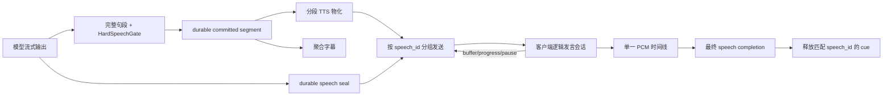

# 逻辑发言流式语音 v2 开发设计

## 1. 文档信息

- 编写日期：2026-07-20
- 文档状态：长期实施基线；第一、二期实现与验证记录见第 16 节
- 适用仓库：`werewolf_arena_live`
- 适用范围：公开玩家发言的模型流式输出、稳定句段、TTS 物化、Live Voice WebSocket、客户端 PCM 调度、字幕、导演 cue、恢复、Replay、God View、质量观测与灰度
- 不适用范围：法官静态语音资产生成、模型 Prompt 优化、角色推理质量、规则结算
- 事故基线：`run_595541f26dfc` / `game_e9826cdb`
- 权威原则：句段可以流式，发言只能是一个逻辑事务

关联文档：

- [狼人杀虚拟玩家活人感系统重构开发设计](./2026-07-19-lifelike-player-system-design.md)
- [Live Voice 数据库设计](./2026-07-08-live-voice-streaming-db-design.md)
- [Live/Replay 阻塞修复计划](../plans/2026-07-16-live-replay-blocking-remediation.md)
- [隐私 Audience Contract v2](./2026-07-15-privacy-audience-contract-v2-remediation-design.md)

本文取代 2026-07-19 活人感设计中“一个 committed segment 等于一个独立播放事务”的隐含假设。旧 `segments_v1` 只作为冻结对局和历史 Replay 的兼容合同，不再作为新对局的目标实现。

## 2. 背景与事故结论

### 2.1 原始目标

旧改造希望在模型完整发言结束前提交第一个稳定句子，使 TTS 尽早开始，从而降低首音频延迟。这个目标仍然成立。

### 2.2 `run_595541f26dfc` 的事实

该局不是模型生成失败，也不是 TTS Provider 过慢：

- 19 次逻辑发言被拆成 82 个独立语音 utterance；
- 126 个物化任务全部完成，最大尝试次数为 1；
- 句段文本拼接与最终模型文本一致；
- 多数首段在事件发布后约 1～3 秒已经物化；
- 浏览器导演播放游标随后落后 95～325 秒；
- 82 个玩家句段全部记录为 `segment_final=false`；
- 服务端以独立 utterance 为单位等待 `voice_played`，等待上限为 60 秒；
- 客户端以任意相交的语音完成范围释放整个合并发言 cue。

因此 60 秒超时不是根因。根因是生产端从“一次发言一个语音”变成“一次发言多个语音事务”，而导演完成、ACK、流控与恢复仍沿用旧的一次发言合同。

### 2.3 必须修复的合同错位

| 层次 | v1 行为 | 后果 |
| --- | --- | --- |
| 模型提交 | 每个完整句子立即发布 | 正确，能够降低首句等待 |
| TTS | 每个句子独立物化 | 可以保留，但不能等于独立逻辑发言 |
| Broker | 每个 utterance 都进入 ACK 队列 | 导演落后时形成 60 秒级联 |
| 客户端 | 每个 utterance 独立 ready/playing/played | 后续句段与当前 cue 脱节 |
| 导演 | 任意相交完成都释放整个 cue | 第一段播完即可错误结束整段发言 |
| 最终标记 | 依赖句段创建时的 `segment_final` | 流式时尚不知道哪一句是最后一句 |

## 3. 目标、非目标与成功标准

### 3.1 目标

1. 第一条稳定句段就绪后即可开始播放。
2. 同一 `speech_id` 的所有句段组成一个逻辑播放会话。
3. 中间句段完成不释放导演 cue。
4. 发言封口且最后音频真正播放完成后，只释放一次 cue。
5. 流控依据客户端缓冲音频时长，不依据 utterance 数量。
6. 播放超时从客户端实际激活或播放进度开始计算，不从服务端发送开始计算。
7. Live、Replay、God View、恢复和历史客户端具有明确的版本兼容路径。

### 3.2 非目标

- 不在第一期实现客户端连续 PCM 播放；
- 不在第一期修改导演完成算法；
- 不通过把 60 秒改为更大值掩盖队列问题；
- 不让语音播放状态阻塞或改变游戏规则状态机；
- 不把原始模型 token 或未通过硬门禁的草稿交给 TTS；
- 不重写历史事件或历史语音记录；
- 不要求 v2 与 MP3/Blob 边收边播同时上线，首版 v2 连续播放只支持 PCM。

### 3.3 硬性成功标准

- 提前释放导演 cue：0；
- 同一发言重复最终完成：0；
- 句段乱序播放：0；
- 已封口发言继续追加句段：0；
- 完整 v2 发言缺少权威封口：0；
- audience 串音：0；
- 因暂停或导演尚未到达来源事件而产生的播放超时：0；
- 新版失败时能够按对局冻结配置降级到整段语音。

## 4. 不可破坏的既有语义

1. `sourceEventId` 是播放激活边界。
2. `lastSourceEventId` 只用于覆盖范围、Replay 和去重，不能推迟播放开始。
3. `presentation_id` 继续用于语义去重；`speech_id` 不替代跨表现面的 presentation 消费语义。
4. 跳过、失败、过期和被打断的语音仍必须形成终态 ACK/observation。
5. audience 从事件、物化任务、utterance、WebSocket 到字幕必须端到端保留并 fail-closed。
6. 对局使用开局冻结的 liveness snapshot；代码更新不能把进行中的 `segments_v1` 对局无声明地升级为 v2。
7. Live 和 Replay 可以采用不同加载策略，但必须消费相同的 durable speech contract。

## 5. 术语与标识

| 名称 | 含义 | 生命周期 |
| --- | --- | --- |
| `action_id` | 一次游戏逻辑行动 | Provider 重试之间稳定 |
| `request_id` | 一次模型 Provider 尝试 | 每次尝试不同 |
| `speech_id` | 一次逻辑公开发言 | 跨所有句段、TTS 和播放状态稳定 |
| `segment_id` | 一条稳定句段 | 在同一 `speech_id` 内唯一 |
| `segment_index` | 句段顺序 | 从 0 连续递增 |
| `utterance_id` | 一次 TTS 物化单元 | v2 中可以一段一个，但不再代表逻辑发言 |
| `presentation_id` | 展示/回放语义去重标识 | 保持现有消费语义 |
| `speech seal` | 发言不再追加句段的权威事实 | 每个 `speech_id` 恰好一次 |
| `playback session` | 某个观众连接上的逻辑播放实例 | 允许断线后重建 |

## 6. 目标架构



责任边界：

- 引擎决定哪些文本已经稳定、哪些句段属于同一发言、何时封口；
- TTS 只负责把句段变成音频，不决定发言完成；
- Broker 负责按发言分组、流控与连接状态，不决定导演 cue；
- 客户端负责有序缓冲和实际播放，只在逻辑发言终态时报告完成；
- 导演只消费逻辑发言完成，不消费句段完成。

## 7. Engine durable contract：`segments_v2`

### 7.1 版本选择

`sentence_stream` 允许三种冻结值：

```text
off
committed_segments       # 历史 segments_v1
committed_segments_v2    # 新合同，未灰度前不得自动分配
```

`committed_segments_v2` 必须配合 `speech_stream_version="speech-v2"`。未知值或错误组合必须 fail-closed。

### 7.2 committed segment

为兼容现有 Live、Replay 和字幕，第一期继续使用 `model_response_delta` 承载已经通过硬门禁的领域句段：

```json
{
  "schema_version": 2,
  "commit_state": "accepted_segment",
  "speech_stream_mode": "segments_v2",
  "action_id": "act_xxx",
  "request_id": "req_xxx",
  "speech_id": "sp_xxx",
  "segment_id": "seg_xxx",
  "segment_index": 0,
  "segment_final": false,
  "visible_text": "我先听后置位。",
  "presentation_id": "pres_xxx",
  "is_public": true
}
```

v2 规则：

- `segment_final` 为兼容字段，固定为 `false`，不得作为封口信号；
- 每条句段写入 `speech_turn_segments`；
- `(session_id, action_id, segment_index)` 连续且唯一；
- 同一 action 的 `speech_id` 不能变化；
- 句段可以在模型 renderer 完成前发布。

### 7.3 权威 speech seal

第一期不新增一个会进入导演 cue 的时间线事件。现有 durable `action_parsed` 是唯一权威封口：

```json
{
  "schema_version": 1,
  "action_id": "act_xxx",
  "speech_id": "sp_xxx",
  "speech_stream_mode": "segments_v2",
  "segment_count": 2,
  "final_segment_index": 1,
  "speech_status": "spoken",
  "tts_suppressed_by_segments": true,
  "visible_result": {"say": "我先听后置位。现在不急着归票！"}
}
```

选择 `action_parsed` 的原因：

- 它已经持久化并参与恢复和 Replay；
- 当前 durable receipt 已在该事件上校验最终文本；
- 不增加一个新的可视 cue，不改变导演事件序列；
- 第三期可以把它映射成 Voice WebSocket 的 `speech_sealed` 控制消息。

封口不变量：

1. `segment_count >= 1`；
2. `final_segment_index == segment_count - 1`；
3. durable 句段数量必须等于 `segment_count`；
4. 拼接句段必须等于 `visible_result.say`；
5. receipt 的 stream mode 必须与 seal 一致；
6. seal 之后禁止新增句段；
7. 同一 seal 事件允许幂等重放，其他第二次 seal 必须拒绝。

### 7.4 状态映射

| 生成结果 | `speech_status` | durable receipt status | 是否允许已有句段播放 |
| --- | --- | --- | --- |
| 正常完成 | `spoken` | `complete` | 是 |
| Provider 在已提交句段后失败 | `partial` | `partial` | 是 |
| 确定性打断 | `interrupted` | `interrupted` | 是，按打断边界 |
| 无任何可提交句段 | `not_spoken` | 无 receipt | 否 |

## 8. 持久化设计

第一期在 `speech_turn_receipts` 增加：

```text
speech_stream_mode       varchar(24) not null default 'segments_v1'
final_segment_index      integer null
sealed_source_run_id     varchar(32) null
sealed_source_event_id   integer null
```

约束：

- `speech_stream_mode IN ('segments_v1', 'segments_v2')`；
- v2 未封口时 `final_segment_index` 和 seal 坐标为空；
- v2 封口后写入最终索引和封口事件坐标；
- 历史记录统一回填为 `segments_v1`，不猜测历史 seal 坐标；
- checkpoint 读取必须保留 stream mode，不能把 v2 降回 v1。

不在第一期新增 speech playback session 表。播放连接态在第三、四期确定消息和重连合同后再落库，避免预先冻结错误结构。

## 9. Voice WebSocket v2 合同

本节是第二至四期的实施基线，第一期只建立 Engine durable contract。

### 9.1 服务端消息

保留现有每段 `voice_start/audio_chunk/voice_end` 音频载荷，并增加协议协商后的逻辑消息：

```text
speech_opened
  speech_id
  source_event_id
  speaker/audience/audio_format/sample_rate

speech_sealed
  speech_id
  final_segment_index
  segment_count
  speech_status
  last_source_event_id

speech_preempted
  speech_id
  cut_after_segment_index
  reason/fade_out_ms
```

`voice_start` 在 v2 中仍有 `utterance_id/segment_id/segment_index`，但 utterance 完成不再等于 speech 完成。

### 9.2 客户端控制消息

```text
speech_buffer_state
  speech_id
  highest_contiguous_segment_index
  buffered_ms
  state = buffering | playing | paused
  played_ms

speech_played
  speech_id
  final_segment_index
  status = completed | interrupted | skipped | failed
  played_ms
```

设计要求：

- buffer state 只用于流控和 watchdog；
- `speech_played` 每个客户端播放会话最多一次；
- 旧 `voice_played` 继续用于 v1 和旧客户端；
- 跳过/失败路径必须报告终态，不能让 Broker 等待；
- 连接断开由服务端记录 `connection_lost`，不能逐段等待 60 秒。

## 10. 客户端逻辑发言状态机

第二期实现纯状态机，第三期接入真实 PCM：

```text
collecting
  -> buffering
  -> playing
  -> sealed
  -> completed

任意非终态
  -> interrupted | skipped | failed
```

`SpeechPlaybackSession` 至少包含：

```text
speechId
sourceEventId
lastSourceEventId
speaker/audience
segments[index]
highestContiguousIndex
finalSegmentIndex?
sealStatus?
bufferedMs
playedMs
state
completionEmitted
```

状态机不变量：

- 只调度最高连续索引以内的句段；
- 收到 2、0、1 时必须按 0、1、2 播放；
- 中间 utterance 播完只更新句段状态；
- `finalSegmentIndex` 未知时不能完成；
- 最终句段播放结束且 seal 已收到时才能完成；
- completion 使用 `speechId` 精确匹配导演 cue；
- 历史无 `speechId` 语音才使用事件范围 fallback。

字幕时间轴按前序句段实际时长累加，不为每个句段重新清空整段字幕状态。

## 11. Broker、流控与超时

### 11.1 发言级排队

- 同一 `speech_id` 的后续句段不等待前一 utterance 的播放完成 ACK；
- 下一逻辑发言默认等待当前发言终态；
- TTS materializer 可以提前物化后续句段，但 Broker 是否发送由缓冲水位控制；
- prefetch 不再用“utterance 数量”表达。

### 11.2 初始缓冲水位

```text
low_water_ms  = 3000
high_water_ms = 8000
```

- 低于低水位继续发送；
- 达到高水位暂停发送；
- 参数必须可观测、可灰度，不写成无法归因的魔法常量；
- 最终数值由真实 PCM 对局数据调整。

### 11.3 超时职责

禁止从服务端发送第一段开始启动固定 60 秒“播放完成”计时器。

v2 分成：

1. **未激活等待**：导演尚未到达 `sourceEventId`，不计播放超时；缓冲水位自然限制发送。
2. **播放进度 watchdog**：客户端进入 playing 后，只有持续无进度才判定卡死。
3. **暂停**：paused 冻结 watchdog。
4. **断线**：立即形成 connection_lost，不逐段级联等待。
5. **预计完成窗口**：根据剩余音频时长加固定容差判断，而不是所有发言统一 60 秒。

## 12. 版本兼容与降级

| 场景 | 行为 |
| --- | --- |
| 冻结 `segments_v1` 对局 | 保持旧事件、旧 ACK 与历史解释 |
| 冻结 `segments_v2` + v2 客户端 | 使用逻辑发言状态机 |
| 冻结 `segments_v2` + 旧客户端 | 服务端按整段语音降级，或拒绝 v2 协商后重新连接 v1 |
| 非 PCM | 第一版继续整段 Blob 播放 |
| Replay 历史 receipt 无 mode | 视为 `segments_v1` |
| receipt mode 未知 | fail-closed，不生成推测语音 |
| 缺少 seal | 不提前完成；记录合同错误并降级/终止该 speech 会话 |

协议协商使用显式版本，不通过“是否碰巧出现某字段”猜测客户端能力。

## 13. 分期实施计划

### 第一期：止损与 durable `segments_v2` 合同

口头路线中的“0期止损”和“1期契约”合并为一个可独立交付的一期，避免文档存在一个无法验收的前置阶段。

范围：

1. 新 treatment 保留 ActorMind read 和 affect delivery，但关闭旧 `committed_segments`、utterance prefetch 和分段 preempt。
2. 保留历史 `committed_segments` 读取能力。
3. 增加 `committed_segments_v2` 冻结值和 `speech-v2` 版本约束，但不自动分配。
4. v2 segment 固定 `segment_final=false`。
5. `action_parsed` 成为权威 seal，携带 `final_segment_index`。
6. durable receipt 保存 stream mode、最终索引和 seal 坐标。
7. Replay、privacy projection、Admin parser 和 Mobile 聚合字幕识别 v2 合同。
8. 完成迁移、回归和开发文档。

明确不做：

- 不发送新 WebSocket speech 消息；
- 不修改 60 秒常量；
- 不修改客户端 PCM 队列和导演完成；
- 不启用 v2 treatment；
- 不声称首音频性能已经改善。

一期退出标准：

- 所有句子都在 renderer finish 前提交时，所有 segment final 均为 false，但 seal 最终索引正确；
- durable store 拒绝 seal 后追加句段和第二个不同 seal；
- v2 receipt 经过 checkpoint/Replay 后仍是 v2；
- 新 treatment 不再产生旧分段流；
- 相关 API、Replay、projection、Admin、Mobile 测试通过；
- Alembic upgrade/downgrade 通过；
- 工作区差异只包含本文一期文件。

### 第二期：客户端 speech session 状态机（shadow）

范围：

- 新建纯 `SpeechPlaybackSession` reducer；
- 将 segment 有序聚合、seal、preempt、终态定义写成无 AudioContext 单元测试；
- `VoicePlaybackCompletion` 增加 `speechId`；
- 导演优先按 speechId 完成，旧语音保留范围 fallback；
- Mobile hold 只绑定匹配的逻辑发言；
- 开发环境可接收 v2 消息并 shadow 计算，不实际播放。

退出标准：

- 第一段完成不能释放 cue；
- 最终段完成只释放一次；
- 乱序、重复、缺段、seal 先到/后到均有确定结果；
- v1 客户端测试不回归。

### 第三期：连续 PCM 与发言级流控

范围：

- Broker 按 speechId 分组；
- v2 WebSocket 协商和第 9 节消息；
- 同一 AudioContext 时间线追加句段；
- buffered_ms 高低水位流控；
- speech 级 ACK、实际激活与进度 watchdog；
- 仅内部固定对局启用。

退出标准：

- 导演落后 5 分钟不会产生逐段 ACK timeout；
- 同一发言句段之间无重复、乱序或明显接缝；
- 下一位玩家不会抢在当前发言前播放；
- paused 90 秒后可继续。

### 第四期：恢复、打断、Replay 与多 audience

范围：

- WebSocket 重连和幂等边界；
- 进行中 speech 从完整 segment 边界恢复；
- 自爆、猎人、终局和 terminal window 打断；
- Replay seek/backward/replay；
- player_public 与 spectator_god_view 隔离；
- v1/v2/无 mode 历史矩阵。

退出标准：

- 重连不重复已消费 segment；
- 终局不遗留未 ACK 会话；
- Live/Replay/God View 文本、顺序与 audience 一致；
- 恢复前已听见文本不会重新生成不同内容。

### 第五期：灰度与自适应优化

范围：

- 固定对局、1%、5%、20%、50%、100% 放量；
- 分段长度、TTS 并发和 buffer 水位调优；
- 自动回退预算；
- 完整对局人工听感与性能对照。

晋级要求：

- `turn_ready -> actual_playback_start` P95 至少改善 30%；
- 整段完成 P95 不恶化超过 5%；
- failed/interrupted 不显著高于控制组；
- 音频 underflow 发言占比低于 1%；
- 分段间可听停顿 P95 低于 300ms；
- 提前 cue completion、重复播放、乱序均为 0。

## 14. 测试矩阵

### 14.1 Engine/Store

- 所有完整句在 finish 前提交；
- 未标点尾句只在 finish 时提交；
- complete/partial/interrupted 三类 seal；
- segment index gap；
- speechId 中途变化；
- seal count/index/text 不匹配；
- seal 后追加；
- 同 seal 幂等与不同 seal 冲突；
- checkpoint v1/v2 round trip；
- 恢复时 snapshot mode 不匹配。

### 14.2 Replay/Projection

- v2 Replay segment_final 全 false；
- Replay seal 保留 final index；
- action_parsed 不重复追加全文；
- private voice snapshot 和 debug 字段不投影；
- 历史 receipt 缺 mode 按 v1；
- 未知 mode fail-closed。

### 14.3 Client/Director

- 0、1、2 正序；2、0、1 乱序；
- 重复 segment；
- seal 先于最终音频、晚于最终音频；
- 第一段完成不释放；
- 最终完成一次；
- pause 90 秒；
- preempt fade out；
- connection loss；
- backward seek；
- terminal window；
- v1 fallback。

### 14.4 端到端固定场景

必须保留一个 `run_595541f26dfc` 型确定性场景：19 次逻辑发言中的任意一次产生 4 个句段，TTS 1～3 秒就绪，导演游标故意落后超过 60 秒。期望没有逐段 timeout，且导演只在第四段播放完成后释放。

## 15. 观测、灰度与自动回退

### 15.1 指标分层

生成层：

- `turn_ready_to_first_segment_committed_ms`
- `segment_count_per_speech`
- `speech_seal_missing_total`
- `speech_contract_violation_total{reason}`

TTS 层：

- `tts_to_first_audio_ms`
- `segment_materialization_failure_total`
- `materialized_audio_ms_per_speech`

播放层：

- `turn_ready_to_actual_playback_start_ms`
- `speech_buffered_ms`
- `speech_underflow_total`
- `speech_playback_completion_ms`
- `speech_terminal_status_total`
- `speech_duplicate_completion_total`
- `speech_out_of_order_total`

导演层：

- `speech_cue_hold_ms`
- `speech_premature_cue_release_total`
- `speaker_gap_ms`

### 15.2 自动回退条件

任一条件满足即停止给新对局分配 v2：

- 出现提前 cue release；
- 出现 audience 泄漏；
- 重复播放或乱序非零；
- v2 failed/interrupted 比控制组高 1 个百分点以上；
- underflow 超过 3%；
- seal 缺失或合同错误超过 0.1%；
- 观测覆盖率低于 99%，无法判断真实状态。

回退只影响新对局。进行中对局继续使用冻结 snapshot，除非触发专门的兼容降级路径。

## 16. 实施记录

### 第一期

- 状态：已完成
- 文档冻结日期：2026-07-20
- 完成日期：2026-07-20
- 数据库迁移：`20260720_34_add_speech_stream_v2_contract.py`
- 未包含：WebSocket v2、客户端 speech session、导演改造、连续 PCM、线上 v2 灰度

已交付：

1. 新对局的 treatment 分配停止 `committed_segments`、TTS 预取和语音抢占；ActorMind read 与 affect delivery 保持独立，不回退其他活人感能力。
2. 冻结配置新增 `committed_segments_v2`，且与 `speech-v2` 双向绑定；错误组合 fail-closed，历史 `committed_segments` 继续按 `segments_v1` 恢复。
3. 引擎、durable receipt 与 Replay 全链路携带 `speech_stream_mode`；v2 的所有句段固定 `segment_final=false`。
4. `action_parsed` 为 v2 写入 `final_segment_index`，durable store 校验连续句段、完整文本、stream mode、唯一封口、幂等重放与封口后禁止追加。
5. receipt 新增 stream mode 和 seal 坐标；迁移把所有旧行回填为 `segments_v1`，并增加数据库 check constraint。
6. checkpoint、恢复、Replay、隐私投影、Admin 解析与 Mobile 聚合字幕均兼容 v1/v2；第一期没有改变 Voice WebSocket、导演或 60 秒等待逻辑。

验证结果：

- API 相关回归：698 passed，10 skipped；
- Admin Web：27 个测试文件、310 项测试通过，生产构建通过；
- Mobile Web：21 个测试文件、224 项测试通过，生产构建和 bundle budget 检查通过；
- Ruff：本期涉及的 Python 文件全部通过；
- 迁移：SQLite upgrade/downgrade 单测通过；本地 PostgreSQL 已升级到 `20260720_34 (head)`，原有 35 条 receipt 全部回填为 `segments_v1`，列定义和 check constraint 已核验；
- 工作树：`git diff --check` 通过。

### 第二期

- 状态：已完成
- 完成日期：2026-07-20
- 数据库迁移：无
- 未包含：服务端 v2 协商与消息发送、真实 v2 音频调度、`speech_played` ACK、buffer 水位流控、线上 v2 灰度

已交付：

1. 新增纯 `SpeechPlaybackSession` reducer，在不依赖 AudioContext 的情况下定义收段、连续索引、就绪、播放、seal、完成、跳过、失败和抢占状态。
2. reducer 对乱序、缺段、重复、身份冲突、seal 先到/后到、幂等 seal、冲突 seal 和重复终态做确定性处理；只有 seal 已知且 `0..finalSegmentIndex` 全部播放完才产生一次逻辑完成。
3. game-client 在开发环境解析 `speech_opened`、`speech_sealed`、`speech_preempted` 及带 segment 坐标的既有语音消息，并 shadow 计算会话；逻辑控制消息不进入现有实际音频队列，生产环境不启用 shadow 结果。
4. `VoicePlaybackCompletion` 增加可选 `speechId`。带 segment 元数据的中间句段不再发出整段完成；分段 v1 只允许 `segmentFinal=true` 的句段发出一次精确完成，无 speechId 历史消息继续使用事件范围 fallback。
5. Director cue 从流式 delta 或最终事件继承 speechId；收到带 speechId 的完成时只允许精确匹配，不再因事件范围相交提前释放。
6. Mobile 的 voice hold 只绑定当前 cue 的相同 speechId，历史无 speechId 项保留 source event fallback；完成坐标映射保留 speechId。

验证结果：

- game-client：25 个测试文件、363 项测试通过，TypeScript typecheck 通过；
- Mobile Web：22 个测试文件、227 项测试通过，ESLint、TypeScript、生产构建和 bundle budget 检查通过；
- 第二期定向边界：game-client 101 项、Mobile bridge 3 项通过；
- 工作树：`git diff --check` 通过。

## 17. 主要代码落点

第一期：

- `apps/api/app/werewolf/liveness.py`
- `apps/api/app/werewolf/engine.py`
- `apps/api/app/werewolf/liveness_store.py`
- `apps/api/app/models/game_session.py`
- `apps/api/app/werewolf/replay_playback.py`
- `apps/api/app/werewolf/privacy_projection.py`
- `apps/api/app/api/schemas/admin_games.py`
- `apps/api/app/admin/quality_evaluations.py`
- `apps/admin-web/src/features/game-records/`
- `apps/mobile-web/src/components/mobileLiveSubtitle.ts`

第二期：

- `packages/game-client/src/live/speechPlaybackSession.ts`
- `packages/game-client/src/live/liveVoiceStream.ts`
- `packages/game-client/src/live/liveDirector.ts`
- `apps/mobile-web/src/pages/liveVoiceDirectorBridge.ts`
- `apps/mobile-web/src/pages/LivePage.tsx`

第三至四期：

- `apps/api/app/werewolf/voice.py`
- `apps/api/app/werewolf/voice_stream.py`
- `packages/game-client/src/live/liveVoiceStream.ts`
- `packages/game-client/src/live/livePcmPlayer.ts`
- `packages/game-client/src/live/liveDirector.ts`
- `apps/mobile-web/src/pages/LivePage.tsx`

## 18. 禁止的捷径

- 不通过增加 60 秒超时解决排队；
- 不通过增加 utterance prefetch 数量解决缓冲；
- 不让 `segment_final` 重新承担流式封口；
- 不用事件范围相交代替 speechId 精确完成；
- 不在客户端页面局部拼补一个没有 durable seal 的最终状态；
- 不把 v2 与 ActorMind、情绪表达绑成不可独立回退的开关；
- 不在没有 Live、Replay、God View 和恢复回归时放量。
