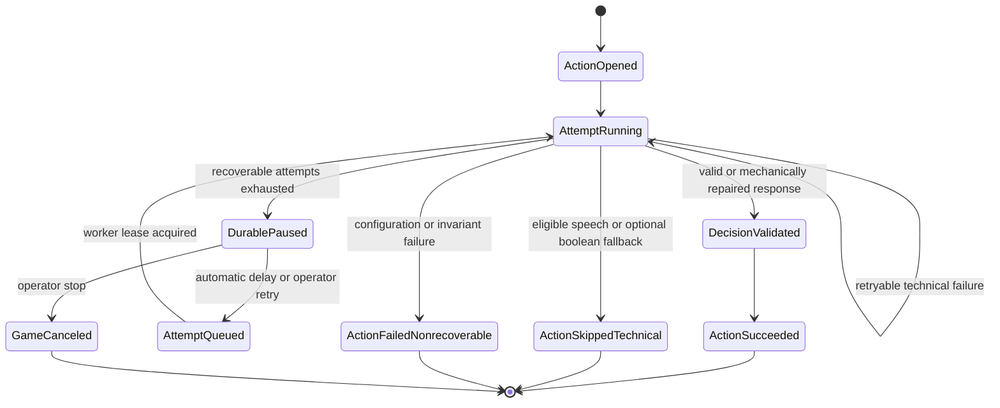

# Live V2 12 人完整对局稳定性修复开发文档

**Date:** 2026-08-05

**Status:** Approved for implementation

**Priority:** P0 Match Reliability / P0 Data Integrity

**Scope:** `apps/api` 的 Live V2 玩家库冻结、模型调用、输出解析、动作重试、持久暂停、跨进程恢复、事件审计与稳定性验收

**Source Runs:**

- 成功基线：`v2_game_8bbac29008ed4314` / `v2_run_d8623f50f85e4ba1`
- 失败与取消样本：本文件第 2 节列出的 9 条运行记录

**Related Designs:**

- `docs/live-v2-refactor-guidelines.md`
- `docs/superpowers/specs/2026-07-15-game-resume-continuity-remediation-design.md`
- `docs/superpowers/specs/2026-07-21-single-speech-delivery-stabilization.md`

## 1. 决策摘要

本次开发的核心决策是：

> 模型允许发生可恢复的技术故障，但单次空流、超时或机器格式错误不得直接终止完整对局。

实现必须同时满足以下约束：

1. 玩家模型始终来自已冻结的玩家库配置，不自动切换模型，不用临时模型覆盖玩家绑定。
2. `thinking` 只读透传模型配置，不因开启或关闭而进入不同业务逻辑。
3. 不设置模型上下文字符预算，不删除已知事件；历史选择仍必须保留可审计的 retained/dropped 证据。
4. 只重试技术故障和机器格式故障，不因模型做出错误策略判断而重试。
5. 原始请求、原始响应、失败码、修复动作、重试关系和最终结果必须完整保存。
6. 技术故障自动重试耗尽后，对局进入可持久恢复的 `paused_model_error`，不得立即进入 `failed`。
7. 必需目标动作不得用随机目标伪造模型决定。
8. 公共发言技术失败后可以明确跳过，但不得生成一句并非模型输出的伪造发言。
9. 无 TTS 运行不得实例化或调用外部 TTS；本开发不改变既有语音合同。
10. 历史失败、取消和成功记录全部保留，不进行清理或覆写。

本次开发不是简单地“多重试几次”。目标是建立可分类、可恢复、可重启、可审计的完整模型动作生命周期。

## 2. 已确认运行证据

### 2.1 十次运行结果

| 序号 | Game | 终态 | 停止阶段 | 模型请求 | 模型响应 | 请求失败事件 | 成功动作 | 失败动作 | 直接原因 |
| ---: | --- | --- | --- | ---: | ---: | ---: | ---: | ---: | --- |
| 0 | `v2_game_1a97c8d459504f12` | canceled | first_night | 4 | 0 | 0 | 3 | 0 | 首次误用旧模型覆盖，12/12 与玩家库不符，立即取消 |
| 1 | `v2_game_b2ea3efaff4c47df` | failed | day_1 | 31 | 30 | 1 | 45 | 1 | MiniMax 回显完整输入上下文，`model_decision_invalid_json` |
| 2 | `v2_game_b9534cb52e214d35` | failed | day_1 | 56 | 52 | 4 | 70 | 1 | DeepSeek 白天发言空流，`model_empty_stream` |
| 3 | `v2_game_f757454e025d4c7a` | canceled | day_1 | 61 | 57 | 4 | 75 | 0 | 暂停后外部跑局脚本复用幂等键，恢复冲突后取消 |
| 4 | `v2_game_b665de8d63d44e53` | failed | day_1 | 70 | 61 | 9 | 79 | 1 | DeepSeek 放逐投票空流，`exile_vote_failed` |
| 5 | `v2_game_5bf358b263744387` | failed | day_1 | 50 | 47 | 3 | 65 | 1 | GLM 输出 `{"explode": false}}`，`model_decision_structured_speech_leak` |
| 6 | `v2_game_95fe5190353c4c8c` | failed | day_1 | 79 | 65 | 14 | 83 | 1 | DeepSeek 放逐投票重试后仍为空流 |
| 7 | `v2_game_56d99aca74eb4dfd` | failed | day_1 | 87 | 77 | 10 | 95 | 1 | MiniMax 回显输出契约而非具体投票，`model_decision_invalid_speech` |
| 8 | `v2_game_4935b3aa9a974405` | canceled | day_1 | 52 | 35 | 16 | 50 | 0 | 豆包警长投票在 60/90 秒预算下连续 8 个恢复周期超时 |
| 9 | `v2_game_8bbac29008ed4314` | game_completed | day_4 | 169 | 169 | 0 | 230 | 0 | 狼人获胜，完整结束 |

除序号 0 的误建记录外，序号 1～9 的冻结玩家模型均为玩家库匹配 `12/12`。

### 2.2 失败类型汇总

未完成的正式运行中，共记录：

- 55 条超时尝试事件；
- 3 个最终空流失败；
- 3 个最终机器格式失败；
- 1 次外部跑局脚本幂等恢复缺陷；
- 1 次创建前没有阻止玩家库模型不匹配。

六局真正进入 `failed` 的运行全部停在第 1 天。第 1 天同时包含：

- 首夜结算后的法官播报；
- 12 人上警意愿；
- 竞选发言与退水；
- 警长投票；
- 全员白天发言；
- 狼人逐席自爆决策；
- 全员放逐投票及可能的加赛；
- 遗言与入夜播报。

因此第 1 天是模型调用最密集的阶段。当前“一个必需动作失败即整阶段失败”的策略会把低频模型故障放大为高频整局失败。

### 2.3 超时预算证据

旧默认值：

```text
first_token_seconds = 20
attempt_total_seconds = 60
action_total_seconds = 90
max_attempts = 2
```

最终成功局临时统一使用：

```text
first_token_seconds = 120
attempt_total_seconds = 180
action_total_seconds = 300
```

成功局中正常完成但超过旧预算的调用包括：

| 模型 | 动作 | 完成耗时 |
| --- | --- | ---: |
| `agent_plan/glm-5-2-260617` | exile_vote | 143.120s |
| `agent_plan/doubao-seed-evolving` | day_debate_speech | 105.613s |
| `agent_plan/glm-5-2-260617` | werewolf attack decision | 103.278s |
| `agent_plan/doubao-seed-evolving` | exile_vote | 95.246s |
| `agent_plan/minimax-m3` | werewolf attack decision | 92.307s |
| `agent_plan/glm-5-2-260617` | day_debate_speech | 92.234s |

这组证据表明 60/90 秒不是保守预算，而会主动取消本来能够成功的真实请求。

### 2.4 成功局基线

`v2_game_8bbac29008ed4314` 的最终证据：

- `status=awaiting_observation`；
- `phase_state=game_completed`；
- `winner=werewolves`；
- `completion_reason=deterministic_win_condition`；
- 2,631 条 V2 记录事件；
- 230 个 `action_opened`；
- 230 个 `action_succeeded`；
- 169 个 `model_request_started`；
- 169 个 `model_first_token_received`；
- 169 个 `model_response_received`；
- 0 个 `model_request_failed`；
- 0 个 `action_failed`；
- 169/169 个模型请求包含 prompt projection；
- `requests_with_drops=0`；
- `max_dropped=0`；
- 玩家库冻结模型匹配 12/12；
- 外部 TTS 客户端未实例化，外部 TTS 调用为 0。

成功局在动作引擎外层还吸收了 3 次瞬时空流。这进一步证明空流属于应该自动恢复的传输结果，而不是应该终止整局的业务决定。

## 3. 当前代码根因

### 3.1 空流默认不可重试

`V2ModelError.retryable` 默认是 `False`。`model_empty_stream` 创建错误时没有显式设置 `retryable=True`，因此空流不会进入自动重试，也不会进入人工暂停恢复。

当前行为：

```text
provider stream ends without text
  -> V2ModelError(model_empty_stream, retryable=False)
  -> no retry
  -> no paused_model_error
  -> action_failed
  -> day_runtime_failed
```

### 3.2 机器格式错误不在重试循环内

动作引擎的模型尝试循环只捕获 `V2ModelError`。解析产生的 `V2QualityError` 是独立异常类型，会穿过尝试循环，直接进入动作最外层失败处理。

因此以下错误都没有自动恢复机会：

- `model_decision_invalid_json`；
- `model_decision_invalid_shape`；
- `model_decision_invalid_speech`；
- `model_decision_structured_speech_leak`；
- 上下文回显；
- 输出契约回显。

### 3.3 可暂停错误范围过窄

`_can_pause_for_model_failure()` 当前只接受：

- `exc.retryable=True`；
- `model_first_token_timeout`；
- `model_total_timeout`。

空流和机器格式错误既不会自动重试，也不会进入持久暂停。

### 3.4 暂停恢复依赖当前进程内存

当前 `_PausedModelActionWaiter` 保存在 `V2ActionEngine._paused_model_actions` 内存字典中。

数据库能够保存：

- `model_action_paused`；
- `retry_model_action` 控制请求；
- `model_action_retry_requested`。

但真正唤醒动作依赖原进程内的 waiter 和尚未退出的协程栈。进程重启或外部临时运行器退出后，控制接口只能返回：

```text
admin_v2_model_action_retry_unavailable
The retry request was persisted, but the local paused action could not be resumed.
```

因此当前“持久暂停”只有持久状态，没有持久执行能力。

### 3.5 阶段失败升级过快

必需动作返回 `None` 后，Day/Night engine 将其解释为阶段失败，`fail_runtime()` 随即把：

- game status；
- phase state；
- run status；
- completion reason

全部写成失败终态。

当前没有“动作技术失败但对局仍可恢复”的中间语义。

### 3.6 玩家库绑定由调用方重复提交

创建 DTO 同时包含 `profile_id`、`model_provider` 和 `model`。这允许调用方选中玩家库昵称和人格，同时提交另一套模型。

序号 0 的误建记录说明，仅靠跑局脚本自觉不能保证玩家库模型不被覆盖。

## 4. 开发目标与非目标

### 4.1 目标

1. 可恢复模型技术故障不再产生整局失败。
2. 同一动作的所有尝试具有唯一 ID、明确父子关系和稳定幂等语义。
3. 自动重试由 API/runtime/worker 自己完成，不依赖外部跑局脚本。
4. 暂停动作在 API 或 worker 重启后仍能继续。
5. 玩家库继承模式由服务端解析并冻结模型，调用方不能覆盖。
6. 技术重试不改变模型、thinking、上下文、候选集合或规则状态。
7. 只缓存、提交和展示通过机械合同校验的模型结果。
8. 所有修复和降级均可在 V2 事件链中还原。
9. 真实策略错误保持 `observed_only`，不通过重试掩盖。
10. 用连续 20 局 12 人完整运行验证稳定性，而不是用单局成功替代验收。

### 4.2 非目标

- 不自动切换玩家模型；
- 不自动修改玩家库配置；
- 不专门关闭 thinking；
- 不给模型上下文设置字符预算；
- 不通过随机投票、随机落刀或随机技能目标伪造模型决定；
- 不重试合法但愚蠢的策略决定；
- 不改狼人杀规则、身份分配、胜负条件或阶段顺序；
- 不删除已有失败、取消或成功记录；
- 不在本工作包中重做 TTS、Live 展示或 Replay；
- 不为兼容旧运行路径保留第二套重试状态机。

## 5. 稳定性不变量

### 5.1 玩家模型不变量

当创建请求使用 `model_binding_mode=profile_library` 时：

```text
frozen.model_provider == VirtualPlayerProfile.model_provider
frozen.model == VirtualPlayerProfile.model
```

必须对所有座位成立，否则创建请求返回 409，且不得生成 `v2_game_records`。

冻结成功后，即使玩家库配置发生变化，已创建对局仍使用自己的 frozen snapshot。

### 5.2 模型尝试不变量

同一个 `action_id` 的技术重试必须保持：

- actor 不变；
- provider/model 不变；
- thinking 和 model parameters 不变；
- model-visible context 不变；
- candidates 和 allowed targets 不变；
- output contract 不变；
- action record seq 不变；
- 仅 `attempt_id`、attempt number 和 retry metadata 变化。

### 5.3 语义真实性不变量

- 合法目标但策略错误：接受并记录，不重试；
- 合法发言但内容错误：接受并记录，不重试；
- 违反输出机器合同：允许机械修复或同模型重试；
- 无法解析出模型决定：不得伪造为模型决定。

### 5.4 动作提交不变量

同一 `action_id` 最多只能有一个业务终态：

- `action_succeeded`；
- `action_skipped_technical`；
- `action_failed_nonrecoverable`；
- `game_canceled` 导致的取消。

`model_request_failed` 只是尝试结果，不等于动作终态。

### 5.5 展示不变量

技术重试期间不得提前创建重复 presentation、speech 或 voice asset。

只有模型决定通过合同校验并准备提交时，才允许进入展示与 TTS 生命周期。

## 6. 统一错误分类

引入明确的模型失败类别，避免用异常类继承关系隐式决定是否重试。

### 6.1 分类合同

建议新增：

```python
ModelFailureCategory = Literal[
    "transport",
    "timeout",
    "machine_format",
    "provider_configuration",
    "semantic_contract",
    "internal_invariant",
]
```

每个失败同时给出：

```python
@dataclass(frozen=True)
class V2ModelFailureDisposition:
    category: ModelFailureCategory
    code: str
    auto_retryable: bool
    pause_recoverable: bool
    preserve_raw_response: bool
```

### 6.2 失败矩阵

| 失败码/条件 | 类别 | 自动重试 | 耗尽后 | 说明 |
| --- | --- | --- | --- | --- |
| `model_empty_stream` | transport | 是，最多 3 次 | pause | 不应立即终止动作 |
| `model_transport_failed` | transport | 仅 retryable transport | pause | 保留 exception/errno |
| HTTP 429 | transport | 是，遵守 `Retry-After` | pause | 不切换模型 |
| HTTP 502/503/504 | transport | 是 | pause | 现有分类继续保留 |
| HTTP 400/401/403/404 | provider_configuration | 否 | pause + operator attention | 避免无意义重试风暴 |
| `model_provider_failed` | transport | 是，最多 3 次 | pause | 保存 provider request ID |
| `model_invalid_sse` / `model_invalid_event` | transport | 是 | pause | 上游流格式故障 |
| `model_first_token_timeout` | timeout | 是，最多 2 次 | pause | 使用统一 120/180/300 秒预算 |
| `model_total_timeout` | timeout | 是，最多 2 次 | pause | 不直接 fail runtime |
| `model_output_budget_exhausted` | machine_format | 是，最多 2 次 | pause | 同模型重发，不提高上下文预算 |
| `model_decision_invalid_json` | machine_format | 是，最多 2 次 | pause | 原始响应必须保存 |
| `model_decision_invalid_shape` | machine_format | 是，最多 2 次 | pause | 不猜业务语义 |
| `model_decision_invalid_speech` | machine_format | 是，最多 2 次 | pause/technical skip | 由动作类型决定 |
| `model_decision_structured_speech_leak` | machine_format | 是，最多 2 次 | pause/technical skip | 先尝试窄修复 |
| 合法目标但判断错误 | semantic_contract | 否 | success + observed_only | 保留真实模型行为 |
| 规则状态、候选集合或 DB 不变量错误 | internal_invariant | 否 | fail runtime | 这是系统缺陷，不应伪装恢复 |

### 6.3 术语修正

事件中的 `terminal` 必须拆分，避免“本次尝试终止”被误读为“动作或对局终止”。

新增字段：

- `attempt_terminal`；
- `action_recoverable`；
- `run_terminal`。

历史事件不迁移；新读取逻辑对旧 `terminal` 做兼容解释。

## 7. 重试策略

### 7.1 统一超时配置

正式配置调整为：

```dotenv
LIVE_V2_MODEL_FIRST_TOKEN_SECONDS=120
LIVE_V2_MODEL_ATTEMPT_TOTAL_SECONDS=180
LIVE_V2_MODEL_ACTION_TOTAL_SECONDS=300
```

这些值对所有玩家模型统一生效，不按 thinking 分支。

### 7.2 分类重试次数

建议策略：

```text
transport / empty stream: 3 attempts
timeout:                  2 attempts
machine format:           2 attempts
configuration:            1 attempt
semantic:                 1 attempt
```

这里的 attempts 包含第一次请求。

### 7.3 退避策略

- 普通传输与空流：`0.5s -> 2s`，加入小范围 jitter；
- HTTP 429：优先使用 `Retry-After`，没有时使用 `2s -> 8s`；
- 超时：不在同一 action deadline 内连续挤压第二次请求；第二次必须获得完整 attempt budget；
- 自动尝试耗尽后进入 durable pause，后台恢复使用独立 retry cycle。

### 7.4 同请求重试

技术重试必须使用第一次已经持久化的 `request_payload`，不能重新构建上下文。

原因：

- 避免 retry 时可见历史前进；
- 避免候选集合变化；
- 避免 prompt 模板版本漂移；
- 使多个 raw response 可以进行严格横向比较。

允许变化的字段仅限 Provider 要求的请求标识，不得改变消息内容和模型参数。

### 7.5 格式纠错提示

第一次机器格式失败后，第二次请求可以添加一个固定的 transport-level correction instruction，但不得添加新的游戏事实或策略提示。

示例：

```text
上一响应未满足机器输出格式。请只返回合同要求的 JSON 对象，
不要返回输入上下文、字段定义、Markdown 围栏或解释文字。
```

该 correction instruction 必须：

- 版本化；
- 写入 request payload；
- 不改变 candidates、rules 或 known events；
- 记录 `retry_reason=machine_format`。

## 8. 窄范围机械修复

在重试前允许执行以下确定性修复：

1. 去除单层 Markdown JSON 围栏；
2. 修复单个、明确不匹配的尾部 `}` 或 `]`；
3. 继续保留现有全角标点、智能引号和兼容键分隔符修复；
4. 对输出契约回显 envelope：
   - 若必需业务字段已经是合法标量；
   - 候选目标合法；
   - `speech` 仅是合同描述对象，且动作规定 speech forbidden；
   - 则提取业务字段，并记录 `repair_kind=contract_echo_envelope`；
5. 完整输入上下文回显且没有业务决定时，禁止推断，直接进入格式重试。

禁止：

- 从自然语言猜投票目标；
- 从推理文本猜技能决定；
- 为缺失目标选择随机候选人；
- 删除合法但质量差的玩家发言；
- 把机械修复后的内容冒充未经修复的原始响应。

修复成功必须在 `model_response_received` 中同时保存：

- `raw_response`；
- `parsed_output`；
- `repair_kind`；
- `repair_version`。

## 9. 动作耗尽后的产品行为

### 9.1 可技术跳过动作

| 动作 | 耗尽后的行为 | 是否生成模型发言 |
| --- | --- | --- |
| `day_debate_speech` | `action_skipped_technical`，公开显示“该玩家本轮因技术原因未发言” | 否 |
| `sheriff_campaign_speech` | `action_skipped_technical` | 否 |
| `last_words` | `action_skipped_technical` | 否 |
| `judge_day_summary` / completion summary | best effort skip | 否 |

系统提示是产品状态说明，不得以玩家身份播报，不得进入玩家原始 speech 字段。

### 9.2 保守布尔降级

以下动作可在配置明确开启时进行保守降级：

| 动作 | 技术降级值 |
| --- | --- |
| 是否上警 | `run=false` |
| 是否退水 | `withdraw=false` |
| 是否自爆 | `explode=false` |

要求：

- 事件类型必须是 `technical_fallback_applied`；
- `source=model_failure`；
- 不得写成正常 `model_response_received`；
- Admin 必须能区分模型决定和系统降级；
- 该降级不是模型策略评估样本。

### 9.3 不允许降级的必需目标动作

以下动作重试耗尽后必须 pause，不得随机选择：

- 警长投票；
- 放逐投票；
- 预言家查验；
- 女巫救人/毒人目标；
- 猎人开枪目标；
- 狼人最终落刀；
- 任何能够直接改变存活状态、身份信息或胜负的必需目标动作。

### 9.4 狼人并行偏好探测

现有 preference probe 已是 isolated failure，应保留：

- 单个狼人的初步偏好失败不终止整局；
- 至少一个有效偏好时继续团队决议；
- 全部偏好失败或最终团队落刀失败时进入 pause；
- 不用随机落刀代替团队决定。

## 10. 持久暂停与跨进程恢复

### 10.1 目标状态机



### 10.2 新持久化实体

新增 `v2_model_action_recoveries`：

| 字段 | 类型 | 说明 |
| --- | --- | --- |
| `game_id` | varchar(40) | FK，和 `action_id` 组成唯一业务范围 |
| `run_id` | varchar(40) | 当前 run |
| `action_id` | varchar(40) | 唯一动作 |
| `action_type` | varchar(80) | 动作类型 |
| `actor_kind` | varchar(20) | player/judge |
| `actor_id` | varchar(80) | 冻结 actor |
| `model_provider` | varchar(32) | 冻结 provider |
| `model_id` | varchar(120) | 冻结 model |
| `request_payload` | json | 第一次已持久化的精确请求 |
| `request_payload_hash` | varchar(64) | 防止 retry 漂移 |
| `failure_category` | varchar(32) | 第 6 节分类 |
| `failure_code` | varchar(80) | 最近失败码 |
| `attempt_no` | int | 全动作单调递增 |
| `retry_cycle` | int | 自动/人工恢复周期 |
| `state` | varchar(24) | paused/queued/leased/resolved/canceled |
| `next_retry_at` | timestamptz | 后台重试时间 |
| `lease_owner` | varchar(120) | worker 标识 |
| `lease_expires_at` | timestamptz | 崩溃回收 |
| `control_request_id` | varchar(36), nullable | 人工恢复请求 |
| `created_at` / `updated_at` | timestamptz | 审计时间 |

约束：

- `(game_id, action_id)` 唯一；
- 同时只能有一个 `leased` worker；
- `request_payload_hash` 在所有 retry cycle 中不变；
- resolved/canceled 后不可回到 queued；
- stop request 优先于新 lease。

### 10.3 执行架构

不再依赖暂停协程常驻内存。

新的职责拆分：

```text
Phase Engine
  -> open action
  -> persist exact model action job
  -> await durable decision state

Model Action Worker
  -> lease queued job
  -> call provider
  -> validate/repair/retry
  -> persist decision_ready or durable_paused

Phase Engine / Runtime Reconciler
  -> consume decision_ready exactly once
  -> commit game mechanics
  -> create presentation if needed
  -> continue phase
```

API/worker 重启后：

1. worker 回收过期 lease；
2. runtime reconciler 查询 generating/paused games；
3. 已有 `decision_ready` 但未 `action_succeeded` 的动作继续提交；
4. paused 动作继续等待 next retry/operator；
5. 已成功动作不得重复调用模型或重复展示。

### 10.4 人工重试幂等

`retry-model-action` 继续要求 `Idempotency-Key`，但服务端必须：

- 将一次控制请求绑定到一个 retry cycle；
- 重放相同 key 返回相同结果；
- 不要求外部调用方自己管理 attempt number；
- 当前动作已经 queued/leased 时返回 replayed success，而不是 409；
- 当前动作已 resolved 时返回已完成状态；
- 当前动作不存在时才返回不可恢复错误。

## 11. 玩家库冻结合同

### 11.1 创建请求

V2 创建 DTO 新增：

```json
{
  "model_binding_mode": "profile_library"
}
```

在该模式下，客户端只提交：

- `seat`；
- `profile_id`；
- 与本次对局相关的非模型开关，例如 `voice_enabled=false`。

服务端从 `VirtualPlayerProfile` 读取并冻结：

- name/personality；
- model_provider/model；
- model_parameters/thinking；
- delivery/voice 配置；
- model configuration version/update timestamp。

客户端提交的 model/provider 字段如果存在且不匹配，返回 409：

```text
v2_player_model_binding_mismatch
```

### 11.2 显式覆盖模式

本工作包不删除现有显式覆盖能力，但它必须：

- 使用不同的 `model_binding_mode=explicit_override`；
- 需要明确 Admin 权限；
- 在 frozen snapshot 和 `game_created` 中记录 override source；
- 不得由普通大厅或自动跑局默认使用。

### 11.3 创建后断言

创建事务提交前必须重新验证 12 个 frozen player：

```text
profile_library mode -> all bindings match current library row
```

失败则整个事务回滚，不允许先创建再由运行器取消。

## 12. 事件与可观测性合同

### 12.1 保留现有事件

- `action_opened`；
- `model_request_started`；
- `model_first_token_received`；
- `model_response_received`；
- `model_request_failed`；
- `model_retry_scheduled`；
- `model_action_paused`；
- `model_action_retry_requested`；
- `model_action_resumed`；
- `action_succeeded`；
- `action_failed`；
- `game_completed`；
- `game_canceled`。

### 12.2 新增事件

| 事件 | 触发点 |
| --- | --- |
| `model_response_repair_applied` | 窄范围机械修复成功 |
| `model_action_retry_exhausted` | 自动尝试耗尽、准备 pause |
| `model_action_recovery_queued` | durable job 进入队列 |
| `model_action_recovery_leased` | worker 领取 |
| `model_action_recovery_reclaimed` | lease 过期回收 |
| `model_action_decision_ready` | 校验后的决定持久化完成 |
| `action_skipped_technical` | 允许技术跳过的发言动作 |
| `technical_fallback_applied` | 保守布尔降级 |
| `action_failed_nonrecoverable` | 配置或内部不变量导致终止 |

### 12.3 指标

按 provider/model/action_type 统计：

- 请求数；
- 成功率；
- 空流率；
- 超时率；
- 格式失败率；
- 自动重试次数；
- pause 次数与持续时间；
- first-token P50/P95/P99；
- completion P50/P95/P99；
- repair_kind 分布；
- technical skip/fallback 分布；
- 完整对局完成率。

一次完整对局的可靠性报表必须同时给出：

- game/run IDs；
- frozen model match；
- model request/response/failure；
- action opened/succeeded/skipped/failed；
- retry lineage；
- context retained/dropped；
- winner/completion reason；
- 外部 TTS 调用情况。

## 13. 实现范围

### 13.1 `app/v2/model_client.py`

- 为所有 Provider 错误输出明确 failure disposition；
- 将 empty stream、provider failed、invalid SSE/event 正确分类；
- 识别 HTTP 429 和 `Retry-After`；
- 实现第 8 节的窄范围 repair；
- 保留 raw response，不在 client 内覆盖原始证据；
- 不把语义错误标记为 retryable。

### 13.2 `app/v2/action_engine.py`

- 将 `V2QualityError` 纳入统一尝试循环；
- 使用分类重试次数和统一超时；
- 自动重试耗尽后创建 durable recovery，而不是 fail action；
- 实现 technical skip/fallback 矩阵；
- 保证模型成功前不创建重复 presentation；
- 删除对外部运行器重试循环的依赖。

### 13.3 `app/v2/repository.py`

- 新增 recovery CRUD 和 lease 原子更新；
- 持久化 exact request payload/hash；
- 保证 decision ready 只提交一次；
- 新增事件；
- stop/cancel 能关闭 paused/queued/leased job。

### 13.4 `app/v2/live_runtime.py`

- 启动 recovery worker/reconciler；
- 应用启动时恢复未完成 job；
- websocket 重连不重复启动相同动作；
- terminal game 不再领取 job。

### 13.5 `app/v2/router.py` 与 `app/v2/control.py`

- retry API 只改变 durable recovery 状态；
- 不直接调用进程内 waiter；
- 重复控制请求返回幂等结果；
- 返回 paused/queued/leased/resolved 的明确状态。

### 13.6 创建与阵容预检

- 增加 `model_binding_mode`；
- profile library 模式由服务端解析模型；
- 创建事务内验证 frozen binding；
- 普通大厅与自动完整对局统一使用 profile library 模式。

### 13.7 配置

- 更新 `app/core/config.py` 默认值；
- 更新 `.env.example`；
- 配置校验保持 action total >= attempt total；
- thinking 继续由模型配置决定。

### 13.8 数据库迁移

- 新增 `v2_model_action_recoveries`；
- 迁移仅新增，不改写历史事件；
- 不删除旧 control request；
- 历史 paused game 不自动重放，除非显式运行 repair/resume 命令。

## 14. 测试计划

### 14.1 Model Client 单元测试

必须覆盖：

1. 第一次 empty stream，第二次有效响应；
2. 连续 empty stream，达到上限进入 pause；
3. HTTP 429 使用 `Retry-After`；
4. 502/503/504 自动重试；
5. 401/403 不自动重试；
6. invalid SSE/event 自动重试；
7. 单个多余尾括号修复；
8. contract echo envelope 提取合法 target；
9. 完整 context echo 不做语义推断；
10. 合法但错误的投票不重试；
11. repair 前后 raw response 均可审计；
12. thinking enabled/disabled 都走相同重试分类。

### 14.2 Action Engine 测试

1. 每个 retry 使用相同 request hash；
2. attempt ID 唯一、attempt number 单调递增；
3. 自动重试成功后只产生一个 `action_succeeded`；
4. empty stream 耗尽后 game/run 为 paused，不是 failed；
5. invalid JSON 耗尽后 game/run 为 paused；
6. public speech technical skip 不生成玩家 speech/TTS；
7. optional boolean fallback 产生独立事件；
8. required target 不允许 fallback；
9. stop while paused 能取消 job；
10. 重复 retry control 不重复调用 Provider；
11. presentation 和 voice asset 不重复；
12. 规则内部不变量错误仍然 fail closed。

### 14.3 跨进程恢复测试

使用确定性 fake Provider：

1. action 请求后 pause；
2. 终止 API/runtime 进程；
3. 重启；
4. worker 回收 lease；
5. 原 action 继续；
6. 成功结果只提交一次；
7. phase 从正确位置继续；
8. public/god projections 无重复；
9. websocket 客户端重连后状态正确；
10. 历史 presentation 不重播。

### 14.4 玩家库绑定测试

1. 12 个 profile library 玩家全部由服务端冻结模型；
2. 调用方提交不同 model 时创建返回 409；
3. voice_enabled=false 不改变 model binding；
4. 玩家库在创建后更新不影响 frozen game；
5. explicit override 需要权限并留下来源事件。

### 14.5 完整对局故障注入

使用确定性 Provider 在不同调用序号注入：

- 第 1 次请求空流；
- 第 30 次请求 invalid JSON；
- 第 60 次请求超时；
- 第 90 次请求 HTTP 503；
- 第 120 次请求 contract echo；
- pause 后进程重启；
- retry control 重放。

每个场景最终都必须进入确定性胜负，且不得出现重复动作。

### 14.6 真实模型连续运行

固定条件：

- 规则：`classic_12_seer_witch_hunter_idiot`；
- 玩家：玩家库发布的 12 个 profile；
- `model_binding_mode=profile_library`；
- 不覆盖模型；
- thinking 原样透传；
- 不设置上下文字符预算；
- 已知事件全部保留；
- 外部 TTS 关闭；
- 每局运行至确定性胜负。

连续运行 20 局，不因单局成功提前停止。

## 15. 验收标准

开发完成必须同时满足：

### 15.1 自动化门禁

- API V2 单元与集成测试全绿；
- 新增 error taxonomy、repair、retry、pause、restart 测试全绿；
- Alembic upgrade/downgrade 测试通过；
- existing V2 privacy、action、presentation 和 replay 测试无回归。

### 15.2 连续 20 局门禁

- 20/20 最终进入 `game_completed`；
- 可以发生 retry 和 pause/resume；
- recoverable technical failure 不得产生 `day_runtime_failed` / `night_runtime_failed`；
- 不得出现无法恢复的悬挂 generating/paused 状态；
- 每局 frozen player model match = 12/12；
- 模型切换次数 = 0；
- context dropped event count = 0；
- action opened = succeeded + skipped technical；
- action failed nonrecoverable = 0；
- required target technical fallback = 0；
- 外部 TTS 调用 = 0；
- 所有 presentation 均关闭；
- 所有 durable recovery job 均 resolved/canceled；
- 每局有唯一 winner 和 completion reason。

### 15.3 重启门禁

至少一局必须在 paused model action 时主动重启 API/runtime，重启后继续至终局，且：

- 不重复模型已成功动作；
- 不重复票、死亡、技能效果或公开发言；
- 不丢失历史；
- 不需要外部临时脚本接管。

## 16. 实施顺序

### Phase A：立即稳定现有进程内运行

1. 更新统一超时默认值；
2. 建立 failure disposition；
3. empty stream/transport/quality 进入自动重试；
4. 扩大 paused recoverable 范围；
5. 加入窄范围 repair；
6. 加入 profile library 创建强校验；
7. 完成单元与进程内集成测试。

Phase A 完成后，现有观察到的六类模型终止原因应全部变为成功、重试或 pause，但仍不能宣称支持进程重启恢复。

### Phase B：持久恢复

1. Alembic 新增 recovery table；
2. 实现 lease worker；
3. action engine 改为 durable decision handoff；
4. runtime reconciler；
5. control API 去除本地 waiter 依赖；
6. 完成 crash/restart 集成测试。

### Phase C：技术跳过、可观测性与管理

1. speech technical skip；
2. optional boolean fallback；
3. retry/repair/recovery 事件；
4. Admin 详情展示尝试链和暂停原因；
5. 稳定性指标与单局审计摘要。

### Phase D：真实连续对局验收

1. 运行固定故障注入矩阵；
2. 运行连续 20 局真实 12 人无 TTS 对局；
3. 对失败或暂停逐条按 action/attempt 审计；
4. 全部门禁通过后才标记稳定性开发完成。

## 17. 回滚与数据策略

- 数据库迁移只新增表和索引；
- 不删除历史 game/run/event/control request；
- 新代码回滚时保留 recovery table，不做破坏性 downgrade；
- 尚未 resolved 的 recovery job 在回滚前必须停止领取；
- 已成功业务动作不得因回滚重新执行；
- 不通过删除失败记录提高表面完成率；
- 稳定性统计必须同时包含 completed、failed、canceled 和 paused。

## 18. 明确拒绝的方案

以下方案不进入开发：

1. 某个模型失败后自动换成另一个模型；
2. 将全部玩家临时改为同一个“更稳定”模型；
3. 关闭 thinking 来规避慢响应；
4. 丢弃较早历史来缩短请求；
5. 对必需投票或技能随机选择候选人；
6. 把模型错误发言重写成看起来正确的发言；
7. 只靠外部脚本无限调用 retry API；
8. 通过删除失败运行记录制造稳定率；
9. 只跑一局成功就宣布修复完成；
10. 保留两套可分流的旧/新模型动作状态机。

## 19. 完成定义

本开发文档对应工作只有在以下条件全部满足后才可标记完成：

- Phase A、B、C 代码和测试完成；
- 真实 20 局门禁完成；
- 至少一次进程重启恢复完成；
- 玩家库模型冻结 12/12 全部正确；
- 无自动模型切换；
- 无上下文事件丢弃；
- recoverable technical failure 不再结束整局；
- Admin 能还原每个 action 的请求、响应、失败、repair、retry 和最终提交；
- 历史失败记录仍然保留；
- 用户确认真实连续对局稳定性达到预期。
