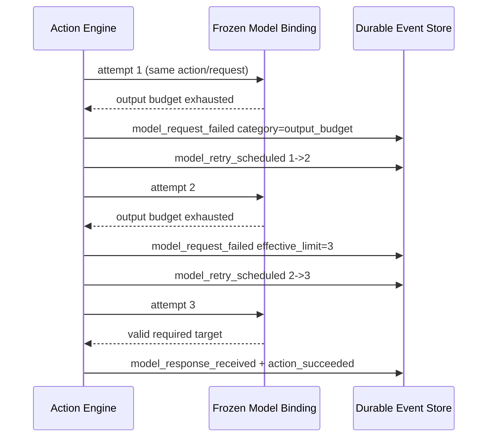

# Live V2 模型输出预算、自动恢复与长尾耗时治理开发文档

**Date:** 2026-08-10

**Status:** 用户已批准进入开发；A/B/C1/D 与 E1 离线 harness 已实现并完成聚焦验证；V12 发布与外部实验仍被 cutover/billing 门禁及尚未实现的 E1 live runner 阻断

> 2026-08-20 核对：代码的 `MODEL_CONTEXT_SCHEMA_VERSION` 已是 **13**，本文写作时的 V12 cutover 描述已被后续变更覆盖。E1 live runner 在代码中仍无对应实现。本文的延迟分析与失败分类仍是当前实时提速工作的主要依据。

**Priority:** P0 Failure Semantics / P0 Automatic Recovery / P1 Generation Latency / P1 Context Efficiency / P1 Queue Throughput

**Source Game:** `v2_game_f29d64c8a34045e6`

**Source Run:** `v2_run_6bf43d276750431f`

**Key Action:** `v2_action_c6633e326c6d4574`

**Scope:** `apps/api` 的 Live V2 模型流、失败分类、自动重试、冻结生成策略、V12 模型上下文与 Provider 准入；`apps/admin-web` 的模型请求诊断与 V12 上下文展示；隔离 text-only 验收

**Related Designs:**

- `docs/superpowers/specs/2026-08-08-live-v2-model-context-v11-contract-hardening-design.md`
- `docs/superpowers/specs/2026-08-05-live-v2-full-match-stability-remediation-design.md`
- `docs/live-v2-refactor-guidelines.md`
- `docs/live-v2-realtime-action-protocol.md`

## 0. 审批边界

本文以开发前规格为主，并在不改写原审批边界的前提下补充实施结果。

开发前门禁要求先完成：

1. 固化实局证据；
2. 给出按风险排序的工作包；
3. 完成独立文档 review 并修订；
4. 等待用户明确回复“通过”“进入开发”或同等含义的批准。

用户已于 2026-08-10 明确回复“通过，进入开发”，因此 A/B/C1/D 与 E1 的离线验证工具已获准按本文范围实施。该批准仍不等于 Git commit、push、生产发布、修改生产 Provider 并发、清理存量对局、回放 f29 私密冻结请求或产生未经确认的按量费用。

用户批准前不得修改运行时代码、测试、数据库、环境并发值或现有对局状态。文档批准只授权本文“本次实现范围”中的代码和隔离验证；不授权 Git commit、push、生产发布、回放含私密身份的冻结请求或修改生产 Provider 配额。

## 1. 结论与实施顺序

### 1.1 事故定性

这局不是终局失败，也不是卡死：

- `game_completed` 已在 `record_seq=3018` 持久化；
- 胜方为 villagers，原因为 `deterministic_win_condition`；
- `execution_released` 已在 `record_seq=3028` 持久化；
- `awaiting_observation` 是完成后的展示状态，不是仍在等待模型；
- 六个 action window 全部关闭，唯一 recovery 已 resolved。

本局真实问题有四个：

1. 模型把全部输出预算耗在 reasoning，流结束时没有可见 JSON，当前却被归入 `machine_format`；
2. 阻塞型必选目标动作即使原 action budget 足够，也会在第二次 output-budget 失败后暂停等管理员；
3. 大部分模型 wall time 发生在首 token 之后、首个可见文本之前，现有 timeout 只能识别首 token、idle 和硬截止；
4. Agent Plan 的 Provider 级并发槽为 3，长 GLM 请求会使同 Provider 的短请求排队。

### 1.2 推荐实施顺序

| 顺序 | 工作包 | 本次范围 | 预期直接结果 |
| --- | --- | --- | --- |
| 1 | A：`output_budget` 独立分类与完整流诊断 | 实施 | 失败语义正确，成功/失败都能解释 reasoning、finish reason、usage 与耗时阶段 |
| 2 | B：阻塞型必选目标的第三次自动重试 | 实施 | 在原 action budget 足够时自动完成，不再无谓等待管理员 |
| 3 | C1：动作级 reasoning-only 预算合同与 shadow 观测 | 实施；不 enforce | 为后续安全截断积累按模型、动作类别分层的数据，不改变现有模型思考参数 |
| 4 | D：V12 可逆的语义无损紧凑上下文 | 实施，独立版本切换门 | 减少重复结构和请求字符，不删除历史事实、原始发言或私密事实 |
| 5 | E1：Agent Plan 并发 3→4→6 隔离 canary | 验证，不改生产默认 | 找到安全吞吐点，量化 queue、active latency 与错误率 |
| 条件项 | C2：reasoning-only timeout enforce | 本次不实施 | 只有 shadow 门槛满足并再次批准后才启用 |
| 条件项 | E2：Provider 内公平调度 | 本次不实施 | 只有 canary 后仍存在多局饥饿才设计并实现 |

工作包必须顺序执行。A/B 不等待 V12；D 不得反向阻塞已经确认的失败恢复修复；C2/E2 不因本文件获批而自动启用。

### 1.3 明确否决的“快修”

本次不做：

- 不单纯提高 `max_tokens`；本局 4096/8192 已出现 reasoning-only 耗尽，盲目增加只会扩大费用和长尾；
- 不单纯提高 300 秒 hard timeout；五个 hard timeout 直到截止前仍持续产生 reasoning delta；
- 不提高 first-token 或 stream-idle timeout；全部 26 个失败 attempt 都已经收到 headers 和 reasoning first token；
- 不关闭所有 boolean/target 动作的 Thinking；自爆、投票和技能目标都可能直接决定胜负；
- 不自动降低 `reasoning_effort`、换模型、换 Provider、改变 temperature 或重写冻结请求；
- 不用系统随机目标、规则推测目标或 computed strategic hint 伪造模型决定；
- 不恢复固定 8K 字符裁剪、最近 N 条、模型生成摘要或只保留派生 claim；
- 不把字符数称为 token 数、context window 使用量或窗口溢出证据；
- 不用一局的模型混合样本直接宣布某模型质量或稳定性更优。

## 2. 实局证据基线

### 2.1 全局时间线

| 项目 | 结果 |
| --- | ---: |
| Run wall time | 12,597.6 秒（3小时29分57.6秒） |
| 模型请求区间并集 | 约 2小时18分47秒 |
| 管理员前人工等待 | 4,224.401 秒（70分24.4秒） |
| 人工等待占整局 | 33.5% |
| 扣除模型区间与人工等待后的其他时间 | 约 46 秒 |

模型区间按并行 attempt 去重后计算，不能把所有 attempt 耗时直接相加为整局 wall time。

### 2.2 请求与失败分布

| 指标 | 数量 |
| --- | ---: |
| 物理模型 attempts | 208 |
| 逻辑模型 actions | 188 |
| 成功 attempts | 182 |
| 失败 attempts | 26 |
| 曾受失败影响的 actions | 18 |
| 后续模型响应恢复 | 12 |
| technical false fallback | 4 |
| technical speech skip | 1 |
| blind wolf attack action_failed | 1 |

失败分类：

| 失败码 | attempts | actions | 证据 |
| --- | ---: | ---: | --- |
| `model_output_budget_exhausted` | 19 | 12 | 有 headers、reasoning first token，无首个可见文本，finish reason 为长度类 |
| `model_attempt_hard_timeout` | 5 | 5 | active 约 300 秒，持续 reasoning，非 idle |
| `model_empty_stream` | 2 | 1 | DeepSeek 同一动作短暂空流，第三次成功 |

失败分布为 GLM 12、DeepSeek 7、Doubao 7、MiniMax 0，但玩家、动作、轮次、上下文长度与模型绑定混杂，因此只能描述本局观察值，不能建立模型因果排名。

### 2.3 耗时阶段

成功请求：

| 指标 | P50 | P90/P95 | Max |
| --- | ---: | ---: | ---: |
| active completion | 42,278 ms | P95 180,162 ms | 298,560 ms |
| wall（queue + active） | 49,230 ms | P95 180,294 ms | 298,593 ms |
| queue | 86 ms | P95 50,566 ms | 84,289 ms |
| headers | 1,722 ms | P95 4,337 ms | 11,225 ms |
| first token | 2,118 ms | P95 4,713 ms | 30,424 ms |
| first visible text | 33,267 ms | P95 175,933 ms | 297,588 ms |

成功 active 时间约 95.8% 发生在首 token 之后。主要瓶颈不是连接、鉴权、模型名或首 token，而是 reasoning 到首个可见 JSON/正文的长尾。

五个 hard timeout 的 reasoning delta 数为 3,107～6,519，最大相邻增量间隔仅 253～347 ms，最后进度发生在 299,970～299,994 ms。它们是持续工作撞到硬截止，不是 stream idle。

### 2.4 关键暂停动作

`v2_action_c6633e326c6d4574` 是 night 5 狼队顺序最终归票：

| Attempt | 参数 | 结果 | active |
| --- | --- | --- | ---: |
| 1 | GLM 5.2；Thinking enabled/high；8192 | output budget exhausted | 约 175.4 秒 |
| 2 | 同上 | output budget exhausted | 约 172.8 秒 |
| 3 | 同上 | 成功，raw response 95 字符 | 166.022 秒 |

三次 `request_payload`、provider、model 和 parameters 完全相同；第三次只更换 attempt identity。第二次失败时原 action budget 仍余 271,146 ms，足以覆盖按前次 observed elapsed 估算的第三次尝试。当前 `model_failure_disposition()` 把该错误的 `max_attempts` 固定为 2，才导致：

```text
05:32:13.853Z action_paused
06:42:38.254Z operator_retry
06:45:24.xxxZ third attempt succeeded
```

因此最窄恢复修复是“有资格的第三次自动 attempt”，不是扩大 timeout 或改变模型参数。

### 2.5 上下文规模

关键请求的 V11 `prompt_projection`：

| 项目 | 数值 |
| --- | ---: |
| serialized chars | 59,372 |
| known events chars | 54,749（92.2%） |
| known events | 123 |
| future filtered | 0 |
| budget dropped | 0 |
| raw speech chars | 9,543 |

123 条事件含 86 条 public 与 37 条 actor-private；大量 `record_seq/known_at_seq`、scope、occurrence 和引用字段重复。证据支持“结构重复值得紧凑化”，但不支持“模型窗口溢出”。

### 2.6 Provider 排队

Agent Plan 与 Ark 当前各使用 Provider 级进程内 semaphore，Agent Plan 默认上限为 3。Agent Plan 本局 145 个 attempts 中：

- 29 次 queue ≥10 秒；
- 17 次 queue ≥30 秒；
- 总 queue 约 1,180.876 秒；
- MiniMax 本身完成较快，但 queue P95 约 59.78 秒，表明它会被同 Provider 长 GLM 请求占槽。

queue wait 当前在 admitted 后被加回 action deadline，所以不消耗 active action budget；它仍真实增加用户 wall time。后续 canary 必须同时报告 wall 和 active，不能把 queue 改善误报为模型生成变快。

## 3. 目标、非目标与不变量

### 3.1 本次扩大验收包总目标

在不改写模型真实策略、不删除可见事实、不切换模型的前提下，让 Live V2：

1. 正确区分“没有形成机器输出”与“形成了非法机器输出”；
2. 对现行执行器中没有 target-kind 技术兜底的 blocking required-target 动作，在预算允许时自动完成第三次同语义尝试；
3. 精确测量首 token 后 reasoning-only 长尾；
4. 用可逆、可审计的 V12 编码减少上下文重复；
5. 用受控 canary 决定 Provider 并发，不凭单局直接改生产默认。

这是用户要求按推荐顺序展开的扩大验收包。每个工作包仍只有一个可观察结果，并按第14.1节独立发布、独立回归；对本文的批准不自动批准 C2、E2、生产并发或发布操作。

### 3.2 本开发包对耗时问题的承诺边界

本包不会把“已能观测 reasoning-only 长尾”写成“已经缩短模型 active latency”：

- B 直接消除符合条件的第二次失败后无限等待管理员这一段人工 wall time，但第三次本身仍可能消耗约一次完整模型生成时间；
- C1 只冻结分类并做 shadow telemetry，绝不提前终止请求，因此本阶段对 active reasoning P50/P95 不承诺改善；
- D 的验收结果是请求结构体积减少且语义无损，只有配对基准能报告其 completion 相关性，不能承诺字符减少等比例转化为耗时下降；
- E1 的直接目标是减少 Provider queue 和 batch wall time；它不能让已经 admitted 的单个模型更快。

真正对 reasoning-only active 长尾执行提前截止属于 C2，必须等 C1 达到第 7.6 节门槛、重新提交阈值与质量影响报告并再次获批。因此本次可交付的是“失败恢复落地 + active 长尾可决策数据 + 上下文与排队的安全优化前置条件”，不是虚构一个未经验证的生成耗时 SLA。

### 3.3 明确不做

- 不修正模型的狼人杀推理、投票选择或发言质量；
- 不因合法但“看起来差”的策略重试；
- 不增加输出字数、句数或自然语言风格限制；
- 不重做大厅、规则目录、玩家资料、Replay、TTS 或 Mobile Live；
- 不新增模型路由、自动模型降级或跨 Provider fallback；
- 不改变技术 speech skip 和 boolean false fallback 的现有语义；
- 不改变 queue wait 不计入 active action budget 的现有合同；
- 不更改历史事件或回填历史 `failure_category`；
- 不自动迁移已冻结 V11 `rule_snapshot` 到 V12。

### 3.4 必须保持的不变量

1. 同一逻辑 action 的自动重试保持相同 `action_id`、request payload、provider、model、Thinking、reasoning effort、max tokens、候选集与上下文版本。
2. 每次物理请求使用新的 `attempt_id`，并由 `retry_of_attempt_id` 形成无环 lineage。
3. 自动重试不能重置 action deadline；queue wait 仍按现合同从 active budget 排除。
4. 模型策略错误、合法低质量输出和缺失 optional `decision_note` 不触发技术重试。
5. required target 缺失或非法仍由应用层冻结候选校验拒绝；不得随机补齐。
6. 所有模型可见身份继续只使用 `seat_N`；normal 与 god-view Mobile 都不接收模型诊断、私密上下文或 usage。
7. V12 保留每条可见原始 speech 的 Unicode 原文恰好一次；派生索引不能替代原文。
8. `authority`、`epistemic_status`、`visibility`、owner、occurrence、record/known 时序不得因紧凑编码丢失。
9. `task.at_seq` 后的事件、其他 actor 的私密事实和 dangling references 必须 fail closed。
10. V12 紧凑编码必须可确定性展开为 canonical V11 语义对象并通过 hash/round-trip 校验。
11. 模型 reasoning 内容本身不持久化；只保存计数、时间、finish reason 和 Provider 提供的规范化 token usage。
12. 未知 generation policy/action classification 安全回落为完整战略预算或 fail closed，绝不误套短预算。

## 4. 当前代码根因

### 4.1 失败类别混淆

`apps/api/app/v2/model_client.py` 当前的 `V2ModelFailureCategory` 没有 output-budget 类别。`model_output_budget_exhausted` 被映射为：

```text
category = machine_format
retryable = true
pausable = true
max_attempts = 2
```

这混淆了两个不同阶段：

- output budget：Provider 没有产生任何可见机器输出；
- machine format：已经产生文本，但 JSON/字段/候选合同不合法。

结果是 output-budget 会污染 `machine_format_failure_count` 和 decision-family 的格式失败预算。

### 4.2 流结束诊断丢失

`_stream_text_admitted()` 已经在流中统计：

- response headers；
- provider request id；
- first token 与 first text；
- reasoning/text delta count；
- max inter-delta；
- last progress；
- finish reason。

但流结束后抛出的 output-budget/empty-stream 错误只带 `code` 和 `retryable`。所以 DB 中这些失败看起来像 `reasoning_delta_count=0`，实际只是异常构造时丢失。

### 4.3 第三次 attempt 被静态 cap 阻止

`action_engine.py` 的全局 retry policy 已允许最多 3 次，action 总预算为 620 秒；实际条件使用：

```python
cycle_attempt_no < min(policy.max_attempts, disposition.max_attempts)
```

output-budget disposition 的 `max_attempts=2` 使第三次永远不会开始，哪怕 remaining action budget 足够。

### 4.4 没有 reasoning-only deadline

现有 stream timer：

- first-token：从 admitted 到首 token；
- stream-idle：任意 reasoning/text delta 都刷新；
- attempt-hard：从 admitted 起不可重置。

持续 reasoning 会一直保持 stream active，直到 hard timeout。系统已经观测 first visible text，但没有独立的 reasoning-only budget。

### 4.5 V11 重复结构

V11 保留全量可见历史是正确性选择，但 known events 的每个事件重复 scope、occurrence、record/known seq 和派生引用字段。该诊断促成了 Work Package D；D 现已实现 Compact V6，但只有通过独立 cutover 门禁的新局才可使用。既有 V11 请求的 `budget_dropped_event_count=0` 仍是正确事实，也不应被误读为已经在历史局上做过结构压缩。

### 4.6 Provider 级 FIFO gate

当前 `_ProviderGate` 是按 Provider 创建的 semaphore。它限制并发但不感知 game/model/action，也不提供 Provider 内公平顺序。提高 cap 可能减少 queue，也可能增加 429、5xx 或 active latency，必须先 canary。

## 5. Work Package A：`output_budget` 与完整诊断

### 5.1 新失败分类

将 `V2ModelFailureCategory` 增加：

```text
output_budget
```

分类规则：

| Failure code | Category | Base max attempts | Pausable |
| --- | --- | ---: | --- |
| `model_output_budget_exhausted` | `output_budget` | 2 | yes |
| `exc.code in {model_decision_contract_missing, model_decision_contract_invalid}`，无论异常具体为 `V2QualityError` 或 `V2ModelError` | `internal_invariant` | 1 | no |
| `isinstance(exc, V2QualityError)` 且 code 不在上一集合（当前含 invalid JSON/shape/boolean/target/note/speech、required target missing、ambiguous objects、structured speech leak） | `machine_format` | 2 | yes |
| `model_first_token_timeout/model_stream_idle_timeout/model_attempt_hard_timeout/model_total_timeout` | `timeout` | 2 | yes |
| `model_transport_failed/model_empty_stream/model_invalid_sse/model_invalid_event/model_provider_failed` 或 retryable HTTP | `transport` | 3 | yes |
| 配置缺失、参数非法及其他明确 4xx | `provider_configuration` | 1 | no |

旧事件不改写。Admin 和聚合必须同时接受历史 `machine_format + model_output_budget_exhausted` 与新 `output_budget`。

新分类不计入：

- `machine_format_failure_count`；
- `prior_machine_format_failures`；
- `automatic_machine_format_budget`；
- 投票 decision-family 的格式失败 lineage。

它必须进入独立 lineage，而不是完全取消跨 action 的上限：

```text
output_budget_failure_count
last_output_budget_attempt_id
last_output_budget_failure_code
prior_output_budget_failures
automatic_output_budget_budget
```

`V2ActionFailure`、`V2SpeechSpec`、recovery snapshot 与 request/failure audit 分别增加上述适用字段。machine-format 和 output-budget 两套计数永不互相增减；旧记录缺少 output-budget lineage 时按 0 解析，不从历史 machine-format 反推。

### 5.2 Provider usage 规范化

扩展 `_ProviderEvent`，从 Provider 明确返回的 usage 中只接收非负整数并规范化为：

```json
{
  "input_tokens": 0,
  "output_tokens": 0,
  "reasoning_tokens": 0,
  "total_tokens": 0,
  "cached_input_tokens": 0
}
```

字段全部 optional。映射：

- Responses：`response.usage.input_tokens/output_tokens/total_tokens` 与 `output_tokens_details.reasoning_tokens`；
- Chat Completions：`usage.prompt_tokens/completion_tokens/total_tokens` 与 `completion_tokens_details.reasoning_tokens`；
- cached input 只从明确的 `input_tokens_details.cached_tokens` 或 `prompt_tokens_details.cached_tokens` 映射；
- Provider 没有返回、返回负数/布尔/未知形状时忽略；
- 每个 usage snapshot 独立规范化，不跨 snapshot 拼接字段；优先取最后一个 terminal 合法非空 snapshot，若协议没有 terminal usage 才取最后一个合法非空 snapshot；
- `usage_update_count` 是合法非空 normalized snapshots 数；任一相同字段在两个合法 snapshots 中取不同值时 `usage_conflict_observed=true`，最终仍按上一条确定性规则选择；
- 不保存任意 raw usage 对象，防止协议漂移和无界 payload。

`finish_reason` 使用固定枚举 `completed/stop/length/max_output_tokens/content_filter/tool_calls/unknown`：Responses 完成态记为 `completed`，不完整态映射明确 reason；Chat Completions 映射协议 finish reason。分类只识别 `length/max_output_tokens`，未知值只记 `unknown`，不得保存无界原文或猜成 output-budget。

`reasoning_tokens` 视为 Provider 所报 output token 的子集，不再次加到 `output_tokens`。Provider 的 `total_tokens` 与 input/output 不一致时保留 Provider 原值并记录 `usage_consistency=provider_total_mismatch`；缺字段不自行补算，完整一致记 `exact`，无法判断记 `unavailable`。

字符统计和 token usage 分栏展示。usage 缺失时必须显示 unavailable，不做字符到 token 的推算。

### 5.3 成功与失败的对称诊断

`V2ModelError`、`_StreamResult`、`V2ModelDecision` 增加 nullable 字段：

- `finish_reason`；
- `provider_usage`；
- `reasoning_only_elapsed_ms`。

output-budget 和同一流结束分支的 empty-stream 错误必须带齐：

- `failure_stage=stream`；
- provider request id；
- sanitized response headers；
- first token seen/ms/kind；
- first visible text ms；
- finish reason；
- active elapsed ms；
- queue wait/provider in-flight/provider limit；
- reasoning/text delta count；
- max inter-delta 与 last progress；
- provider usage。

`model_response_received` 成功事件同步持久化 finish reason、usage 与 reasoning-only elapsed。这样成功/失败能使用同一口径比较。

### 5.4 重试停止原因

`model_request_failed` 新增 nullable 审计字段：

```text
effective_attempt_limit
retry_delay_ms
required_retry_window_ms
automatic_retry_scheduled
automatic_retry_stop_reason
```

枚举：

```text
automatic_retry_stop_reason:
  not_retryable
  decision_family_budget_exhausted
  attempt_limit_reached
  insufficient_action_budget
```

保留现有 `max_attempts` 表示全局 policy 上限；`effective_attempt_limit` 表示本失败与动作合同实际采用的上限，避免破坏旧字段语义。

`model_request_failed` 是不可变的事实，只能记录 append 时已经确定的 retry decision，不能预写最终 resolution。`model_retry_scheduled` 同步记录 `effective_attempt_limit`、`required_retry_window_ms` 与 `failure_episode_id`。

不新增 `model_failure_resolved` 写事件。最终 resolution 在写路径中尚未发生，把它另起事务追加会产生“outcome 已提交、resolution 尚未提交”的 crash gap；强行保证唯一性又需要额外表/唯一约束和迁移，不符合本次最窄修复。

改为给每段连续模型失败生成稳定的 `failure_episode_id`：

```python
material = "\0".join(
    ["v1", game_id, run_id, action_id, str(retry_cycle), first_failed_attempt_id]
).encode("utf-8")
failure_episode_id = "v2_mfep_" + sha256(material).hexdigest()[:24]
```

episode 从某 retry cycle 的首个 `model_request_failed` 开始；该 cycle 后续的 failed/retry/started 事件，以及第一个真正 terminal evidence 之前的 response/technical/pause/action-failed 事件携带同一 ID。accepted `model_response_received` 一经提交就终结 episode 并清空 action engine 中的 active ID；之后的 normalization、TTS、recording 或 action failure 属于另一个问题，绝不能继续携带旧 ID。管理员恢复后的新 retry cycle 只有再次发生失败时才产生新 episode。ID 只用于内部审计，不发给模型或 Mobile。

Admin API 在同一数据库只读 snapshot 中，按 `failure_episode_id` 与 `record_seq` 确定性聚合，不由 UI 猜测：

| Durable evidence | Derived resolution |
| --- | --- |
| 后续 accepted `model_response_received` 携带同一 episode ID | `automatic_retry_success` |
| technical skip/false supporting event 与其后 `action_succeeded` 都携带同一 episode ID、action ID，且 record sequence 正确 | `technical_skip` / `technical_false_fallback`；primary resolution ref 指向 `action_succeeded`，同时返回 supporting ref |
| `model_action_paused` 携带同一 episode ID | `operator_pause` |
| `action_failed` 携带同一 episode ID，并由 repository 同事务显式写 `failure_episode_disposition=isolated_action_failure` | `isolated_action_failure` |
| `action_failed` 或其他 terminal runtime-failure event 显式携带该 ID/ID 列表与 `failure_episode_disposition=run_failure` | `run_failure` |
| `game_canceled.canceled_failure_episode_ids` 包含该 ID | `run_canceled` |
| 尚无上述 durable evidence | `unresolved` |
| 同一 episode 出现互斥 terminal evidence | `invariant_conflict`，展示全部 event refs 并告警，不按优先级掩盖 |

聚合结果同时返回 `source_attempt_ids`、`resolution_event_type/id/record_seq`。`model_retry_scheduled` 只代表后续请求已计划，绝不算 resolution。旧事件没有 episode ID 时显示 `legacy_unavailable`，不按时间戳反推。

crash/ownership-lost 后如果只有 failure/retry 而没有 outcome，聚合保持 `unresolved`。当前代码没有 started-run takeover/reclaimer，`start_and_claim_execution()` 不能接管这类 run，因此本包不能把“新 worker 继续该 episode”写成已有能力或验收项；它只能等现有管理员 cancel，或未来另立 takeover 设计。不得为了让 Admin 看起来完整而补写虚构 outcome。

具体恢复边界：

1. 只有成功提交了带 `failure_episode_id` 的 `model_request_failed` 才算 episode 已开始；因 fence/stop 拒绝而未提交的 failure 不创建幽灵 episode；
2. operator recovery 仍使用当前 frozen recovery snapshot；如果新 retry cycle 的首个 attempt 再失败，才以该新 cycle 与新 first-failed attempt 生成新的 episode ID；
3. `cancel_game()` 在已持有 game row lock 的同一事务内，扫描 current run 中所有有 failure、无 terminal evidence 的 episode，把排序后的 ID 列入 `game_canceled.canceled_failure_episode_ids`，同时完成现有 recovery/window/presentation 取消、owner 字段清理和 `game_canceled` 写入；不在 stop 生效后调用普通 `append_event`；
4. 所有把 run/game 置为 failed 的事务也必须在同一 game lock 下扫描 open episodes，并把排序 ID 写入实际 terminal event 的 `failed_failure_episode_ids`。覆盖 `repository.fail_action/fail_phase_transition`、`match_repository.fail_runtime` 的 day/runtime/max-round 路径与 `night_repository.fail_runtime` 的 ability runtime 路径；不得只处理 action engine 自己的异常；
5. `fail_action()` 不盲信 action engine 内存中的 episode ID；它在 game lock 下用共享 deriver 确认 ID 仍 open，只有仍 open 才附到 `action_failed` 并同事务写显式 `failure_episode_disposition=isolated_action_failure|run_failure`。已被 accepted response、pause 或 technical success 终结的 ID 不得再次传播；同一 action type 可能在不同调用点是 isolated 或 blocking，Admin 禁止按 action type、最终 game status 或时间接近度推断；
6. technical outcome 仍是现有两阶段事务：supporting event 已提交但 `complete_silent_action()` 的 `action_succeeded` 尚未提交时保持 unresolved；若随后 `action_failed` 或 cancel，则分别按显式 disposition 或 canceled list 终结，不能提前报 technical resolution；`complete_silent_action()` 增加 nullable episode ID 与 `technical_outcome_record_seq`，并写入 `action_succeeded`，让聚合器验证 supporting event 的 game/action/episode/type/先后关系；
7. Admin 聚合运行在单一事务 snapshot；相同事件集永远得到相同结果，重复读取不产生任何写入，因此天然幂等。

抽取唯一共享纯函数 `derive_failure_episodes(events)`，输入按 `record_seq` 排序的单一 run 完整事件列表，输出 open/terminal/conflict episode。Admin 的 `all_game_events()` 必须先按 `run_id` 分组、逐 run 派生，禁止把重开局前后的 episodes 合并；cancel 和 fail-runtime 只传 current run。三类调用都使用同一函数，禁止复制两套 terminal 判定。repository 在持有 game lock 后物化 events；由于所有 V2 event append 同样先取得该 game lock，扫描结果与随后 terminal event append 之间不会插入另一条该游戏事件。

Admin 的增量接口不能只用 source failure 的旧 record seq 判断是否返回。每个聚合条目新增 `resolution_updated_at_record_seq`；当 outcome/cancel/runtime-failure 的 record seq 大于调用方 `after_record_seq` 时，必须重新返回该 episode 的所有 source attempts，即使这些 failure attempts 本身更早，避免 UI 永远停留在 unresolved。

持久化边界必须同时修正现有 per-attempt 标志时序：

- action engine 在 model target resolution/context projection 前初始化 cycle 1、首个 attempt ID 与 attempt state；因此 pre-provider failure 也能持久化稳定 attempt/retry-cycle 并派生 episode，而不伪造 `model_request_started`；
- `model_request_failed` append 成功后立即设置 `model_failure_recorded=True`，再写 binding-health 等旁路审计；旁路 append 失败不得让 outer handler 为同一 attempt 再写第二条 model failure；
- accepted `model_response_received` append 成功后立即设置 `model_request_completed=True` 并清空 active failure episode，再写 health/repair/normalization 等旁路事件；其后 repository、审计、TTS 或 action error 不得把已接受的模型请求重写成 `model_request_failed`；
- `pause_model_action()` 事务提交 `model_action_paused` 后同样立即清空 action engine 的 active episode；随后 broadcast、等待 operator 或进入新 retry cycle 时发生的错误不得复用已由 pause 终结的 ID，repository 的 under-lock open-check 是最后防线；
- generic outer fallback 只有在真正的 `V2ModelError` 或模型上下文投影错误、且该 attempt 尚无 durable success/failure 时才允许补 model failure；repository/audit append 错误按 internal runtime/action failure 处理，不能伪装成模型故障。

`derive_failure_episodes()` 还必须验证：

- episode ID 能由首个 failure 的 game/run/action/retry-cycle/attempt 重算；每条新 failure 都必须写 `retry_cycle`，provider start 之前的 projection/config failure 固定从 cycle 1 开始；
- source model lifecycle events（failed/retry/started/accepted response）的 run/action/cycle 与 model audience 一致，record sequence 单调，attempt 不重复；存在 physical start/retry 时 lineage 必须连续；`model_not_configured`、`model_parameters_invalid`、model-context projection invariant 等 pre-provider failure 允许没有 started event，但不允许缺 attempt/retry-cycle；
- terminal evidence 保留既有安全 audience，不要求与 private model lifecycle 相同；action-level evidence 只接受白名单 event type、同 game/run/action、严格位于 source failure 之后，并验证显式 disposition 或 supporting record ref。两类 run-level 例外都必须显式列出 open IDs：`game_canceled` 通过 `canceled_failure_episode_ids` 关联；白名单 `day_runtime_failed/ability_runtime_failed/match_runtime_failed/game_phase_transition_failed` 通过 `failed_failure_episode_ids` 关联；
- 任何跨 run/action 传播、source lifecycle audience 漂移、重复 attempt、ID 不匹配、存在 physical events 时 lineage 断裂或 terminal 冲突都产出 `invariant_conflict`，不静默修复。

### 5.5 Admin 投影

Admin request summary/detail 增加：

- finish reason；
- normalized usage；
- reasoning-only elapsed；
- reasoning/text delta counts；
- max gap/last progress；
- effective attempt limit；
- failure episode ID、服务端 derived resolution、outcome/supporting event refs、`resolution_updated_at_record_seq`；
- generation policy（Work Package C 完成后）。

展示顺序固定为：queue → headers → first token → reasoning-only → first visible text → complete/fail。normal/god-view Mobile 与公开 Live 不新增字段。

### 5.6 数据库兼容

事件 payload 使用 JSONB；recovery 表 `failure_category` 是无 CHECK 的 `String(40)`。本工作包不需要 Alembic migration，也不回填历史事件。所有 API/Admin 新字段 nullable，旧事件解析为 `null`。

## 6. Work Package B：阻塞型必选目标第三次自动重试

### 6.1 资格谓词

新增纯函数 `is_blocking_required_target(spec)`，只有同时满足以下条件才有第三次 output-budget attempt：

```text
decision_contract.kind == target
decision_contract.target_mode == required
allowed_target_ids 非空
best_effort == false
isolated_failure == false
```

这不是 action-type 白名单；资格来自冻结 action spec 的输出合同与阻塞语义。当前 `_technical_exhaustion_outcome()` 只覆盖 `kind=speech` 和 `kind=boolean`，target-kind 没有技术兜底，因此不把“无兜底”伪装成一个不存在的合同字段。若未来要给 target 新增兜底，必须先新增并冻结显式 `technical_exhaustion_mode`，不能靠 action-type 集合暗中改变本谓词。

以下明确不符合：

- `decision_contract.kind == speech` 的动作；
- boolean self-explosion/sheriff run/withdraw；
- private memory；
- preference probe；
- 并发批处理中可释放的 isolated target；
- best-effort 动作。

`kind=target + target_mode=required + speech_mode=required` 仍然符合资格；源动作就是这一组合，不能因为它同时要求一句狼人私聊 speech 而被误排除。

### 6.2 有效 attempt 上限

新增纯函数：

```python
effective_model_attempt_limit(spec, exc, disposition, policy)
```

规则：

1. 只有 `exc.code == model_output_budget_exhausted` 且资格谓词为 true 时，返回 `min(policy.max_attempts, 3)`；
2. 其他 output-budget 保持 `min(policy.max_attempts, 2)`；
3. 存在 decision-family output-budget 时，再受 `automatic_output_budget_budget - prior/current failures` 约束；
4. transport、timeout、machine-format、provider configuration 全部保持现有语义；
5. 若部署设置的全局 max attempts 小于 3，不越过该上限。

### 6.3 Decision-family 总上限

day vote 的同一冻结 decision family 可能依次经过 `concurrent_initial -> concurrent_recovery -> sequential_recovery`。如果只把 output-budget 从 machine-format 移走而不新增独立 family budget，一个 voter 最坏会得到 2+2+3 次 output-budget attempts，属于不可接受的重试放大。

因此 day vote 增加：

```text
_VOTE_OUTPUT_BUDGET_AUTOMATIC_BUDGET = 3
```

规则：

1. family 的所有逻辑 actions 累计最多 3 次 automatic output-budget failures；
2. 每个 isolated action 自身仍最多 2 次，但还要取 family remaining 的最小值；
3. 例如 initial 已失败 2 次，concurrent recovery 只剩 1 次，不可再发 2 次；
4. family 到 3 后，sequential blocking path 使用 `V2PreflightPauseFailure` 的 output-budget lineage 直接进入 durable pause，不再发第四次；
5. operator retry 属于显式新 retry cycle，沿用现有可恢复语义并完整审计，不伪装为 automatic budget；
6. 没有 decision-family 的源关键 blocking action，仍可在同一 action 内使用 3 次上限。

`day_engine.py` 的 concurrent recovery eligibility 必须同时检查 machine-format remaining 与 output-budget remaining；两类 preflight failure 各自引用最后一次对应 category 的 attempt/code。不能让类别分离改变既有 machine-format family budget。

Decision-family 的 resolution 归属固定如下：isolated action 的 failure episode 在该 action 的 durable `action_failed` 后派生为 `isolated_action_failure`，到此已经终结。后续 sequential blocking action 因 family budget 在 preflight 直接暂停时没有新的物理模型失败，也就不得复用 source episode 再派生一个 `operator_pause`。preflight pause 只在 `model_action_paused` 中携带按 family chronology 排序、去重的 `source_failure_episode_ids` 作为耗尽来源，并可保留现有 latest source attempt；一次 family budget 可能由 initial 与 concurrent-recovery 两个已终结 episodes 共同消耗，不能只记最后一个。它不是新的 model failure episode。若未来需要 family-level episode，必须定义不同 ID namespace 和合同，不能复用 action episode。

### 6.4 第三次预算窗口

第三次不能只因“还剩 1 秒”就启动。仅在第二次 output-budget 失败后计算：

```text
observed_window = min(attempt_total_seconds, previous_attempt_active_elapsed)
required = retry_delay + observed_window
start_third = action_remaining > required
```

若 previous elapsed 缺失、非法或为零，fail closed 使用完整 `attempt_total_seconds`。第一次失败到第二次 attempt 保持现有 output-budget 窗口语义，不引入额外限制。

本局第二次失败后：

```text
action_remaining ~= 271.146s
previous_attempt ~= 172.8s
retry_delay < 1s
```

因此有资格自动第三次；如果只剩几十秒则停止并进入现有 pause/recovery。

### 6.5 事件序列

预期成功链：



第三次仍在原 action cycle 与 deadline 内，不产生 operator recovery，不更换 action、模型或 payload。

### 6.6 失败与 fallback 语义

- 第三次仍失败：blocking action 按现有流程进入 durable pause；
- budget 不足：不启动第三次，记录 `insufficient_action_budget` 后 pause；
- isolated target：单 action 最多两次，跨 decision family 自动 output-budget 总数最多三次；
- speech-kind action：保持两次后的 technical skip；
- boolean-kind technical action：保持两次后的 explicit false fallback；
- 任何 fallback 事件继续说明是 technical outcome，不伪装为模型决定。

## 7. Work Package C1：冻结的 generation policy 与 shadow budget

### 7.1 为什么本次不立即 enforce

本局存在真实成功请求：

- exile vote 首个可见文本最高 297,588 ms；
- self-explosion 最高 268,571 ms；
- wolf attack 最高 218,863 ms；
- private memory 最高 176,026 ms；
- day speech 最高 115,574 ms。

因此统一 120/180 秒 first-visible 截止会杀死真实成功策略，自动 retry 还可能把 wall time 和 queue 放大。C1 只建立冻结合同、归一计时、shadow 命中统计和 Admin 审计，不中断请求。

这意味着本开发包中只有 A/B 已直接落地错误分类与人工暂停修复；D/E1 当前只是 context/queue 优化的确定性前置，D 尚未 cutover，E1 也没有 live runner 或实测结果，因此不构成 context、queue 或 active latency 已改善的证据。C1 的完成结果是得到安全启用 C2 所需的可信分层数据；在 C2 另行批准前，不能宣称“模型生成耗时已经解决”。

### 7.2 合同位置

在 `rule_snapshot` 顶层新增独立合同：

```text
model_generation_policy_contract
```

它与 `model_context_contract` 平行，不能放入 `model_configurations` 或玩家的 canonical model parameters。原因：

- `thinking/reasoning_effort/max_tokens` 是模型绑定配置；
- reasoning-only timeout 是游戏执行策略；
- 已开局和 operator resume 必须继续使用同一冻结执行策略；
- server/Admin 热变不能改变运行中游戏的行为。

### 7.3 V1 合同草案

```json
{
  "schema_version": 1,
  "classification_version": 1,
  "enforcement": "observe_only",
  "reasoning_parameter_mode": "inherit_frozen_model_configuration",
  "default_profile": "strategic_full",
  "profiles": {
    "strategic_full": {
      "reasoning_only_timeout_ms": null,
      "timeout_max_attempts": 2
    },
    "recoverable_public_speech": {
      "reasoning_only_timeout_ms": 180000,
      "timeout_max_attempts": 1
    },
    "isolated_auxiliary": {
      "reasoning_only_timeout_ms": 240000,
      "timeout_max_attempts": 1
    }
  },
  "action_profiles": {
    "day_debate_speech": "recoverable_public_speech",
    "sheriff_campaign_speech": "recoverable_public_speech",
    "sheriff_pk_speech": "recoverable_public_speech",
    "exile_pk_speech": "recoverable_public_speech",
    "exile_last_words": "recoverable_public_speech",
    "first_night_last_words": "recoverable_public_speech",
    "private_round_memory": "isolated_auxiliary"
  }
}
```

180/240 秒只是 shadow 候选，不是启用阈值。未列出的 vote、ability、target、boolean 和未知动作全部回落 `strategic_full`。

### 7.4 计时语义

统一使用 `reasoning_only_timeout_ms`，不是含首 token 抖动的 admission-to-first-visible timer：

1. admitted 到首 token：仍由现有 first-token timeout 负责；
2. 首个 reasoning/text token 到首个 non-whitespace visible text：reasoning-only timer；
3. reasoning delta 不重置该 timer，但继续刷新 stream-idle；
4. 首个非空 text 出现后取消 reasoning-only timer；
5. 后续仍由 stream-idle 与 attempt-hard 约束；
6. queue wait 不进入任何 active timer；
7. shadow 模式只计算 `would_timeout`，绝不取消流。

派生：

```text
reasoning_only_elapsed_ms = first_visible_text_ms - first_token_ms
```

若没有 visible text，则使用 failure/completion elapsed 减 first token；没有 first token 时为 null。

### 7.5 冻结与兼容

- 新游戏冻结 current generation policy，并写入 `game_created`；
- `V2ActionClaim` 把合同传到 action engine；
- `model_request_started` 写 resolved provider/model/profile/action type/classification version、source、shadow limit、enforcement、reasoning parameter mode，并将尚不可计算的 `shadow_would_timeout` 显式写为 null；
- 每个 `model_response_received` 和 `model_request_failed` 重复写上述分层 identity，并写 `reasoning_only_elapsed_ms`、`shadow_would_timeout`；无法计算时显式为 null；
- output-budget、empty-stream、hard-timeout 和其他失败 attempts 都进入 shadow 分母，不能只统计成功响应；
- operator resume 使用原合同；
- legacy game 缺少合同：兼容为 disabled，保持现有行为；
- 合同存在但 version/shape 未知：`unsupported_model_generation_policy_contract` fail closed；
- 不在运行时根据 action name 的新代码偷偷改变旧冻结合同。

### 7.6 C2 启用门槛

C2 不在本次实施范围。未来启用必须同时满足：

1. 每个 `(provider, model_id, policy_profile, classification_version, action_type)` 保留独立切片；启用门槛至少在 `(provider, model_id, policy_profile, classification_version)` 上满足 100 个成功 attempts，或每 Provider 至少 30 且聚合至少 100；
2. 候选阈值不小于成功分布 P99 + 20% headroom；
3. shadow 对最终成功请求的误命中率 ≤1%；
4. technical skip/fallback、pause、整局完成率和策略质量没有恶化；
5. 相同 action/context 的重复配对基准支持 Provider-specific 分叉；否则继续 provider-neutral；
6. 新的 enabled 合同升版并只作用于新游戏；
7. 再次提交开发/启用审批。

即使未来 enforce，也不自动关闭 Thinking、降 effort 或改变 max tokens。

## 8. Work Package D：V12 可逆紧凑上下文

### 8.1 版本 tuple

当前实际 current tuple 为：

```text
(model_context=11, prompt=4, known_events=5, ledger=5, model_view=5, selector=2)
```

V12 最窄 tuple：

```text
(12, 5, 6, 5, 5, 2)
```

只升级真正改变的 model context、prompt template 与 known events。Discourse Ledger V5、model view V5 和 selector V2 若输出/选择语义不变，不做无意义升版。

V12 runtime 的 supported tuple 只包含完整 `(12,5,6,5,5,2)`。V11 的 Prompt 3/4 属于 V11 历史合同，不能仅把 Prompt 4 塞进 V12 legacy set；未来若只改 V12 prompt，再按同一 context tuple 显式注册其 legacy prompt。

### 8.2 设计原则

V12 是“语义无损、确定性可逆”的编码，不是摘要：

- 先构造并校验 canonical known events；
- 模型请求使用 `encode_v6(canonical)`；
- 被动 observation 继续使用 canonical 展开视图；
- Admin 可用 `expand_v6()` 展示与验证；
- `expand_v6(encode_v6(canonical_v5)) == canonical_v5`；
- speech 原文、法官事实、actor-private 事实和时序零删除；
- annotations/questions/relations 只作引用索引，不能替代 speech。

`model_observation.py` 目前读取 V11 风格的顶层 `visibility/kind/data/speech`，因此不能把压缩结构直接传入 observation context。模型输入和内部 observer 必须在 canonical 校验后分叉。

### 8.3 Known Events V6 形状

示意：

```json
{
  "schema_version": 6,
  "encoding": "lossless_refs_v1",
  "defaults": {
    "record_seq": "known_at_seq",
    "event_ref": "record_seq_string_when_equal",
    "scope_ref_by_kind": {
      "player_statement": "public"
    },
    "occurred_in_ref_by_kind": {
      "player_statement": "night_5"
    }
  },
  "scope_catalog": {
    "public": {
      "visibility": "public"
    },
    "actor_private": {
      "visibility": "actor_private",
      "owner_scope": "player",
      "owner_ref": "seat_4"
    }
  },
  "occurrence_catalog": {
    "night_5": {
      "period": "night",
      "round_no": 5
    }
  },
  "events": [
    {
      "event_ref": "2736",
      "kind": "player_statement",
      "known_at_seq": 2736,
      "speech": "原始发言只出现一次",
      "data": {}
    }
  ],
  "annotations": [
    {
      "source_event_ref": "2736",
      "source_annotation_index": 0,
      "claim_type": "..."
    }
  ],
  "questions": [],
  "relations": []
}
```

具体编码规则：

1. chronological events 始终为单一全局有序数组，不按 scope 或 round 拆流；
2. `record_seq == known_at_seq` 时省略 record seq；不同或未知时显式保存；
3. event ref 可由 record seq 无歧义恢复时省略，否则显式保存；显式 `event_ref=null` 非法，不能与省略混同；
4. encoder 按 event kind 选择出现次数最多的 `scope_ref` 与 `occurred_in_ref` 作为确定性默认；并列时按 ref 字典序；事件值等于 kind 默认时省略，不同时显式 override；某 kind 有 occurrence 默认但 canonical event 没有 `occurred_in` 时，必须写 `occurred_in_ref=null` 抑制默认；
5. scope/occurrence 使用可读语义 key，禁止 `a/b/1/2` 等不可审计短码；同 key 对应不同对象时 fail closed `compact_catalog_key_collision`，不得后写覆盖；
6. authority、epistemic status、owner 和 visibility 可以由 catalog 引用，但展开后必须逐事件完整恢复；
7. 原始 speech 只在 source event 保存一次；V6 顶层 annotation 使用 `source_event_ref + source_annotation_index`，expand 后按 index 精确恢复为 V5 对应 event 的 `annotations[]`；question/relation 保持原数组顺序和全部引用；
8. 空数组/空对象只在 schema 明确允许且展开等价时省略；
9. 不做模型生成摘要，不生成新的战略结论，不重新解释旧发言。

这里的 `canonical_v5` 精确定义为 Known Events V5 的完整语义对象：`schema_version/events/questions/relations`，每个 event 含其原始 `annotations[]`。源事件没有 `record_seq` 时，V6 使用显式 unknown/null 标记；expand 后由 canonicalizer 恢复为同一“未知”语义，不能把 `known_at_seq` 伪造成真实 record seq。

Canonical hash 算法固定为：

```python
canonical_bytes = json.dumps(
    canonical_v5,
    ensure_ascii=False,
    allow_nan=False,
    sort_keys=True,
    separators=(",", ":"),
).encode("utf-8")
canonical_sha256 = hashlib.sha256(canonical_bytes).hexdigest()
```

hash root 仅为完整 `known_events` canonical V5 对象，不含外围 task/persona/metadata。所有 catalog/reference 在 hash 前必须成功展开；missing ref、duplicate event ref、annotation index 冲突或 catalog collision 一律 fail closed。

### 8.4 投影审计元数据

元数据只进入审计，不回塞模型输入：

```text
canonical_serialized_char_count
compact_serialized_char_count
compaction_saved_chars
compaction_ratio
verbatim_speech_count
verbatim_speech_chars
retained_event_refs
dropped_event_refs
canonical_sha256
round_trip_verified
```

硬门禁：

- `dropped_event_refs == []`；
- retained refs 与 canonical 可见 refs 完全相等；
- speech count/Unicode text byte-exact；
- canonical hash before/after expand 相等；
- reference closure、chronology、future cutoff、private owner 全通过；
- f29 脱敏 fixture 的 known-events 字符减少至少 20%，否则 V12 复杂度收益不足，不发布。

减少 20% 只证明结构体积改善，不承诺 completion latency 按比例下降。延迟必须由同模型、同动作、同语义的配对基准另行报告。

发布前还要用不含存量私密身份的固定 seat-only 长上下文 corpus 做 V11/V12 配对请求。覆盖本局出现的四个模型绑定，每个绑定固定 20 对、V11/V12 顺序交错，共最多 160 个外部请求。

100% 门槛只适用于本地可确定的投影、隐私、round-trip 与引用不变量，不要求随机模型 100% 输出合法。外部基准的 primary denominator 是每个 variant 的全部 80 个请求；只有 Provider/stream 成功、应用解析通过、冻结候选/字段合同接受的请求才记为 `valid_adopted_decision=1`，output-budget、任意 timeout、empty-stream、transport、machine-format 和 application rejection 全部记 0，不能只看 application-invalid。

模型门槛为：每个模型的 20 个 V12 请求最多比其 20 个 V11 请求少 1 个 valid adopted decision，且四模型聚合的 80 个 V12 请求最多比 80 个 V11 请求少 1 个。每个 failure category 和 Provider HTTP 状态另行逐项报告。

延迟同时报告两组，避免 survivor bias：

1. 全部 80 对的 `active_terminal_elapsed_ms`，失败请求取从 admitted 到 durable success/failure 的实际 elapsed；其 paired median 回退不得超过 10%；
2. 双侧都得到 valid adopted decision 的 valid-valid 子集，报告 paired median/P95、样本数，以及因 V11-only failure、V12-only failure、both-failed 被排除的 pair 数；valid-valid paired median 回退也不得超过 10%。

只有 valid-rate 门槛先通过时才允许解释 latency 门槛，防止“更快失败”伪装成性能改善。P95 作为带样本量的描述指标，不做 1 个百分点伪精度判断。输入 token 只有在 Provider 返回 usage 时报告，不从字符数估算。该基准检查表示变更是否明显伤害输出合同，不宣称随机模型决定逐次相同。

### 8.5 V11/V12 切换

- V11 历史记录继续可读；Admin 使用通用 raw/canonical 展示；
- 新 runtime 只执行/恢复 current V12；
- 上线前 DB preflight 必须按下面的 terminal predicate 证明所有 V11 都是安全历史记录；
- 任一 V11 不满足安全历史 predicate 就中止 V12 部署，由管理员明确完成、取消或重建；
- 禁止修改旧 `rule_snapshot`、自动迁移合同或让旧 action 混用 V12 prompt；
- 首个 V12 游戏创建后，旧 V11 binary 不能安全恢复 V12，运行时回滚必须 fix-forward；
- 可独立暂停新游戏创建，不影响历史读取。

V12 不需要 Alembic migration；版本合同随新游戏冻结。

安全历史 predicate 必须全部满足：

1. `project_v2_runtime_state.match_status in {completed, canceled, failed}`；
2. completed 必须有 `phase_state=game_completed`、winner、completion reason、`run.completed_at` 与 durable `game_completed`；canceled 必须有 game/run canceled 与 durable `game_canceled`；failed 必须有 game/phase/run failed 和对应 durable runtime/action failure 证据；
3. `execution_state=stopped`，且 current run 的 `worker_id/worker_heartbeat_at/lease_expires_at` 全为 null；
4. 没有 `closed_at IS NULL` 的 live presentation、action window 或 ability activation；
5. 没有 state 非 `resolved/canceled` 的 model action recovery，也没有 recovery lease；
6. 没有未终止 voice asset/recording/finalization；
7. completed/failed 路径要求 terminal event 后有 execution release，或对应 terminal repository transaction 已原子清空 owner/heartbeat/lease；canceled 路径明确接受现有 `cancel_game()` 同一事务写入 `game_canceled`、清空 owner/heartbeat/lease 并递增 fence，不能额外要求一个不会产生的 `v2_run_execution_released`；从未取得 ownership 的局可由完整 ownership 审计字段证明；
8. `current_run_id` 与被检查 run 一致，避免漏查旧 attempt 或错把非 current run 当终态。

实际阻断状态至少包括 `waiting_to_start/ready/generating/broadcasting/finalizing/paused_model_error`，以及 match_status 仍为 running/waiting 的 `awaiting_observation`。`awaiting_observation` 不能单独作为 terminal 判断；源 f29 只有同时满足上述 completed predicate 才是安全历史记录。

### 8.6 Admin 展示

当前 Admin presentation/parser 对 schema 11 有硬编码。改为：

- V11：历史 raw/canonical 只读展示；
- V12：专用 renderer，显示 compact 与 expanded audit；
- 未知 schema：raw JSON + unsupported 提示，不猜测字段；
- 不使用 `schema >= 11` 共享错误解析；
- 显示 retained/dropped refs、round-trip、hash 与 compaction ratio；
- 不向 Mobile 暴露 catalog、私密事实或审计元数据。

### 8.7 实施记录（2026-08-10）

已完成：

- current runtime tuple 精确冻结为 `(12,5,6,5,5,2)`，V11 Prompt 3/4 仅作为历史读取，runtime/start/claim/channel 对 missing、V11、unknown 合同 fail closed；
- `model_context_compaction.py` 实现 canonical V5→Compact V6→canonical V5 的纯函数 round-trip、canonical SHA-256、逐字 speech、引用闭包、私密 owner、时序与 null/override 校验；
- 模型请求使用 Compact V6，`model_observation.py` 继续接收 canonical V5；Prompt Template 5 明确解释 catalog、按 kind defaults、override、`occurred_in_ref=null` 与 `record_seq=null`；
- 静态脱敏 f29 fixture 来自最大 V11 request 的结构与字符串长度分布，不含原始发言、私密 ID 或完整 game ID；冻结 131 events、44 speech/10015 chars，canonical 59872 chars→compact 46161 chars，减少 13711 chars（22.90%），zero drop 且 hash/round-trip 通过；
- Admin 列表不展开 V6；详情只对目标 attempt 展开一次，并同时校验外层 schema/prompt、完整 tuple、内层 schema/prompt 与 V6 encoding；V11/unknown 缺失 persisted payload 不使用当前模板伪重建；浏览器只消费后端 `verified` canonical；
- 新增只读 `preflight-v12-model-context-cutover` CLI。真实本地数据库扫描结果为 `scanned=152, safe=3, blocking=149, ignored_current_v12=0, deployable=false`；源 f29 满足 safe history predicate。

因此 D 的代码实现与本地确定性验证已完成，但发布门禁尚未通过：不得创建首个 V12 真局、不得切换 runtime，也不得把 D 标记为已发布。V11/V12 160 次外部配对基准因无法确认无 overage 而暂停；不得用本地字符压缩结果替代模型合法率/active latency 证据。

## 9. Work Package E1：Agent Plan 并发 canary

### 9.1 为什么先 canary

现有并发上限已经是启动配置：

```text
LIVE_V2_AGENT_PLAN_MAX_IN_FLIGHT=3
```

本局证据支持 queue 长尾，但没有 4/6 并发下的 429、5xx、active latency 或吞吐证据。直接硬编码 6 不安全。

### 9.2 隔离实验

顺序固定为 3 → 4 → 6；4 不通过则不跑 6。实验拆成两个不可混淆的部分：

1. 固定 workload benchmark：隔离 API 进程使用同一 seat-only synthetic corpus、同一模型/action mix、同一 prompt contract；各 cap 的运行时段交错，corpus 内顺序使用固定种子随机化，避免把时间漂移或整局随机性当作并发效果；
2. 真局 smoke：只在选出通过门槛的最小 cap 后运行一局新建 12 人 text-only 游戏，验证状态机/取消/连接池，不拿这局和其他 cap 做严格性能对比；
3. 两部分均从服务端关闭 TTS；
4. 每档 benchmark 固定 120 个 admitted attempts，不得无限“至少”追加；
5. 记录进程数，计算 `per_process_limit × live_instances` 的总 Provider 并发；
6. 不回放 f29 的冻结私密 payload；若要做存量私密请求 A/B，另行征得明确授权。

指标：

- queue P50/P95/max；
- active completion P50/P95/max；
- wall completion；
- batch/game completion；
- 429、502、503、504 和其他 5xx；
- success、output-budget、hard-timeout 比率；
- Provider headers 的 rate-limit 信息；
- provider in-flight 实测峰值。

### 9.3 Go/no-go

4 相对 3 必须同时满足：

- queue P95 至少改善 30%；
- batch wall 至少改善 15%；
- active completion P95 恶化不超过 10%；
- success rate 下降不超过 1 个百分点；
- 429+5xx 增量不超过 1 个百分点；
- 无连接池泄漏、permit 泄漏、取消死锁或跨 Provider 串行。

6 使用同一门槛与 4 比较。选择最小的通过值，不追求最大并发。生产默认和部署环境值的修改必须在报告结果后单独确认。

### 9.4 外部调用硬预算

文档批准后的全部外部模型验证受以下 ceiling 约束：

| 项目 | 硬上限 |
| --- | ---: |
| V11/V12 配对 | 160 requests；4 小时 |
| cap=3 benchmark | 120 requests；2 小时 |
| cap=4 benchmark | 120 requests；2 小时 |
| cap=6 benchmark | 仅 cap=4 通过后，120 requests；2 小时 |
| 选定 cap 真局 smoke | 1 局；最多 250 attempts；4 小时 |
| 全部实验合计 | 最多 770 requests；14 小时；配置 output-token ceiling 6.4M |

各阶段上限和全局上限以先到者为准。实际 Provider usage 可得时，总 input+output token 达 12M 立即停止；usage 不可得时以 request/attempt/wall ceiling 为硬停止。不得为实验切换到未经批准的按量付费 endpoint、提高模型 max tokens 或产生 overage；若当前套餐不能确认不产生额外账单，外部实验暂停并再次请求用户批准。任一安全/错误率门槛提前失败时立即停止该档，不为凑样本继续烧请求。

### 9.5 离线 harness 实施结果

本次只实现可复现、fail-closed 的离线实验前置，不执行外部模型请求：

- 固定 seat-only V12 corpus 为每档 120 个 attempts、10 个 wave、每 wave 12 个；模型与动作类别配额、随机种子、corpus hash 和 schedule hash 均冻结；
- 默认 CLI 只做 dry-run，明确报告 `external_model_requests=0`、`http_client_created=false`、无数据库访问和无 TTS；
- future-live 前置校验要求显式确认外部调用与费用、有效预算账本、固定 corpus/schedule 和完整 attempt identity；当前拒绝任何 cap=6 live 计划，未来只能由同一受信进程根据本轮 cap=3/4 observations 当场决定是否进入 cap=6，外部聚合报告不能授权跳档；
- 当前 binary 即使所有前置成立也以 `live_execution_not_implemented` 拒绝，不创建 HTTP client；
- 实际 cap=3/4/6 benchmark、V11/V12 外部配对和 12 人真局仍未执行。只读 cutover preflight 的当前结果为 152 局中 149 个 blocker，且尚不能确认外部调用不会产生 overage，因此必须继续暂停。

离线工具只证明实验输入、预算和报告合同可审计，不构成吞吐改善、active latency 改善或生产并发变更证据。

### 9.6 E2 触发条件

只有出现以下情况才进入公平调度设计：

- canary 通过但多局并发仍有可重复饥饿；
- 同 Provider 某游戏的 backlog 持续挤压其他游戏；
- queue P95 无法通过安全增大 cap 达标。

届时设计下限：

- admission identity 包含 game/action/attempt/model；
- Provider 内按 game round-robin，game 内 FIFO；
- retry 进入本 game 队尾，不插队；
- work-conserving，无其他 lane 时不空置 slot；
- cancel 可移除 ticket 且不泄漏 permit；
- 持久化 scheduler policy、queue depth、position 与 wait；
- 不宣称公平调度能抢占已运行的长 GLM；单局三槽已被占满时仍需等待首个槽释放。

E2 需要单独文档修订与批准，本次不实现复杂 scheduler。

## 10. 状态、事件与 audience

### 10.1 不新增业务状态

A/B/C1 不增加 game/run/action 业务状态。沿用：

```text
generating --automatic retry--> generating --valid result--> action success state
generating --budget exhausted--> paused_model_error
paused_model_error --operator_retry--> generating
```

V12 只改变新游戏冻结合同与模型输入编码，不改变狼人杀规则状态机。

### 10.2 事件变化

| Event | 变化 |
| --- | --- |
| `game_created` | 新游戏记录 generation policy version/enforcement 摘要与 V12 context tuple；完整合同冻结在 rule snapshot |
| `model_request_started` | resolved provider/model/profile/action class/version、shadow limit、enforcement、reasoning parameter mode、`shadow_would_timeout=null`；同 cycle 的 retry 携带 active failure episode ID |
| `model_request_queued/admitted` | 保持现有；canary 继续记录 limit/in-flight/queue |
| `model_first_token_received` | 保持现有，作为 reasoning-only 起点 |
| `model_first_text_delta_received` | 保持现有，作为 reasoning-only 终点 |
| `model_response_received` | finish reason、usage、reasoning-only elapsed、shadow would-timeout；重试响应携带 active failure episode ID |
| `model_request_failed` | output-budget category、完整流诊断、effective limit、stop reason、shadow would-timeout、稳定 failure episode ID；不预写 final resolution |
| `model_retry_scheduled` | effective limit、required retry window、failure episode ID |
| technical/pause/action-failed outcomes | 携带 failure episode ID；`game_canceled` 原子列出仍 open 的 episode IDs |
| `model_binding_health_updated` | 接受新 category，不改变健康计数语义 |

不新增 resolution 写事件。Admin 只按第 5.4 节的稳定 ID、明确 event type 与 record sequence 聚合；UI 不从时间戳猜 category 或 resolution。

### 10.3 Audience

| 内容 | 存储 audience | Mobile normal | God view | Admin |
| --- | --- | --- | --- | --- |
| 模型 request/response/failure 诊断 | 继承现有 model event audience | 不可见 | 不扩大现有可见性 | 可见 |
| actor-private V12 context | 继承 actor-private model event | 不可见 | 不扩大现有可见性 | 可见 |
| usage/finish reason/queue | 与所属 request/response/failure 相同 | 不可见 | 不新增公开字段 | 可见 |
| technical skip/fallback | 现有安全事件 | 只见公开结果 | 可见原因 | 可见完整原因 |

不得把 response headers、request payload、私密 owner 或玩家身份通过 public event 暴露。

normal 与 god-view Mobile 的 snapshot、SSE、WebSocket 和 live event projection 都不得接收 request payload、response headers、usage、raw model response 或 actor-private model context；“God view”持久化 audience label 不等于授权 spectator god-view UI 读取 Admin 模型诊断。本次只扩展 Admin API/页面。

`failure_episode_id` 同样属于 Admin-only opaque correlation。即使 technical skip/fallback 或 action outcome 本身按现有规则可公开，`public_projection.py` 也必须从 normal 与 god-view Mobile payload 中移除 episode ID、supporting refs 与 open-ID lists；模型上下文投影也不得把这些内部诊断字段重新作为 known event 发送给玩家模型。

### 10.4 画面、字幕、语音与结束条件

- normal Live 和 god view 的画面、active speaker、字幕、PCM、presentation sequence 均不改变；
- A/B/C1/D 不创建新的公开展示事件，不因 shadow 命中显示“超时”；
- technical speech skip 与 false fallback 继续沿用现有安全 reason；
- 隔离验收从服务端关闭 TTS，必须是零 TTS 请求、零 voice asset，而不是客户端静音；
- required-target 第三次成功后按原 action success state 推进；第三次失败或预算不足按原 durable pause 停止；
- game completion、winner、execution release 与 `awaiting_observation` 的既有终态语义不改变。

## 11. 代码改动地图

### 11.1 Backend

| 文件/区域 | 预计改动 |
| --- | --- |
| `apps/api/app/v2/model_client.py` | output-budget category、stream diagnostics、finish reason/usage、reasoning-only shadow state |
| `apps/api/app/v2/action_engine.py` | effective attempt limit、第三次资格/窗口、独立 output-budget lineage、failure episode 传播、generation policy audit |
| `apps/api/app/v2/day_engine.py` | decision-family output-budget 总预算与 preflight lineage，防止 2+2+3 放大 |
| `apps/api/app/v2/model_failure_episode.py`（新增） | 稳定 episode ID 与唯一纯函数 `derive_failure_episodes(events)`；不读 DB、不写事件 |
| `apps/api/app/v2/model_generation_policy_contract.py`（新增） | 冻结、验证、解析 observe-only generation policy |
| `apps/api/app/v2/model_context_contract.py` | 注册唯一 V12 tuple `(12,5,6,5,5,2)` |
| `apps/api/app/v2/model_context.py` | canonical projection、Known Events V6 encode/expand、round-trip metadata |
| `apps/api/app/v2/model_context_compaction.py`（新增） | 纯函数 V6 encode/expand/canonical hash，不读取 DB、不调用模型 |
| `apps/api/app/v2/discourse_model_view.py` | 仅在必要处输出 canonical references；不改 V5 选择语义 |
| `apps/api/app/v2/model_observation.py` | 明确继续接收 canonical expanded context，不直接读 V6 wire encoding |
| `apps/api/app/v2/service.py` | 新游戏冻结 generation policy 与 V12 context contract |
| `apps/api/app/v2/public_projection.py` | internal-only contracts 的公开投影/空规则快照兼容，不向 Mobile 暴露完整策略 |
| `apps/api/app/v2/repository.py` / `match_repository.py` / `night_repository.py` | claim 透传合同、V11/V12 runtime gate、preflight 查询；cancel 与所有 terminal-failure transaction 原子收集 open failure episodes |
| `apps/api/app/v2/contracts.py` | Admin nullable diagnostics、usage、generation/V12 audit 类型 |
| `apps/api/app/v2/router.py` | 在单一 DB snapshot 中聚合 failure episode resolution、成功/失败对称诊断与 V12 request detail |
| `apps/api/app/v2/live_runtime.py` | generation contract claim 透传；canary 继续读取现有单一并发配置源 |

如 provider/model capability 已有 catalog 权威位置，继续复用，禁止在 V2 新建第二套模型能力名单。

### 11.2 Admin

| 文件/区域 | 预计改动 |
| --- | --- |
| `apps/admin-web/src/v2/game-records/types.ts` | 新诊断、usage、generation policy、V12 metadata 类型 |
| `parsers.ts` | nullable 兼容、V11/V12 显式分派、未知版本 fail closed |
| `request-presentation.tsx` | V12 compact/expanded 审计展示 |
| `V2GameRecordDetailPage.tsx` | 分阶段延迟、重试停止原因、usage、版本/压缩信息 |

### 11.3 不应修改

- `apps/mobile` Live/Replay；
- TTS 与 voice asset 状态机；
- V1/旧狼人杀模型适配层；
- 规则胜负、投票与能力合法性；
- 现有模型配置的 provider/model/default selection；
- 数据库历史事件内容。

## 12. 自动化验证计划

### 12.1 Work Package A

`test_v2_model_provider_routing.py`：

1. Chat reasoning-only + `finish_reason=length` + usage，异常携带完整诊断；
2. Responses `response.incomplete/max_output_tokens` + usage；
3. usage 缺失为 null，未知/负数/布尔值忽略；
4. success 与 failure 使用同一 usage/finish-reason 口径；
5. empty stream 也保留 headers/id/elapsed/delta；
6. sanitized headers 不泄漏 authorization/cookie。

`test_v2_protocol_units.py`：

1. output-budget category/max attempts/pausable；
2. machine-format count 不因 output-budget 增长，独立 output-budget lineage 正确；
3. 历史 machine-format 兼容；
4. failure event 不预写 resolution；稳定 episode ID 在 failure/retry/outcome 间传播，Admin 聚合对 crash gap 返回 unresolved、对冲突返回 invariant_conflict，且不产生任何写入；
5. 相同 action/retry-cycle/first-failed-attempt 生成相同 ID，不同 retry cycle 生成不同 ID；
6. cancel transaction 在 game lock 下把全部 open episode IDs 排序写入 `game_canceled`，并与 owner/recovery/window 清理原子提交；
7. `fail_action/fail_phase_transition/day fail_runtime/ability fail_runtime/max-round failure` 分别把 open IDs 与 terminal event 原子提交；isolated/run disposition 由 repository 显式提供；
8. ownership lost/fence 拒绝不创建幽灵 episode，已提交但无 outcome 的 episode 保持 unresolved；不测试当前并不存在的 started-run takeover；
9. accepted response 立即终结并停止传播旧 episode；technical supporting event 单独存在时 unresolved，只有随后同 ID `action_succeeded` 才成为 technical resolution；
10. Admin 增量查询在新 outcome record seq 后重新返回旧 source attempts，并更新 `resolution_updated_at_record_seq`；
11. failure/response append 后的 health/audit append 注入失败，不会为同 attempt 生成 success+failure 或重复 failure；repository error 不伪装成 model failure；
12. deriver 拒绝 ID 重算不符、跨 run/action/cycle、source model audience 漂移、重复 attempt、存在 physical events 时断裂 lineage 与 terminal conflict；pre-provider failure 无 started event 仍能合法闭环；
13. private model failure + public technical speech skip、public boolean fallback、public isolated `action_failed`、public `game_canceled` 四种跨 audience outcome 都能正常闭环而不 conflict；
14. Admin 对多 run game 先按 run 分组，不跨 run 合并相同 action/attempt-looking 数据；
15. accepted response 与 committed pause 都立即清空 active episode，post-outcome 错误不传播旧 ID；
16. usage snapshot conflict/total mismatch/unknown finish reason 按合同审计。

### 12.2 Work Package B

API/action engine：

1. blocking required target 前两次 output-budget，第三次成功；
2. 三次 request payload/provider/model/parameters hash 相等；
3. attempt lineage 为 1→2→3，无 pause/fallback/action_failed；
4. required target + required speech 仍符合第三次资格；
5. isolated required target 单 action 保持两次；day-vote decision family 自动 output-budget 总数不超过三次，覆盖 initial=2/recovery=1/preflight pause；
6. isolated episodes 已由各自 `action_failed` 终结后，family preflight pause 只引用完整有序 `source_failure_episode_ids`，不生成第二个 resolution 或新 model episode；
7. speech-kind 与 boolean-kind 保持 technical skip/false fallback；
8. action remaining 小于 previous elapsed + delay 时不第三次并 pause；
9. global max attempts=2 时不越权；
10. 第三次仍失败时 durable recovery 可由 operator resume；
11. cancellation/ownership lost/backoff 不泄漏任务或 permit；
12. transport 3次、timeout 2次、machine-format decision-family 预算回归不变。

### 12.3 Work Package C1

1. 新游戏冻结 generation policy；
2. server 热变不影响活动/恢复游戏；
3. legacy missing=disabled；未知/畸形 version fail closed；
4. classifier 显式映射，unknown/self-explosion/vote/ability 回落 strategic full；
5. Responses/Chat payload 与改前完全相同，Thinking/effort/max tokens/request hash 不变；
6. reasoning delta 刷新 idle 但不重置 shadow timer；
7. whitespace 不算 visible；首个非空 text 结束 reasoning-only；
8. queue wait 不计；first-token/hard/idle race 有确定优先级；
9. observe-only 命中不取消流、不重试、不 fallback；
10. success/output-budget/empty-stream/hard-timeout 都写 shadow elapsed/would-timeout，不能计算则 null；
11. operator stop/resume 继续冻结 policy。

### 12.4 Work Package D

1. current tuple 精确为 `(12,5,6,5,5,2)`；missing/V11/unknown runtime fail closed；
2. 所有 public/private event kind round-trip；
3. speech Unicode byte-exact、只出现一次、零 drop；
4. global chronology、future cutoff、known_at/record seq default/override/null；
5. private owner/visibility/authority/epistemic status 完整；
6. annotation/question/relation reference closure、annotation index 与 catalog collision fail closed；
7. observer 使用 canonical，不因 wire compact 改变 passive observations；
8. f29 脱敏 fixture known-events 至少缩 20%；
9. Prompt Template 5 明确解释 catalog/ref/default；
10. seat-only V11/V12 配对基准满足允许失败数、聚合合法率与 paired median 门槛；
11. API 旧记录可读、新 V12 可运行；preflight 覆盖每个真实 live state、terminal evidence、lease、open presentation/window/activation/recovery/voice asset；
12. Admin V11 raw/V12 renderer/unknown fail closed；
13. canonical hash 与 expand 后一致。

### 12.5 Admin

1. parsers 对新字段与旧 null 兼容；
2. 成功/失败阶段时间展示一致；
3. usage unavailable 不估算；
4. category、effective limit、stop reason、resolution 可区分；
5. output-budget 不再显示为 JSON 格式错；
6. unresolved/legacy_unavailable/invariant_conflict 明确显示，不伪造 resolved；
7. private request、headers 与 opaque failure episode ID 不进入 normal/god-view Mobile 或模型上下文；
8. Admin 才能读取完整 episode lineage。

### 12.6 全量门禁

至少运行：

```text
apps/api/.venv/bin/python -m pytest <聚焦 V2 文件>
apps/api/.venv/bin/python -m pytest apps/api/tests
ruff check / ruff format --check
admin Vitest
admin TypeScript
admin ESLint
admin production build
git diff --check
```

若全量测试因与本文无关的既有失败阻塞，必须给出聚焦通过证据、全量失败原文和归属，不得把失败静默忽略。

### 12.7 实施验证结果（2026-08-10）

- 后端任务相关组合回归：`599 passed`；覆盖 A/B/C1/D/E1、CLI、Admin diagnostics、fence 与 Provider routing；
- 后端全量：`2772 passed, 10 skipped, 2 failed`。两条失败均为既有 V2 import-boundary 检查，指向本次未修改的 `ability_runtime.py -> app.werewolf.rules` 与 `tts.py -> app.werewolf.volcengine_tts`；未把它们静默记为通过，也未在本包扩张范围修复；
- Admin Web：全量 `34 files / 380 tests passed`，TypeScript production build 与 ESLint 通过；
- Python Ruff lint 全量通过；本次新增的 9 个 Python artifact 通过 `ruff format --check`。仓库全量 format check 仍列出历史/现有未统一格式文件，因此没有为追求全库机械绿而改写无关文件；
- `git diff --check` 通过；
- 两个毫秒级并发测试在组合压力下暴露取整/调度抖动后已修正：reasoning-only elapsed 由持久化毫秒端点相减，queue test 保留“wall 超预算、active 未超预算”的原不变量并增加调度余量，均重复验证；
- E1 dry-run 再次确认 `external_requests=0`、`http_client_created=false`；没有调用外部模型、访问/修改业务数据库、修改生产并发、创建 V12 真局或执行 TTS。

代码 review 已覆盖各工作包；若最终整包 review 发现新的 P0/P1，本节结果必须在修复与重跑后更新。

## 13. 隔离真局与人工观察

### 13.1 真局验收

A/B/C1/D 完成后运行至少一局新建的 12 人 V12 text-only 对局：

- 隔离 API 进程；
- 服务端 TTS disabled，并以 durable `tts_skipped`/零 voice asset 证明；
- 使用新游戏，不重放 f29 私密冻结 payload；
- 保存每个 attempt 的 tuple、policy、queue/active/first-visible/usage；
- 游戏确定性完成，或仅因真实外部模型故障进入现有 durable recovery；
- 0 future/private leak；
- 0 dropped V12 event；
- 0 round-trip/hash/reference invariant failure；
- technical skip/fallback 与模型决定严格区分；
- terminal game 的新 failure episodes 为 0 unresolved、0 invariant conflict；运行中 crash-gap 必须仍显示 unresolved 而不是被掩盖；
- V11 非终局 preflight 为 0 后才允许 V12 runtime cutover。

### 13.2 用户观察清单

用户在 Admin V2 应能确认：

1. 该局最终完成，不把 `awaiting_observation` 显示为模型仍在运行；
2. output-budget 单列，不显示为 machine-format；
3. 失败详情能看到 first token、reasoning count、finish reason、usage available/unavailable；
4. blocking required target 的 1→2→3 lineage 清晰，request hash 相同；
5. speech-kind/boolean-kind 没有第三次；isolated action 单 action 未扩大，decision-family 总数受独立预算约束；
6. generation policy 为 observe-only，模型参数没有被动作层修改；
7. V12 compact 与 canonical count/hash/zero-drop 清晰；
8. queue 与 active 耗时分开；
9. normal Mobile 看不到上述私密诊断；
10. 没有 TTS 请求或语音资产。

## 14. Rollout、回滚与停止条件

### 14.1 发布分段

```text
Release 1: A + B
  -> failure semantics + critical auto recovery

Release 2: C1
  -> frozen observe-only generation policy

Release 3: D
  -> V12 cutover after zero non-terminal V11 preflight

Experiment: E1
  -> isolated concurrency canary, production unchanged
```

每个 release 都必须能独立回归；不得把 A/B 修复绑定到 V12 大切换。

### 14.2 回滚

- A/B：代码回退；历史新 category 仍按 string/raw 可读；
- C1：legacy/disabled 兼容，暂停新游戏即可；
- D：首个 V12 游戏后不能回滚到不认识 V12 的 binary，必须 fix-forward；可暂停新建并保持历史读取；
- E1：隔离进程回到 cap=3；生产值未获批准不得改变；
- 不通过改写 DB event、rule snapshot 或删除 recovery 进行回滚。

### 14.3 立即停止条件

出现任一条件停止当前阶段：

- request hash/model parameters 在 automatic retry 间改变；
- output-budget 被计入 machine-format family budget；
- 同一 isolated action 出现第三次，或 speech-kind/boolean-kind 出现第三次；
- day-vote decision family 的 automatic output-budget failures 超过三次；
- shadow policy 实际取消了流；
- V12 dropped refs 非空、speech/hash/chronology 不一致；
- private owner 或 future event 泄漏；
- canary 出现明显 429/5xx、连接池/permit 泄漏或 active P95 超门槛；
- 非终局 V11 不为 0 却尝试 V12 cutover。

## 15. Review 清单

文档 review 必须逐项回答：

1. 是否把终局状态、模型失败和人工等待分开？
2. 是否有任何结论把字符数误称 token/window？
3. output-budget 与 machine-format 的边界是否可测试？
4. 第三次资格是否排除了 isolated、`kind=speech`、`kind=boolean` 与合法策略错误，同时明确保留 `kind=target + target_mode=required + speech_mode=required`？
5. 第三次是否仍受原 action deadline 和 observed window 约束？
6. diagnostics 是否同时覆盖 success/failure、Responses/Chat、usage missing？
7. generation policy 是否冻结、默认安全、第一版 observe-only？
8. 是否避免自动关闭 Thinking、降低 effort、换模型或改 max tokens？
9. V12 是否 byte-exact 保留 speech、zero-drop、round-trip、单一 chronology？
10. observer 是否继续使用 canonical，而非误读 compact wire？
11. V12 tuple 是否只升真正改变的子版本？
12. V11/V12 cutover 和不可安全 binary rollback 是否写清？
13. queue canary 是否分开 wall/active，并计算多实例总并发？
14. E2 是否被条件化，而不是无证据引入复杂 scheduler？
15. audience、TTS、Mobile、Replay、Git 与私密请求授权边界是否完整？
16. 自动化、真局、用户观察和停止条件是否足以验收？

## 16. 完成定义

本开发包完成需全部满足：

1. 用户明确批准本文；
2. A/B/C1/D 按顺序实现，C2/E2 未越界；
3. 新失败分类、第三次资格和停止原因的回归通过；
4. 所有自动重试保持冻结请求语义，failure episode 聚合在 crash/cancel/ownership/family-preflight 场景中确定且无伪 resolution；
5. V12 round-trip、zero-drop、speech byte-exact 和 ≥20% fixture 压缩门禁通过；
6. V11 非终局 preflight 为 0，V12 cutover 安全；
7. Backend/Admin 自动化门禁通过；
8. 至少一局隔离 12 人 V12 text-only 真局完成全链审计；
9. E1 必须报告 cap=3/4；只有 4 通过门槛才执行并报告 cap=6，否则报告明确的 skipped reason；生产值仍等待确认；
10. 用户按第13.2节观察并验收；
11. 未经另行要求，不执行 Git commit、push 或生产发布；
12. 实施记录、测试结果、真局 ID 和任何未通过项回填到本文或独立验收报告。

## 17. 待用户确认的批准项

请用户一次性确认或逐项修改：

1. 同意将 `model_output_budget_exhausted` 新归类为 `output_budget`，历史事件不回填；
2. 同意只给 blocking required-target 在预算足够时第三次同语义 attempt；
3. 同意 generation policy v1 只 observe-only，不立即截断模型 reasoning；
4. 同意模型参数继续完全继承冻结配置，不自动调整 Thinking/effort/max tokens；
5. 同意 V12 采用可逆 refs/catalog 编码，保持 zero-drop 与 speech 原文一次；
6. 同意 V12 runtime cutover 前要求非终局 V11 为 0，禁止 snapshot 自动迁移；
7. 同意先做 Agent Plan 3→4 隔离 canary，仅在 4 通过时继续 6；生产并发值待报告后再确认；
8. 同意 C2 reasoning timeout enforce 与 E2 公平 scheduler 不随本次自动实施；
9. 同意实现后运行新建 12 人 V12 text-only 隔离真局，但不回放 f29 的私密冻结请求；
10. 同意外部验证遵守第 9.4 节硬上限：最多 770 requests、14 小时、配置 output tokens 6.4M，并在可得 usage 达 12M 总 tokens 时停止；不产生未经确认的按量费用；
11. 同意本次不 commit、不 push、不生产发布，除非后续明确要求。
